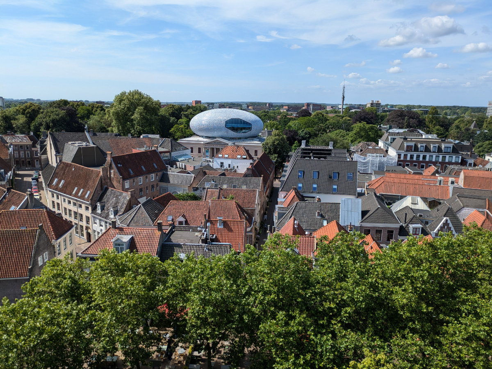
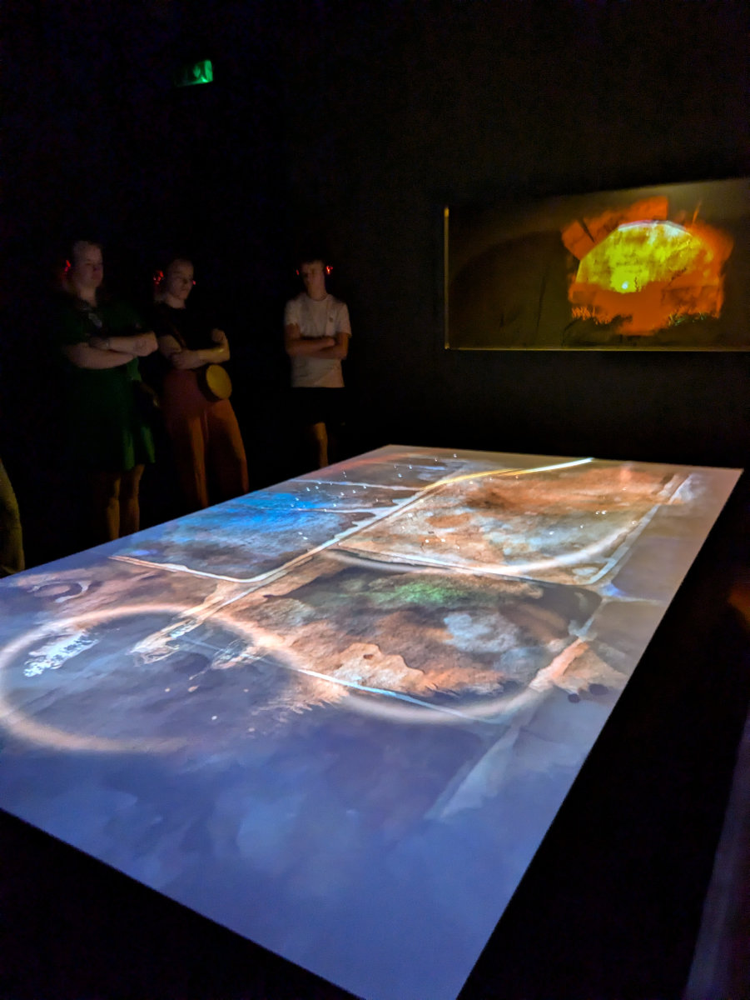
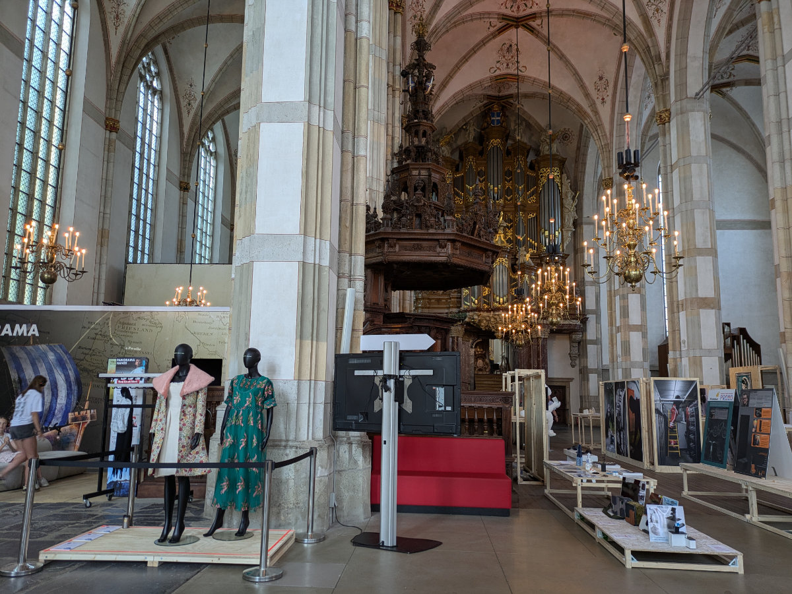
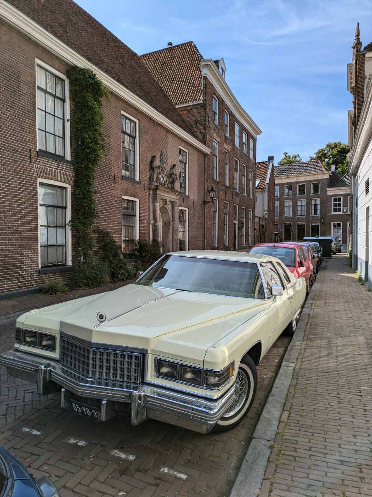

_Zwolle vista dal tetto della chiesa_

Questa notte saremo tutti e quattro riuniti nel nostro nuovo paese di residenza.
Hilly e Gemma arriveranno nella tarda serata, hanno un appuntamento alle 13.00 a Baden, in Svizzera, con un amico, e poi, proseguiranno attraverso la Germania dirette verso Hattem.
Ci hanno fatto la grande sorpresa che non si fermano a dormire in Francia ma vengono diritte qui.\
Io e Sophia non vediamo l’ora.\
Due giorni fa era il compleanno di Sophia e siamo andati al cinema. Qui possiamo anche vedere i film in lingua originale al cinema e questa e’ una bella cosa. I film non vengono doppiati, ne al cinema, né in tv.\
Dopo il cinema volevamo andare a mangiare qualcosa ma ci siamo riempiti di nachos e patatine e non avevamo più fame quindi siamo tornati a casa.Pedalare lungo il ponte della ferrovia al tramonto e’ stato bellissimo.\
Ieri mattina siamo andati ad uno show che avevamo prenotato qualche giorno prima. Nella chiesa principale di Zwolle hanno costruito una struttura chiusa al cui interno avviene uno show ogni mezz’ora.\
Il nostro appuntamento era per le 10.30 del mattino. All’ingresso ci hanno dato delle cuffie wireless, le nostre selezionate per la lingua inglese. Entrati nella prima stanza, eravamo una ventina di persone, c’era una specie di grosso tavolo sul quale venivano proiettate delle immagini. Il soggetto del racconto era la storia di Zwolle e della “lega anseatica”, un’alleanza piu’ che altro di tipo commerciale fra le città del nord europa e del mar baltico, una specie di repubbliche marinare del nord europa. Zwolle faceva parte di questa alleanza.\
Nella seconda stanza invece il racconto veniva proiettato tutto intorno sulle pareti e sul pavimento. Le musiche e la voce che narrava gli eventi erano molto coinvolgenti.
Un bel modo di far conoscere la storia. C’erano anche dei bambini e mi sembravano molto presi.
Finito lo show ci hanno fatto salire sul tetto della chiesa per vedere la città dall’alto. Che spettacolo!\
All’interno della chiesa c’era anche una mostra di oggetti di design fatti da artisti emergenti.
Una cosa che ho notato è che nelle chiese di Zwolle ci si fa un po’ di tutto. In una c'è un bar e in un'altra un sushi restaurant.
Per le strade di Zwolle c’era il mercato cittadino. Vendevano delle ciliegie bellissime a 4€ al kg, un affare pazzesco!
Per quanto riguarda la mia ricerca di lavoro e’ tutto fermo al momento, nel senso che sto rispondendo ad alcuni annunci, di tanto in tanto, ma mi sono reso conto che nel mio portfolio non ho dato abbastanza attenzione ad una particolare tecnologia. Sto rimediando.\
Il modo migliore di trovare lavoro però e’ facendo networking e a questo fine mi sono iscritto ad un "meetup" che si tiene ad Amsterdam l’11 luglio.\
I "meetup" sono degli eventi gratuiti, che possono essere organizzati da chiunque, e, nel settore della programmazione sono di solito organizzati da aziende o associazioni, per affrontare un tema specifico. Mi viene detto che sono ottimi posti dove intessere delle relazioni professionali.
Sotto questo punto di vista, ovvero nell'iniziare e mantenere delle relazioni, professionali o anche d'amicizia, io sono un po' un cavernicolo, un lupo solitario. Ma ora mi tocca cambiare.

_La prima parte dello show_

_La mostra all'interno della chiesa_

_In giro per le vie di Zwolle_

_Saluti anche da Bruno_
