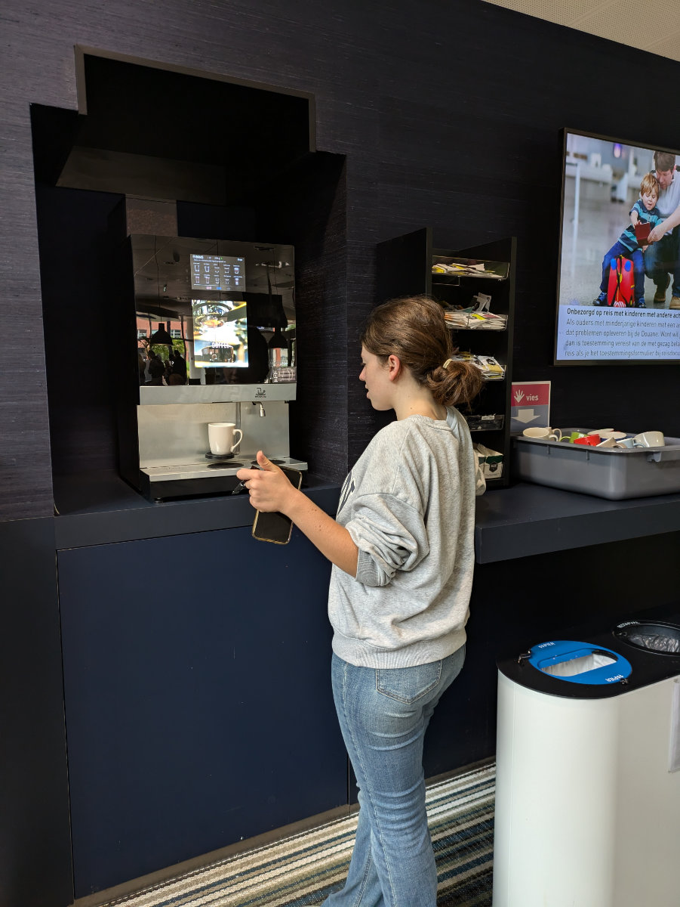
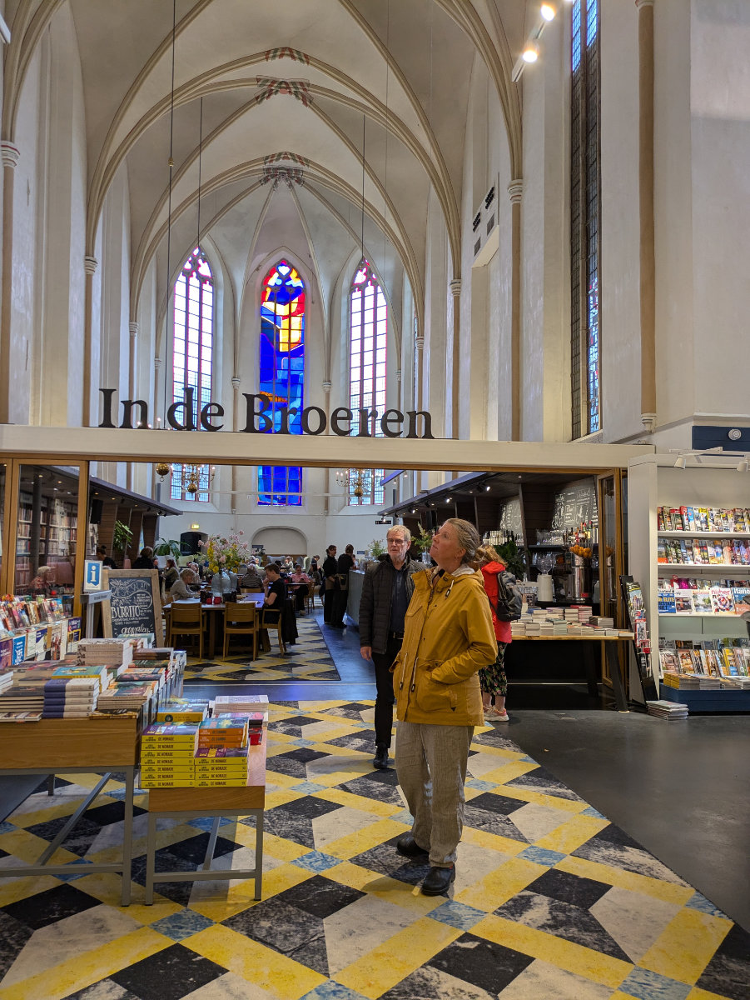

_Che strano vedere la nostra auto parcheggiata qui fuori_

La famiglia Cassetta e’ ufficialmente trasferita in Olanda.\
Si, proprio in Olanda, e non nei Paesi Bassi.\
Infatti da oggi ricomincero’ a chiamarla Olanda. Per chi legge il blog in Inglese non cambierà nulla, ma in Italiano vi ho stressati tutti con Paesi Bassi e Nederlandesi ma ho da poco avuto nuove informazioni.\
Sebbene l’Olanda sia solo una regione dei Paesi Bassi, all’estero, un po’ dovunque, si chiama Olanda tutto il paese, e gli abitanti sono gli Olandesi.\
Anche qui, loro stessi, spesso, chiamano la loro nazione “Holland”.\
Ora che ci sono gli europei di calcio, e gli Olandesi sono dei gran tifosi, come gli Italiani, vedo spesso degli striscioni arancioni, fuori dalle case, con scritto “Holland”.\
Quindi scusate se ho creato un po’ di confusione, viva l’Olanda!

Dicevo che la famiglia Cassetta e’ tutta qui riunita, dopo quasi un mese di separazione.
Gemma e Hilly sono arrivate all’una di notte, stanche morte, hanno divorato il pollo al curry che avevo cucinato per me e Sophia, e poi siamo andati tutti a dormire.\
Sono arrivate con la macchina piena di roba, non so come faremo a spostarci ora che ci siamo anche io e Sophia e i nostri bagagli.

Ieri abbiamo passato la giornata ad Hattem facendo delle lunghe passeggiate con Bruno mentre oggi io e Gemma abbiamo noleggiato altre due biciclette, che terremo per la prossima settimana, e poi siamo andati a Zwolle perche’ Hilly e Gemma avevano appuntamento per prendere il loro codice fiscale (BSN).\
Io sono andato con loro perché volevo gustarmi ancora il sublime rapporto con l’amministrazione pubblica ed e’ stato addirittura piu’ bello della prima volta.\
Oggi infatti mi sono accorto che c’era una macchinetta per caffe’, cappuccini, cioccolate calde e vari tipi di The a disposizione del pubblico. Tutto gratis. Le tazze erano di ceramica!
Io mi sono preso subito una cioccolata calda e Gemma e Hilly un cappuccino. Appena ci siamo seduti sui divanetti con le nostre bevande fumanti hanno chiamato i numeri di Gemma e Hilly e loro sono corse agli sportelli lasciandomi le loro tazze col cappuccino e facendomi fare la magra figura dell’Italiano che quando c’e’ qualcosa di gratis si butta a pesce e prende a manciate tutto quello che puo’.

Dopo aver ricevuto il codice fiscale abbiamo fatto un giro in centro perché Gemma ha bisogno di fare un po’ di pratica con la bicicletta e imparare a portarla anche in posti diversi dalla campagna. Siamo entrati in un'altra “non-chiesa” adibita a libreria e bar/cafe’, devo dire tutto molto elegante, e poi per merenda abbiamo mangiato per strada patate fritte, nuggets di pollo e palline di carne anch'esse fritte. Che merenda! Facevano tutti così e noi ci siamo adattati.

Questa sera abbiamo guardato la partita di calcio Olanda-Romania, l’Olanda ha vinto per tre a zero e alla fine, qui nella nostra via, hanno sparato dei petardi. Il povero Bruno tutto terrorizzato e’ venuto a mettersi tra me e Hilly per essere rassicurato.

Domani mattina andiamo tutti e quattro a Leiden, a un’ora e trenta di auto da qui, perché abbiamo un appuntamento con la scuola dove pensiamo di iscrivere le ragazze. Abbiamo preso quest’appuntamento diversi mesi fa. All’epoca quando pensavo a questo momento mi sembrava qualcosa di distante e un po 'surreale ma oggi ci siamo.\
Siamo in questa casa tutti e quattro insieme solo da due giorni ma ci sembra gia’ di essere a casa nostra. E’ incredibile come ci si adatta in fretta.\
Dovremo ancora andare in diverse case prima di stabilirci in un abitazione definitiva. Mi rattrista pensare che con molta probabilita’, quella che troveremo tra qualche mese, sara’ l’ultima casa in cui vivremo tutti e quattro insieme. Quelle mura vedranno andarsene per la loro strada prima Sophia e poi Gemma.\
Quindi dobbiamo sceglierla bene.

_Gemma prende il suo cappuccino nel palazzo comunale_

_La non-chiesa adibita a libreria_

_Gli Olandesi hanno veramente capito come utilizzare le chiese_
