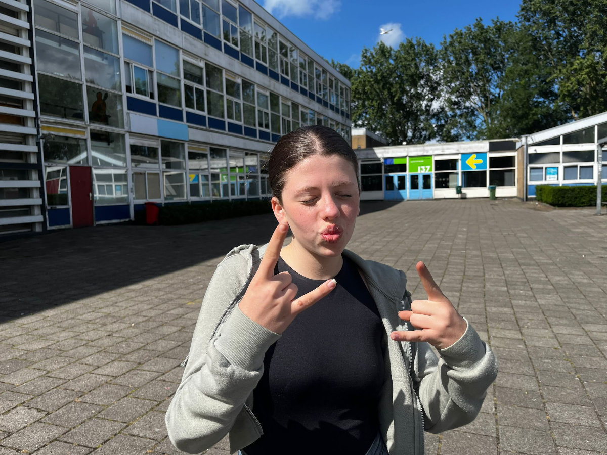
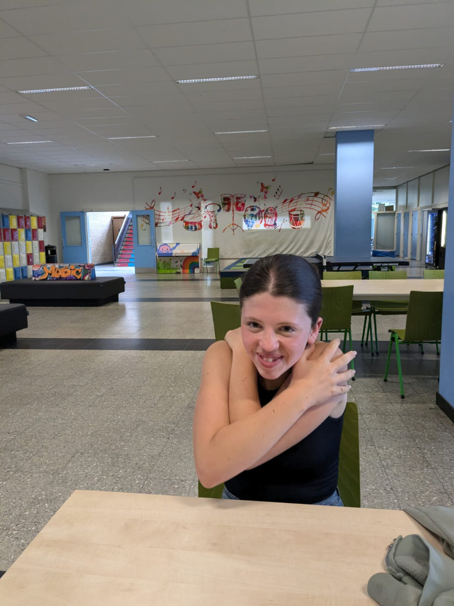
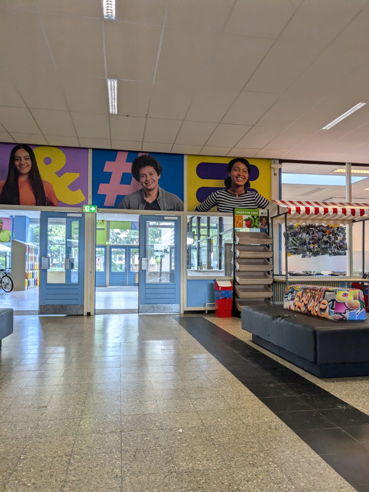
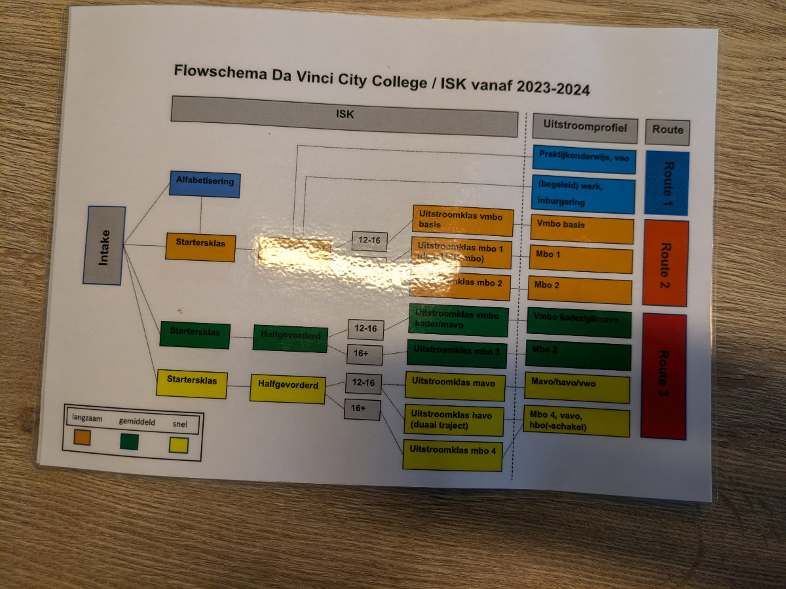

_Gemma in una tipica posa da giovane, davanti alla scuola_

Siamo partiti da Hattem alle 9 del mattino, dopo aver portato Bruno a fare una bella camminata, perché poi sarebbe stato solo in casa per diverse ore.\
Alle 11 eravamo nell’ufficio dell’addetta scolastica alle nuove iscrizioni. Ci ha offerto qualcosa da bere prima di iniziare l’incontro e poi ci siamo seduti ad un grosso tavolo da riunione, noi quattro da una parte e lei dall’altra.\
All’inizio ci ha fatto una panoramica del significato della scuola in cui ci trovavamo, l’istituto Leonardo da Vinci, a Leiden, facendoci vedere dei grafici in cui venivano rappresentati i diversi passaggi attraverso i quali, in un tempo massimo di due anni, gli studenti venivano poi introdotti nel sistema scolastico Olandese, avendo imparato la lingua.\
Gli studenti accolti nella scuola hanno un'età compresa tra gli 11 e i 18 anni e la maggior parte arrivano dal medio oriente e dal nord africa, alcuni dall’Ucraina.\
Quello era l’ultimo giorno di scuola, prima delle vacanze estive e all’ingresso avevamo notato che quasi tutte le ragazze portavano l’Hijab, il tradizionale velo Islamico che copre la testa e il collo.

Alla fine dell’incontro, durato quasi un’ora e mezza, tutte le nostre domande avevano avuto una risposta e abbiamo deciso di iscrivere le ragazze in quella scuola. A quel punto l’addetta ha preso un computer portatile e ci ha fatto una serie di domande per riempire i moduli di iscrizione che alla fine ci ha fatto firmare.\
Ci ha anche detto che Sophia e Gemma avrebbero dovuto fare quattro test scritti, e una piccola prova di lettura, per poter essere messe nelle classi giuste per il loro livello. Potevano fare i test anche subito ma, siccome avevamo Bruno a casa da solo, e i test sarebbero durati più di due ore, abbiamo preso appuntamento per il giorno dopo, sempre alle 11.\
Usciti dalla scuola eravamo tutti molto entusiasti per l’accoglienza ricevuta, l’unica un po’ scontenta era Gemma che pensava di aver finito con i test, avendo appena concluso gli esami di terza media e invece si trovava a doverne affrontare di nuovi il giorno dopo.\
L’edificio scolastico e’ un po’ vecchio tanto che il prossimo anno sara’ l’ultimo in cui viene utilizzato, poi verra’ demolito e gli studenti si sposteranno in un edificio temporaneo finche’ quello nuovo non sara’ pronto.

La mattina dopo, Hilly e le ragazze sono ripartite alle 9 per tornare a Leiden e concludere la fase di iscrizione.\
I test consistevano in una breve prova di lettura ad alta voce in Olandese, un test di logica per valutare la rapidita’ degli studenti a imparare nuovi concetti, un test di matematica, uno di Inglese e un a prova di comprensione dell’Olandese a crocette.\
In base ai risultati dei test gli studenti venivano poi messi in classi a tre diverse velocita’: lenta, media e veloce. C'è anche una quarta classe in cui vengono messi gli studenti che arrivano alla scuola in condizioni di completo analfabetismo.\

Mentre le ragazze facevano i test io sono rimasto a casa a lavorare e a cercare case in affitto nella zona di Leiden. Se per l’inizio della scuola non riusciamo a trovare una casa a Leiden o in una delle piccole municipalità limitrofe l’iscrizione infatti viene annullata e dobbiamo poi fare una nuova iscrizione nella zona in cui abiteremo. Speriamo di non dover arrivare a questo perche’ Leiden ci piace molto, anche la scuola.

Verso le 15 Hilly e le ragazze erano di ritorno. La prima cosa che mi ha detto Sophia e’ stata: “ E’ incredibile, in quella scuola funzionava tutto!”.
Le prove sono iniziate alle 11 in punto e tutti i computer che gli studenti (erano in 13) dovevano utilizzare per svolgere i test erano funzionanti, senza alcun problema.
Non eravamo abituati a tutto cio’.\
Sia Sophia che Gemma sono state messe in classi ad apprendimento veloce.\
Sophia ha anche passato molto bene la prova di comprensione dell’Olandese e quindi le hanno fatto fare un ulteriore test scritto in Olandese che però non è andato benissimo. La loro comprensione della lingua è infatti molto più avanzata visto che conoscono l’Afrikaans ma quando poi si tratta di scrivere non ne capiscono ancora molto.\
Una grossa differenza rispetto alle scuole superiori italiane sta anche nella gestione degli smartphones. Dall’anno scorso il governo Olandese ha fatto una legge molto severa che vieta l’utilizzo degli smartphones da parte degli studenti in tutte le scuole.
All’ingresso della scuola ci sono gli armadietti degli studenti e i telefoni vanno lasciati lì dentro dalle 8.20 del mattino fino all’uscita, di solito alle 16.00. Non possono essere neanche presi nei vari intervalli o nella pausa pranzo.\
Per Gemma questa non e’ una novita’ visto che alle scuole medie funzionava gia’ così. Ma al liceo Sophia ci raccontava di come la maggior parte dei suoi compagni fosse costantemente sul telefono non appena ci fosse una pausa.\

Arrivati a questo punto non ci resta che dover trovare casa nella zona dell’Olanda in cui e’ piu difficile trovare casa. Per poter trovare casa quasi sempre serve anche dover dimostrare di avere due buoni stipendi. Negli annunci che vediamo, infatti, le case migliori hanno sempre questi vincoli.
L’impresa e’ ardua e non c’e’ poi cosi’ tanto tempo.\
Ce la faranno i nostri eroi?\
Lo scopriremo nelle prossime puntate.

_Gemma pronta ad affrontare i test_

_L'ingresso della scuola_

_Il grafico che spiega il percorso scolastico_
