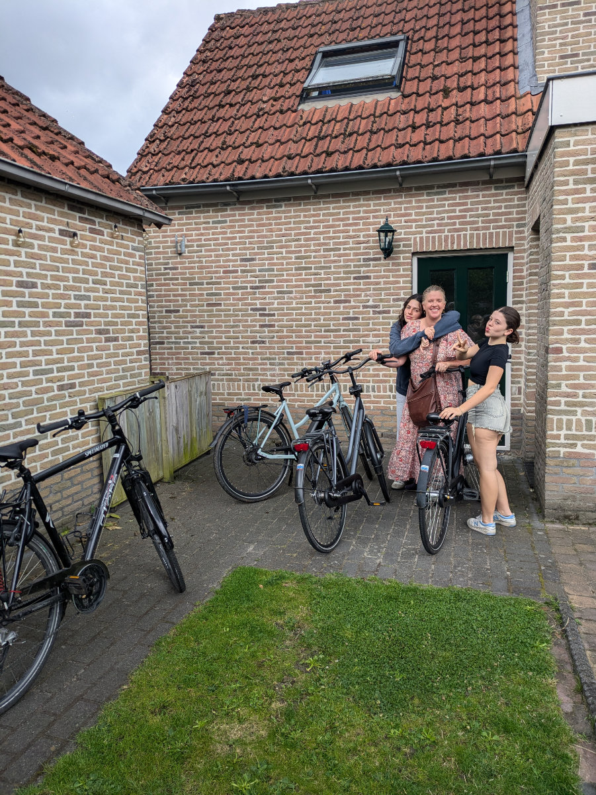
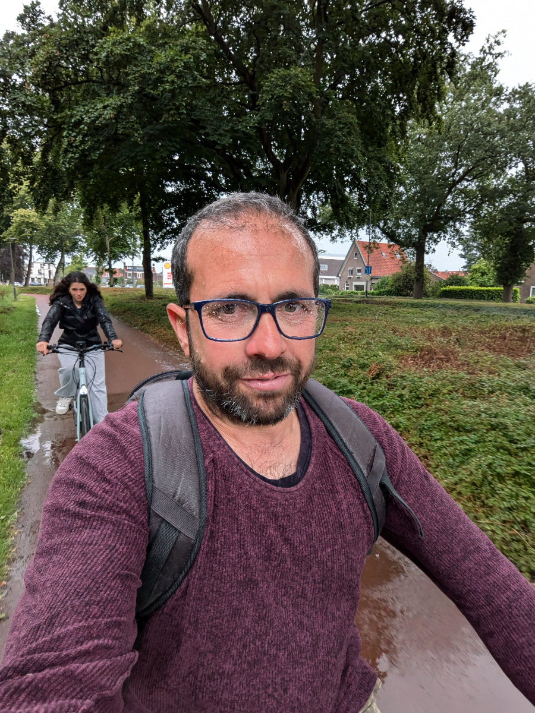
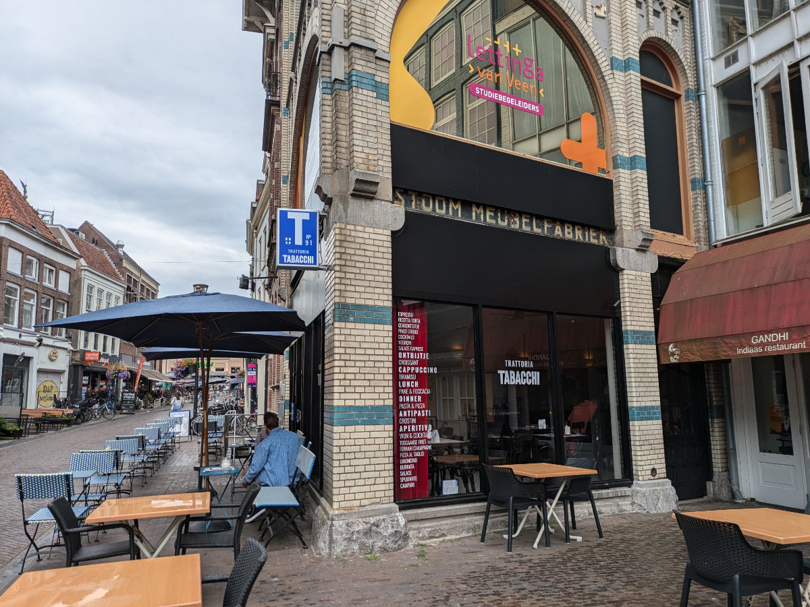
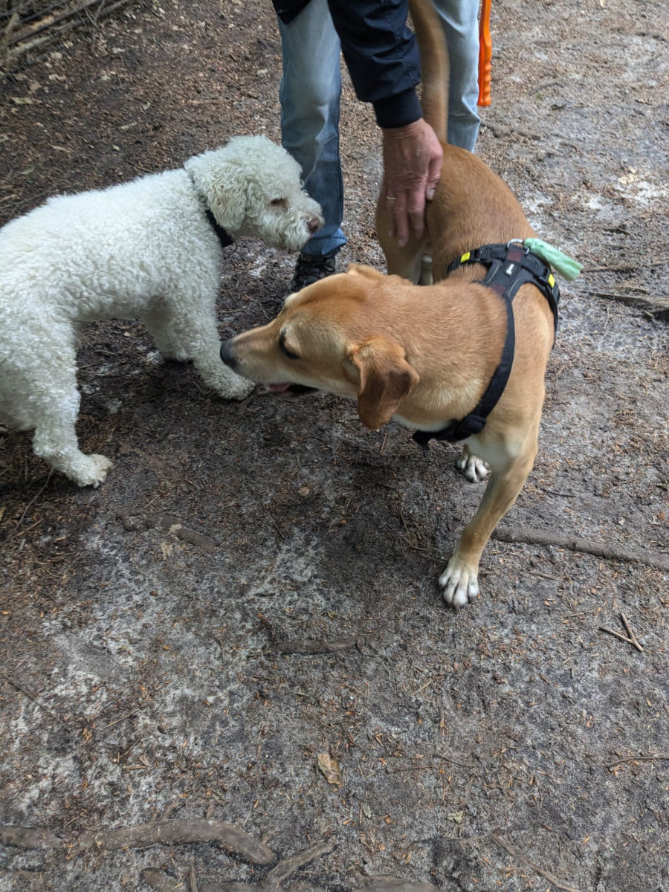

_La nostra uscita domenicale ad Hattem_

Ci stiamo veramente godendo Hattem e la fantastica casa di Ben e Moniek.
Ieri sera alle 21.00 c'è stata la partita di calcio Olanda-Turchia, quarti di finale degli europei. Non sapendolo in anticipo avevamo prenotato il cinema esattamente per la stessa ora.
Siamo andati a Zwolle in bici anche se c’era freddo e poteva piovere da un momento all’altro.
Mentre arrivavamo al cinema c’erano orde di Olandesi, ognuno con almeno un indumento arancione, che si dirigevano verso il centro di Zwolle, dove proiettavano la partita.
Noi andavamo a vedere “Inside Out 2” in 3D.
All’uscita dal cinema, contenti comunque di aver visto un bellissimo film, la partita era appena finita e dal centro di Zwolle arrivava un onda sonora di musica, urla e clacson di automobili. L’Olanda aveva vinto, 2-1, e ora va in semifinale contro l’Inghilterra. La prossima partita non ce la perderemo assolutamente.
Tornando a casa sembrava la notte di capodanno per tutti i fuochi d'artificio che rimbombavano per le strade.

Oggi siamo andati a pranzo ad Hattem. Appena siamo usciti di casa, ovviamente in bici, ha iniziato a piovere. Gemma ci ha maledetti per tutto il tragitto.
Nella piazza di Hattem ci sono diversi bar/ristoranti, abbiamo scelto quello piu’ pieno di tutti e c'era un tavolo libero. Abbiamo colto l’occasione per fare un brindisi per celebrare il fatto che siamo ufficialmente immigrati tutti e quattro in Olanda.\
Nel mio bicchiere c’era della coca-cola.\
La notte del 31 dicembre scorso feci una promessa con me stesso che non avrei bevuto nessun alcolico fino a che non avessi trovato un lavoro in Olanda. Sono passati sei mesi e non ho ancora ceduto alla tentazione di bermi una birra ghiacciata o un buon bicchiere di vino rosso.\
Ci sono state alcune occasioni in cui è stata veramente dura rinunciare ma finora non ho mollato. Questa cosa l’ho iniziata perche’ avevo bisogno di essere piu’ lucido al mattino presto, quando mi trovavo davanti al computer per fare le mie 3/4 ore di studio e programmazione ,prima di iniziare a lavorare, e ultimamente sentivo che anche un paio di bicchieri di vino alla sera prima non mi permettevano di essere focalizzato al cento per cento.\
Però devo ammettere che non vedo l’ora di celebrare il mio primo posto di lavoro con una bella birra. Speriamo presto.

Gemma sta diventando sempre piu’ sicura di se’ con la bicicletta anche se va un po’ in panico nelle zone troppo trafficate. Fra qualche mese dovra’ usarla quotidianamente, per andare a scuola. Sono sicuro che quando vedrà i suoi compagni di classe farlo, con naturalezza, non lo vivra’ piu’ come un'imposizione e quindi ci mettera’ piu’ impegno.

Hildegard ha speso tutto il pomeriggio, ieri, a rifare il suo curriculum. Sta cercando di combinare tutta la sua esperienza nel mondo dell’ospitalita’ con la nuova passione per i social media. Da diversi mesi sta gestendo i profili social di due sue amiche per imparare il mestiere.
Un altro lavoro che le piacerebbe fare è quello della postina. L’idea di girare casa per casa a consegnare lettere e nel frattempo scambiare saluti e qualche chiacchiera con decine di persone al giorno la affascina molto. Io credo che questo lavoro le calzi a pennello.

Sophia sta facendo dei bellissimi disegni di moda. Qualche giorno fa ha comprato un edizione da collezione della rivista Vogue da cui sta prendendo ispirazione. Sta anche studiando l’Olandese perche’ vuole arrivare all’inizio della scuola il piu’ preparata possibile. Forse non avevo ancora detto che la lingua che verrà usata dagli insegnanti sarà esclusivamente l’Olandese.
Mi devo dare una mossa anche io con l’Olandese se no per natale sarò l’unico in famiglia a non capirci ancora niente.

_Per le vie di Hattem_

_Qui siamo ancora inconsapevoli dell'acquazzone in arrivo_

_Non siamo ancora attrezzati per tutta questa pioggia_

_La curiosa trattoria "Tabacchi" a Zwolle_

_I lagotti ci sono anche in Olanda_
