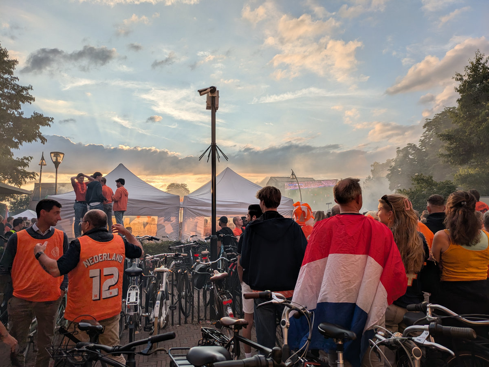
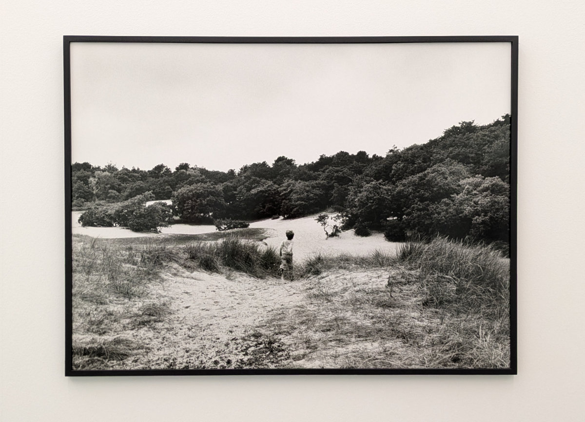
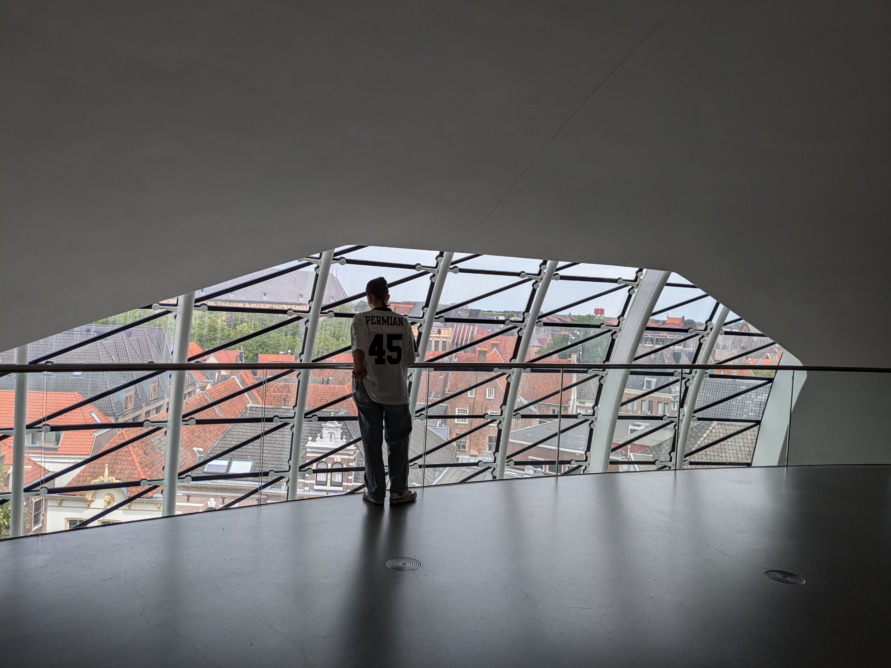
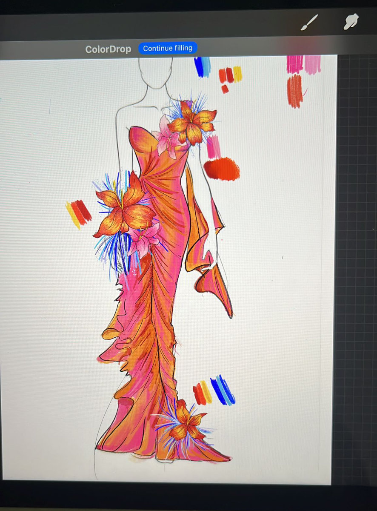
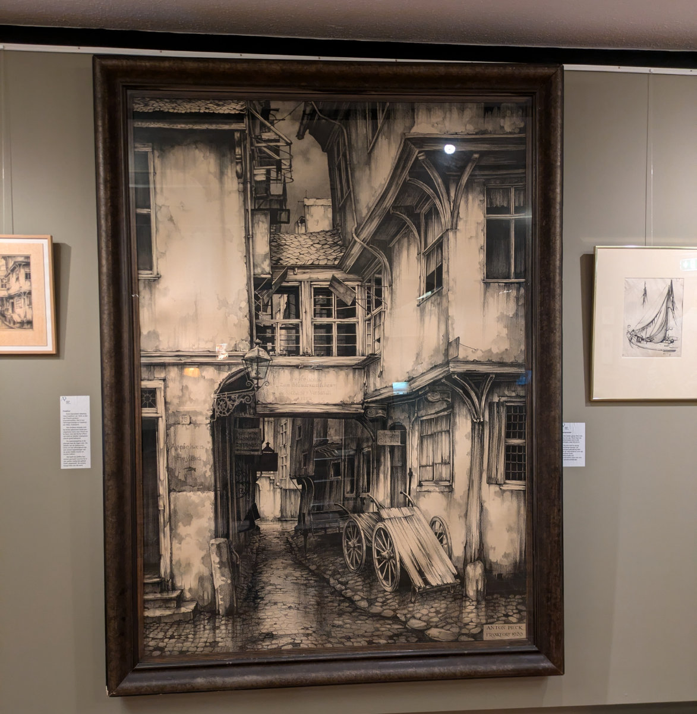
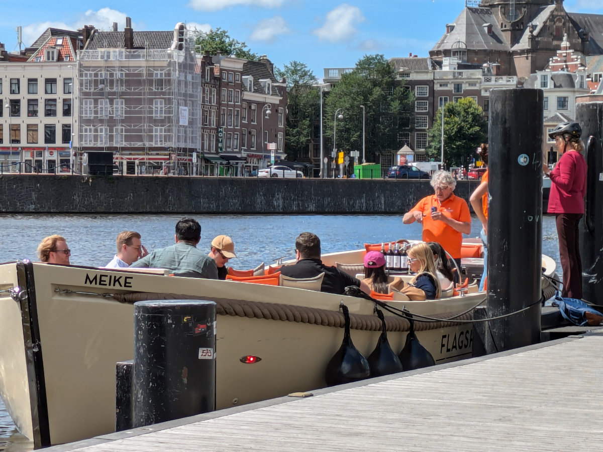
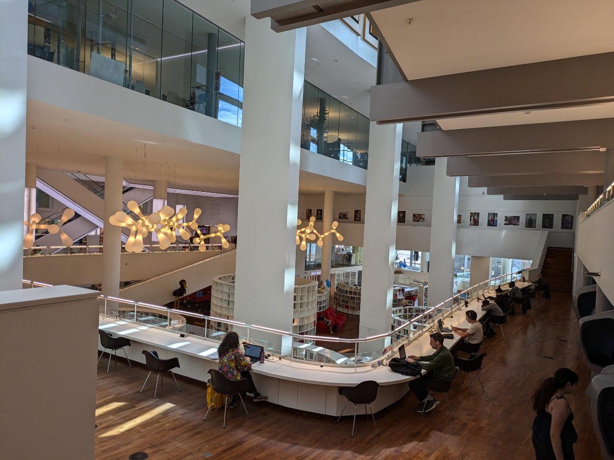

_In lontananza si vede anche lo schermo_

Sono sul treno che va da Zwolle ad Amsterdam. Ho appena incontrato Bart e Moniek alla stazione dove sono arrivato con la loro macchina. Hanno detto di aver fatto un bellissimo viaggio attraverso Albania, Bosnia e Kosovo.
Salutare Bruno e’ stata dura. Gemma ha detto che lei non può fare tanti “pet sittings” come abbiamo fatto io e Sophia perché si affeziona troppo agli animali.
In questo momento il treno sta passando sul ponte rosso che attraversa il fiume Ijseel e
fuori dal finestrino vedo la pista ciclabile che abbiamo percorso tante volte per andare in bici da Hattem a Zwolle.

Ieri sera per la prima volta siamo andati a Zwolle in auto (avevamo riconsegnato le bici a noleggio) per vedere la partita di calcio tra Olanda e Inghilterra.
Gli Olandesi prendono il tifo per la propria nazionale molto seriamente. Pensavamo di andarci a godere la semifinale di fronte al maxischermo allestito in una grossa piazza di Zwolle ma e’ andata un po’ diversamente.\
Migliaia di persone vestite di arancione tentavano di scorgere almeno un fazzoletto di quello schermo da cui speravano di vedere vincere la propria squadra/nazione.
Ci tengo a precisare che non si trattava solo di migliaia di persone ma di migliaia di persone altissime, che nel mio caso, vista la mia statura fisica, rendevano il compito ancora più difficile.\
Come quando da bambino andavi in un posto molto affollato solo che in questo caso non cera mio padre a prendermi sulle sue spalle.\
Comunque un posticino niente male l’abbiamo trovato, di fronte a delle biciclette che bloccavano eventuali giganti, e la partita l’abbiamo vista tutta. L’Olanda ha giocato abbastanza male e ha perso per due a uno.\
Per uscire dal parcheggio ci abbiamo messo un ora.\
Meglio le biciclette!

Negli ultimi giorni abbiamo sfruttato un po’ le nostre “museumkaart” e siamo andati a visitare il museo della fondazione, a Zwolle, e il museo dedicato ad Anton Pieck, ad Hattem.
Nell'interessante edificio del Museo della Fondazione abbiamo visto una serie di quadri, fotografie e video di arte contemporanea. Una delle foto, che riprende un bambino, in inverno tra le dune di sabbia, mi ha ricordato di una mia esperienza passata.\
Quando avevo forse 4 o 5 anni, andai in Sardegna per natale. Di solito ci andavo sempre in estate, e passavo un mese in tenda tra le magiche dune di sabbia di Chia. Per me quel mare rappresentava la totale libertà e durante il freddo e nebbioso inverno milanese sognavo di correre giù da una duna per buttarmi nelle sue calde acque turchesi. Fu così che quando ci andai in inverno nel mio piccolo cervellino ci fu una specie di corto circuito sinaptico che mi fece correre giu’ dalla duna per buttarmi tutto vestito tra le trasparenti e gelide onde di Chia.

_Il quadro che ha risuscitato la mia memoria_

Nel museo di Anton Pieck invece abbiamo visto le opere di questo interessante pittore,disegnatore, grafico Olandese vissuto attraverso tutto il 900.
Probabilmente vi sara’ capitato di vedere una sua illustrazione in qualche libro di fiabe oppure potreste aver sentito parlare di “Efteling” , un parco di divertimenti a tema fantasy che lui ha contribuito a disegnare, situato nel sud ovest dell’Olanda.

_Il museo della fondazione di Zwolle_

_La finestrona del museo_

_Un abito disegnato da Sophia_

_Un disegno di Anton Pieck_

Questa mattina Hilly e le regazze sono partite, piuttosto presto, per andare a Oosterbeek, dove abbiamo il nostro nuovo “pet sitting”.
Sono partite con una macchina così carica di roba che io comunque non ci sarei stato. Gemma e Sophia si sono dovute intagliare una nicchia tra borse, ciabatte, racchettoni da spiaggia, scatole e raccoglitori vari. Hildegard non ha avuto le energie, durante le fasi preparatorie alla partenza in Toscana, di riuscire a partire un po' più in economia. In tutto ciò si e’ dimenticata di portare l’unica mia scatola, un cubo di 40 cm di lato, con alcuni indumenti che mi servivano per l’estate. Ti amo mia cara moglie!

Intanto dopo il viaggio in treno sono arrivato ad Amsterdam, mi son comprato un insalata di tonno in un Albert Heijn, uno dei supermercati Olandesi, e me la sono mangiata su di una panchina di fronte ad un grosso canale dal quale partivano piccole barche per portare i turisti tra i canali.
Passero’ le prossime ore in una biblioteca a dieci minuti a piedi dalla stazione di Amsterdam, un posto aperto dalla mattina fino alle dieci di sera dove ci sono un sacco di postazioni di lavoro, grossi tavoli, caffetteria e diversi piani di libri e altre postazioni.\
Un posto perfetto dove lavorare in tranquillita’.\
Alle 18.00 inizia il “Meetup” a cui mi sono iscritto diversi giorni fa e durante il quale spero di trovare qualche contatto per possibili sbocchi lavorativi.
Il Meetup e’ organizzato da un associazione di categoria per i “Frontend developers”, non sapevo neanche esistesse una cosa del genere. Si terranno due brevi conferenze intervallate da momenti di socialita’, proprio al fine di fare “Networking”, che in italiano si puo’ tradurre con “fare rete”.

Ieri ho avuto la prima telefonata da un’azienda tra quelle a cui ho risposto ad un annuncio di lavoro. Mi ha subito chiesto se parlavo Olandese e quando gli ho detto di no mi ha risposto che purtroppo serviva che io lo parlassi, oltre all’Inglese. Mi ha anche chiesto quanta esperienza avevo con “Angular” e gli ho detto che non ne avevo affatto. Quindi la conversazione e’ finita li’.
Ho aderito piu’ o meno ad una quarantina di annunci nelle ultime settimane e ho sempre evitato di farlo quando la conoscenza dell’Olandese fosse obbligatoria per il lavoro oppure quando non conoscessi affatto la tecnologia richiesta, eppure almeno una me ne e’ sfuggita, e proprio quella mi doveva contattare.
Avevo sottovalutato la necessità della lingua Olandese nel settore tech. Tutte le informazioni che avevo raccolto mi avevano fatto pensare che bastasse l’inglese mentre ora, tra tutti gli annunci che vedo, per sviluppatori, almeno il 50% richiedono tassativamente anche l’Olandese.
Comunque resto positivo e motivato e anche Hilly mi sembra bella carica.

_Ci sono a bordo piu' bottiglie di vino che persone_

_La Bibliotheek_

_Interno della biblioteca dove sto lavorando in questo momento_

_Il loculo della concentrazione. Ce ne sono diversi_
