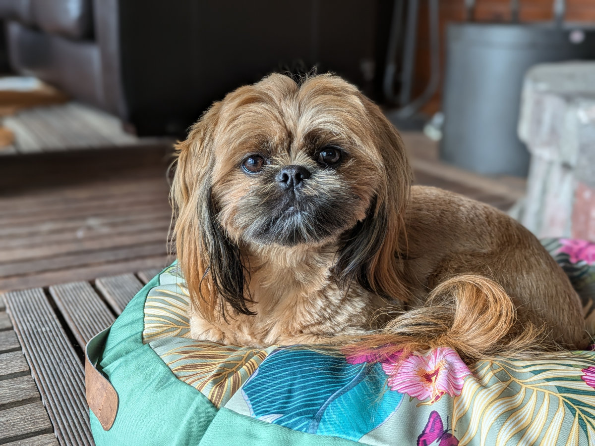
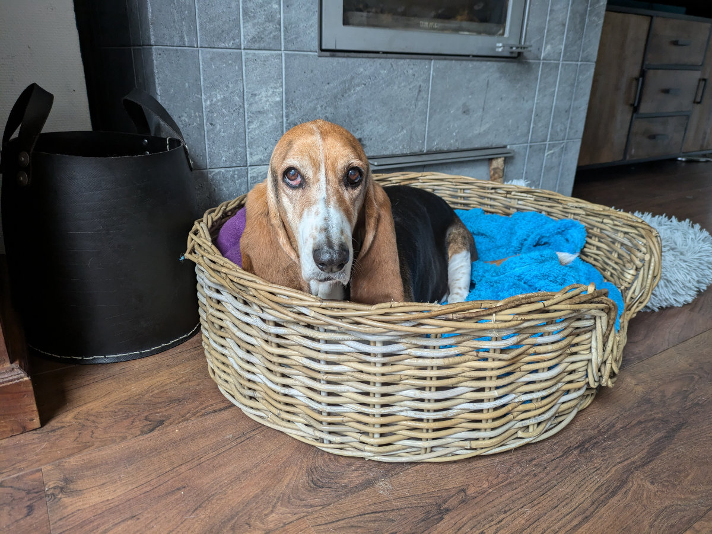
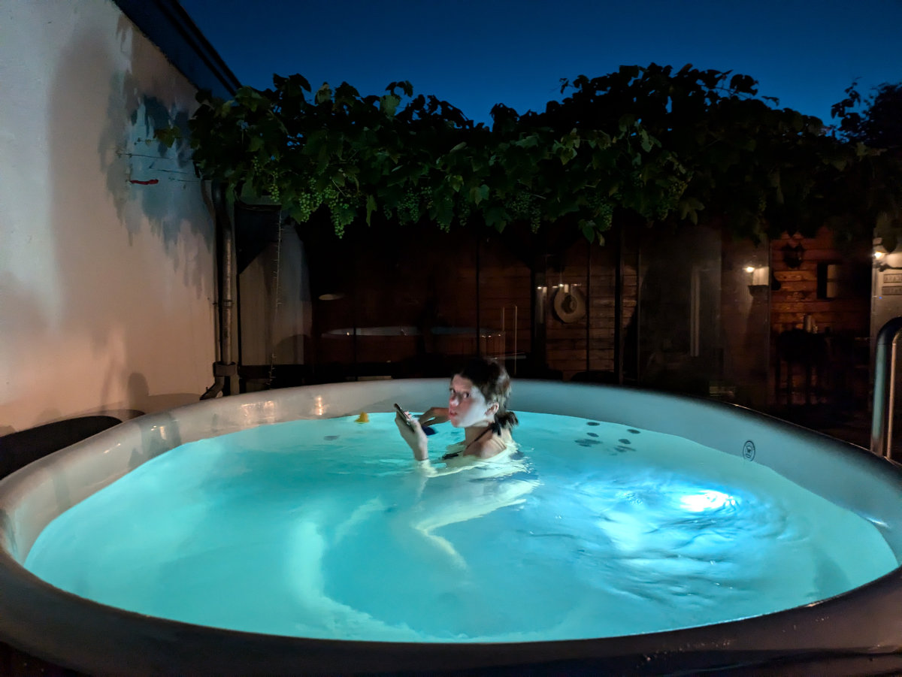
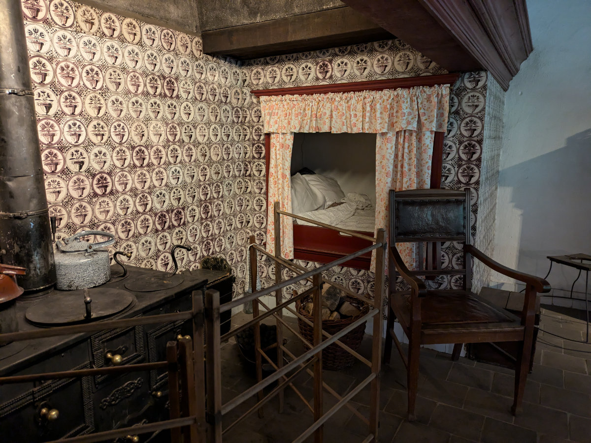
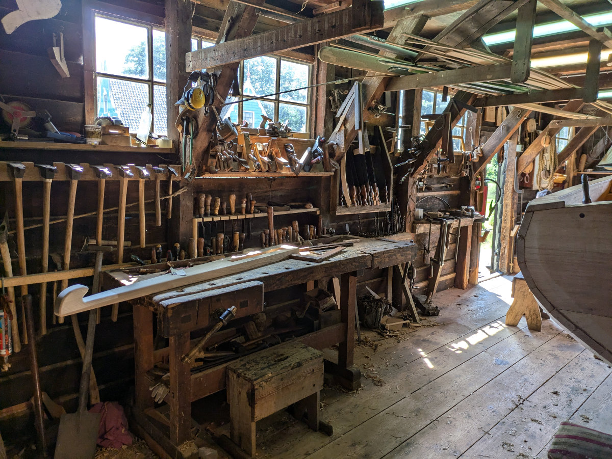
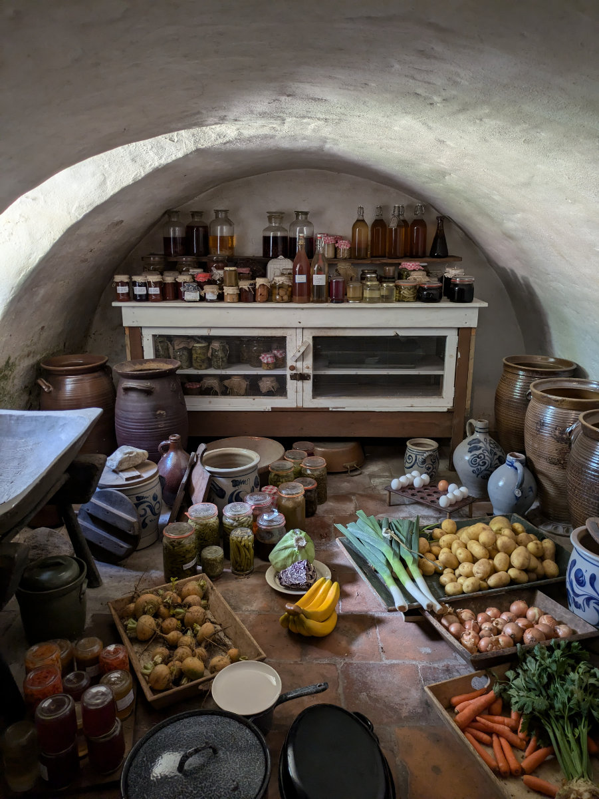
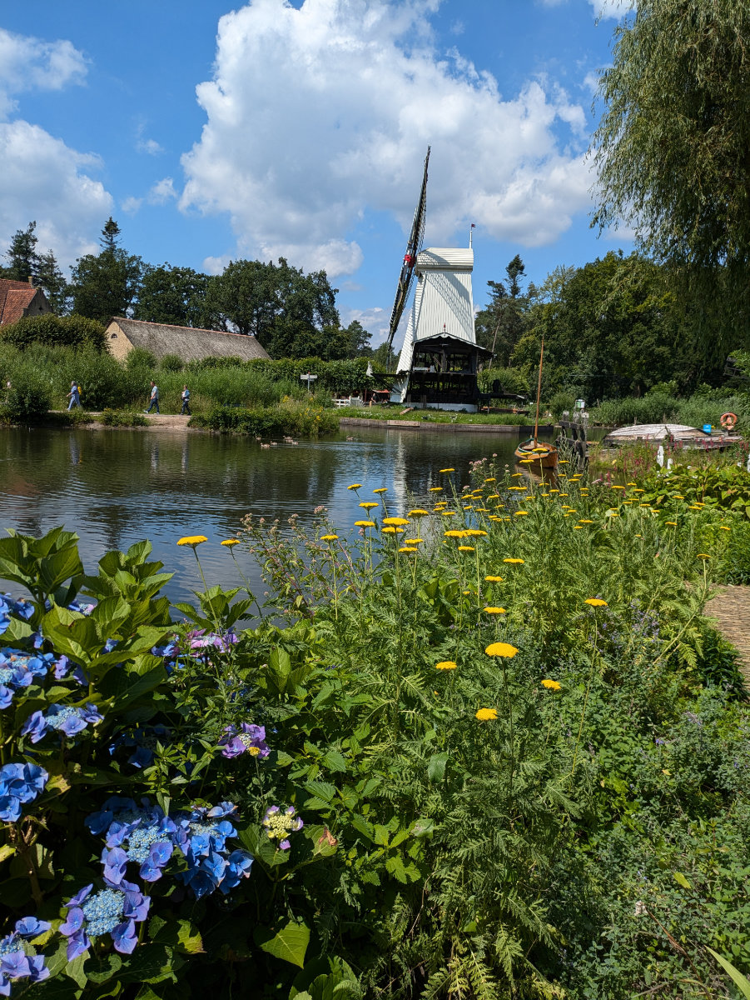
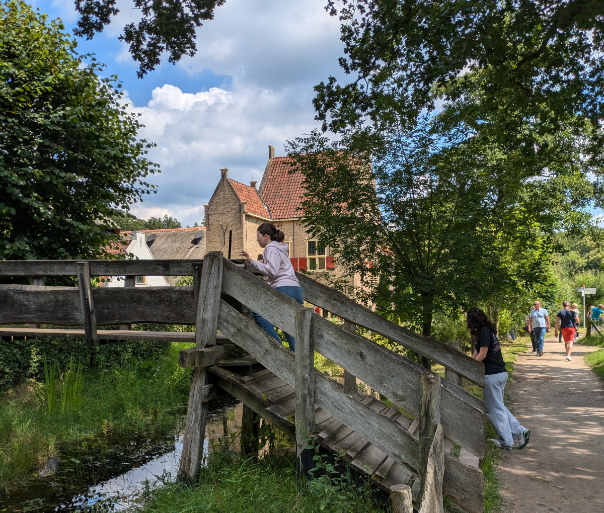

_Come si fa a non volerselo sbaciucchiare tutto_

Siamo a Casa di Karen e Jaco, una famiglia Sudafricana che in questo momento si trova in vacanza in Francia. Hildegard e Karen furono colleghe di lavoro 30 anni fa, per un periodo molto breve, ma sono rimaste comunque in contatto.\
Quando hanno saputo che stavamo facendo “pet sitting” ci siamo accordati e ora eccoci qua a Oosterbeek.\
Questa zona e’ un po’ diversa da quello che abbiamo visto finora. Il paesino si sviluppa sopra una collina e ci sono quindi salite e discese, una gran novita’.\
A 5 km di distanza si trova Arnhem, una città di 167.000 abitanti.\

Karen, Jaco e la piccola Amee hanno due cani e un criceto.\
Uno dei due cani si chiama Abbie ribattezzato immediatamente “Spiffy” da Gemma.\
Spiffy e’ una femmina di un anno ed è un pelouche. Sophia dice che gli causa una forte “cuteness overload”, in Italiano “sovraccarico di carineria”. Quella sensazione incontenibile di voler quasi divorare un essere vivente troppo puccioso.\
Spiffy vuole continuamente giocare e zampetta per la casa come un folletto.\
L’altro cane si chiama Lilly, ha undici anni e ha grossi problemi di artrite.
Vederla incedere goffamente sulle zampe mezze deformate dall’artrite spezza il cuore. Ha uno sguardo triste ma allo stesso tempo dolcissimo.

_Guardate gli occhi di Lilly_

Il criceto si chiama Pluisie e sta nella sua gabbietta tutto il giorno a parte quando qualcuno lo mette dentro una sfera di plastica trasparente, tutta bucherellata, e lui si aggira per la stanza facendola roteare in modo erratico.\
La casa e’ grande e molto bella, abbiamo anche una jacuzzi in giardino e una sauna.
Come in tutti gli altri posti, a parte quando eravamo in centro ad Amsterdam, c’e’ un silenzio irreale e sembra che le case intorno a noi siano tutte disabitate.

Ieri saremmo dovuti andare ad un altro barbeque sud africano, a pranzo da dei conoscenti di Hilly (che però lei non ha mai incontrato) ma Hilly non si sentiva bene quindi abbiamo cancellato.\
Io e le ragazze allora siamo andati a visitare il “Nederlands Openluchtmuseum”, a dieci minuti di auto da casa.\
Il “Museo all’aria aperta dell’Olanda” e’ un parco a tema dedicato alla storia, agli usi e alle tradizioni olandesi, fondato nel 1912. E’ stata una vera sorpresa, le ragazze si aspettavano un’altra noiosissima galleria d’arte e invece si sono divertite tanto.
Ci sono vari villaggi, tutti fatti di vere case, di cui la maggior parte sono edifici storici che sono stati trasportati lì per salvaguardarli.\
Si trovano delle botteghe artigiane in cui viene mostrato nel dettaglio come si facevano alcune lavorazioni e gli artigiani che producono i manufatti lavorano veramente, non fanno finta.\
E’ stato bellissimo entrare nelle case e vedere come erano arredate 2 o 3 secoli fa.
Una novità e’ stato vedere come dormivano all’epoca. In tutte le case di campagna si trova un armadio, di forma rettangolare, di solito in cucina, al cui interno c’erano coperte e cuscini e ci dormivano dentro evidentemente in posizione fetale viste la lunghezza del letto e quella degli Olandesi.\
Lo tenevano in cucina perché era l’ambiente più caldo della casa.

Domani mattina porteremo Sophia e Gemma a Dusseldorf, dove prenderanno il volo per Cagliari. Gemma non vede l’ora di andare al mare tutti i giorni con la sua migliore amica, Elena e Sophia, anche lei, rivedra’ la sua migliore amica, Maya, che non vede da un anno e mezzo perche’ si e’ trasferita in Australia ma ora va anche lei a Pula e passeranno diverse giornate insieme.\
So già che ci mancheranno tanto ma sarà anche bello stare solo io e Hilly per due settimane.\
In queste due settimane faremo un Pet sitting a Wassenaar, localita’ balneare apparentemente molto ambita dai tedeschi, tra l’Aia e Leiden, e poi andremo a Scheveningen, attaccato all’Aia, sempre sulla costa, dove saremo quando le ragazze torneranno in Olanda.

Nel post precedente stavo parlando del Meetup a cui avrei partecipato quella sera.\
E’ andata cosi.\
Alle 18 ci siamo ritrovati negli uffici di un’azienda che sviluppa l’app “Werkspot” che e’ attiva anche in Italia e si chiama “Instapro” attraverso la quale si possono richiedere degli interventi a casa di idraulici, elettricisti, muratori etc.\
Eravamo una quarantina di persone e c’erano 40 cartoni di pizza e due frigoriferi pieni di bevande. Si sono tenute due mini conferenze su temi molto specifici inerenti lo sviluppo web e prima, durante e dopo si mangiava la pizza e si beveva qualcosa chiacchierando con gli altri partecipanti, così fino alle 22.00.\
Per me l’evento è stato molto positivo, ho conosciuto un paio di sviluppatori con cui mi sono scambiato i contatti ma soprattutto mi e’ servito a rendere tutto un po’ più reale. Sono 4 anni che studio e pratico qualcosa ma non ho mai avuto la possibilita’ di affrontare questi temi con nessuno perche’ non conosco nessuno che faccia lo sviluppatore frontend.\
Hilly e’ salita di un gradino nel suo tentativo di iniziare una carriera da social media manager, una sua amica le ha assegnato un cliente e quindi comincera’ ad essere pagata, ad ore.\
Non e’ molto ma sta imparando tante cose che in futuro le serviranno sicuramente.

Da venerdì saremo molto vicini a Leiden e quindi potremo andare a parlare di persona con qualche agenzia per trovare la casa in affitto.\
Oggi in realtà avevamo un appuntamento in videochiamata con un’agenzia che poi ha cancellato all’ultimo momento.

_Sorpendo Gemma mentre si gode la jacuzzi_

_I letti Olandesi del passato_

_La bottega dell'armatore_

_Quando non cera il frigorifero_

_Girando tra i villaggetti del museo all'aria aperta_

_Le ragazze in eplorazione_
