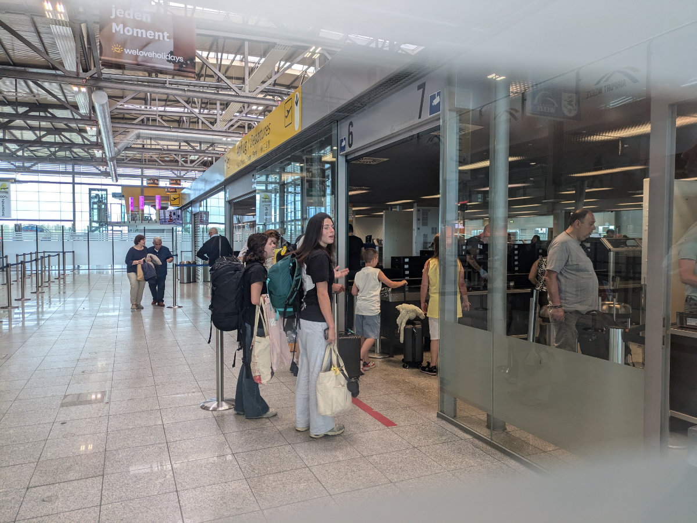
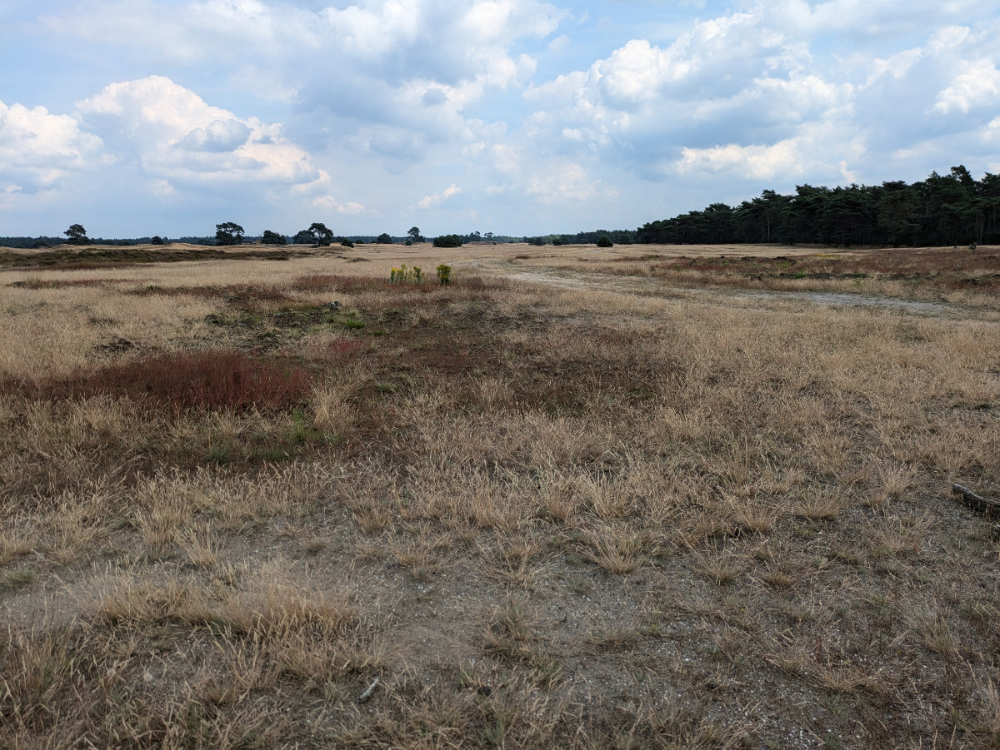
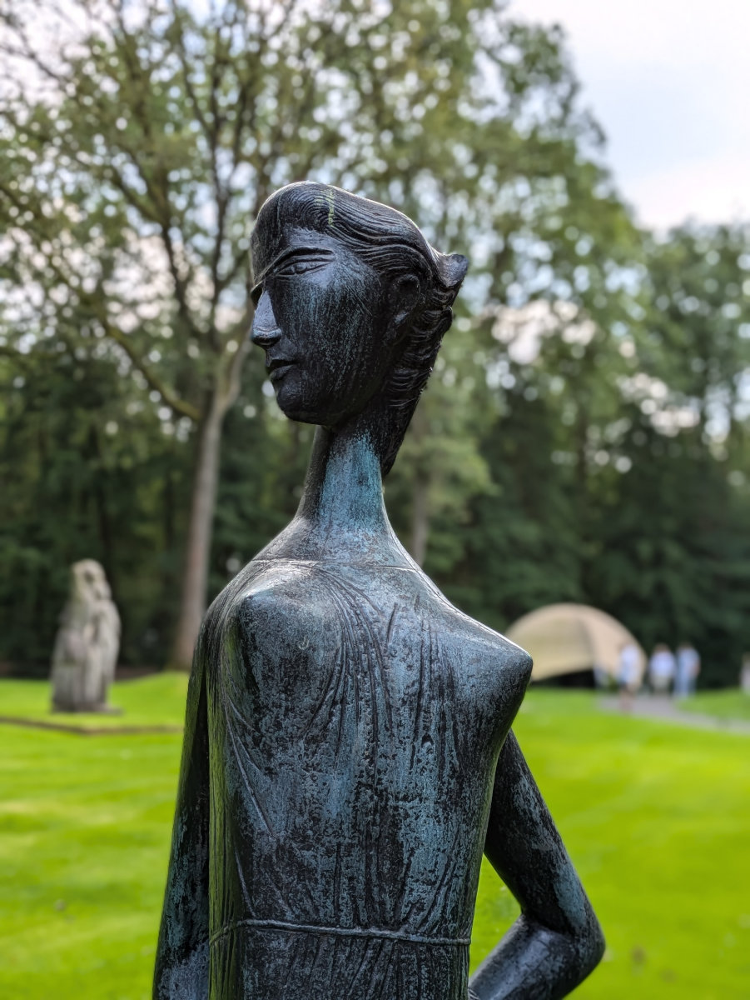
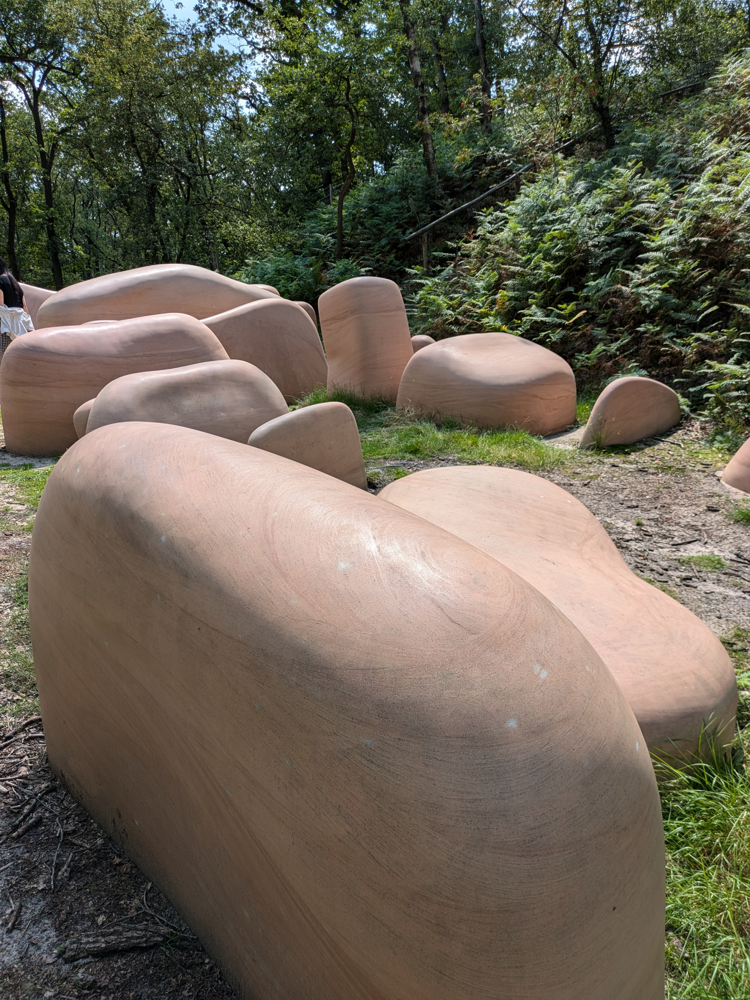
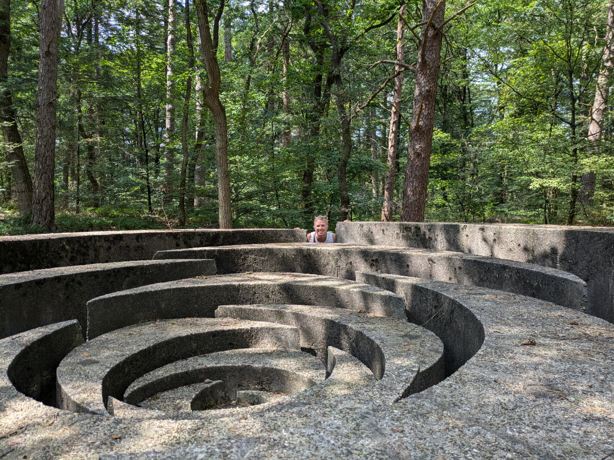
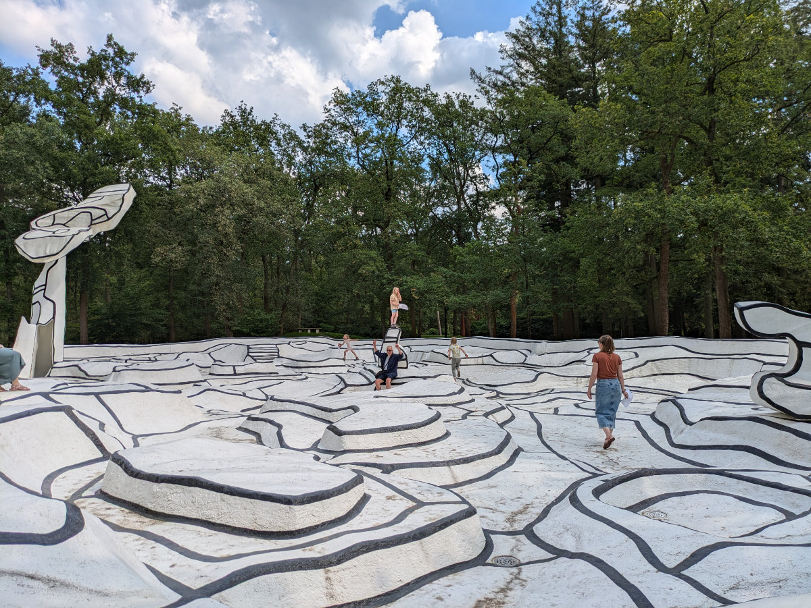

_Il mondo e' la nostra casa_

Le ragazze sono partite da qualche giorno, ogni tanto ci arriva qualche foto del mare cristallino del sud della Sardegna, sono felice che loro siano lì.\
All’aeroporto di Dusseldorf le ho salutate ed è stato bello vederle attraversare la security per la prima volta da sole. Spero che questo sia il primo di tanti viaggi che faranno in giro per il mondo.

Abbiamo lasciato la casa di Karen e Jaco due giorni fa, salutare “Spiffy” e Lilly non è stato facile.\
Abbiamo trascorso gli ultimi giorni a Oosterbeek principalmente seduti di fronte al computer a lavorare e cercare lavoro e casa. Ancora niente di concreto.\
Un giorno siamo andati a visitare il Kroller Muller museum. Il museo si trova all’interno di un grande parco naturale. All’ingresso del parco c’e’ un parcheggio dove lasciare la macchina e prendere una delle centinaia di biciclette messe a disposizione dal parco per poterlo girare in tutta tranquillita’.\
Dopo qualche chilometro di pedalata tra boschi di querce e tutta una parte di bassa vegetazione spontanea, che sembra di essere in Sudafrica, si arriva al museo.\
Il Kroller Muller museum e’ un altro museo all’aria aperta. Camminando nel grande parco del museo, a sua volta all’interno del parco naturale, si possono vedere grosse sculture di arte moderna e contemporanea che sono posizionate nel paesaggio, dal quale vengono valorizzate.
Si possono seguire diversi percorsi e sentieri tutti disseminati di scritte che indicano a quale emozioni e sensazioni prestare attenzione.\
Alla fine della visita ci siamo accorti che c’era anche tutta una parte interna che non siamo riusciti a visitare con cura quindi ci siamo ripromessi di tornarci con le ragazze.

_Le bici del parco naturale_

_La savana Olandese_

_Il Kroller Muller museum_

_Una statua del Kroller Muller museum_

_I massi rosa_

_Cucu'!_

_Il bizzarro labirinto in bianco e nero del museo_

_Il museo e' proprio spettacolare_

_Un grosso alveare_

Da un paio di giorni siamo a casa di Naina e Martin. Loro hanno due figlie dell'età di Sophia e Gemma e sono andati in vacanza per dieci giorni lasciandoci la loro casa per curare i loro tre gatti, due porcellini d’india e un acquario di pesci.\
La casa si trova a Wassenaar, una cittadina a 10 km a nord dell’Aia e a 5 chilometri da Leiden.
Wassenaar e’ uno dei posti più costosi dell’Olanda, per quanto riguarda i prezzi delle case. La zona e’ molto verde e ben mantenuta, ci sono un sacco di stradine e piste ciclabili e in pochi minuti si raggiunge il mare.

Sabato pomeriggio siamo andati in bici a Leiden. C’erano molte barche tra i canali molte delle quali avevano a bordo un altoparlante che pompava musica e giovani che facevano festa.\
Eravamo andati a Leiden per prendere una busta di “2good2go”, si pronuncia "too good to go” e significa “troppo buono per essere buttato”. E’ un app che permette di comprare un pacco sorpresa, da bar, caffetterie, supermercati e panetterie, contenente generi alimentari che per diversi motivi verrebbero buttati via ma che sono ancora ottimi da consumare.\
Il costo di una busta si aggira sui 5 euro. Ne avevamo preso uno a Dharnem a 5.90, da una caffetteria del centro, e conteneva tutta una serie di panini, brioche e salati che non sono stati serviti durante il giorno.\
Il pacco preso Sabato a Leiden invece veniva da un supermercato, costava 5 euro e conteneva due grosse insalate di pasta, una confezione di fettine di filetto di maiale e uno yogurt alla fragola da mezzo chilo. E’ un modo per risparmiare soldi evitando lo spreco insensato di alimenti.

Tornando in bici da Leiden abbiamo visto una casa con fuori un cartello “affittasi”. Ci siamo fermati a scambiare due chiacchiere con la vicina che era impegnata a lavorare in giardino.
La casa è una villetta di due piani, tipo quella in cui ci troviamo ora, probabilmente un centinaio di metri quadri ma posizionata in una bella zona di Wassenaar, di fronte ad un canale e un parco. La signora ci ha detto che fino a poco tempo fa ci viveva una famiglia inglese. I nostri sogni ad occhi aperti di trasferirci in quella casa sono stati bruscamente interrotti quando la signora ci ha detto che veniva affittata a 3000 euro al mese. Il nostro budget e’ di 2000, almeno per il momento.

Oggi vogliamo visitare alcune agenzie immobiliari nella zona e cercare di capire se sia possibile prendere in affitto una casa anche senza avere due contratti di lavoro.\
Siamo in contatto con un'agenzia di donne Sudafricane che aiuta i singoli o le famiglie espatriate che cercano una casa in Olanda. La persona con cui abbiamo parlato ci dice che e’ possibile prendere una casa senza contratti di lavoro ma pagando 12 mesi in anticipo. Questa agenzia pero’ chiede un mese di affitto come parcella, un po’ come tutte le agenzie in Olanda, pero’ ne vuole mille in anticipo e l’esclusivita’ nel cercarci casa. Noi non ce la siamo ancora sentiti di impegnarci con loro, almeno finché non abbiamo verificato a fondo come funzionano le agenzie locali. Cosa che faremo nei prossimi giorni.

Un’altra possibilita’ sarebbe quella di prendere una casa ammobiliata in affitto a breve termine fino a che non abbiamo due contratti lavorativi e quindi la possibilita’ di accedere a qualsiasi proposta d’affitto. Vedremo nei prossimi giorni.

_I gatti Ody e Tippy_

_Tornando in bici da Leiden_
