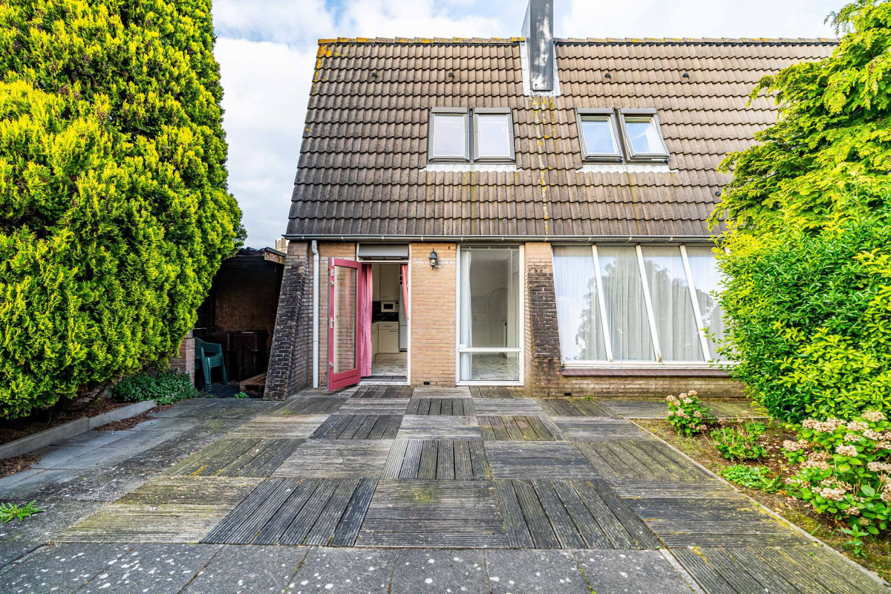
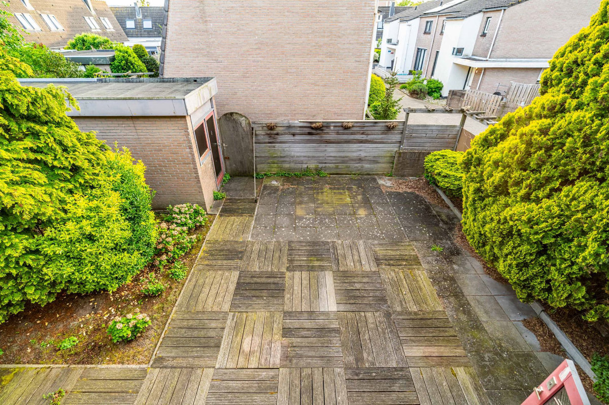
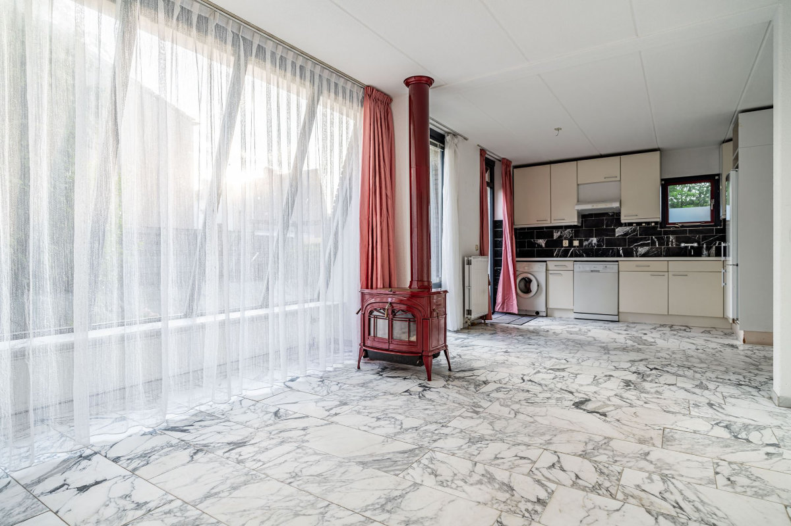
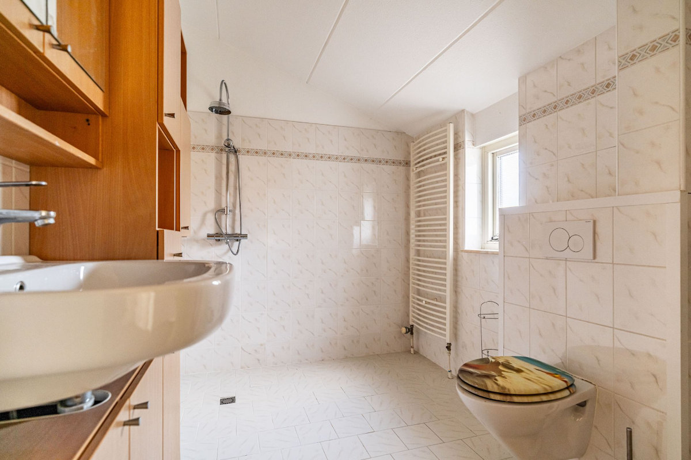
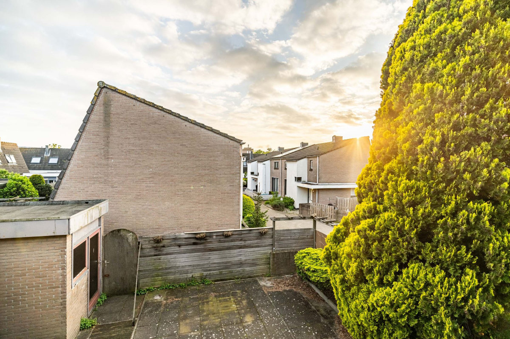
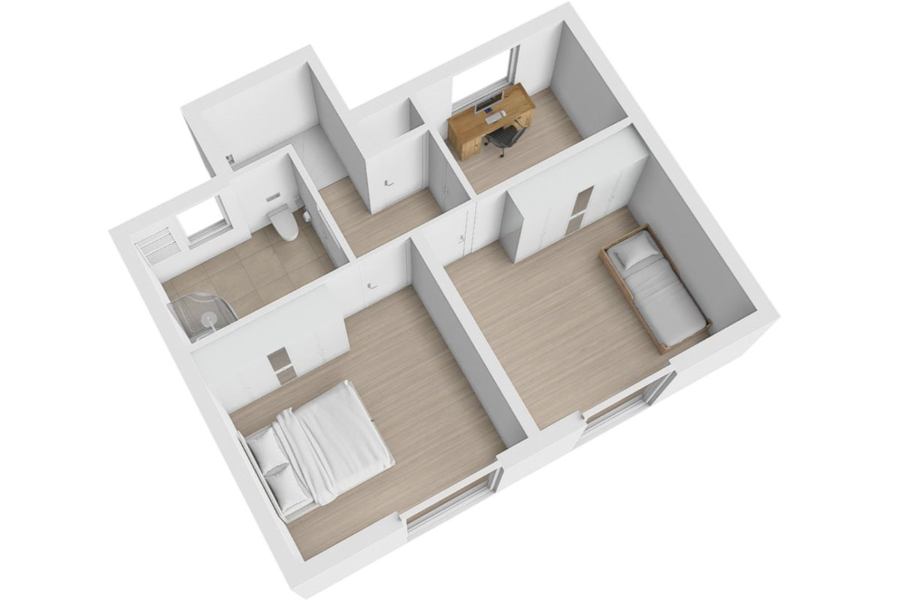
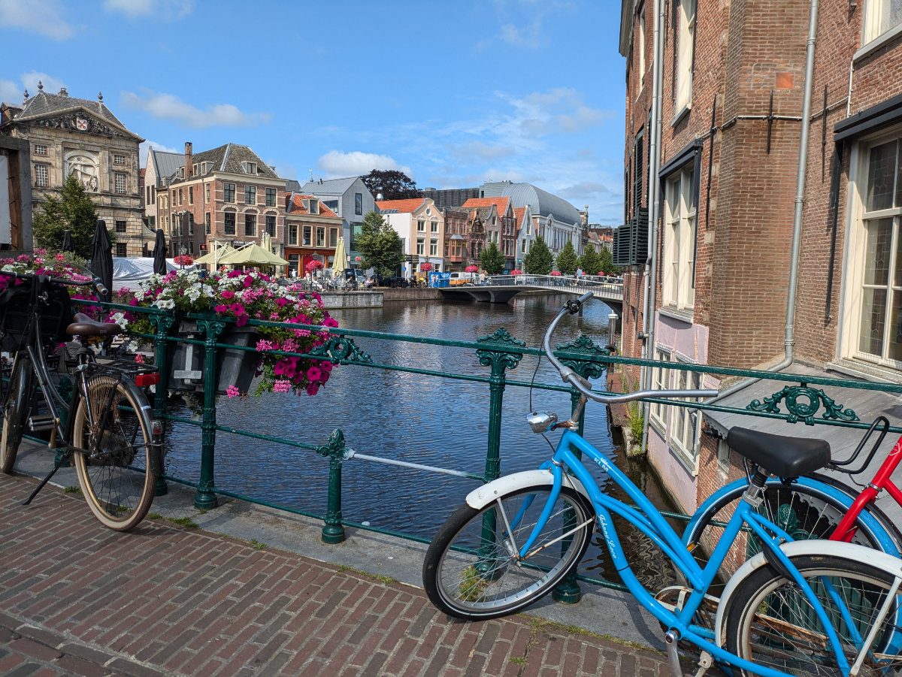
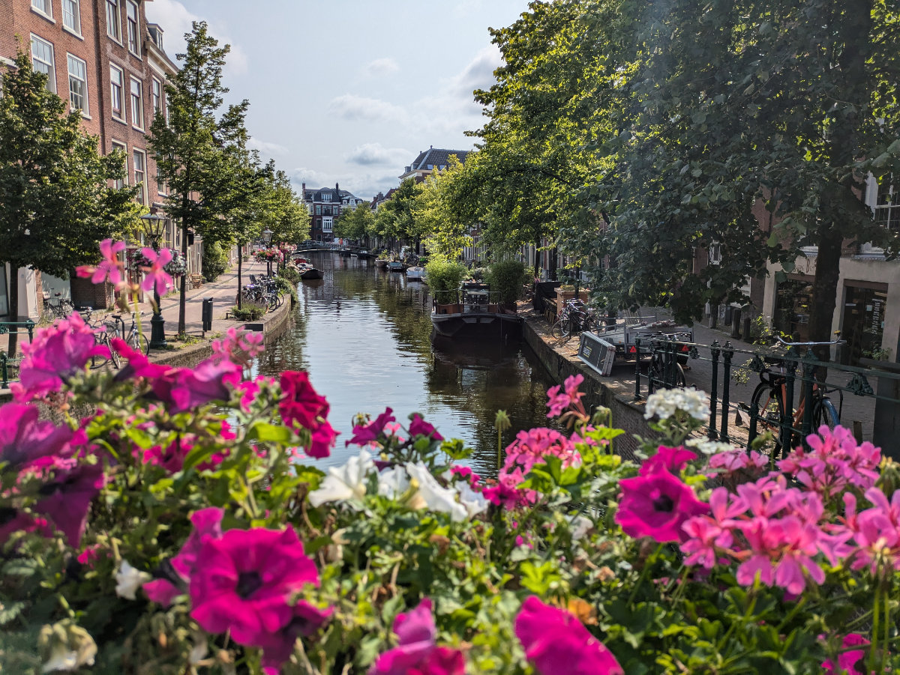
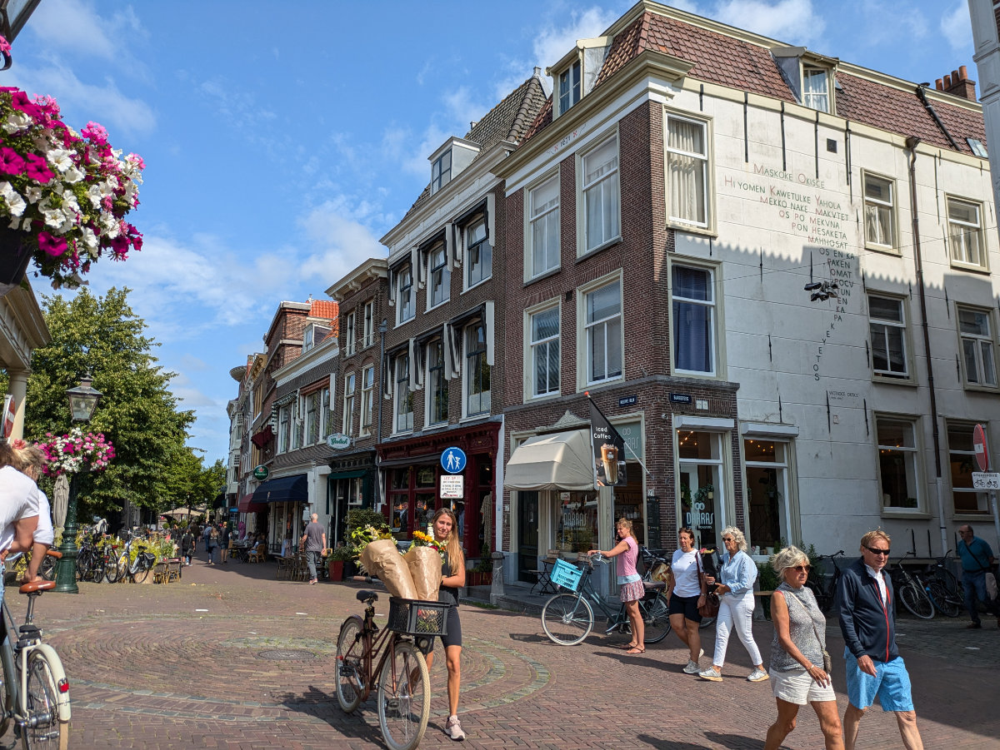
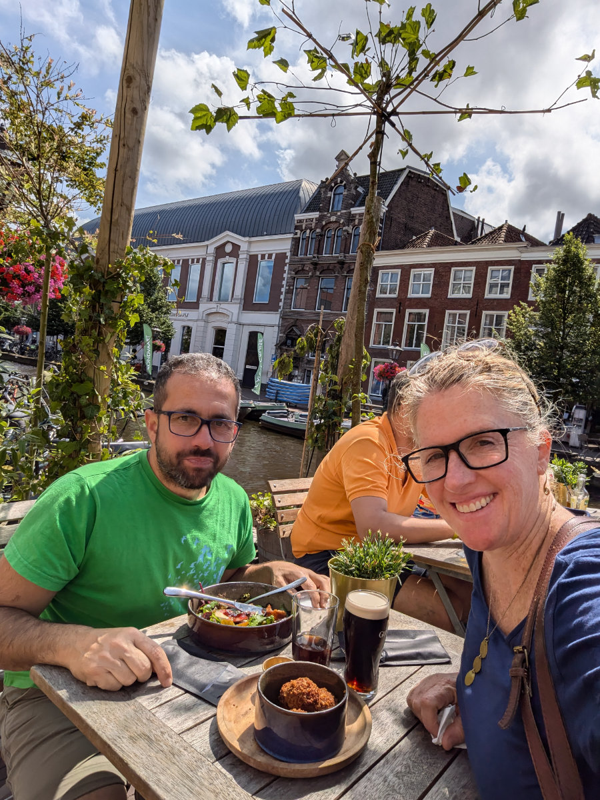

_La casa vista dal giardino_

Forse ci siamo!

Questa mattina io e Hilly siamo andati a vedere una casa in affitto a Leiden. Siamo stati portati lì da un’agenzia, di sudafricani, che lavora solo con espatriati. E’ la prima casa che visitiamo e forse sarà l’unica.\
Si tratta di un edificio un po’ inconsueto rispetto alle tipiche case olandesi, che bene o male si assomigliano un po’ tutte. Nonostante la casa sia gia’ abitabile ci sono alcuni elementi un po’ “horror” tipo tutto il pavimento del piano di sotto, la cucina e alcuni mobili che resterebbero nella casa. La cosa piu’ positiva e’ che e’ a soli sette minuti di bici dalla scuola a cui andranno Sophia e Gemma e a quindici minuti, sempre in bici, dal centro di Leiden.\
La zona e’ anche molto tranquilla e ben servita. C’e’ una stazione del treno a 5 minuti; supermercati, caffetterie e ristoranti sono molto vicini così come un bellissimo parco.\
In somma la location e’ ideale.\
Cosa un po’ meno positiva e’ il prezzo, di 2200 euro al mese, un po’ piu’ alto del budget che ci eravamo dati.\
La casa sarebbe disponibile da meta’ Agosto e questo andrebbe bene per noi che infatti siamo sistemati con pet sitting fino al 22 Agosto e poi saremmo homeless.

Dopo aver visitato la casa, e aver anche conosciuto il proprietario, che sembra una bravissima persona, io e Hilly siamo rimasti a pranzo a Leiden. Abbiamo mangiato in un Bar Bistrot lungo uno dei molti canali che rendono Leiden veramente adorabile e affascinante.\
Vivere in questo posto ci sembra un sogno e se la casa andasse in porto saremmo tutti felicissimi; anche le ragazze, con cui abbiamo fatto una video chiamata subito dopo per chiedere un loro parere.\
Infatti una di loro dovrebbe accontentarsi di una camera da letto molto piccola, e Gemma si e’ offerta di sacrificarsi. Quando dico molto piccola intendo 5.5m² !\
Pero’ c’e’ una bella finestra.\
Il giardino e’ abbastanza grande, per gli standard olandesi, ma e’ per la maggior parte pavimentato.
C’e’ anche una stanzina esterna in cui potrei allestire una micro-officina, un sesto di quella che avevo alla Civettaia.
Io e Hilly stiamo fantasticando su tutte le migliorie che faremmo nel caso il proprietario accettasse la nostra proposta.
Questa mattina c’erano anche altre persone a vedere la casa e, per farvi capire, da quello che ci dicono le agenzie, la crisi immobiliare e’ così forte che quando una casa entra nel mercato arrivano subito un centinaio di richieste, le quali vengono scremate a una decina che poi vengono proposte al proprietario per essere valutate. In questo caso sembra ci siano meno richieste perché la casa non è bellissima dentro (mentre di solito sono molto curate) e perché il prezzo per la metratura e’ un po’ elevato. Ma noi siamo abbastanza disperati e nel caso tra un anno volessimo cambiare basterebbe dare un mese di preavviso.\
Da parte del proprietario invece c’e’ bisogno che lui dia 3 mesi di preavviso. Qui funziona così.

_Dalla finesta della camera da letto_

_Il "bellissimo" pavimento in marmo e la "splendida" cucina_

_Il bagno e' abbastanza grande e c'e' pure una finestra, che lusso!_

_La vista dalla camera da letto non e' paragonabile a quella della civettaia pero' non e' neanche cosi' male._

_Il piano di sopra con lo studio che diventerebbe la stanzina di Gemma_

Per quanto riguarda il lavoro, entrambi stiamo rispondendo a diversi annunci ogni giorno.
Nel caso riuscissimo ad assicurarci la casa nelle prossime settimane, anche senza dei contratti di lavoro, avremmo un po di respiro per poter trovare lavoro, ancora 3 o 4 mesi di autonomia prima di addentrarci nel mondo dei ristoranti, negozi, consegne a domicilio, pulizia cessi e manovalanza varia.\
Anche se in quel caso dovremmo fare gli straordinari per poterci permettere 2200€ d’affitto. Ma una cosa alla volta!

Due giorni fa siamo andati alla spiaggia di Wassenaar, il paese in cui ci troviamo. Una bellissima pedalata di 20 minuti attraverso boschi naturali e dune di sabbia per poi arrivare ad una splendida spiaggia con un mare, ahime’, color ruggine in cui facevano il bagno solo due bambini che sarebbero stati felici anche di sguazzare in una pozzanghera.\
Ma siamo tutti d’accordo che non siamo qui per il mare, per quello andiamo in Sardegna o in Sudafrica, grazie mille.\
Nell’ultima settimana ha piovuto pochissimo e ci siamo goduti un po’ d’estate.\
Sophia e Gemma ci raccontano del caldo pazzesco che fa in Sardegna. Gemma e Elena stanno facendo la bella vita! Durante il giorno prendono l’autobus per andare alla spiaggia del campeggio di Torre Chia, dove Iron fa il bagnino, e tutte le sere si vestono e truccano per andare in piazza a Pula, dove hanno gia’ una comitiva di amici.\
Sophia si gode il mare di Nora e sta pianificando il suo prossimo futuro, facendo dei budget di spesa e dei pronostici sui guadagni che fara’ lavorando in qualcuno delle dozzine di cafe’ lungo i canali del centro di Leiden. Ha detto che appena torna cerca lavoro. Io alla sua eta’ pensavo solo a vivere sulle spalle dei miei genitori e non avevo mai un risparmio in tasca. Hilly uguale!\
Da dove e’ saltata fuori Sophia?

_Per le vie di Leiden_

_Canali in fiore_

_Leiden e' molto piacevole_

_Uno spuntino da quaranta euro, li mortacci loro!_
