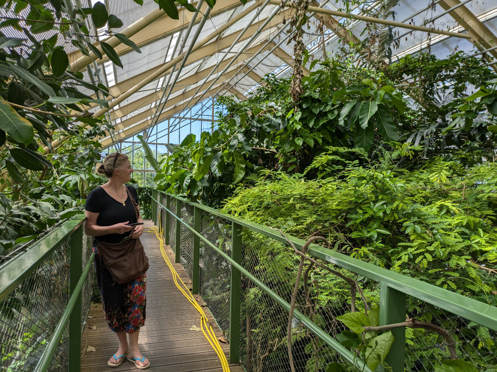
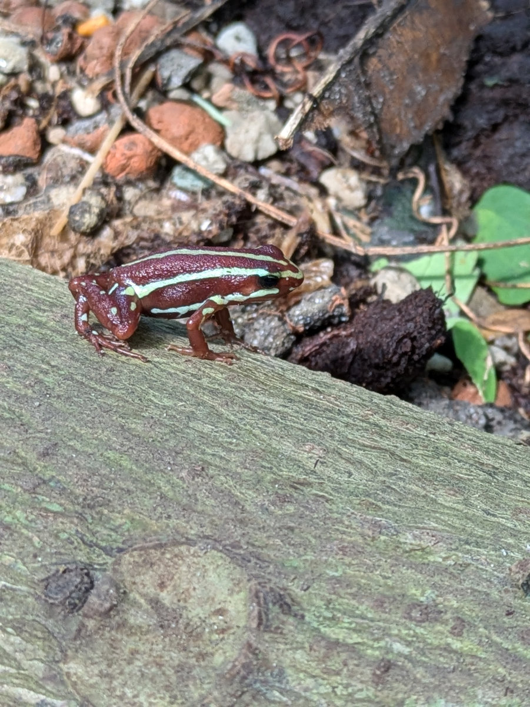
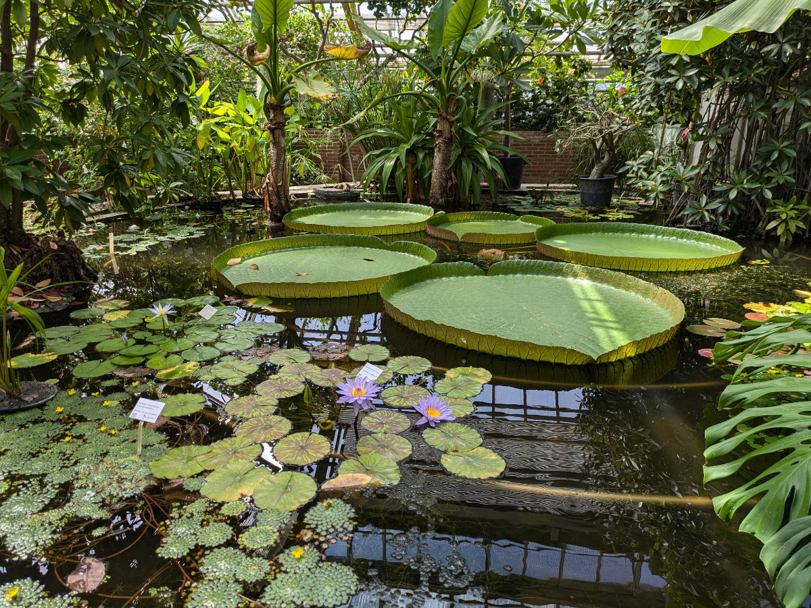
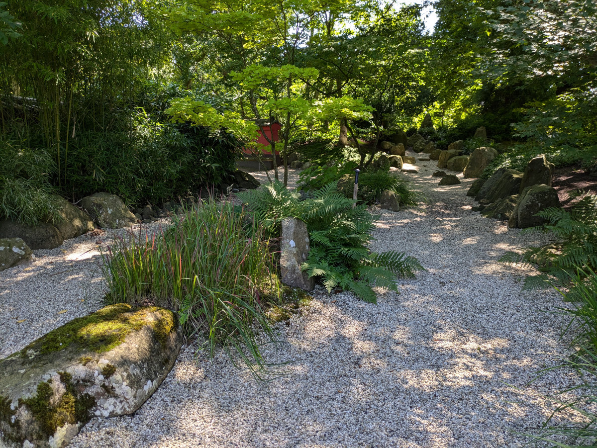
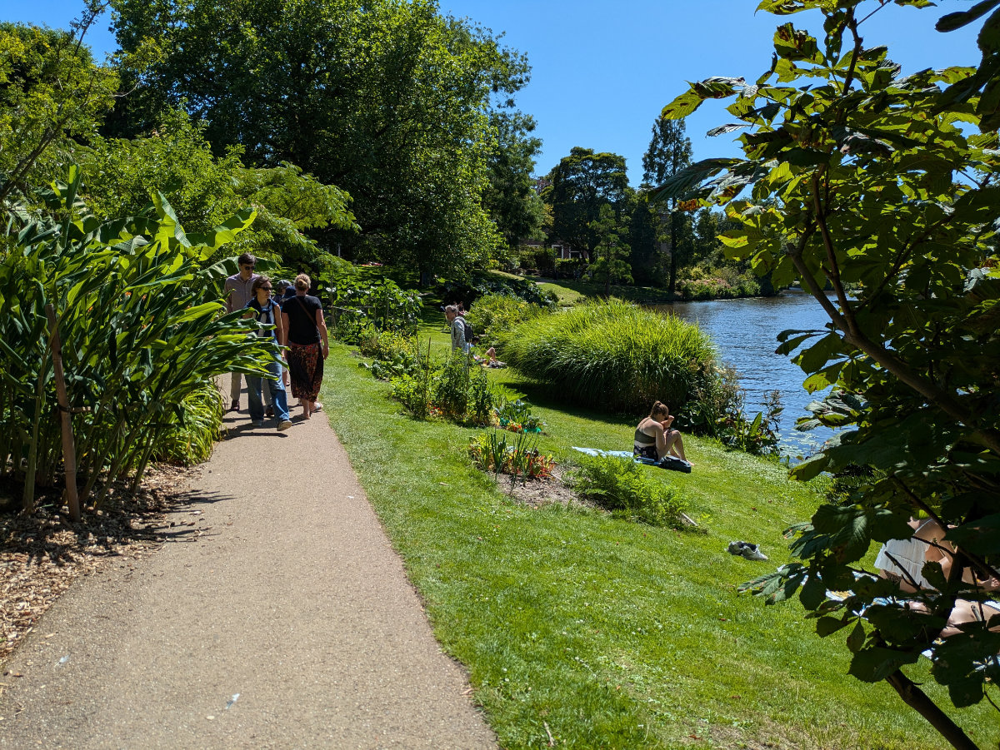
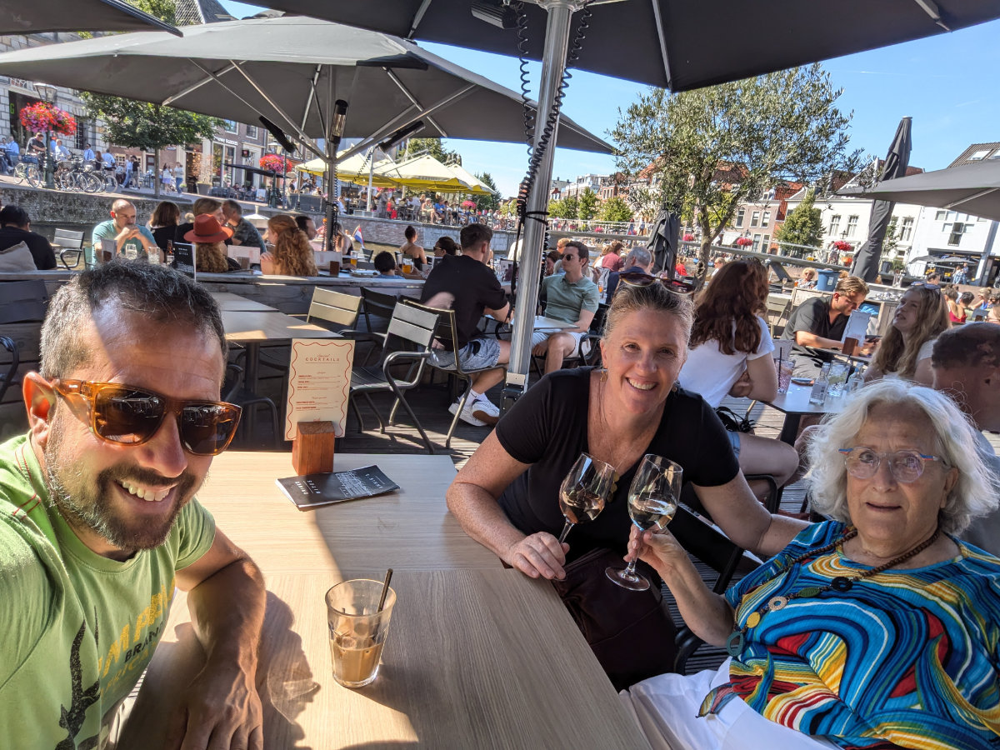
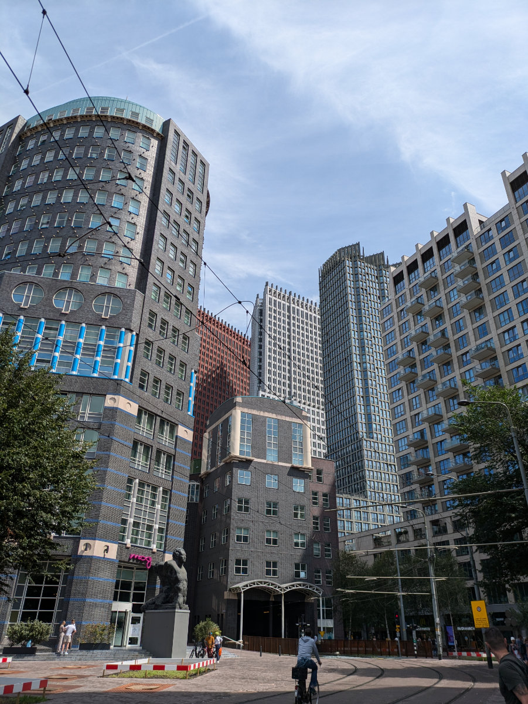

_Yuppieee!!!_

Oggi, verso l’ora di pranzo, abbiamo ricevuto la stupenda notizia che il proprietario della casa che abbiamo visitato venerdì ha scelto noi come affittuari.
Durante il week-end, nonostante abbia cercato di pensarci il meno possibile, il mio cervello indisciplinato ha svolto un'intensa attivita’ di sottofondo per pianificare lavori di fai-da-te, risolvere problemi logistici, fissare date e scadenze. Ora posso tranquillamente portare tutta questa attivita’ cerebrale in primo piano!\
Mentre tornavamo in bicicletta dall’Aia, dove siamo andati a visitare la famiglia che ci affidera’ la propria casa per le prossime tre settimane, partendo da domani, io e Hilly parlavamo di come tutto questo grande puzzle, che una volta completato rappresentera’ la nostra nuova vita in Olanda, si stia magicamente componendo nel migliore dei modi.\
Siamo riusciti a non pagare alberghi o Airbnb per tutta l’estate e passeremo dall’ultimo pet-sitting alla casa che abbiamo trovato. Questo ci ha fatto risparmiare parecchi soldi e ci dara’ ancora qualche’ mese per cercare lavoro.

La casa ci verra’ consegnata il 15 Agosto mentre l’ultimo pet-sitting finira’ il 21 Agosto, il giorno del compleanno di Gemma.\
Prima del 21 Agosto voglio fare alcune migliorie alla casa. Vogliamo posare un parquet su tutto il piano di sotto, per coprire il marmo che non ci piace. Possibilmente dipingere i mobili della cucina. Magari cambiare il colore di qualche parete. Sistemare il bagno.\
Prima dell’inizio della scuola, a fine Agosto, dovremo anche andare in Toscana a prendere la roba che abbiamo immagazzinato.

Il Fatto che vivremo a Laiden mi rende immensamente felice.
Ieri siamo usciti a pranzo con Maartje, una cara amica cresciuta a Leiden che frequentava i genitori di Hilly quando nei primi anni 70 vissero li perche’ il papa’ di Hilly stava facendo il dottorato in legge. Ci ha raccontato un sacco di storie su quegli anni e su tutti gli amici olandesi e sudafricani che orbitavano intorno a loro in quel periodo.
Abbiamo anche visitato l’orto botanico, sempre utilizzando la nostra “museumkaart” e quindi risparmiando venti euro a testa. Tutto era estremamente ben curato e ben organizzato e sicuramente un posto da visitare diverse volte durante l’anno. C’e’ una grossa serra tropicale, calda e umida, dove fara’ piacere andare nelle fredde giornate invernali. A un certo punto ci sono dei tavoli, nella serra, dove si puo’ andare a fare un pic-nic, o anche a lavorare al computer.
Laiden ieri era un'esplosione di fiori lungo i canali, barche festeggianti e tavoli carichi di birre. Maartje ci ha fatto un elenco di eventi che si svolgeranno tra Agosto e Ottobre. La festa della cittadina e’ il 3 Ottobre e danno da mangiare aringhe e verdure gratis a tutti. Una tradizione molto antica.

Nella casa in cui andremo da domani dovremo badare a 2 cani e 1 gatto. La casa si trova a dieci minuti a piedi dal centro dell’Aia e a 5 minuti da un grande bosco. La strada che abbiamo fatto in bici da Wassenaar a l’Aia e’ incredibile. Corre parallela alla costa ma lontana di qualche chilometro, grossi alberi lasciano passare poca luce e sulla parte sinistra, andando verso l’Aia, si susseguono decine di ville una piu’ spettacolare dell’altra. Una specie di Beverly Hills Olandese. Chi soffre di forte invidia sociale deve tenersene alla larga!

Giovedì pomeriggio Sophia e Gemma torneranno in Olanda. Sono contentissime per la notizia della casa, soprattutto per il fatto che potranno uscire per andare a scuola alle 8.10 del mattino.\
Un enorme cambiamento per loro rispetto al modo in cui sono cresciute.\
 Per tutti questi anni si sono fatte 1 ora e mezza di autobus al giorno, tra andata e ritorno, (grazie Samuela, Valeria e Angelo per il vostro incessante e fantastico servizio) e Sophia negli ultimi due anni ancora di piu’, per andare a Empoli 6 giorni alla settimana. Questo voleva dire alzarsi tutte le mattine tra le 5.30 e le 6.00.\
 Capite la felicita!

_La serra tropicale_

_Al secondo piano della serra tropicale_

_Questa era posata su di un tronco_

_Una delle painte piu' strane che abbia mai visto_

_Il giardino Zen_

_Lungo un canale nell'orto botanico_

_A tavola con Maartje_

_Palazzi a L'aia_

_Le bestioline di Hilly_
