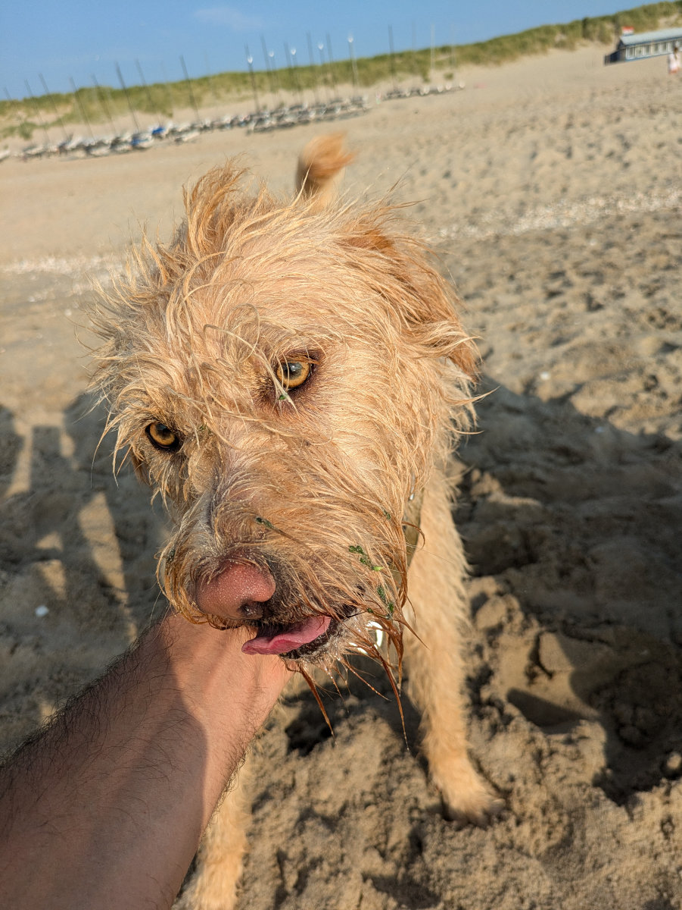
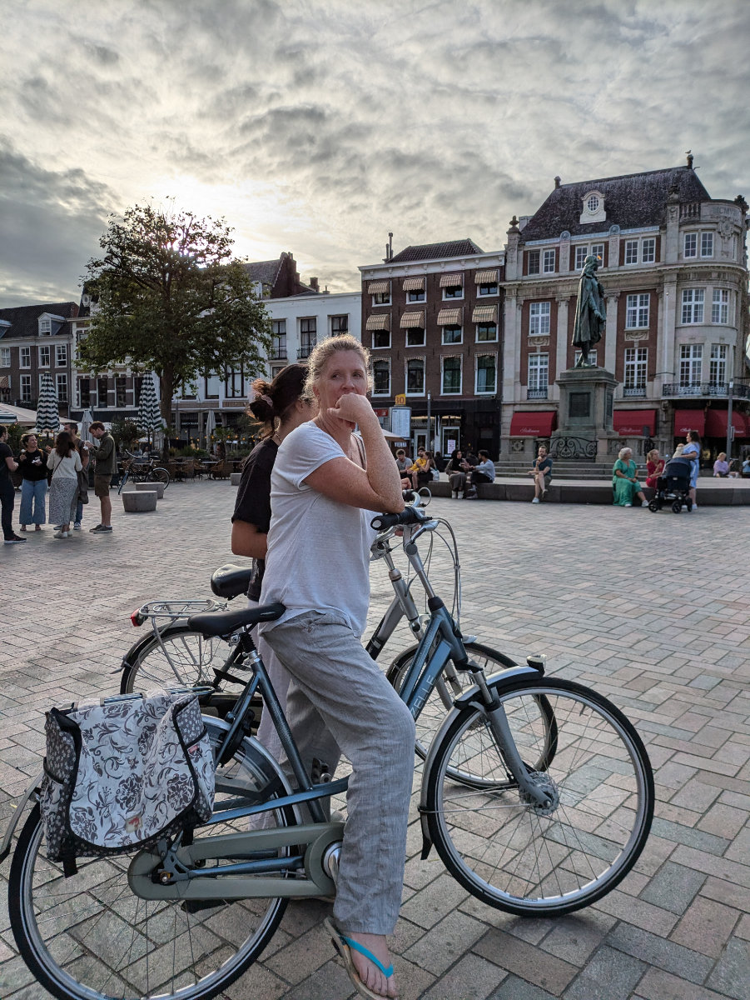

_I cani tirano come matti quando intravedono il ponticello_

E’ passata una settimana dall'ultimo post e dalla telefonata dell’agenzia immobiliare che ci ha fatto fare salti di gioia.
Nel frattempo le ragazze sono tornate dalla Sardegna. Pelle scura e capelli schiariti dal sole.
Il giorno in cui sono tornate a Cagliari c’erano 44 gradi. Qui ne fa al massimo 27.

I cani Bertie e Gertie sono fantastici. Fratello e sorella di due anni, provenienti dalla stessa cucciolata ma molto diversi. Quando li portiamo in spiaggia si scatenano come dei matti, inseguendo i gabbiani e perdendosi tra le dune. Il gatto Moxie e’ molto amichevole e si e’ lasciato coccolare fin dal primo momento.\
La zona in cui abitiamo e’ piuttosto particolare. Siamo vicinissimi ai grattacieli ma abitiamo in una via tranquilla, di cassette a 3 piani con il giardino. Camminando 5 minuti si arriva a degli uffici di vetro e acciaio, sembrerebbe il posto peggiore dove portare i cani a camminare ma poi, passati sotto un portico, si attraversa un ponticello in legno e ci si ritrova in un denso bosco di querce e faggi dove si puo’ camminare per chilometri nella natura.\
L’ Aja e’ molto affascinante. Diversa dalle tipiche città olandesi.\
Il centro e’ un bel mix di modernita’ e passato e, nelle zone periferiche, ci sono strade molto larghe, grossi edifici e un sacco di verde.
In giro si respira un'aria internazionale e si sente parlare tanto inglese. Una grossa differenza da una città come Zwolle, per esempio, dove tutto e’ olandese fino al midollo.

Sabato siamo andati a Leiden a far vedere a Sophia la casa, dal di fuori. Gemma non e’ voluta venire.
Mentre sbirciavamo all’interno del giardino ci siamo accorti che su una sedia era seduto il proprietario, intento a mangiare un panino. Stava lavorando alle piccole ristrutturazioni che si e’ impegnato a fare prima del giorno della consegna. Si e’ accorto della nostra presenza e ci ha fatti entrare facendoci fare un altro bel tour della casa. Sophia era molto felice di vedere la sua futura camera e ha iniziato una board su pinterest, sulla quale ha invitato a partecipare anche il resto della famiglia, per condividere idee di possibili migliorie agli interni.\
Io intanto mi sto facendo una lista dei materiali che mi servono per cambiare il pavimento al piano di sotto e nelle stanze delle ragazze.\
Questa mattina abbiamo una video chiamata con un agenzia che ci dovrebbe fornire gli allacci di corrente, acqua, riscaldamento e Internet. Il riscaldamento è fornito dal comune. In casa arriva direttamente l’acqua calda e in teoria dovrebbe essere piu’ economico, ed ecologico, che avere la propria caldaia a gas.

Sabato abbiamo anche comprato le prime due biciclette. Per Hilly e Sophia. Abbiamo risposto ad un annuncio su Facebook Marketplace, erano in vendita entrambe dallo stesso proprietario, che si trovava a Wassenaar, a pochi isolati di distanza da dove abbiamo alloggiato fino a qualche giorno fa.\
Entrambe le bici sono della marca “Gazelle”, molto diffusa in Olanda e di ottima qualita’.\
Abbiamo pagato 260€ quella di Hilly e 180€ quella di Sophia. Non c'è stato modo di contrattare neanche 10€ sul prezzo.\
Entrambe hanno bisogno di un bel intervento di manutenzione, soprattutto quella di Hilly, ma la maggior parte dei miei attrezzi e’ ancora in Italia. Non vedo l’ora di metterci sopra le mani.
Oggi andremo a cercare la bici per Gemma, in giro per negozi a l’Aja. Essendo lei piu’ insicura sulle due ruote preferisce vederne tante e trovare quella piu’ comoda per la sua taglia.

Io sto pensando di cercare lavoro, per il momento, nei molteplici negozi di biciclette che ci sono a Leiden. La paga e’ quella di base, pero’ almeno inizierei a lavorare facendo comunque qualcosa che mi piace. Un’idea che mi e’ venuta, dopo che ci siamo assicurati la casa, che ha un grande giardino pavimentato e una micro officina, e’ quella di comprare delle bici usate, messe molto male, e trasformarle in eleganti bici custom dall'alto valore “hipster” da poi rivendere. Questo come lavoretto in più, che io faccia poi il programmatore o qualsiasi altra cosa. L’idea mi affascina parecchio.

Nel week-end e’ venuta a trovarci una nostra amica Belga che Hilly conosce da tanti anni. Niele non vive piu’ in europa da tanto tempo. Ha lavorato come insegnante in Sudafrica, per diversi anni in Etiopia e ora e’ da un paio d’anni in Congo, dove insegna, in lingua fiamminga, in una scuola elementare. Ci ha raccontato un sacco di storie sull’Etiopia e sul Congo. Lei era venuta a trovarci quando vivevamo a Crespina, poi un paio di volte alla Civettaia, e ora è anche stata la prima amica a vedere la nostra nuova casa.

Abbiamo prenotato il furgone/camion per andare in Toscana a prendere la nostra roba. Partiamo il 21 mattina e saremo di ritorno il 23 notte. Sophia restera’ da sola nella casa Nuova per tutto il tempo mentre Gemma verra’ con noi. E’ disposta a farsi 3000 km pur di rivedere i suoi amici anche per solo un giorno. Per ammortizzare un po’ il costo del viaggio, che tra noleggio e carburante sara’ di circa 2000€, abbiamo trovato una signora olandese, tramite un post su Facebook, che ha bisogno di trasportare dei pacchi e qualche mobile nella sua casa in versilia. Ci siamo accordati per un contributo spese di 600€.
Quindi il 21 alle 9.30 ritiriamo il furgone/camion, andiamo in un paesino sulla strada verso la Germania a caricare le cose della signora, e contiamo poi di arrivare in Versilia la mattina dopo, per consegnare il piccolo carico.\
Per non arrivare al mattino troppo presto ci fermeremo a dormire in auto per qualche ora. Poi il 22 andremo a caricare le nostre cose, incontreremo alcuni amici, probabilmente non vedremo Gemma neanche per un minuto, e il 23 mattina ripartiremo con il veicolo carico e direzione Leiden.\
Un’altro pezzo del puzzle che spero andra’ a posto senza tanti problemi.

_Bertie e' un cucciolone_

_Moxie dorme tutte le notti con Gemma_

_Gertie ama perdersi tra le dune di sabbia_

_La spiaggia dell'Aja_

_Grandi corse nell'acqua_

_Le nuove biciclette di Sophia e Hilly_

_In giro per L'Aya_

_Il Binnenhof, gli uffici ministeriali dell'Aja_

_Nello sfondo il teatro di Leiden dove Merinda (mamma di Hilly) faceva la guardarobiera 50 anni fa_
