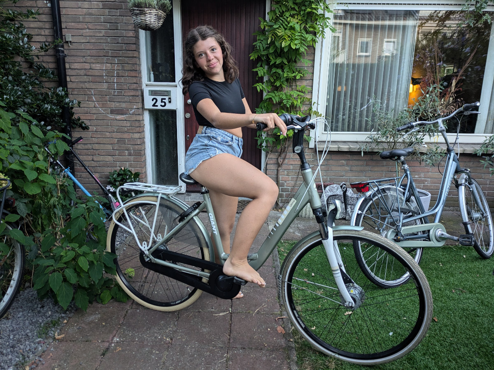
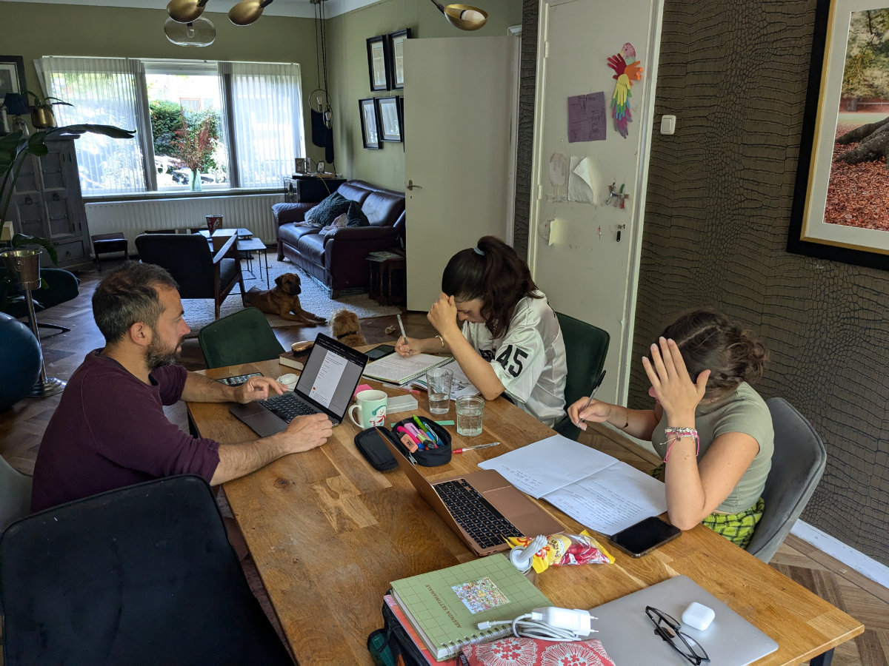

_Questo sarebbe un po' un mio sogno_

Qualche giorno fa avevo risposto ad un annuncio di lavoro in cui cercavano meccanici per biciclette. La proposta prevedeva un corso di 8 settimane per imparare a riparare bici di tutti i tipi a cui sarebbe seguito un lavoro assicurato. L’annuncio riportava chiaramente che era necessaria un po 'di esperienza manuale con le biciclette (quella ce l’ho), voglia di imparare ( anche quella c’e’) e la conoscenza dell'Olandese parlato e scritto (no, qui non ci siamo).\
Io non mi ero accorto di questa ultima clausola, o forse ho fatto inconsciamente finta di non vederla, e avevo prontamente risposto all’annuncio, tra le decine di annunci a cui aderisco ogni settimana.\
Un paio di giorni dopo ricevo una chiamata, in olandese, da una signora che rimane subito un po’ spiazzata dal fatto che le rispondo, in inglese, dicendole che non parlo la lingua della sua nazione. Lei crede di aver sbagliato numero, cercava un certo Cristian Cassetta che aveva risposto all’annuncio per meccanico di biciclette. Io la rassicuro dicendole che sono io Cristian Cassetta e che si, avevo risposto all’annuncio ed ero interessato al lavoro.\
“Si, ok, però lei non conosce l’Olandese”, mi dice la signora. Io rispondo: "È vero, non lo conosco, però amo le biciclette, ho tanta voglia di imparare, e poi con le biciclette non ci devo mica parlare”.\
Ci facciamo una grande risata insieme e lei comincia a spiegarmi i dettagli della faccenda.\
In pratica tutte le persone che partecipano al corso prendono il sussidio statale di disoccupazione e in più il governo paga il corso, che costa 4000€. Nel mio caso io non sono ancora registrato come lavoratore in Olanda, non prendo sussidi e il governo non paga un bel niente per me.\
Ci sarebbe un'alternativa, mi dice la signora: se per me va bene mi fanno fare il corso gratis ma poi, alla fine, mi impegno a lavorare in uno dei loro negozi di bici, a Leiden, o comunque in zona, per almeno un anno.\
Dopo una breve consultazione con Hilly accetto la proposta.\
Prima però mi devono accettare loro, perché comunque per loro e’ un investimento farmi fare tutto il corso se poi non sono buono a nulla.\
Per essere accettato al corso devo fare un test con un meccanico professionista che valutera’ le mie capacita’ e la mia attitudine (speriamo non valuti anche il mio olandese!).\
Per il test devo andare domani in un paesino a un ora e mezza di auto di distanza, devo essere lì alle 11.\
Se verrò ammesso potrò iniziare con le lezioni il 26 Agosto e per 8 settimane dovrò andare a Utrecht, per 40 ore alla settimana. Il corso e’ per il 90% pratica a per il 10% teoria. La teoria sara’ tutta in Olandese e quindi dovro’ barcamenarsi in continue traduzioni istantanee con google translate.\
Alla fine fanno un esame e poi rilasciano un certificato.\
La paga, una volta ottenuto il lavoro, e’ abbastanza bassa per l’Olanda. Parliamo di 2470€ lordi al mese per 38 ore di lavoro. Pero’ le tasse su stipendi bassi sono molto poche, solo il 9%, e quindi dovremmo comunque poter stare tranquilli, magari integrando nei weekend con altri lavoretti, per almeno un anno, durante il quale posso approfondire le mie conoscenze come sviluppatore o portare il discorso delle biciclette ad un livello piu’ alto. Questo ovviamente prevede che anche Hilly lavori full-time.\
Sono molto entusiasta di lavorare con le bici e spero veramente che tutto andra’ in porto. Questo mi darebbe anche la possibilita’, a tempo perso, di fare “bike flipping” ovvero acquistare bici sgangherate su facebook, metterle a posto, customizzarle un po’, e poi rivenderle facendo un profitto.\
Per preparami un po’ all’esame di domani ho lavorato un po’ sulle bici di Hilly e Sophia, con i pochi attrezzi che mi son portato, visto che comunque non erano mai state manutenute dall’ex proprietario. Le biciclette olandesi sono abbastanza diverse dalle mountain bike su cui ero abituato a metter le mani. Speriamo domani di non fare cavolate!

Lunedi io e Gemma abbiamo acquistato una bicicletta per lei. L’abbiamo presa in un negozio, sempre usata, e l’abbiamo pagata 320€.\
 Gemma e’ molto felice dell’acquisto e sta facendo pratica in giro tra i grattacieli dell’Aja.\
Ieri sera ci siamo incontrati con degli amici che vivono in Islanda ed erano di passaggio in Olanda. Dovevano prendere un volo ad Amsterdam ma sapendo che noi eravamo qui hanno passato una notte a l’Aja, in un Airbnb.\
Siamo andati tutti e quattro in bici da loro e abbiamo cenato insieme. Poi, per non lasciare i cani troppo tempo da soli, Sophia e Gemma sono tornate a casa in bici, tutte sole, nella notte attraverso la citta’.\
Un altro grande passo.

_Faccio pratica con le biciclette olandesi_

_La nuova bici di Gemma_

_Christian, Anna e i loro 3 figli, vivono in Islanda ma Christian e sudafricano e Anna e' tedesca (tutti fuori fuoco tranne Hilly)_

_Sessione di studio mattutino_
