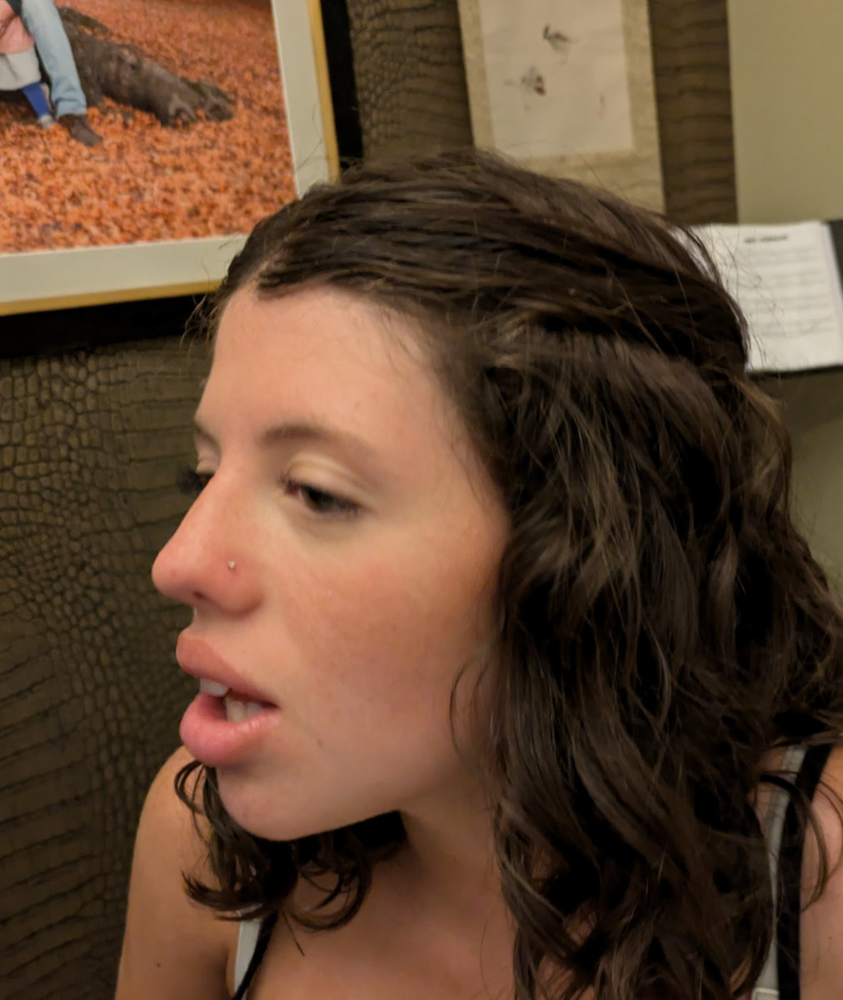
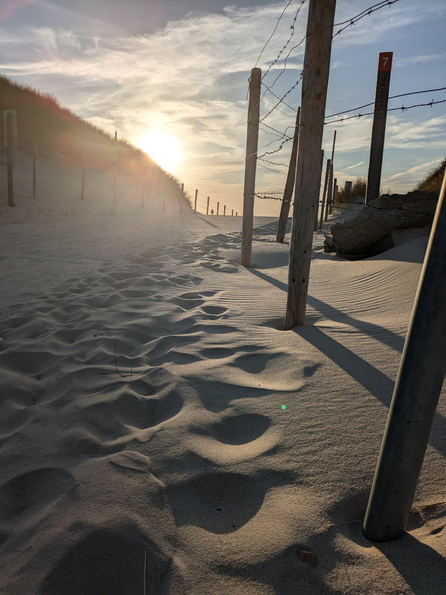

_La scuola "Maintec" a cui sono iscritto_

Ce l’ho fatta! Sono iscritto al corso. Yupppiee!!
Il viaggio di un'ora e mezza in macchina per raggiungere l’officina e’ passato liscio. Guidare in autostrada in Olanda e’ abbastanza rilassante. Le auto mantengono tutte la distanza di sicurezza e usano le frecce per cambiare corsia. Molti italiani considererebbero noioso guidare in queste condizioni, per me e’ una manna.\
Parcheggio l’auto di fronte ad un grosso negozio di biciclette in una zona industriale nella cittadina di Uden. Dietro l’edificio si trova l’officina/scuola dove si tengono i corsi. La ditta che gli organizza ne ha due, io andro’ in quella di Zeist, vicino ad Utrecht.\
Nell’officina si sta tenendo il corso, ci sono una decina di ragazzi e signori, tutti intenti a lavorare su delle biciclette sospese con dei cavi attaccati al soffitto. Ogni studente ha a disposizione una postazione con un sollevatore per alzare la bicicletta, un banco da lavoro e tutti gli attrezzi necessari.\
In fondo all’officina/scuola trovo l’ufficio di Annette, la signora con cui avevo parlato al telefono. Mi sorride e mi fa cenno di entrare.\
Mi offre un caffe’ ma io rifiuto, sono gia’ abbastanza nervoso.\
Lei comincia a parlarmi in olandese ma passa molto in fretta all’inglese visto l’enorme punto di domanda che mi si dipinge in volto. Mi fa delle domande e intanto scrive al computer.\
"Perché vorresti fare il meccanico di biciclette?” Io le rispondo abbastanza sinteticamente che e’ una mia passione e credo di poterlo fare bene. In realtà avrei voluto dirle che in questo momento della mia vita ci sono solo 3 lavori che farei con grande entusiasmo. Lo sviluppatore web, il falegname oppure il meccanico di biciclette. Però a questo ci ho pensato dopo, mentre tornavo a casa in auto con un grosso sorriso stampato in faccia.\
Finita la chiacchierata con Annette viene il momento di sporcarsi le mani. Annette mi presenta Tom, l’istruttore in quel corso. Tom e Annette mi parlano in Olandese, io annuisco ma non funziona, si accorgono che non capisco una mazza e passano subito all’inglese. Fiuu’!! Me la sono scampata ancora!\
Tom mi porta ad una postazione dove c’e’ appesa una bici da donna e mi dice di smontare e rimontare la ruota posteriore.\
Le biciclette olandesi sono più complicate delle bici italiane o delle mountain bike perché hanno i freni a tamburo e il cambio integrato nel mozzo posteriore. Questo implica il fatto che bisogna togliere una serie di aggeggi nell’ordine giusto prima di poter svitare i bulloni che tengono la ruota posteriore.\
L’ennesima botta di culo! Proprio quella mattina, mentre sorseggiavo il caffe’, in attesa di partire per andare al colloquio, avevo guardato un video su youtube di un tizio che smontava e rimontava una ruota posteriore esattamente dello stesso modello di quella che ora mi trovavo davanti.\
Parto convinto anche se le mani mi tremavano un po’, sotto lo sguardo attento di Tom, che intanto mi chiede: “ Ferrari o Lamborghini?” . Io non capisco la sua domanda e gli rispondo “Fiat”, così un po’ a caso. Lui mi dice che ha sentito dire che gli italiani si dividono in due categorie, quelli che amano la Ferrari e quelli che preferiscono la Lamborghini. Io gli dico, con una gocciolina di sudore sulla fronte, mentre maneggio una sottile chiave a brugola, che questa cosa non la sapevo.\
Lui mi racconta della sua passione per le automobili e di come gli piaccia ristrutturare vecchie auto. Ne ha diverse. Intanto si allontana e io proseguo concentrato nella mia missione, sicuro di me e convinto di stare facendo bene. Rimontata la ruota gli chiedo se il tensionamento della catena secondo lui e’ giusto, né troppo lenta, né troppo tesa. Lui mi risponde: “Non ti preoccupare, lascia pure stare la bici, ho gia’ detto alla segretaria che per me vai piu’ che bene, l’ho visto dopo due minuti, da come tenevi in mano gli attrezzi. Si vede che sei abituato a lavorare con precisione.”\
Un'ondata di orgoglio travolge il mio ego, sempre avido di complimenti.\
In effetti ha ragione. Fin da bambino, quando ricevevo un regalo, dopo averlo maneggiato per qualche minuto procedevo subito a smontarlo per vedere com'era fatto dentro.\
Quando facevo le scuole medie mi avevano regalato una automobile radiocomandata in kit di montaggio. Mi ricordo che per diverse ore ero stato assorbito completamente dall’assemblaggio delle piccole parti dimenticando persino di mangiare o di andare in bagno.\
Le mie biciclette erano sempre customizzate in qualche modo così come il mio motorino.\
Tutto questo ha fatto la differenza.\
Alla fine del colloquio Annette mi aveva detto che restava solo di chiedere all'amministratore della scuola l’autorizzazione ad inserirmi nel prossimo corso. La mia situazione infatti era un po’ atipica visto che il corso non veniva pagato dallo stato, nel mio caso, e per loro rappresentava un po’ un rischio, un investimento che avrebbero recuperato durante il mio primo anno di lavoro.
Ci lasciamo con la promessa che mi avrebbe fatto sapere qualcosa prima del weekend.\
Intanto mentre tornavo a casa non sono riuscito a fare a meno di fantasticare sui possibili risvolti che una mia accettazione al corso avrebbe comportato.
Solo oggi pomeriggio, dopo altre 24 ore passate sulle spine, Annette mi ha chiamato per darmi la bella notizia che ero stato inserito nel corso che parte il 26 Agosto, ultimo posto disponibile. Yea!!

Oggi pomeriggio abbiamo accompagnato Gemma a farsi il piercing al naso. Quando siamo arrivati al negozio ci viene detto che era troppo piccola e che ci vogliono minimo 16 anni. Usciamo determinati ad andare a provare in un altro negozio quando il tipo ci richiama e ci dice che ha parlato con il proprietario e in effetti, con il consenso dei genitori, si puo’ fare anche ora. Allora Gemma si siede sulla poltrona in pelle nera mentre il ragazzo, un colombiano che vive tra la Spagna e l’Olanda, prepara gli strumenti.\
Gemma ha paura ma si fa coraggio. Il tizio prende in mano un grosso spillone luccicante e le trafigge una narice facendole uscire l’arnese di diversi centimetri dal naso. Una scena abbastanza splatter e gli occhi di Gemma si bagnano di lacrime.\
Dopo un paio di secondi e’ tutto finito e il piccolo puntino luccicante si presenta sul nasino di mia figlia. Niente male devo dire. Le sta bene.
Lasciamo il negozio soddisfatti e saliamo sulle nostre bici diretti a casa, dove Gemma non vede l’ora di arrivare per fare una story su Instagram.

Tornati a casa io e Hilly carichiamo i cani in macchina per andare in spiaggia, io mi metto le scarpe da corsa perche’ c’e’ un bellissimo sentiero asfaltato sulle dune che volevo percorrere.\
Mentre lei cammina con i cani lungo il bagnasciuga io mi godo la corsa.\
Il percorso e’ mozzafiato. Chilometri tra cespugli di rose selvatiche e more mentre si sente il rumore delle onde e dei gabbiani. Le rose sono quasi tutte sfiorite, chissa’ come sara’ bello a fine Maggio!
Questa cosa della spiaggia mi sta sorprendendo. Se si esclude il colore del mare non ha nulla da invidiare alla bellissima corsa che mi facevo a cape st Francis, in sudafrica, nella riserva naturale che arriva fino al faro.

_Gemma viene torturata per bene_

_Il nasino di mia figlia!!_

_Il sentiero tra le dune_

_Bellissimi cespugli di rosa canina e more_

_Il percorso per arrivare al mare_

_Un ragazzino si diverte con una tavola tra le onde_

_Bertie e Gertie si divertono come dei matti_

_Siamo felici_
