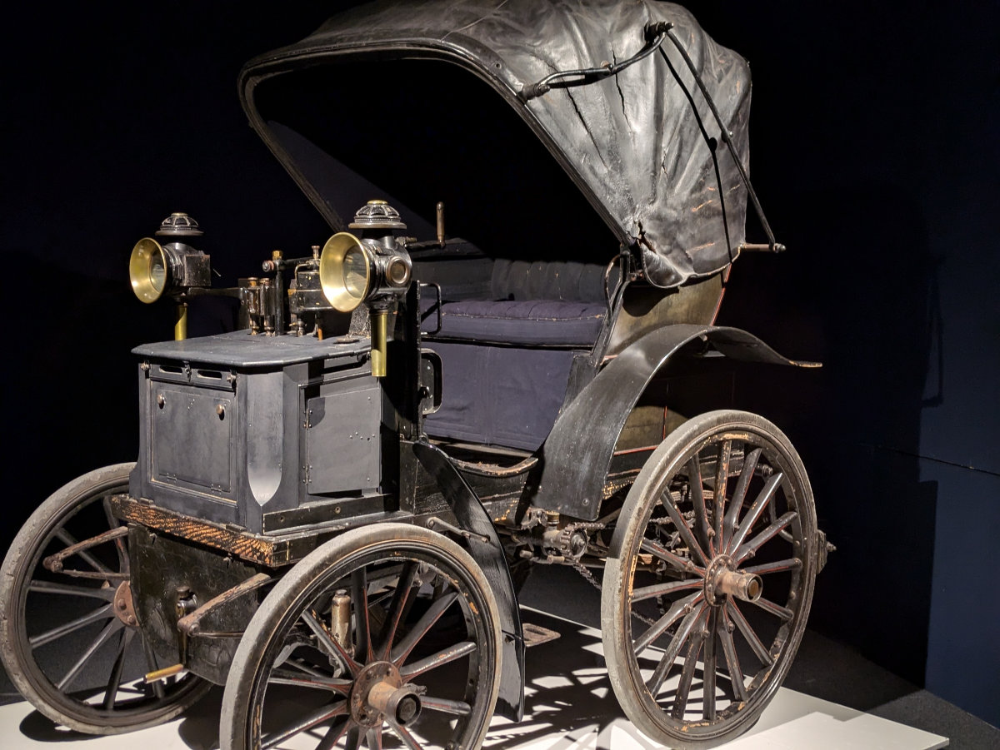
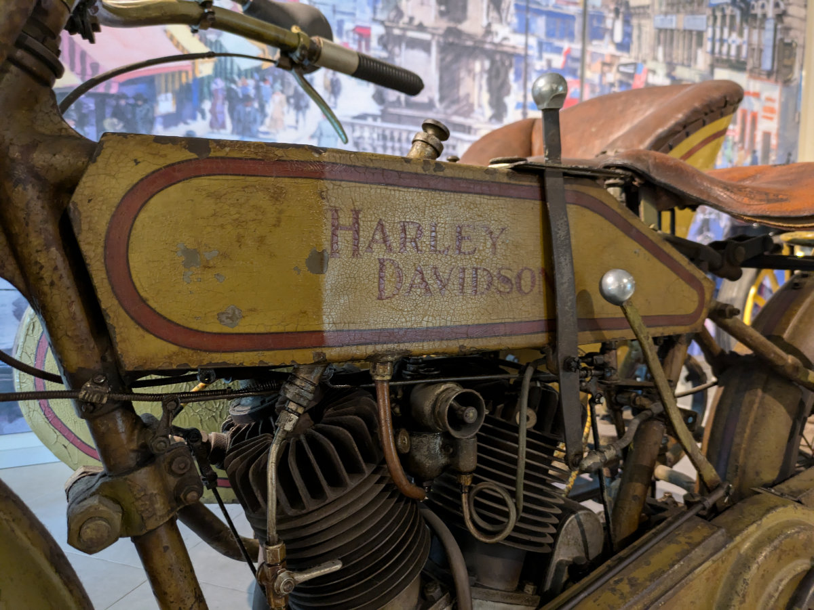
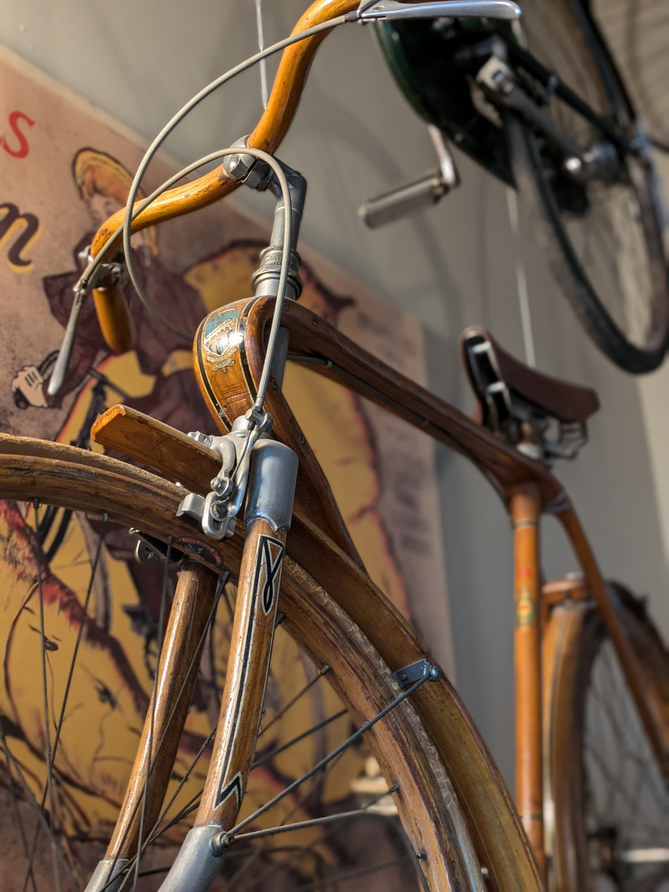
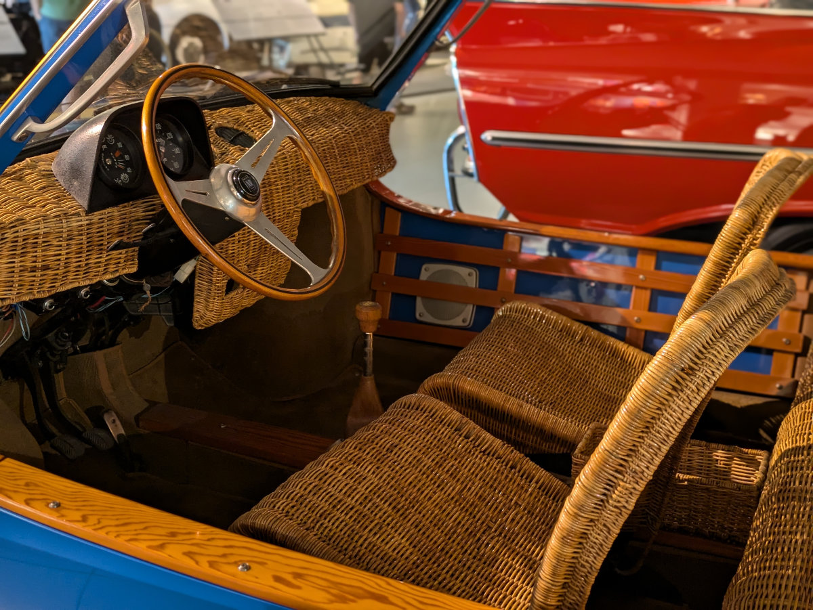
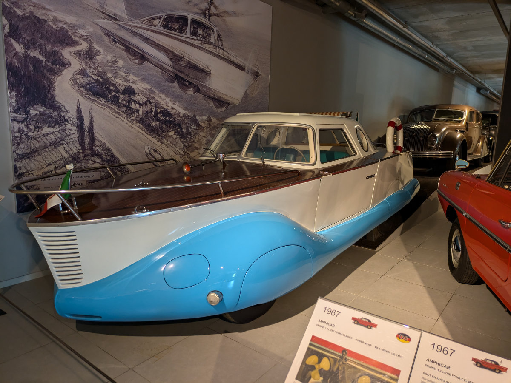
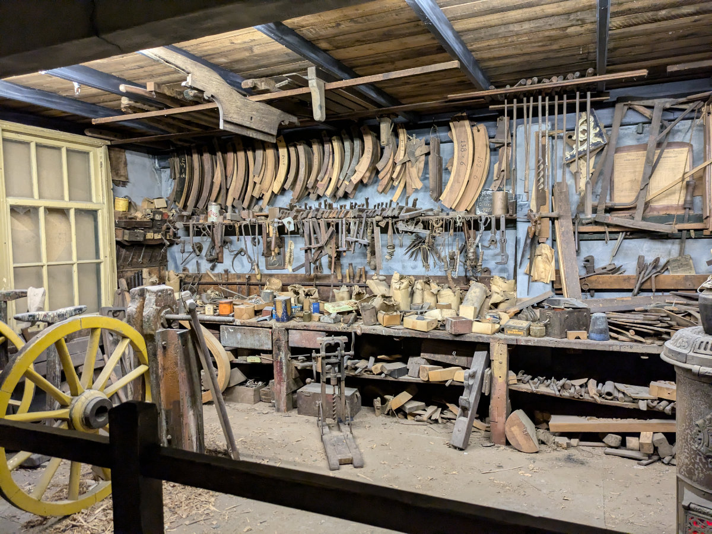
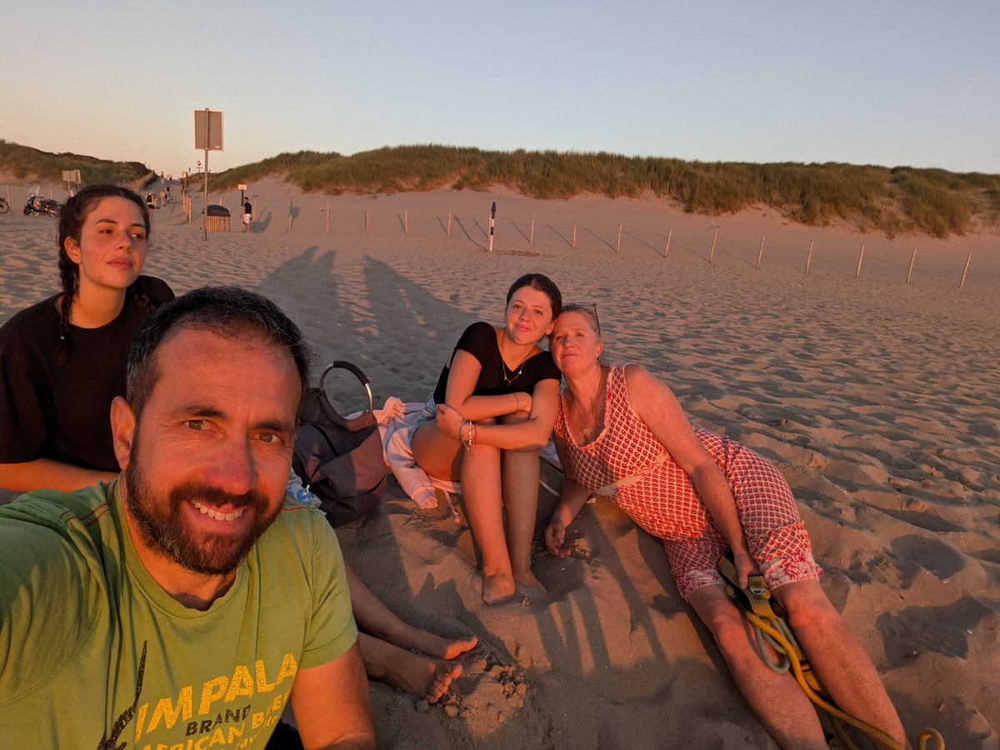

_All'inizio il paradigma era ancora quello delle carrozze, questa è una delle prime ad essere stata motorizzata._

Ieri pomeriggio abbiamo comprato il pavimento per la casa.\
La catena di supermercati del bricolage, Praxis, ha in atto uno sconto del 30% su molti pavimenti laminati durante tutta questa settimana. A meno di 1 km di distanza dalla casa c’e’ uno di questi negozi e qualche giorno prima l’avevamo già visitato. Abbiamo quindi contattato il proprietario, Alfons, per chiedergli se ci potesse aprire la casa per portare i pacchi con le tavole del nuovo pavimento. Ci siamo accordati per trovarci alle 19.00.
Le ragazze sono andate tutto il giorno ad Amsterdam, da sole, e al ritorno hanno preso il treno per Leiden, invece che per l’Aja, e quindi siamo andati tutti e quattro al negozio, per scegliere il pavimento e poi alla casa, per portarlo in due viaggi. Finalmente Gemma l’ha vista dal di dentro, non l’aveva ancora fatto ed e’ stata sorpresa dalla sua cameretta. Se l’aspettava più piccola, viste le nostre descrizioni abbastanza drammatiche; volevamo essere sicuri che poi in futuro non si sarebbe lamentata di avere una camera di quasi un terzo rispetto a quella di Sophia.

_Carichiamo in auto il nuovo pavimento, 25 confezioni in tutto_

Al negozio dove abbiamo comprato il pavimento siamo stati aiutati da un commesso ( non abbiamo mai lavorato in passato con questo tipo di materiali ) per riuscire a scegliere la cosa giusta e poi installarla senza fare casini. Colgo l’occasione per parlare di una caratteristica delle persone olandesi che abbiamo notato da quando siamo qui. Molto spesso, ad un primo approccio, l’olandese si presenta serio e freddo, apparentemente determinato a far sì che la conversazione sia sintetica, concisa, il minimo necessario a concludere l’interazione sociale nel minor tempo possibile.
Questo atteggiamento però non deriva dal fatto che il nostro interlocutore non veda l’ora di liberarsi di noi ma piuttosto da una diversita’ culturale.\
Noi italiani siamo all’opposto dello spettro.\
Quante volte mi e’ capitato in Italia di chiedere informazioni a qualcuno per poi venire improvvisamente imprigionato in un vortice infinito in cui le stesse informazioni venivano ripetute dall’inizio alla fine, in un loop perverso, che sarebbe terminato solo quando uno dei due si fosse stufato dell’amichevole chiacchierata.\
Quando si viaggia o si vive all’estero bisogna liberarsi dalle lenti che si indossano nel proprio paese e attraverso le quali vengono interpretati i comportamenti delle persone. Facendo questo possiamo avere qualche speranza di interagire più in profondità con altri popoli e culture, che hanno sempre molto da offrire, e più lo facciamo più limitiamo eventuali incidenti e incomprensioni.

Domenica abbiamo passato una bellissima giornata.\
Al mattino siamo stati al museo Louwman delle automobili, all’Aja, a una quindicina di minuti di bicicletta dalla casa in cui viviamo ora. Eravamo passati un sacco di volte fuori dal museo, sia in macchina che in bici, e ci eravamo riproposti di andare a visitarlo. \
Siamo stati tutti incredibilmente sorpresi.\
Il museo e’ in pratica una collezione infinita di automobili organizzata e esposta in modo incredibilmente efficace e creativo. Si inizia il tour dal piano superiore del grosso edificio, tutto dedicato alla storia delle automobili, dove si passa dalle carrozze a cavalli del diciottesimo secolo alle prime carrozze motorizzate con propulsione a vapore per poi passare ai primi motori a scoppio e così via.\
Le auto sono tutte ben esposte e illuminate, e le spiegazioni efficaci e stimolanti.\
Hanno anche fatto una cosa intelligente che non avevo ancora visto in nessun museo. A fianco ad ogni modello si trova un QR code che se scansionato porta ad una traccia su spotify con la spiegazione in diverse lingue letta da un attore. In questo modo si evita di dover avere delle audioguide lasciando la comodità ad ognuno di usare il proprio telefono.\
Al primo piano le automobili sono organizzate seguendo vari temi e c'è un fortissimo effetto nostalgia nel vedere auto dagli anni ‘50 ai 2000.\
Al piano terra sono stati ricreati degli ambienti suggestivi di varie officine del passato, più o meno remoto. Di tanto in tanto, per rendere l’esperienza un po’ piu’ varia, ci sono delle stanze dedicate a oggetti come autoradio, posaceneri, parti di auto innovative o curiose, quadri, sculture o altre opere d’arte tutte a tema auto.\
Io non sono un amante delle automobili o delle moto, in citta’ mi danno parecchio fastidio, soprattutto le moto, però questo museo e’ stato veramente affascinante e sicuramente ci tornero’ per ascoltarmi ogni singola audiodescrizione. Consiglio a chiunque venga in Olanda, per periodi piu’ lunghi di un week-end, di andare a visitarlo. Sopratutto amici come Renato Volpi, Massimo Troso, Michele Sanesi e Johnny le Roux: ragazzi dovete assolutamente venire a vederlo!

_Ingresso del museo Louwman_

_Ne e' passata di acqua sotto i ponti, da qui alla Tesla_

_A questa auto e' stato dedicato un film, "Genevieve", che veniva mostrato in uno schermo nello sfondo_

_Una delle prime moto, con il motore integrato nella ruota anteriore_

_Harley Davidson_

_Forse un giorno uniro' le mie passioni e costruiro' biciclette di legno_

_Stile retro per questa lincoln sedan delivery del 2008_

_Fiat con gli interni in vimini, modello da spiaggia_

_Rolls-royce per un maharaja indiano_

_Una particolare fiat auto-barca_

_Abarth rosso fiammante_

_Andare in campeggio con grande stile_

_La bottega antica del costruttore di carrozze_

_Questa zona del museo, con diverse ricostruzioni di ambienti del passato e' molto evocativa_

Domenica pomeriggio tardi, poi, siamo andati alla spiaggia, per un pic-nic al tramonto. Abbiamo portato anche i cani. Io dubitavo fortemente che ci avrebbero lasciati mangiare in pace, senza lanciarsi a tutta velocita’ sull’asciugamano con le nostre vivande riempiendo ogni cosa di sabbia, come hanno gia’ fatto i giorni precedenti quando ci sdraiavamo sulla spiaggia, ma Hilly ha insistito che li portassimo.\
Aveva ragione lei.\
Bertie e Gertie si sono tenuti alla larga dal nostro asciugamano imbandito lasciandoci tranquillamente fare il pic-nic. Bravi cani!

Ieri è stata probabilmente la giornata più calda dell’estate, si sono toccati i 34 gradi e non c’era un filo di vento. Io e Hilly siamo andati in bici a visitare l’autonoleggio dove abbiamo prenotato il furgone, per assicurarci che ci fosse posto per lasciare li la nostra auto, mentre andiamo in Italia. Abbiamo fatto più di un ora di bici, attraverso l’Aja, e abbiamo sudato parecchio. Lungo il percorso c’erano diverse persone che andavano in giro a petto nudo e orde di biciclette che si dirigevano verso la spiaggia.\
Oggi dovrebbe piovere, in teoria, e’ da piu’ di tre settimane che il tempo e’ asciutto, non me l’aspettavo che una cosa del genere potesse accadere in Olanda, tutti mi dicevano che in qualsiasi stagione dopo 3 o massimo 4 giorni di sole sarebbe tornata la pioggia. Forse un effetto del cambiamento climatico.

Domani pomeriggio alle 14.00 riceveremo le chiavi della casa. Nei prossimi giorni posero’ il pavimento in tutto il piano inferiore e nelle camere di Sophia e Gemma. Dipingeremo anche la nuova parete che Alfons ha appena costruito per delimitare la micro cameretta di Gemma. Tutto il resto lo faremo piano piano, vivendoci dentro e senza farci prendere la mano con troppe ristrutturazioni. La casa infatti potrebbe essere venduta da un momento all’altro. In Olanda il proprietario e’ tenuto a dare 3 mesi di preavviso in caso gli serva la casa mentre il locatario, ovvero noi, deve darne uno solo.\
Un altra cosa in cui non dobbiamo esagerare è nel comprare mobili, mobiletti o arredamento vario. In giro ci sono un sacco di fornitissimi negozi dell’usato ( “kringloop” in olandese) che hanno tante belle cose a prezzi bassissimi. La nostra idea e’ di arredare l’appartamento in modo minimalista, tanta roba l’abbiamo gia’, anche troppa, quindi dobbiamo tenere a freno le pulsioni consumistiche ed essere il piu’ possibile frugali. Non sara’ facile.

_Al tramonto sulla spiaggia_
