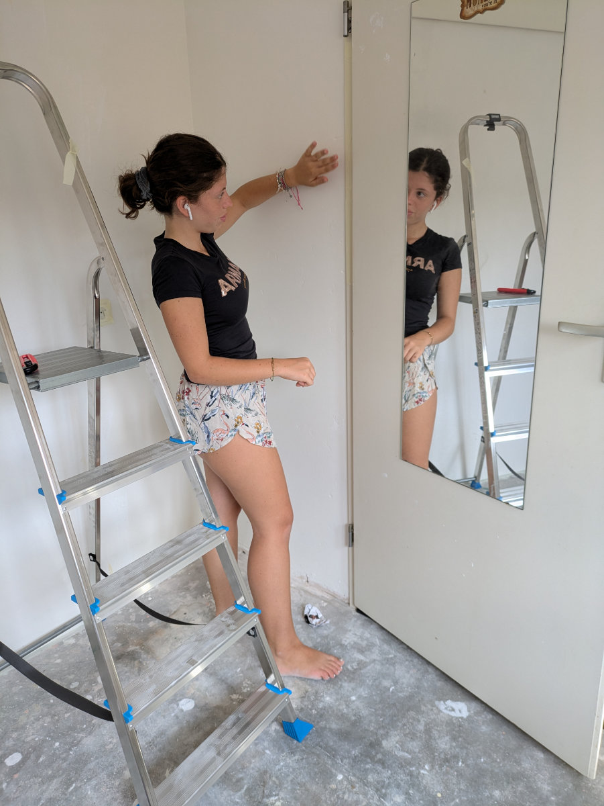
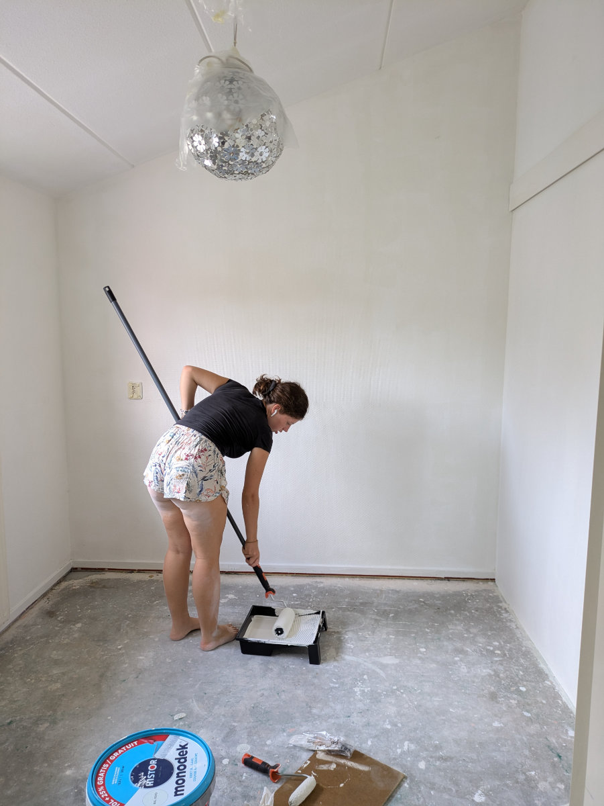
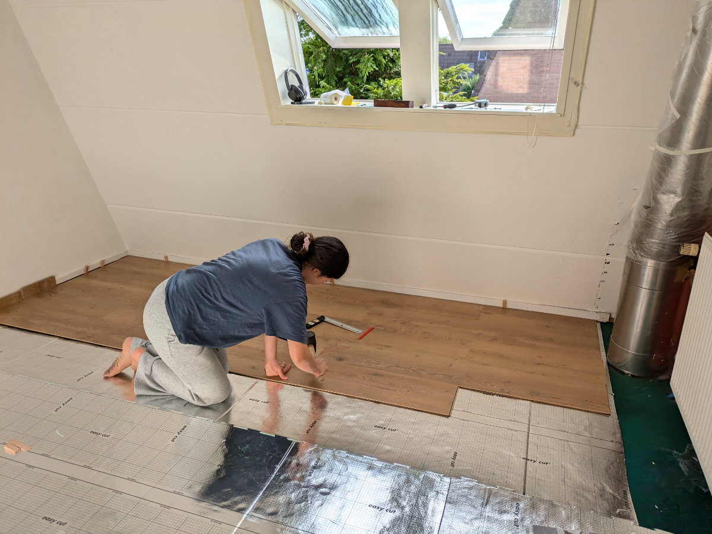
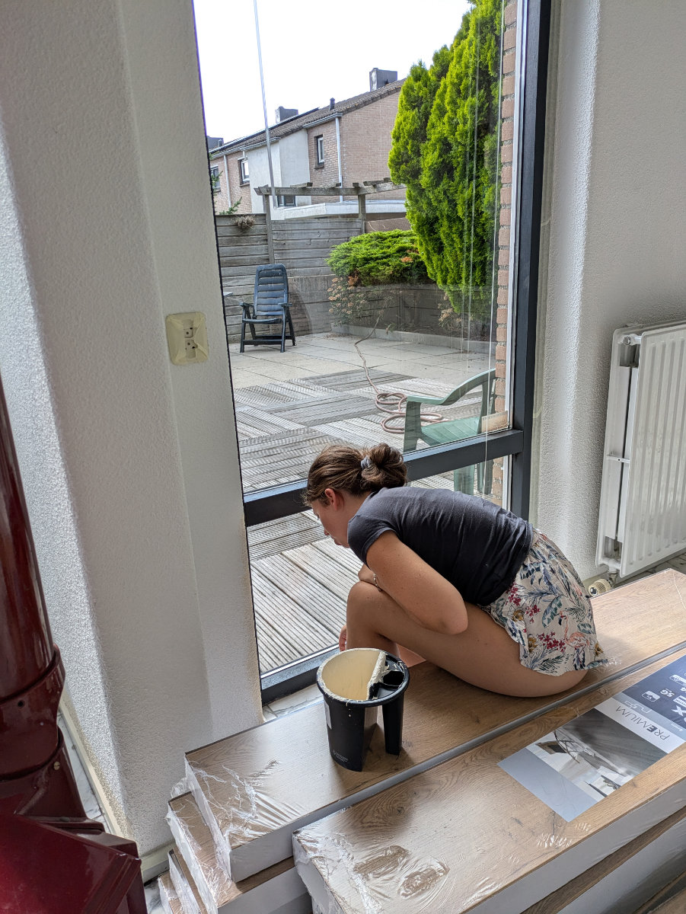
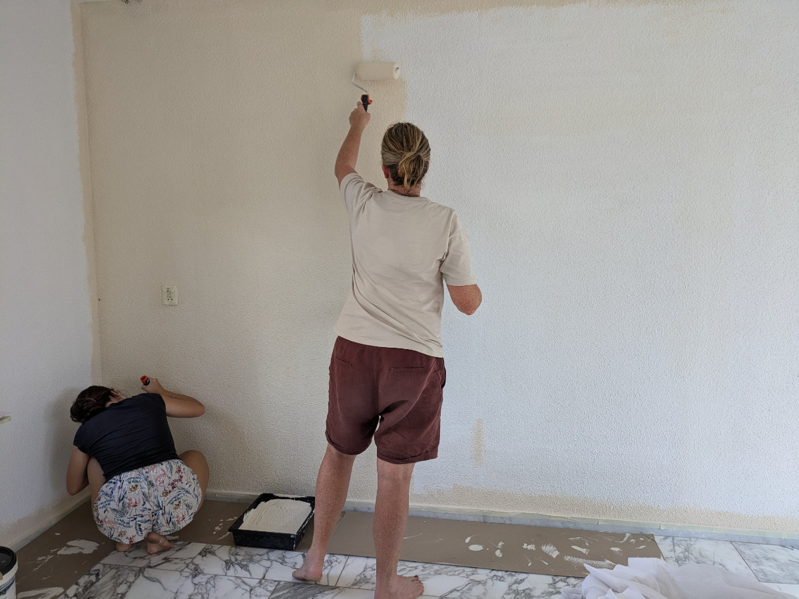
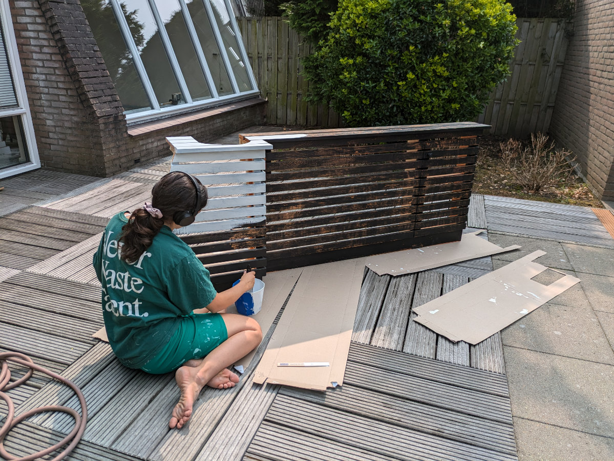
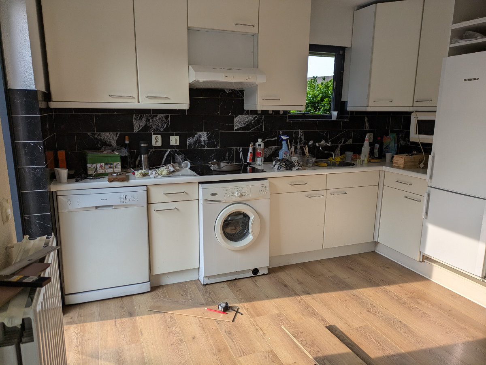
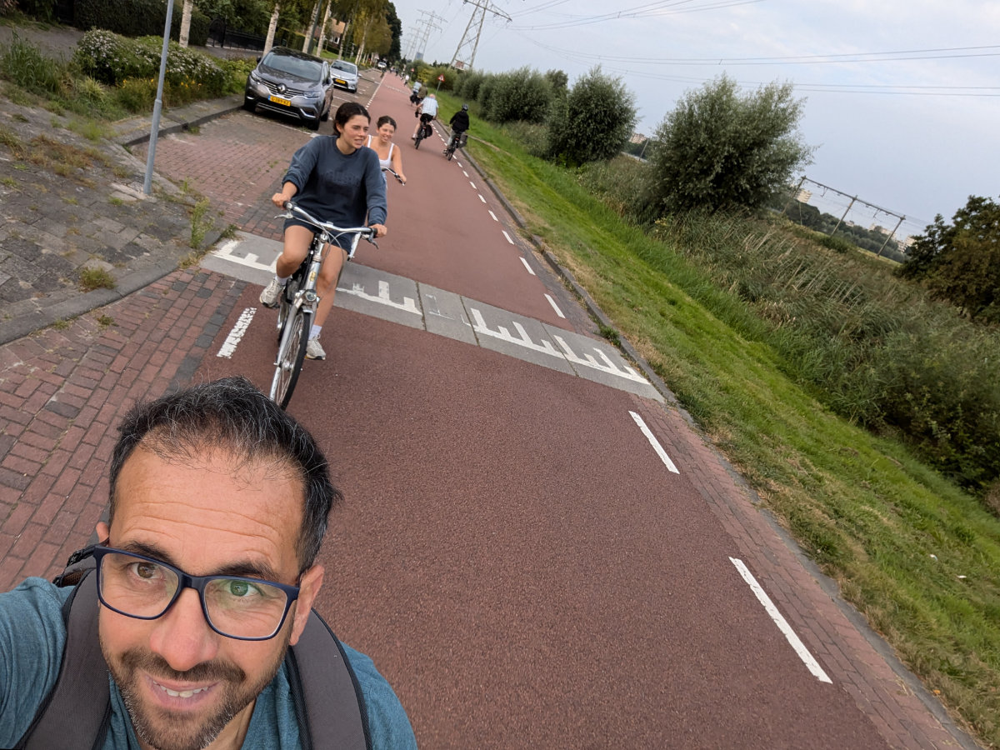

_Affrettiamoci a coprire questo pavimento_

_Ho scritto questo post il giorno della partenza per l’Italia, pensavo di riuscire a metterlo online durante il viaggio ma non ce l’ho fatta. Ora siamo a casa a Leiden, dopo un'epopea di 72 ore che racconterò nel prossimo post._

_Ecco il post del 21 Agosto._

Gli ultimi giorni sono stati intensi, concitati, ricchi di emozioni, produttivi, frenetici, appaganti ma anche snervanti e faticosi. Ricapitoliamo.\
Il 14 pomeriggio abbiamo avuto l’incontro con il proprietario di casa e l’agenzia per la consegna delle chiavi. Tutto bene su quel fronte. Ci siamo messi subito al lavoro.\
Abbiamo cominciato dipingendo tutte le pareti interne. Per non lasciare da soli i cani abbiamo fatto dei turni. Io andavo alla casa al mattino, con Sophia e Gemma, mentre Hilly restava all’Aja. Poi ad un certo punto portavo le ragazze indietro e prendevo Hilly, per tornare a dipingere le pareti con lei.\
Sophia e Gemma si sono dimostrate delle brave imbianchine. Sophia l’aveva gia’ fatto in un paio di occasioni, ma Gemma era una novizia e mi ha veramente stupito per la rapidita’ e intuitivita’ con cui ha appreso l’arte del pennello e del rullo. Abbiamo tutti lavorato con impegno e costanza, Ferragosto incluso, fino ad avere dato una bella rinfrescata alla casa. Erano un po’ di anni che non veniva imbiancata.\
Poi è giunto il momento di iniziare con l’installazione del parquet (laminato) nelle camere da letto e in tutto il piano inferiore.\
L’idea era quella di continuare a fare i turni in cui si sarebbero alternate le ragazze e Hilly ad aiutarmi nella posa del pavimento, per riuscire a finire tutto entro il 20 Agosto, ieri, perche’ il 21 saremmo dovuti partire per andare a prendere le nostre cose in Toscana.

_Gemma mette il nastro prima di dipingere le pareti della sua cameretta_

_Alle prese con il rullo_

_La frustrante posa iniziale del pavimento_

_Gemma dipinge il piano terra_

Nel primo pomeriggio di sabato 17 Hilly a cominciato a sentirsi male. Stavamo completando l’imbiancatura, c’era anche Gemma, mentre Sophia era alla casa con i cani, quando Hilly si e’ dovuta sdraiare sul pavimento, con un fortissimo mal di testa e mancanza di energie. Io e Gemma abbiamo finito di dipingere le pareti della sala e poi siamo tornati tutti e tre da Sophia. Hilly si e’ messa subito a letto e ha passato una nottata con febbre, vomito arancione e dolori in tutto il corpo. Il giorno dopo si sentiva ancora peggio ed e’ rimasta a letto senza riuscire a mangiare niente.\
Io e Sophia abbiamo iniziato con il pavimento di sopra. Non avevo mai installato il parquet. Dopo essermi visto una decina di video su youtube ero convinto sarebbe stato piuttosto facile, e cosi’ in effetti alla fine e’ stato, ma non da subito, prima dovevamo capire alcune cose che non erano poi così scontate e quindi ci mettemmo diverse ore per fare un paio di metri quadri nella cameretta di Sophia, sentendoci scoraggiati e sopraffatti, per dover poi smontare il tutto e ricominciare in un modo diverso./
Nel pomeriggio di Domenica siamo tornati a casa stanchi morti ma appagati e ci siamo concessi qualche ora di riposo. Hilly non migliorava e la sua fronte scottava molto. I sintomi erano inconsueti per la rapidita’ con cui si erano presentati e per un forte dolore e rigidita’ nella zona del collo. Mi decido a cercare aiuto.\
Siccome non abbiamo ancora fatto la richiesta del medico non sapevo a chi rivolgermi e dopo un po’ di ricerche online e aver chiesto consiglio a Dehlia, la nostra amica Sud Africana che vive con la sua famiglia ad Amsterdam, vengo a sapere che bisogna contattare un numero di telefono per l’assistenza sanitaria straordinaria per tutti i casi che non richiedano l’intervento urgente di un'ambulanza o di un pronto soccorso. Passo piu’ di dieci minuti al telefono con una voce registrata ma non riesco a parlare con nessun operatore prima che la linea venga bruscamente interrotta. A questo punto carico Hilly in macchina, con un po’ di difficolta’ visto che riusciva a malapena a stare in piedi, e mi dirigo verso un ospedale dell’Aja, a venti minuti di auto, dove avevo letto c’era una specie di guardia medica notturna. Arrivati nel posto veniamo fatti entrare in una sala d’aspetto dove si trovavano una decina di persone, per lo piu’ genitori con bambini piccoli in attesa di essere visitati.
Ci viene comunque detto che senza prenotazione, sempre allo stesso numero di telefono che avevo chiamato poco prima, non si poteva essere visti da un medico. Allora mi rimetto al telefono e Hilly si sdraia su di un divanetto.\
La voce registrata ripete sempre la solita cantilena, in Olandese, di cui non capisco assolutamente nulla, ma dopo una ventina di minuti mi accorgo che la registrazione viene regolarmente interrotta da un’altra voce registrata che pronuncia una parola che mi accorgo essere un numero, via via decrescente.\
Il numero rappresenta le persone in attesa di risposta. Eravamo partiti dal numero 13.\
Dopo trentacinque minuti siamo al numero due e ho una forte ansia che cada la linea prima di poter parlare con un’operatore e dover cominciare ancora tutto da capo. Al trentottesimo minuto l’infernale cantilena robotica viene interrotta dalla voce di un essere umano in carne ed ossa, un entita’ senziente con cui sono in grado di interagire in modo biunivoco.\
Il sistema sanitario Olandese viene spesso criticato per essere di difficile accesso nei casi in cui non e’ stata ancora fatta una diagnosi e bisogna superare uno screening iniziale a cui di solito segue, secondo i suoi detrattori, la prescrizione di tornare a riposo, perche’ tutto si risolvera’ da se’, e al massimo prendere del paracetamolo.\
Dopo aver risposto ad una ventina di domande dell’operatrice, facendo da tramite tra lei e Hilly, che non riusciva neanche a parlare al telefono, mi viene detto che probabilmente si tratta di una forte “stomach flu” (gastroenterite), visto che ci sono diversi casi in giro e i sintomi sembrano quelli, e quindi Hilly non ha diritto ad essere visitata. L’assistente nella sala d’aspetto e’ stata molto compassionevole e ci ha “rincuorati” dicendoci che se la cosa fosse peggiorata, durante la notte, avremmo dovuto richiamare il numero di telefono o addirittura il 112.\
Guidando verso casa nella notte non ero molto convinto del fatto che si trattasse di gastroenterite ed ero un po’ preoccupato.\
Durante la notte Hilly ha avuto febbre alta e incubi continui ed il giorno dopo si sentiva ancora stanchissima (non mangiava da quasi 48 ore ) con un forte mal di testa ma con qualche accenno di miglioramento. Per la prima volta si affacciava la prospettiva che sarei dovuto venire in Italia da solo con Gemma, facendomi 3000 km in 2 giorni. Un incubo peggio di quelli di Hilly!

Mentre io e Sophia andavamo avanti ad installare il pavimento Gemma si e’ dedicata alla verniciatura della sua finestra. Sophia e’ stata in grado di fare alcune aree di pavimento tutta sola, utilizzando anche la troncatrice per accorciare le tavole.\
Lunedi sera avevamo finito l’80% del pavimento, mancava solo l’ingresso, e Hilly era ancora estremamente debole e scoraggiata ma almeno aveva smesso di vomitare e il mal di testa stava diminuendo. Il giorno dopo, Martedi’, sarebbe stato l’ultimo giorno utile per finire casa nostra e pulire la casa all’Aja perche’ poi, Mercoledi’ mattina, alle 6.30 sarebbe arrivata la famiglia di ritorno dal viaggio negli Stati Uniti e noi saremmo partiti per l’Italia.\
Siccome le tre biciclette che abbiamo comprato si trovavano ancora all’Aja martedi’ mattina presto, io e le ragazze siamo andati in bici a Leiden. E’ stata una bellissima pedalata, tutta una pista ciclabile, tra le campagne, e in 45 minuti eravamo a casa nostra. Entro le 13 io e Sophia avevamo finito il pavimento e restammo ad ammirarlo per diversi minuti, cominciando a pianificare dove avremmo messo i mobili che dovevamo andare a prendere in Toscana. Hilly ha mangiato un po 'di riso in bianco ed una mela, si e’ fatta forza ed e’ venuta a prenderci in macchina.\
Forse ce l'avrebbe fatta a partire il giorno dopo.\
Nel pomeriggio abbiamo pulito la casa e portato i cani a fare gli ultimi giri. Il gatto Moxie per salutarci ha vomitato su una sedia nel salotto. Che tenero!

Questa mattina alle 5 eravamo tutti in piedi a dare gli ultimi colpi di aspirapolvere, pulire il bagno, mettere a lavare le lenzuola, buttare le nostre ultime cose in macchina e via, verso casa nostra. Hilly sembra rinata. Rinfrescata dal digiuno forzato e dal riposo. Uscita dal tunnel oscuro in cui era finita.\
Abbiamo lasciato Sophia a Leiden, nella casa tutta da riordinare e pulire, dove dormirà sul materassino gonfiabile che ci hanno prestato, in attesa del nostro ritorno venerdì notte, per la prima volta da sola in vita sua. Che forza!\
Noi abbiamo ritirato il furgone/camion, uno scassone da 300.000 km, senza aria condizionata e bluetooth e neanche una presa USB dove ricaricare il telefono per la navigazione. Pero’ siamo molto felici, Hilly e’ alla guida da 4 ore, Gemma non vede l’ora di rivedere i suoi amici ed e’ anche il suo compleanno e io sto scrivendo questo post mentre sfrecciamo sull’autostrada tedesca con un piccolo carico di mobili da consegnare a Corsanico, un paesino nella provincia di Lucca.\
Questa volta abbiamo rischiato che un pezzo del puzzle venisse perso ma alla fine l’abbiamo trovato e nei prossimi giorni, se tutto va bene, riusciremo ad incastrarlo nel posto giusto.

_Hilly poco prima del tracollo_

_Sophia dipinge il copricalorifero della sua camera_

_Gemma alle prese con la sua finestra_

_Sophia concentrata sul pavimento della sala_

_Sophia, la maga della troncatrice_

_La sala con il nuovo pavimento_

_La nostra splendida cucina_

_In bici verso Leiden_

_Montaione arriviamo!_

_Alla guida del furgone/camion_
