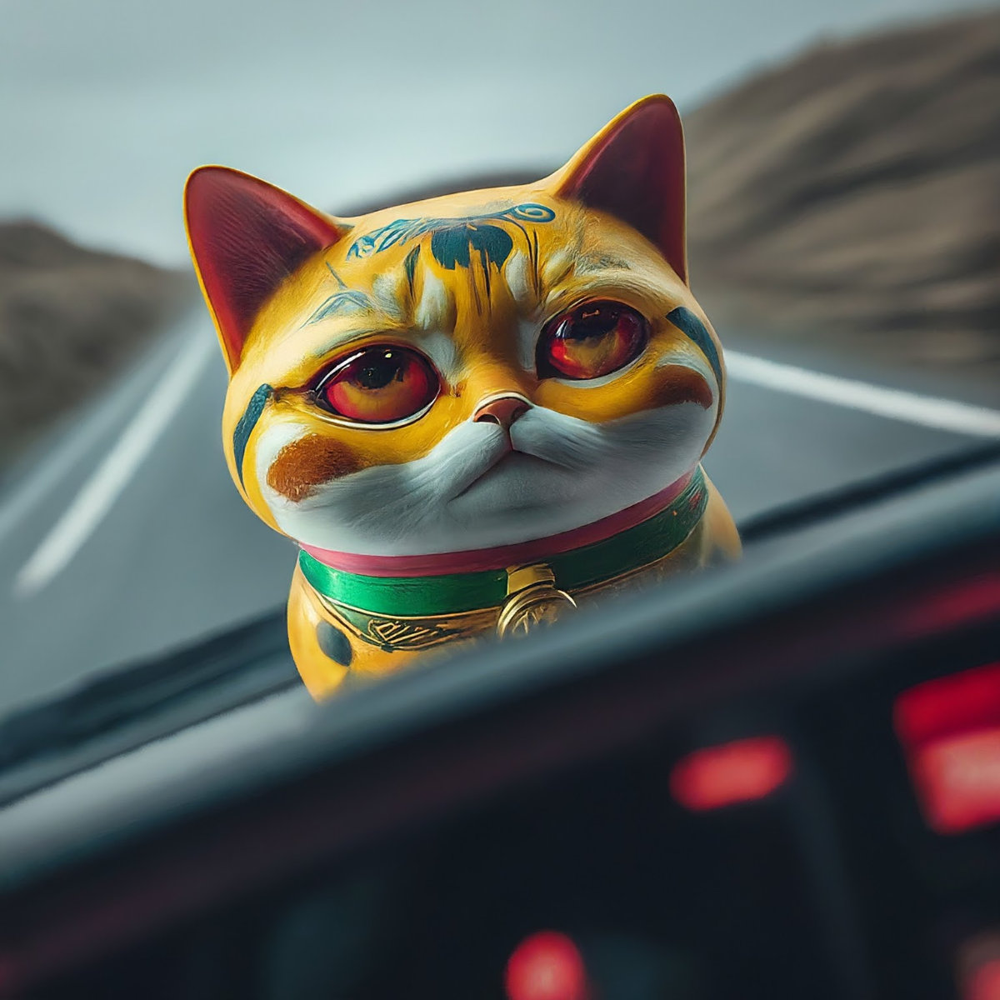
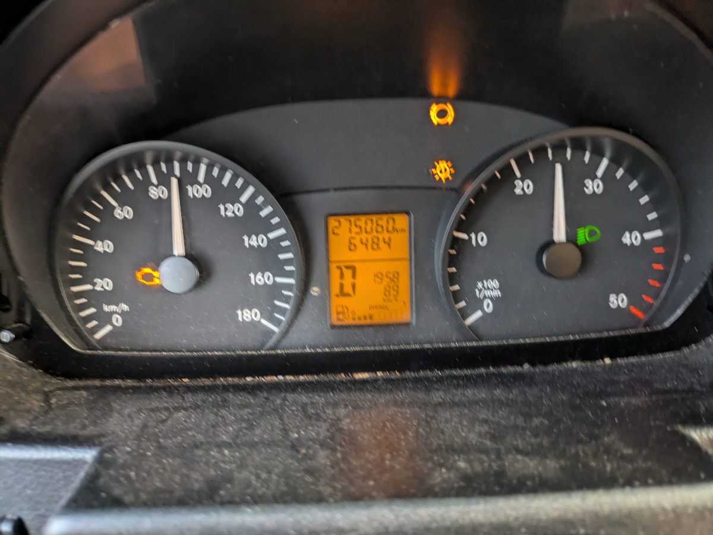
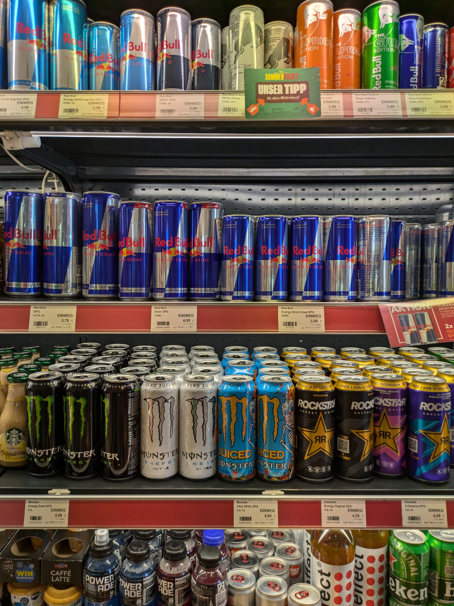
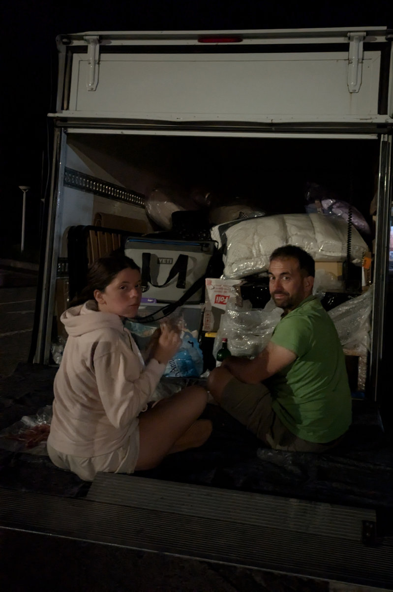
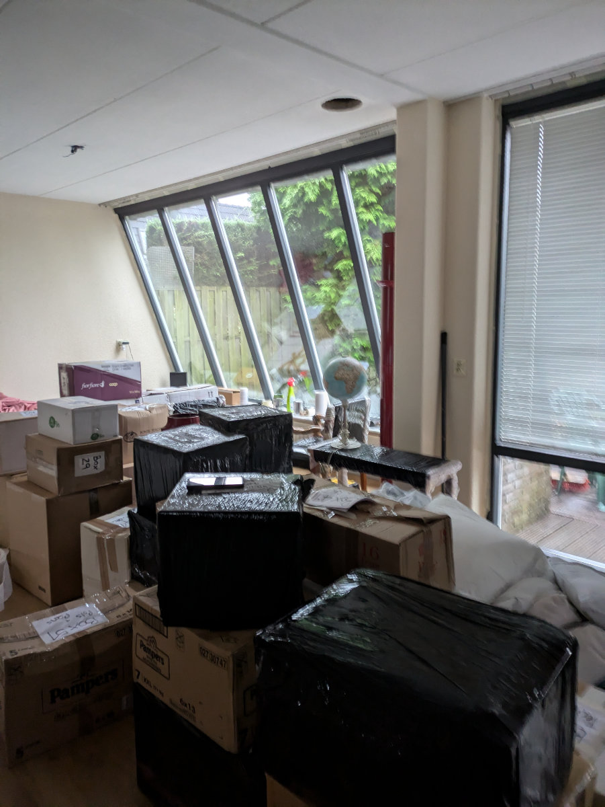
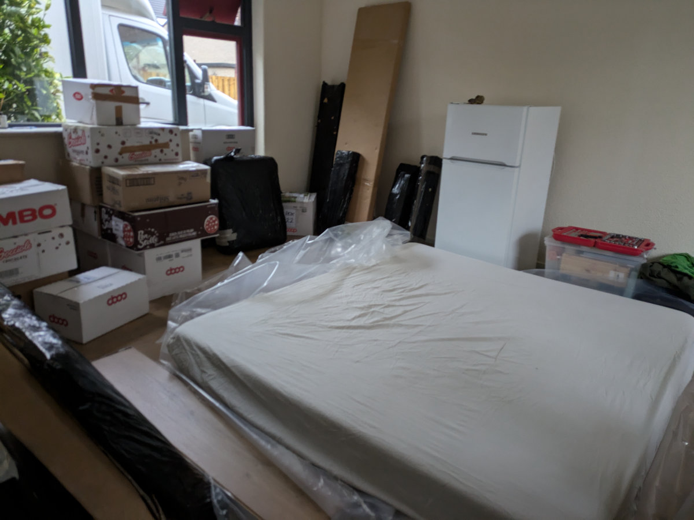

_Questa immagine la capirete leggendo il post_

Il viaggio in Italia e’ stato durissimo.\
Non avevo mai sofferto per mancanza di sonno così tanto in vita mia. Ora e Domenica mattina, mi sono appena alzato dopo quasi 24 ore a dormire, la nostra sala e’ ingombrata dagli scatoloni e dai mobili imballati, quindi, spoiler alert, ce l'abbiamo fatta, sani e salvi, pero’ che fatica!

Eravamo rimasti a Hilly che, ripresasi dal misterioso malanno, guidava il furgone/camion verso l’Italia.
In quelle prime ore ci siamo accorti che il furgone/camion era uno scassone, che comunque avevamo pagato 1000€ per 3 giorni, e che andava ad una media di 90 Km/h con punte di 100 Km/h in discesa.
Il viaggio si preannunciava più lungo del previsto.\
Alla partenza ci era stato detto di non far caso alla spia di malfunzionamento dei freni accesa, era un falso allarme e i freni avrebbero dovuto funzionare per i 3000 km di viaggio.\
Dopo circa un centinaio di chilometri si accese anche la spia motore, indicando un possibile malfunzionamento.\
Maledicemmo l’autonoleggio e decidemmo di non farci caso e proseguire.\
Nel furgone/camion non c’era il bluetooth. Gemma aveva preparato delle playlist su Spotify che purtroppo non potevamo ascoltare. Poco prima di entrare in Svizzera accesi le luci, visto che stava diventando buio, e vidi comparire, tra le spie sul cruscotto, una nuova simpatica segnalazione che dopo una breve ricerca sul manuale del furgone/camion scoprimmo voleva dirci che c’era un malfunzionamento delle luci. Ci fermammo al prossimo autogrill per controllare che tutte le luci funzionassero e scoprimmo che il faro sinistro effettivamente non funzionava. Altre maledizioni e ingiurie verso l’autonoleggio.\
Non c’era speranza che potessimo superare la dogana di ingresso in Svizzera in questa situazione e comunque era pericoloso guidare senza un faro.\
Per fortuna riuscii a comprare la lampadina all’autogrill e a sostituirla con successo. On the road again!\
All’una di notte eravamo all’ingresso del tunnel del San Gottardo, per fortuna, visto l'orario, c’era poca fila e riuscimmo a passare in meno di un ora.\
Dopo poco decidemmo di fermarci per un pisolino, guidavamo ininterrottamente da piu’ di diciassette ore, io mi ero alzato alle 3.30 del mattino, il giorno precedente, e quindi ero sveglio da 24 ore e cominciavo ad avere delle simpatiche ma preoccupanti allucinazioni.\
Passammo due ore alla stazione di servizio di Bellinzona Sud, cercando di dormire tutti e 3 compressi nel piccolo abitacolo. Io trovai la posizione giusta per non avere crampi alle gambe ma ogni volta che mi addormentavo rilassavo la muscolatura per venir svegliato immediatamente da dolorose contrazioni ai glutei che mi imponevano di ritornare alla scomoda posizione di partenza che pero’ evitava i crampi.
Alle 5.30 del mattino, freschi come rose raccolte due settimane prima, ci rimettemmo in viaggio, almeno stava diventando giorno e diventava più facile guidare senza addormentarsi.\
La prossima tappa era per consegnare il carico di scatoloni e oggetti raccolto in Olanda a casa del padre di Monique, da portare a Corsanico, un paesino di Montagna in provincia di Lucca, dove Monique abita da circa un anno. Arrivammo da lei alle 10.00, dopo esserci pericolosamente arrampicati su di una stradina della larghezza esatta del furgone/camion e aver potato gli ulivi della zona con la parte superiore del cassone del nostro veicolo.\
Dopo aver scaricato le cose di Monique ci dirigemmo verso Montaione dove finalmente arrivammo, dopo 27 ore dalla partenza, a casa di Jill e Jason, i nostri cari amici americani che vivono a Montaione dal 2019. Gemma l’abbiamo lasciata a casa della sua amica Alice dandogli appuntamento per il giorno dopo alle 5.00am, per la partenza verso l’Olanda.\
Jill e Jason ci hanno offerto la loro camera da letto per un altro micro sonnellino di 2 ore prima di andare a caricare le nostre cose a Castelfiorentino nel magazzino di Luigi e Rita.
Jill ci ha anche offerto della schiacciata e del prosciutto crudo e anche degli incredibili pomodori che ci siamo divorati per la gran fame e per la mancanza di tali prelibatezze in Olanda.\
Caricare il furgone/camion e’ stato piuttosto semplice, non c'e' stato bisogno di fare uso dell’esperienza maturata in centinaia di ore di gioco a Tetris, negli anni 90 sul mio Game-Boy visto che il veicolo noleggiato e’ risultato sovradimensionato rispetto al volume delle nostre cose da trasportare. Alla fine l’abbiamo riempito al 70%, mettendo le cose pesanti sul fondo così da non ribaltarci alla prima curva presa un po’ troppo velocemente.\
Dopo un fugace ma intenso aperitivo con alcuni amici di Montaione, che e’ stato bellissimo rivedere, e una cena a casa di Jason e Jill, abbiamo dormito per sei lunghissime ore, ristabilendo una piccola ma essenziale percentuale delle nostre energie mentali sentendoci pronti alla maratona di ritorno.\
Gemma e’ stata puntualissima e si e’ fatta trovare nella piazzetta sotto casa alle 5 in punto insieme alle due sue amiche, Alice e Ginevra, con le quali ha passato la notte in bianco. Grandi abbracci e saluti e poi la partenza, dalla coop di Montaione verso Leiden, un ultimo grande sforzo.
All’interno dello scassone bianco il morale era alto tanto quanto la temperatura, nonostante i finestrini aperti. Eravamo ancora all’oscuro della discesa agli inferi psicologica che ci aspettava nelle prossime ore.\
La prima sosta e’ stata a Parma, dove siamo usciti dall’autostrada alla ricerca di un supermercato per fare scorta di viveri e per prendere anche un po’ di focaccia e prosciutto crudo da portare a Sophia, per far sentire anche a lei un po’ della delizia italiana che noi avevamo sentito a casa di Jill e Jason.\
In svizzera c’era un sacco di traffico. Di tanto in tanto ci trovavamo fermi dietro a centinaia di automobili, l’unico veicolo con i finestrini aperti sotto un sole cocente. Un paio d’ore per fare il tunnel del San Gottardo e poi grandi code anche in autostrada. Cominciavamo a vacillare.\
Il furgone/camion andava consegnato la mattina dopo entro le 9.00, di Sabato, seno’ poi si sarebbe passati al lunedì mattina con lo sborso di una grossa penale. Non c’era tempo per fermarsi.\
Con l’arrivo del buio cominciarono le paranoie e le allucinazioni.\
Io soffro molto la mancanza di sonno e non riesco a dormire su di un’auto in corsa da quando ero bambino e scampai ad un pericoloso incidente.\
Ero in auto con i miei genitori e mia sorella, era estate e stavamo andando in vacanza, sbarcati in traghetto nel nord della Sardegna ci stavamo dirigendo a Pula, nell'estremo sud di quell’isola meravigliosa che ci vedeva ogni estate passare i nostri momenti piu’ felici.\
Stavo sonnecchiando nel sedile posteriore della nostra Fiat 131 mirafiori quando uno pneumatico esplose lanciandoci in una serie di testa a coda ad alta velocita’ sulla superstrada sarda dove mancammo per un soffio un disastroso frontale con le automobili che correvano nella corsia opposta.\
Fu il mio primo trauma a bordo di un auto.\
Il secondo trauma avvenne diversi anni dopo quando avevo circa 20 anni. Stavo andando da Milano a Sofia, in Bulgaria, per un concerto, con degli amici. Ci stavamo alternando alla guida senza fare alcuna sosta perche’ se no’ saremmo arrivati tardi al concerto. Per diversi motivi eravamo dovuti passare attraverso la Romania, era notte ed eravamo sulle montagne della Transilvania quando stavo finalmente riuscendo ad addormentarmi, con grande difficoltà vista la mia ansia da passeggero. Ricordo di essere appena scivolato in un sogno in cui sentivo lo stridere delle gomme sull’asfalto e poi uno spaventoso crash. Mi svegliai di soprassalto per ritrovarmi nel silenzio dell'abitacolo del veicolo, un breve momento di tranquillita’ interrotta dopo un paio di secondi dallo stridere delle gomme e dall abbattersi di un oggetto sul cristallo anteriore dell’automobile. Per diverse ore pensai di aver vissuto una premonizione, sognando quello che sarebbe accaduto pochi secondi dopo. In realtà probabilmente il mio cervello ha ricreato l’avvenimento del sogno a posteriori, confondendo di alcuni secondi la linea temporale, cosa che puo’ accadere in alcune situazioni di grande stress psicologico.\
L’incidente era stato causato da un passaggio a livello ferroviario. Non c’era alcuna luce o cartello che segnalava la sbarra d'acciaio abbassata e la ragazza al volante l’aveva vista solo all’ultimo momento siccome c’era una fitta nebbia. La sbarra sfondó completamente il parabrezza e dovemmo buttarlo completamente giu’ dal veicolo calciandolo dall’interno verso l’esterno per poter guidare congelandoci nella fredda notte invernale fino a Bucarest, la capitale della Romania, dove al mattino riuscimmo a trovare un meccanico che ci mise su un parabrezza nuovo. Riuscimmo ad arrivare al concerto in tempo ma il mio trauma veniva enormemente rafforzato.\
A consolidare indelebilmente il mio terrore da passeggero fu un altra occasione i cui stavamo ancora andando in Sardegna, Hilly guidava la nostra Fiat punto sull’autostrada tra La Spezia e Livorno e io le sedevo nervosamente accanto assicurandomi che non si addormentasse visto che eravamo partiti da Milano nel cuore della notte per prendere il traghetto delle 6.00 del mattino da Livorno.\
A 120km/h, mentre superava un automobile, Hilly riuscì ad addormentarsi e a grattare tutta la parte sinistra dell’auto sul guard rail. Ero spacciato. Da quel giorno di 20 anni fa il mio odio per la combinazione automobile-buio-autostrada sarebbe stato assoluto e ingestibile.\
Torniamo a poche ore fa, quando eravamo alla guida nel nord della Svizzera, quasi in Germania, dopo più di 12 ore di viaggio ininterrotto e finalmente mi decido a passare il volante a Hilly rassegnandomi ad una morte violenta e dolorosa. Hilly al volante, Gemma nel sedile centrale e io in quello a sinistra. La mia testa si muove come quella di uno di quei gatti di plastica cinesi portafortuna, con lo stesso moto ondulatorio, non su e’ giu’ ma invece avanti, per guardare la strada, e a sinistra per guardare gli occhi di Hilly sperando che non si chiudano per un tempo superiore alla normale e involontaria umidificazione dei bulbi oculari. Nelle ore di guida notturna che ci separavano dalla nostra nuova abitazione sprofondai in un “bad trip” psichedelico causato dalla mancanza di sonno e dall’affiorare dei miei traumi passati. Vedevo oggetti inesistenti scagliarsi verso di noi e non riuscivo a fermare l’ondata di pensieri spaventosi che si concludevano tutti con la nostra morte brutale e Sophia lasciata sola in una casa con ancora il battiscopa da installare.\
Ad un certo punto anche Hilly cominciò ad avere una leggera distorsione delle percezioni e continuava a toccarsi il naso sentendoselo grottescamente grosso e deformato.\
Arrivammo a Leiden alle 4.30 del mattino, dopo più di 23 ore di viaggio. Scaricammo i materassi dal furgone/camion e ci mettemmo a dormire per 2 ore dopo le quali svuotammo completamente il veicolo per riportarlo all’autonoleggio allAja. Io non voglio più viaggiare in autostrada di notte almeno per i prossimi cinque anni!\
Ora mi sento riposato, dopo il lungo sonno, e felice di aver messo un altro pezzo del puzzle al suo posto.
Sto scrivendo seduto tra gli scatoloni che svuoteremo nei prossimi giorni, contento di essere circondato da oggetti familiari e strafelice che domani mattina iniziero’ il corso per meccanico di biciclette.

_Le molte spie accese durante il viaggio_

_Il mio reparto preferito negli autogrill_

_Gemma e le sue amiche alle 5 del mattino, dopo l'ennesima notte insonne_

_Spuntino notturno sulla sponda del furgone/camion_

_Scatoloni in sala nella nuova casa_

_Il nostro letto temporaneo_
