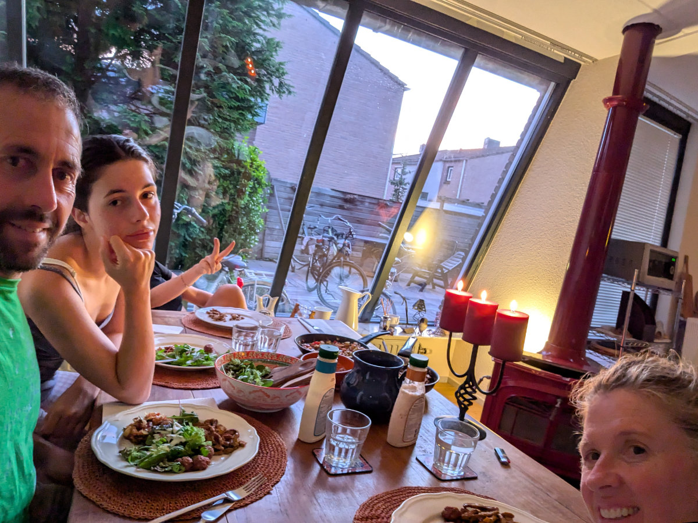

_Pronte per la giornata scolastica_

Le ragazze hanno cominciato il loro anno scolastico Martedì e io ho iniziato il giorno prima, di Lunedì, la scuola per meccanici di biciclette.\
Martedì mattina c’era grande fermento in casa. Gemma sarebbe entrata a scuola alle 8.20 quel giorno mentre Sophia alle 10.00. Gemma era in ansia come non l’ho mai vista. Siccome il primo giorno entravano ad orari diversi Hilly e’ andata in bici con loro fino all’ingresso. La sera a cena abbiamo parlato tanto della loro prima impressione della scuola, dei professori e dei compagni.\
La classe di Gemma e’ abbastanza piccola, sono solo 14 alunni, di età compresa tra i 12 e i 16 anni. Sono tutti alle prime armi con l’olandese e hanno cominciato con dei giochi per imparare i primi vocaboli. Gemma e’ molto piu’ avanzata di loro e si sta annoiando un po’ ma probabilmente piu’ avanti la metteranno in una classe al suo livello. Ha fatto subito amicizia con la sua compagna di banco, una ragazza filippina.\
Il suo atteggiamento e’ cambiato radicalmente. Prima della vacanza in Sardegna era molto pessimista riguardo la nostra scelta di spostarci in Olanda. Da quando e’ tornata, e soprattutto da quando è cominciata la scuola, sembra un'altra persona. Continua comunque a dire che non sopporta gli olandesi e per fortuna in classe sua non ce ne sono.\
La classe di Sophia e’ un po’ piu’ grande invece, ci sono 19 studenti, tutti al secondo anno di ISK (la classe internazionale che precede l’inserimento nella scuola in Olanda ) e a quanto dice Sophia lei e’ quella piu’ indietro con l’Olandese. Questa cosa la rende felice perche’ le piace sentirsi sfidata e fare grandi sforzi per migliorarsi.\
Il mix di nazionalita’ tra gli studenti e’ per l’80% di provenienza medio orientale o giu’ di li (siria, Iran, Turchia, Afghanistan) per un 15% Ucraini e il 5% tutto il resto del mondo (africa, sud america, asia, europa).\
Il contrasto fra le ragazze provenienti da posti come la Siria e l’Iran ( la maggioranza ) e le ragazze cresciute in culture non musulmane e’ piuttosto netto. Gemma va a scuola vestita come le pare (non c’e’ alcun codice di abbigliamento) e tutta truccata mentre quelle altre vanno a scuola con il velo e con il viso acqua e sapone.\
Nei primi giorni di scuola i professori hanno stressato molto l’importanza di non fare ritardi o assenze. Se un alunno fa ritardo di un ora deve poi restare a scuola per un ora in piu’, dopo le 16.00. Dopo un po’ di ritardi vengono avvisati i genitori.
Le assenze devono essere tutte motivate e bisogna fare il possibile per evitarle, ad esempio se c’e’ bisogno di una visita medica bisogna prenotarla dopo l’orario scolastico. Per aggiungere anche un solo giorno alle proprie vacanze bisogna avere il permesso del preside.

Hilly sta facendo la casalinga, per la prima volta dal 2005, quando ci sposammo, e per alcuni mesi lei non aveva un lavoro e mi attendeva a casa al pomeriggio, io di ritorno dal laboratorio farmaceutico in cui lavoravo, era frustrata perche’ non sapeva ancora parlare l’Italiano e pensava non avrebbe mai trovato un’occupazione ne mai avrebbe avuto degli amici.\
Ora invece e’ tutta felice di vederci uscire al mattino per potersi dedicare a organizzare la casa e liberarci dagli scatoloni onnipresenti, cucinare deliziose cenette nella nostra nuova cucina, andare in comune o in banca ad adempiere le nostre faccende burocratiche. Presto troverà un lavoro e conoscendola bene anche un sacco di amici.\
La casa sta prendendo una bella forma. E’ incredibile come ci sentiamo gia’ tutti e quattro “a casa nostra”, grazie anche a tutte le cose che abbiamo portato da Montaione.
La cosa che mi rende piu’ felice di tutte pero’ è girare per le viuzze e le strade ciclabili lungo i canali che conducono al centro di Leiden in sella alla mia nuova bicicletta. Mi da’ la stessa gioia dentro che avevo quando mi affacciavo dalla finestra della mia camera da letto alla Civettaia, su quelle colline a perdita d’occhio, oppure quando passavo ore seduto al piano superiore di un autobus in giro per Londra, ascoltando musica dal mio cd player portatile e osservando gente di culture diverse tutte prese dalla frenesia della metropoli inglese.

La mia prima settimana al corso procede molto bene. Sto imparando ogni giorno cose nuove e i miei colleghi sono molto accoglienti e fanno continui sforzi per comunicare in Inglese con me. Facciamo delle lunghe pause caffe’ dove loro si perdono in discussioni apparentemente molto divertenti, viste le loro continue risate, di cui io non capisco niente se non una parola qua e la’, ma per ora va bene cosi’. Albert, l’insegnante, e’ un buon insegnante, ha molta pazienza e cerca sempre di stimolarci con nuove sfide e indovinelli su come risolvere i vari problemi che si presentano nelle bici da riparare.
Tutta questa settimana la stiamo passando a lavorare su delle bici da città classiche, con i rapporti a deragliatore e i v-brake. Settimana prossima faremo le bici olandesi, un po’ piu’ complicate. Ho imparato a smontare e rimontare completamente la ruota posteriore incluso il mozzo, togliendo anche i cuscinetti a sfera e tutti i raggi del cerchio che poi vanno rimontati seguendo uno schema ben preciso che puo’ variare da ruota a ruota.\
Ieri mi e’ successa una cosa degna di nota. Abbiamo passato tutto il pomeriggio nella sala riunioni a studiare la teoria utile alla riparazione di guasti nelle bici elettriche. Albert ha scritto sulla lavagna la legge di Ohm e le equazioni per calcolare il lavoro conoscendo i Volts e gli Ampere di un circuito chiuso.
Poi ci ha fatto dei quesiti piuttosto semplici su come verificare dei malfunzionamenti su di una e-bike utilizzando un multimetro e sfruttando le equazioni sopra citate. In condizioni normali questi concetti sarebbero stati per me semplicissimi, fin dalle scuole medie mi sono sempre distinto in classe come quello che afferrava subito nozioni di fisica e l’utilizzo di formule matematiche.\
Una volta in prima media l’insegnante di matematica mi portò in giro per le classi terze a spiegare agli alunni come risolvere le equazioni di secondo grado, cosi’, per umiliare quelli che in terza non le avevano ancora capite.Veramente un cattivo esempio da parte della professoressa che mi rese un antipatico saputello agli occhi dei miei compagni piu’ grandi, ingigantendo il mio ego e rendendo ancora piu’ insicuri quegli studenti che gia’ lo erano.\
Ieri, nella sala riunioni, per la prima volta in vita mia ho provato in prima persona una forte “discalculia”, cio’ l’incapacita’ di manipolare i numeri, di cui soffrono alcune persone. Non sono riuscito a risolvere dei problemi in cui bisognava semplicemente invertire le formule. Guardavo i numeri e le unita’ di misura come fossero un linguaggio alieno senza senso logico.\
Credo che questo sia successo perche’ durante la giornata le mie funzioni cerebrali sono enormemente sbilanciate verso la comprensione di un nuovo linguaggio, l’olandese, lasciando pochissimo spazio all’area del cervello utile al pensiero astratto necessario alla soluzione di problemi matematici. Quando ho riprovato a risolvere i quesiti a casa, la sera, tutto era chiaro e banale e le mie facolta’ erano misteriosamente ripristinate.\
Negli ultimi quindici anni e’ stato bello lavorare con mia moglie come unica collega, ovviamente con alti e bassi. In certe afose serate estive, in cucina a preparare la cena per gli ospiti, ci saremmo strangolati a vicenda, però in linea di massima andavamo d’accordo. Ma un cambiamento doveva arrivare e ora sento quanto in realtà mi mancava il sano cameratismo tra un gruppo di nerd di biciclette che lavorano ad un progetto comune.

_Gemma si preparara alla pedalata verso la scuola_

_Le cenette della casalinga Hilly_

_La mia nuova bici, un vero affare trovata su Marktplaats, il "Subito" olandese_

_Le postazioni di lavoro su cui passo otto ore al giorno_

_Il tempo e' ancora bello in Olanda ma presto assaporeremo il famigerato autunno olandese_

_Ponte transformer, ce n'è diversi nella nostra zona_
