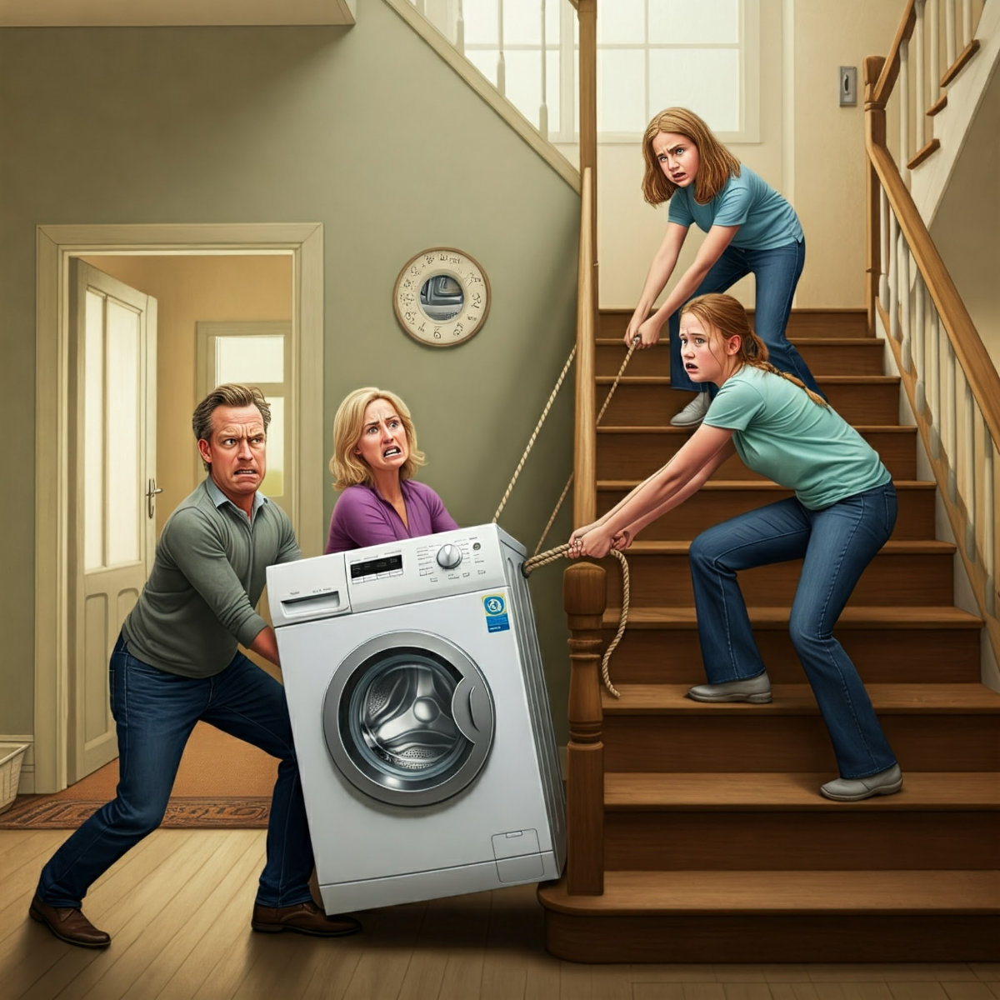
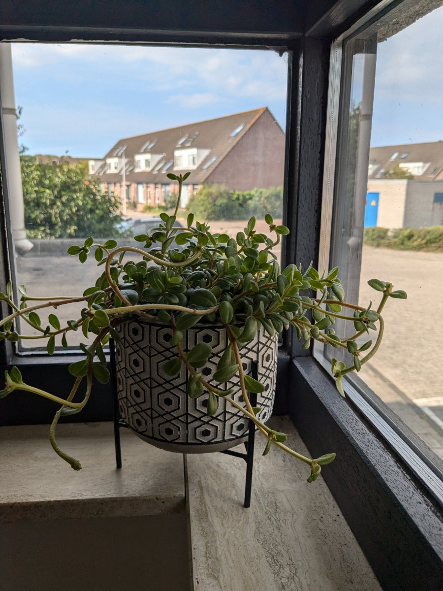
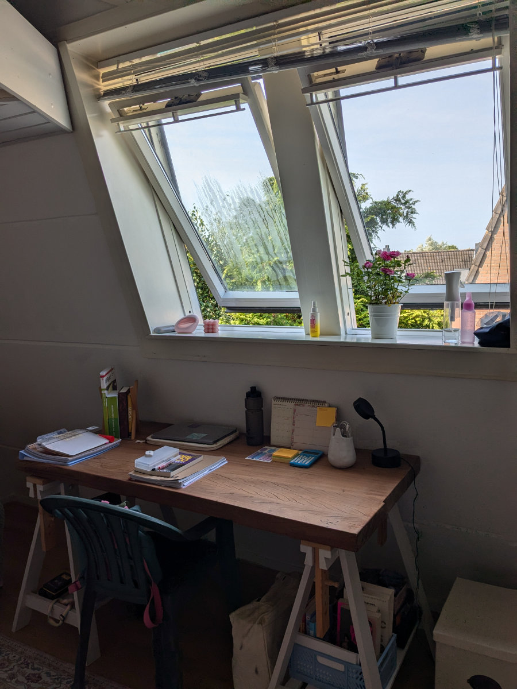

_Alle prese con la lavatrice e la forza di gravita'_

E’ iniziata un’altra settimana e tutti non vedevamo l’ora di metterci al lavoro. Gemma ha detto che il week end e’ stato troppo lungo, l’avrebbe accorciato di un giorno. Sabato io e Hilly abbiamo lavorato tutto il giorno alla casa ( battiscopa non ancora terminato ). Domenica siamo andati tutti e quattro al museo di scienze naturali di Leiden. Non si tratta della classica esposizione di animali imbalsamati, rocce piu’ o meno interessanti e ossa di animali estinti, invece, hanno avuto un approccio piu’ immersivo mescolando gli stessi elementi appena citati con installazioni audiovisive, giochi di luci e stanze semibuie ottenendo un effetto piu’ coinvolgente. Siccome abbiamo la museum card e possiamo tornare in qualsiasi momento abbiamo visto solo una piccola parte del museo andando poi a fare un pic-nic all’orto botanico, sfruttando ancora la museum card.\
Faccio fatica a trasmettere a parole la gioia che proviamo girando in bici per Leiden. Dovete venire a provare per capirlo.\
Questa mattina alla scuola di bici abbiamo passato diverse ore a discutere di pignoni, corone, catene, deragliatori posteriori e anteriori analizzandoli nei minimi dettagli, in tutte le loro variazioni e combinazioni possibili.\
Nel pomeriggio ci siamo messi a coppie a smontare un motore di una bici elettrica ed e’ stato divertente collaborare col mio compagno, nessuno dei due aveva idea di come fare e ci siamo fatti tante risate.\
E’ anche arrivato un carico di bici da città olandesi, sono circa una trentina, abbastanza disastrate. Nei prossimi giorni le dobbiamo smontare una per una e ristrutturarle, poi verranno vendute.

Le ragazze hanno fatto il primo pasto a scuola, hanno formato un tavolo nella caffetteria insieme ad un gruppetto di sudamericani, siriani e turchi. Dicono che essendo italiane vengono venerate dalla maggior parte degli studenti e a loro ovviamente questa situazione piace.\
Fanno orari ogni giorno diversi e quando Gemma finisce prima di Sophia la aspetta nella caffetteria, un po' perche' vuole andare a casa insieme e un po' perche' c'e' un ragazzo colombiano che le piace in classe sua e anche lui si ferma ad aspettare il fratello.

Poco fa abbiamo svolto un impresa che all’inizio sembrava impossibile. Ho già parlato di quanto siano ripide le scale in Olanda.\
Una cosa pazzesca.\
In Italia sarebbero illegali. Anche in casa nostra non sono da meno e io so gia’ che uno di questi giorni una bella caduta me la devo fare. Ad ogni modo, l’impresa incredibile e’ stata quella di portare di sopra la lavatrice, che si trovava in cucina, per metterla in bagno.\
Abbiamo legato una corda intorno al pesantissimo elettrodomestico, Sophia e Gemma tiravano da sopra e io e Hilly spingevamo da sotto. Ad un certo punto ci siamo incastrati e pensavamo non ce l’avremmo mai fatta e saremmo dovuti stare li fino a che qualcuno non avesse mollato la presa e io e Hilly saremmo finiti schiacciati ai piedi delle scale, vicino alla porta d’ingresso.\
Invece grazie ad un metaforico colpo di reni siamo riusciti ad arrivare all’ultimo gradino e ora l’infernale oggetto, simbolo dell’emancipazione femminile si trova al suo posto nel nostro bagno.\
Dopo l’impresa io e Sophia siamo andati a farci una corsa in giro per il quartiere. Gli olandesi hanno un modello di sviluppo urbano che a me piace molto. La nostra zona e’ un dedalo di vie e assembramenti di case sempre diverse e interessanti. Ogni due o tre isolati cambia lo stile delle case e ci sono tanti parchi, giochi per i bambini, canali, laghetti, pascoli di pecore e mucche. Correndo lungo un canale si puo’ guardare dentro i giardini delle varie case, tutte hanno dei gradini che scendono all’acqua dove si trova attaccata una barchetta, una canoa o un SUP.

Un paio di sere fa, con Hilly, abbiamo fatto i conti dei costi fissi che dovremo sostenere per vivere in Olanda. La situazione non e’ proprio rosea. A me piace molto leggere i dettagli della situazione economica di famiglie o singoli, so che per molte persone queste sono cose private di cui non si parla, a me piace farlo.\
Tra affitto, utenze domestiche, assicurazione sanitaria e amenita’ varie, i costi fissi mensili raggiungono la cifra di 3300€. Se poi si aggiunge la spesa al supermercato, il limitatissimo shopping occasionale e qualche piccolo svago, si arriva a 4400€. Due stipendi di base bastano quindi alla mera sopravvivenza senza potersi permettere vacanze, acquisti extra, imprevisti oppure accumulo di risparmi. Appena avremo un lavoro scrivero’ esattamente quanto guadagnamo. La cosa positiva e’ che qui e’ molto piu’ facile, rispetto all’Italia, avere aumenti di stipendio oppure seconde attivita’ remunerative.\
Rispetto all’Italia le grosse differenza sono nel costo delle case e nell’assicurazione sanitaria obbligatoria, che comunque non costa tantissimo, nel nostro caso spendiamo 330€, per tutta la famiglia, perche’ abbiamo aggiunto l’ortodonzia per Sophia e Gemma, ma si riesce a stare anche sotto i 300€ al mese. I minori di 18 anni non pagano l’assicurazione sanitaria ma beneficiano di quella del genitore con l’assicurazione più vantaggiosa.\
Essendo il possesso e l’utilizzo delle automobili fortemente disincentivato (uno dei motivi per cui abbiamo scelto di venire qui ) significa che la tassa automobilistica e l’assicurazione per l’auto sono molto costose, sempre rispetto all’Italia. Per quanto riguarda il carburante invece siamo allo stesso livello di costi con la differenza che il diesel costa molto meno della benzina verde.\
Il prossimo anno sarà un po’ un anno di assestamento, dovremo intaccare i nostri risparmi, che già sono dimezzati negli ultimi 3 mesi, per integrare gli stipendi e cercare di aumentare le entrate il prima possibile. Sicuramente niente vacanze fino al 2026. Questa cosa pero’ non ci pesa, almeno per ora, perche’ siamo tutti entusiasti semplicemente di stare in questo posto e di vivere la nostra nuova quotidianita’.

_Il bellissimo interno del museo di scienze naturali_

_La finestrella sulle scale di casa_

_Cameretta di Sophia_

_La scrivania di Sophia, siamo ancora senza sedie e stiamo usando quelle di plastica trovate in giardino_

_Gemma invece non ha ancora un letto_

_Divano usato, un affarone_

_Questo mobile nel centro l'abbiamo trovato in un "Kringloop", sta benissimo in cucina. Il forno dobbiamo ancora trovarlo._

_La mia prima ristrutturazione completa di una city bike, questa foto risale a ieri, oggi ho quasi finito di rimontare tutto_
