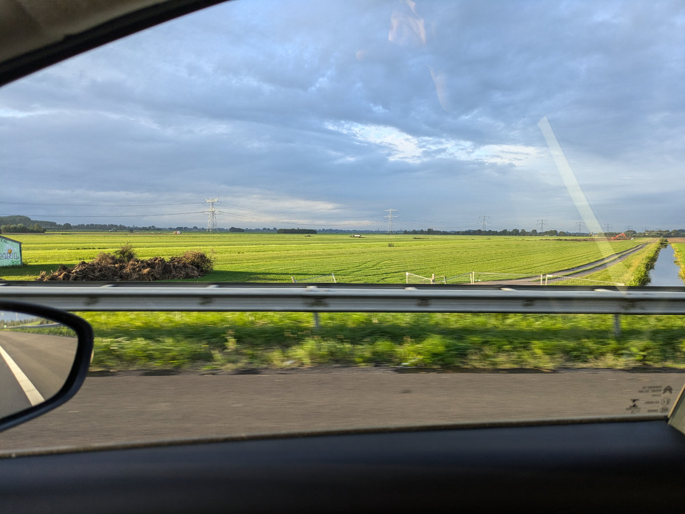
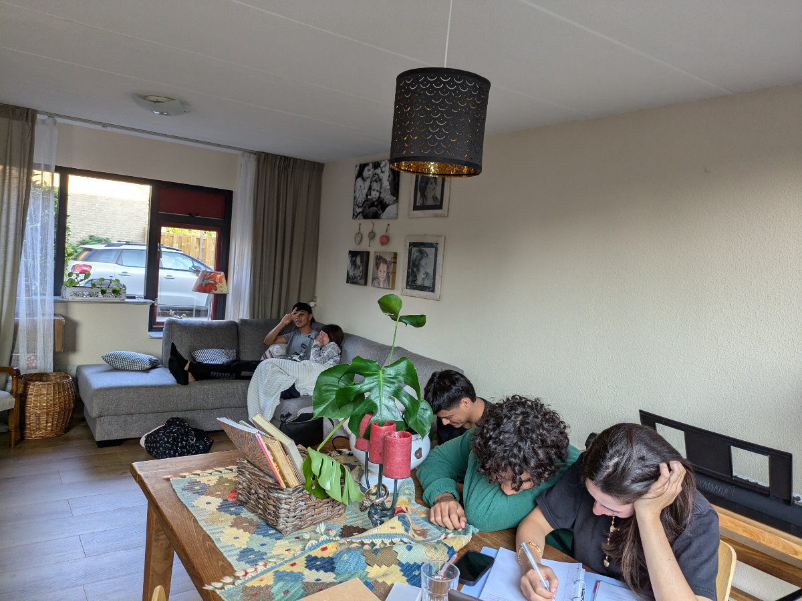
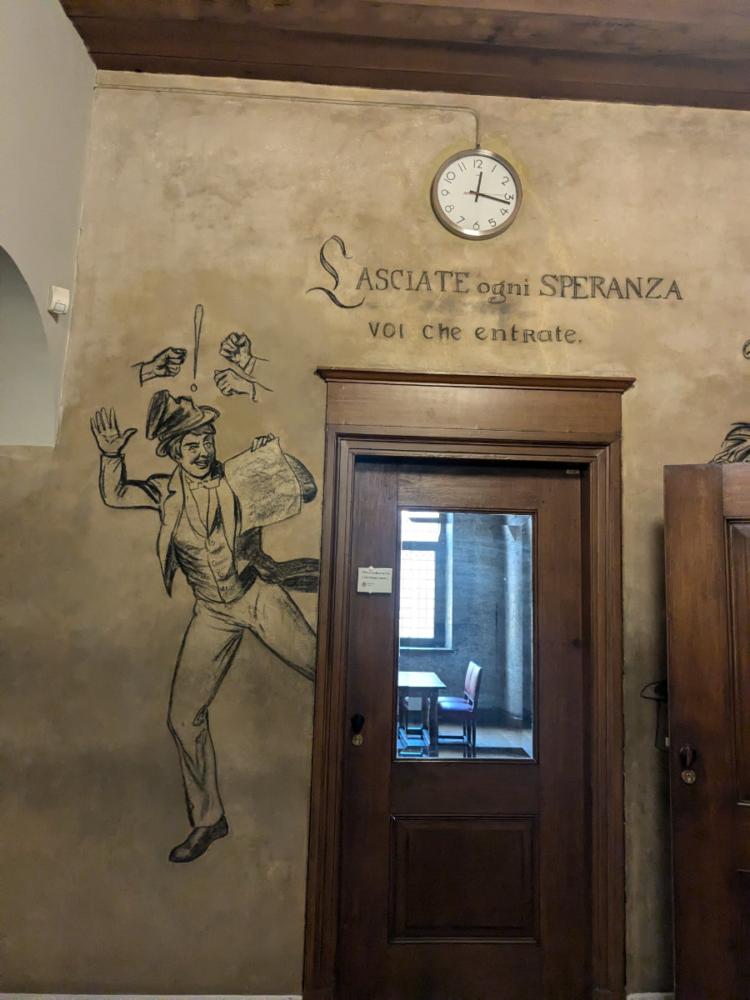
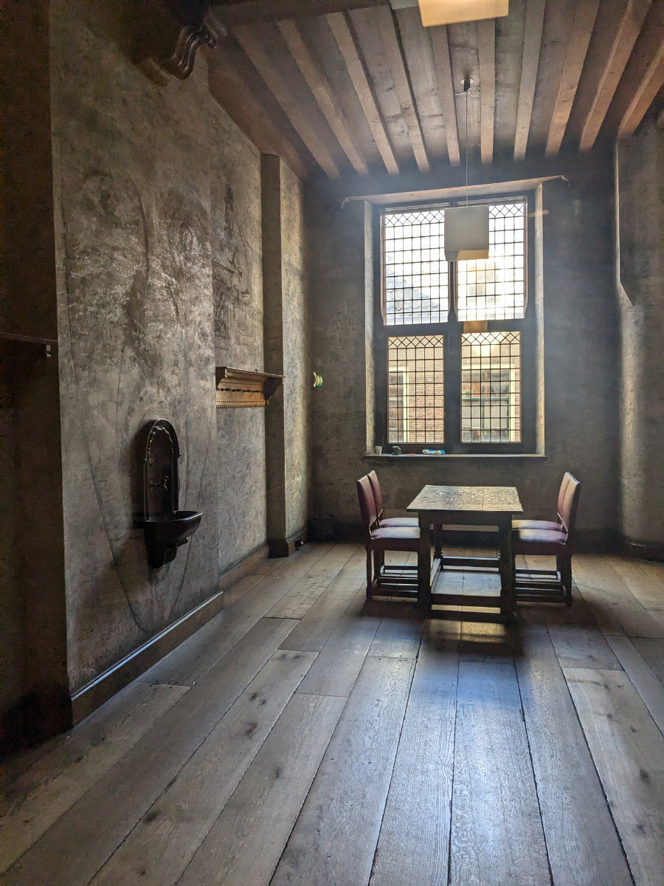
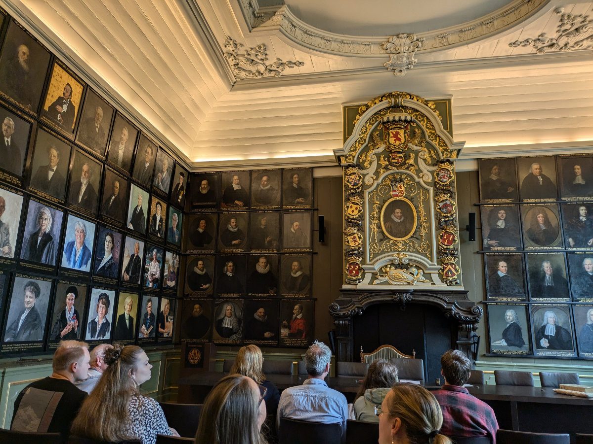
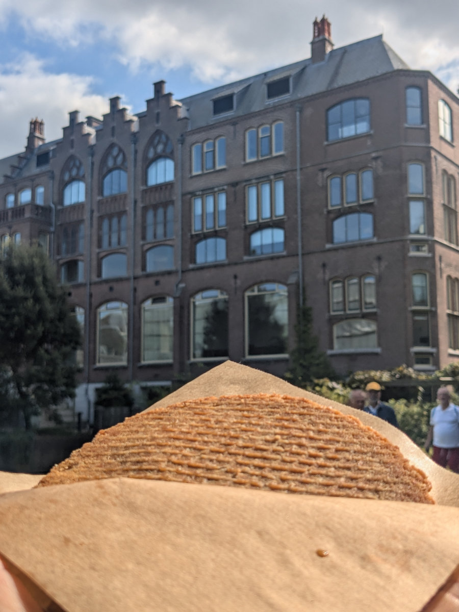

_Un disegno tempestato di firme nella "sweat room"_

Le ultime settimane mi hanno visto impegnato in una sorta di routine. Corso di biciclette dal Lunedi al Venerdi, visite dei “kringloop” (negozi dell’usato) della zona al Sabato mattina, lavori in casa al sabato pomeriggio, uscite culturali a Leiden di Domenica con tutta la famiglia… repeat.\
Il traffico in strada, al mattino e al pomeriggio, negli ultimi tempi e peggiorato, probabilmente per il ritorno degli olandesi dalle vacanze. Tra andata e ritorno mi faccio 2 ore e mezzo d’auto. Per fortuna ci sono i podcasts!\
Al corso di bici siamo un bel gruppetto affiatato. L’insegnante ci ha detto che raramente trova dei gruppi così motivati e scherzando ci ha consigliato di aprire un negozio tutti insieme.
Ieri a metà giornata mi ha dato un mountain bike, che ha trovato per strada, da rimettere in sesto, messa piuttosto male ma con tutti i componenti al loro posto. L’ho appesa immediatamente ai ganci, smontata tutta e provveduto a pulire e ingrassare tutte le parti. Oggi pomeriggio l’ho rimontata, registrato freni e deragliatori e poi sono uscito a provarla. Una bomba! \
Prima di andare via, poi, oggi pomeriggio, visto che eravamo solo in 4, ci ha dato un lavoro da svolgere in gruppo. Visto che una delle biciclette che stiamo revisionando aveva il telaio fratturato ci ha detto di trovare un altro telaio, tra quelli accatastati in magazzino, e adattarlo a tutti i componenti di quella con il telaio rotto. Una bella sfida. Domani dovremmo aver finito.

Hilly ha fatto il suo primo colloquio di lavoro. Si tratta di una posizione presso Johnson and Johnson, la casa farmaceutica americana, che ha una grossa sede a Leiden. Dovrebbe lavorare all’interno dei laboratori dove costruiscono protesi per il seno. Nel caso passasse anche il colloquio successivo, che dovrebbe fare nei prossimi giorni, riceverebbe un contratto temporaneo a partire dai primi di Novembre.\
Anche se e’ un tipo di occupazione che non si aspettava minimamente e’ felice per una serie di motivi. Prima di tutto e’ a 20 minuti di pedalata da casa. Secondo, la paga è abbastanza buona, anche se non si capisce ancora bene quanto porterebbe a casa perché le cifre parlano sempre di stipendio lordo, lo vedremo con la prima busta paga. Terzo fatto positivo e che lavorerebbe su una settimana di sei giorni, nel senso che farebbe 4 giorni di lavoro e due a casa. Un po’ meno positivo il fatto che dovrebbe fare i turni, uno dalle 6.30 alle 14.45 e l’altro dalle 14.45 alle 23.00 e anche il fatto che raramente le capiterebbe tutto il weekend libero non e' il massimo. Ad ogni modo, il lavoro non e’ ancora sicuro e comunque se poi non le piace puo’ sempre cercare altro.

Le ragazze stanno vivendo un esplosione di nuovi stimoli e scoperte, soprattutto Sophia, che non era abituata a tanta vita sociale tutta insieme. Avevo parlato, in un altro post, di Gemma, infatuatasi di Aleandro, un ragazzo Colombiano, ma anche Sophia si e’ subito trovata un ragazzo, di origini Egiziane ma cresciuto a Dubai. Non hanno perso tempo mannaggia a loro!\
Siamo tutti un po’ sorpresi dalle novita’ ma presto dovremo istituire un po’ di nuove regole e paletti se non vogliamo esserne travolti.\
Qualche giorno fa sono andato con Gemma e Sophia a visitare una palestra vicino alla loro scuola, dove vorrebbero iscriversi. E’ dedicata alle sole donne, un nuovo trend qui in Olanda, ne avevamo già viste anche ad Amsterdam. Sophia ha iniziato la settimana di prova gratuita ma Gemma non si e’ potuta iscrivere perche’ ci hanno detto che per frequentare una palestra in Olanda bisogna aver compiuto 16 anni. La povera Gemma dovra’ trovare qualche altra attivita’ sportiva a cui dedicarsi, anche se c’e’ rimasta un po’ male dal divieto impostogli e dice di non voler fare altri sport.

Domenica scorsa era una giornata particolare in Olanda perché erano aperte, tutto il giorno, le porte di monumenti solitamente chiusi al pubblico.\
Ne abbiamo approfittato per andare a visitare un palazzo storico nel centro di Leiden, sede della piu’ antica universita’ del paese, dopo la rivolta olandese, nel 1575. Nel palazzo universitario si trova la famosa “sweat room”, stanza della sudata, dove, fino a poco tempo fa, gli studenti aspettavano il risultato del loro esame finale. Per tradizione gli studenti lasciavano la loro firma sulle pareti della stanza e ad oggi ce n'e' sono decine di migliaia. Tra quelle piu’ celebri si possono vedere le firme di Winston Churchill e Nelson Mandela, quando ricevettero la laurea ad Honorem.\
Un po’ meno famosa ma altrettanto rilevante per noi e’ la firma di mio suocero, Henning Viljoen, passato per la sweat room, dove lascio’ la sua firma, nei primi anni settanta, quando fece il suo dottorato in legge. Che honorem!

Non sto più a dirvi quanto sia bello girare per Leiden in bicicletta, sembro un disco rotto, ora non vi resta che venire a provarlo di persona.\
Quasi ogni giorno io e Hilly un giretto ce lo facciamo. Ci stiamo godendo il tempo libero insieme, come quando eravamo appena sposati e non avevamo ancora figli.\
Per ora il tempo e’ ancora bello ma presto inizieranno le piogge ed il freddo, sperimenteremo il tanto temuto inverno olandese, poi bye bye piacevoli giretti in bici prima di cena.

_Fuori dal finestrino in autostrada al mattino_

_Gemma, Sophia e i loro amici_

_Sophia e Farez_

_Porta d'ingresso alla "sweat room" con l'ammonimento dantesco._

_Sembra una camera di esecuzione piu' che una sala d'aspetto_

_In questa camera mio suocero discusse la tesi di dottorato_

_"Stroopwafel" appena sfornato_
