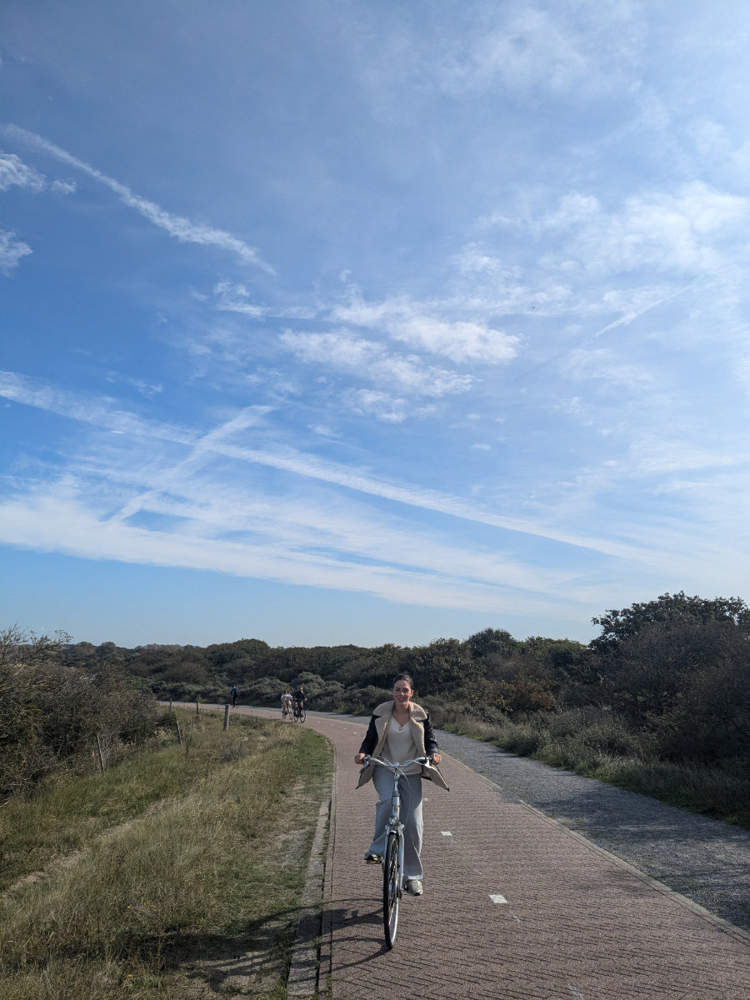
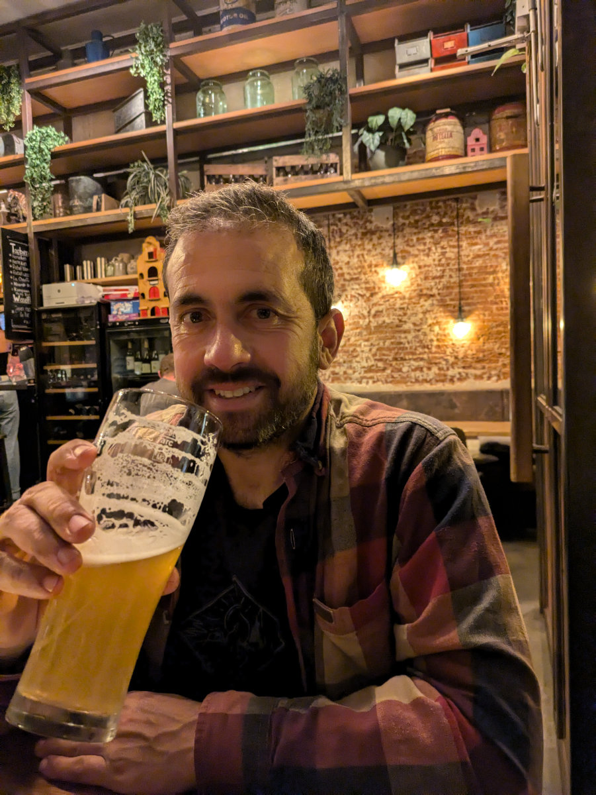
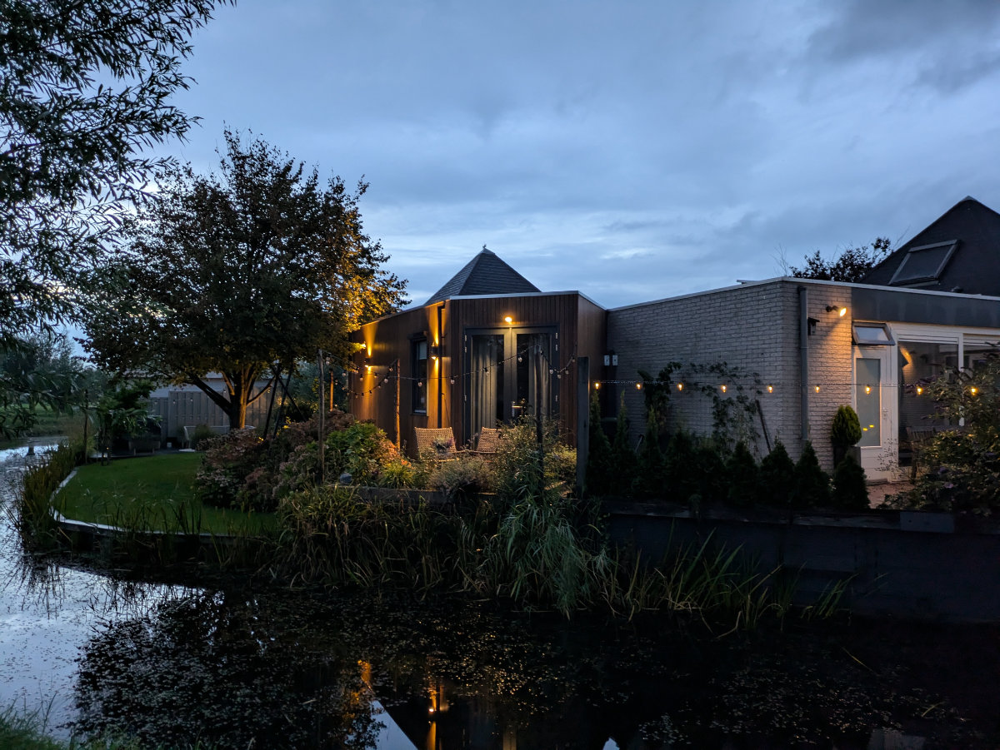

_Sul lungomare a Scheveningen_

Ieri siamo andati a Scheveningen in bicicletta, tutti e quattro, c’era il sole ma faceva un freddo frizzante. C’e’ una pista ciclabile che corre lungo la costa e da Katwijk, vicino a Leiden, si arriva all'Aja, passando appunto per Scheveningen. E’ un percorso bellissimo tra dune di sabbia, arbusti e conifere. C’era un sacco di gente in bici e di corsa. Il cielo era limpido, il sole luminosissimo ma per niente caldo.
A Scheveningen c’erano diversi surfisti che si dirigevano verso la spiaggia, le onde non erano enormi ma regolari e lunghe, perfette per imparare. Ne abbiamo visti arrivare due in bicicletta, con la muta addosso, scalzi, e la tavola sotto braccio. Che contrasto!\
L’idea di fare questa uscita e’ venuta a Hilly dopo aver fatto lo stesso percorso, 35 km tra andata e ritorno, Lunedì scorso.\
Era andata ad un colloquio di lavoro per fare la rappresentante di vini per un azienda agricola Sudafricana. Al colloquio c’erano un Italiano e un Sudafricano, entrambi proprietari di diverse attività legate al vino e alla ristorazione. Tra tutti i curricula che hanno ricevuto hanno preso in considerazione solo quello di Hilly e quello di un altro candidato. Il colloquio è andato bene, e sono rimasti d’accordo che le faranno una proposta al ritorno di uno dei due, non ricordo se l’italiano o il sudafricano, dalle vacanze. Probabilmente la proposta andrebbe nella direzione del lavoro con commissioni piuttosto che verso l’assunzione con stipendio fisso, cosa che per noi al momento non andrebbe bene. Per questo Hilly ha deciso di rifiutare l’offerta, qualsiasi essa sia.\
Nel frattempo pero’ ha fatto altri due colloqui per Johnson&Johnson e verra’ assunta da loro. Non ha ancora firmato un contratto ma le e’ stato detto che lo fara’ nei prossimi giorni.\
Il lavoro sarebbe quello a turni di cui ho già parlato in un post precedente. L’ambiente di lavoro le e’ sembrato all’apparenza positivo, stimolante e internazionale. Il lavoro si svolge tutto in inglese e iniziera’ nel reparto di “inscatolamento delle protesi per seno” con la possibilita’ di scalare in poco tempo a livelli piu’ alti.\
La notizia della futura assunzione di Hilly per J&J e’ arrivata Venerdì, lo stesso giorno in cui io ho fatto una giornata di lavoro in un negozio di bici a Zeist, la cittadina attaccata a Utrecht dove vado ogni giorno per il corso di Bici. Il negozio si chiama “Fietsvakman” (Fiets vuole dire bicicletta in Olandese) e collabora con Maintec (dove faccio il corso) per far fare pratica agli apprendisti. Il proprietario di Fietsvakman e’ Roger, un salvadoregno/canadese che vive da 25 anni in Olanda, sposato con una donna Olandese, e con un figlio di 17 anni. Roger ha fatto diversi lavori in Olanda e poi per passione, nel 2017, ha aperto un negozio di bici. Il suo unico collega è Jost, un Olandese che lavora con lui fin dall’inizio.\
Mi hanno fatto vedere come funziona il negozio nei minimi dettagli. Durante la giornata sono arrivati decine di clienti. In pratica quando il cliente arriva di solito porta una bicicletta, a meno che ne voglia comprare una nuova oppure voglia rifornirsi di parti o materiali. Durante la presa in carico della bicicletta bisogna molto rapidamente fare un'analisi visiva della bici in modo che se ci sono altri problemi, oltre a quelli elencati dal cliente, possono essere discussi subito.\
In tutta la giornata ho messo a posto diverse bici, ognuna con i suoi problemi, più o meno facili da risolvere. Lavorare con Jost e Roger e’ stato molto divertente. Roger e’ un buontempone e scherza in continuazione. Le postazioni di lavoro erano abbastanza incasinate, tutta un'altra storia rispetto alla scuola di bici. Mi sono dovuto ricavare uno spazietto dove appoggiare i miei attrezzi e i pezzi che smontavo, tra una montagna di altri attrezzi, pezzi di ricambio usati, pezzi rotti, contenitori di grasso mezzi vuoti, camere d’aria bucate, packaging vari e spazzatura. Un delirio assurdo in cui Roger e Jost probabilmente vedevano un certo criterio ma neanche poi tanto visto che passavano un sacco di tempo a cercare la chiave del 15 oppure lo smaglia catene. La scusante è che stanno allestendo un nuovo negozio, nella stessa via di questo, ma grande il doppio e si devono trasferire prima di Natale. La giornata e’ stata estremamente stimolante e non vedo l’ora di iniziare a lavorare per un negozio, dove non transigero’ assolutamente sull’ordine e la pulizia della postazione di lavoro.

La particolare congiunzione astrale per cui Venerdi, il lavoro di Hilly, ma anche il mio, si concretizzavano maggiormente, in concomitanza con il fatto che Sophia e Gemma avevano organizzato una serata a casa nostra con amici, e la loro gentile richiesta di allontanarci per qualche ora, hanno posto le basi per un'uscita straordinaria mia e di Hilly, in un bellissimo bar sui canali nel centro di Leiden, e la conseguente rottura del patto di astinenza alcolica che portavo avanti da quasi 9 mesi. Come me la sono goduta quella birra! Cin cin!\
Durante la cena, circondati da decine di studenti, mentre io mi gustavo una birra artigianale locale e Hilly un bicchiere di Primitivo, abbiamo fantasticato sull’idea di aprire una ciclofficina, annessa ad una caffetteria, a Leiden, creando un ambiente dove portare la propria bici per la manutenzione e gustarsi una fetta di torta oppure un piatto di lasagne come si deve. L’idea ha fatto brillare esageratamente gli occhi di Hilly e ci siamo persi in fantasticherie e brainstorming sull'arredamento degli interni e sul possibile menu’. Chissa’, forse fra un paio d’anni, una nuova avventura?

Sophia e Gemma sono sempre piu' contente della nuova situazione. Gemma e' sbocciata. Non l'ho mai confrontata sul fatto che giurava che non si sarebbe mai adattata all'Olanda, mentre io le dicevo il contrario. Testarda com'e' per non darmela vinta si inventerebbe qualsiasi cosa, ma uno di questi giorni glielo dico.\
Venerdì sera scorso sono andate con gli amici a fare un picnic ad un lago vicinissimo a casa nostra, a meno di 5 minuti di bici. Sono rimasti lì fino al tramonto.\
Dietro casa nostra ci sono dei bellissimi canali lungo i quali vado a correre e, all'imbrunire, quando nei piccoli giardini si accendono le luci e’ tutto molto “gezellig”, parola Olandese che non si puo’ tradurre precisamente in inglese, se non con “cozy” che a sua volta e’ una parola inglese che in Italiano non ha un equivalente e significa un misto tra accogliente e intimo.

_Verso Scheveningen_

_Il negozio di bici di Roger_

_Salute a tutti, me la sono proprio goduta_

_I canali dietro casa_

_Gezellig!_

_Photo fatta da Sophia al lago_

_Qualche giorno fa Sophia si e' rintanata sotto ad un ponte a fianco alla sua scuola, con dei compagni, per evitare la pioggia_
