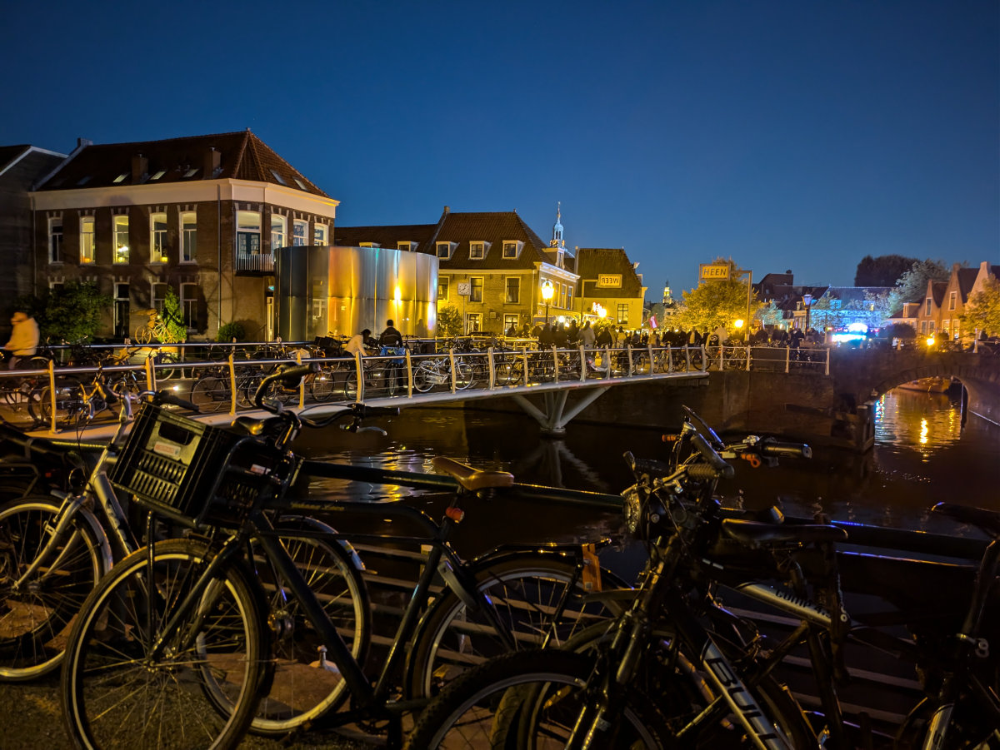

_Le giostre svettano sulla cittadina_

Settimana scorsa, a Leiden, ci sono state delle grandi celebrazioni.\
Il 3 Ottobre del 1574, 450 anni fa, Leiden veniva liberata dall’occupazione spagnola. Ogni anno tutta la citta’ viene coinvolta in una grande festa della liberazione. Il 2 Ottobre, come da tradizione, viene offerto lo “Hotspot”, una pietanza tradizionale Olandese, una specie di purea di patate, cipolle e carote servito con uno spezzatino/stufato di manzo. Secondo la leggenda la ricetta risale proprio al 1574, ed era il cibo che gli Olandesi trovavano nei pentoloni degli spagnoli che scappavano dopo il lungo assedio alla città di Leiden.\
L’Hotspot viene offerto gratuitamente dall’ ”associazione del 3 ottobre” a tutti i residenti di Leiden.\
Siamo arrivati in coda verso le 17.30.\
Il lungo e ordinato serpente di persone si srotolava lungo alcune vie del centro storico, e conduceva alle postazioni in cui i volontari servivano il cibo fumante. Tutto intorno gruppetti di persone gia’ mangiavano e bevevano birra. All’inizio pensavo ci avremmo messo un inifinita’ a raggiungere l’agognato pasto ma ci vollero solo un ventina di minuti. Eravamo io, Hilly e Sophia, la quale era un po’ pessimista riguardo la qualità di quella che sembrava una sbobba mal riuscita .Alla fine si dovette ricredere, invece, e pulì completamente il piatto.\
Il giorno dopo tutte le scuole, i negozi e gli uffici erano chiusi. Le scuole hanno fatto un ponte di quattro giorni. Al mattino Hilly e’ andata presto in centro ( io ero alla scuola di bici, che non si fermava perche’ non si trova a Leiden) a prendere le Aringhe fresche e il pane, sempre tutto offerto gratuitamente dalla comunita’, ai residenti, anche questo parte della tradizione.\
Dal pomeriggio fino alla notte la citta’ e’ stata trasformata in un parco di divertimenti, con le giostre distribuite per le vie del centro storico, gruppi musicali che suonavano, parate di ogni tipo, street food, bancarelle e birra a fiumi dalle 10 del mattino.\
Alcune giostre erano veramente pazzesche, alte decine di metri svettavano sugli edifici storici creando un forte contrasto. Altrettanto impressionante era il costo delle dannate attrazioni, quelle piu’ belle arrivavano a costare 25 euro per una corsa, ma anche quelle piu’ insignificanti e comuni costavano un bel po’, rispetto all’Italia. Ad ogni modo erano sempre piene di gente.\
Le ragazze hanno girato tutta la sera con la loro gang e io e Hilly abbiamo comprato delle birre al supermercato, una bottiglia di Rose’, e ci siamo goduti lo spettacolo di colori e rumori come non facevamo da tanto tempo. Ad un certo punto ci siamo trovati in un piazzetta dove c’era una band che suonava musica degli anni 80/90, molto coinvolgente, il pubblico era tutto di persone dai 40 anni in su, tutti molto presi a ballare e cantare le canzoni a squarciagola. Un magnete che attraeva a sé ogni “Boomer” nelle vicinanze. Anche noi, facendo parte della categoria, ne siamo stati inevitabilmente rapiti e ci siamo fermati per un oretta. Ogni giovane che arrivava rimaneva spiazzato dal bizzarro spettacolo di vecchi sudati e infogati, genitori e nonni che ci davano dentro!\
Siccome il giorno dopo io dovevo comunque alzarmi presto per andare ancora al negozio di bici di Zeist, dove avrei trovato la simpatia di Roger e Jost, ma anche il gran casino di roba buttata a caso su ogni superficie orizzontale, decidemmo di tornare a casa prima della mezzanotte, quando ci sarebbero stati i fuochi d’artificio, che purtroppo ci siamo persi. Al mattino, comunque, i fuochi d’artificio ce li avevo in testa! Non sono più abituato alla birra e al vino.

_Nello sfondo si vede la fila per prendere le aringhe e il pane_

_Le nostre aringhe fresche_

_Al tramonto la festa si fa ancora piu' viva_

_Uno dei canali principali dentro Leiden_

_Una delle tante attrazioni_

_Verso la bolgia_

_Parcheggio gratis!_

_La piazzetta dei Boomers_

Qualche giorno fa c’e’ stata anche una riunione alla scuola delle ragazze a cui erano invitati a partecipare tutti gli studenti e i loro genitori o tutori legali. Il ritrovo era alle 19.00 nell’aula magna della scuola. Sopra un lungo tavolo c'erano dei grossi contenitori thermos con the e caffe’ oltre a biscotti e ciambelle in gran quantita’. In tutto eravamo forse duecento persone. Il discorso di presentazione della scuola e’ stato fatto in Olandese ma veniva tradotto dopo ogni frase anche in Inglese, Arabo e Ucraino.
Alla scuola sono iscritti studenti di piu’ di 40 nazionalita’ diverse. Sophia e Gemma sono le uniche italiane.\
Nella seconda parte dell’incontro siamo andati nelle diverse classi dove il professore/tutor di ogni classe ci ha dato informazioni più precise e ha risposto alle nostre domande. Io andai nella classe di Sophia e Hilly in quella di Gemma.\
A novembre faranno dei test approfonditi di conoscenza dell’Olandese e, in base ai risultati dei test, potranno anche spostare gli studenti in classi piu’ adatte al loro livello. In effetti Sophia e Gemma sono abbastanza avanti rispetto agli altri studenti, grazie alla loro conoscenza dell’’Afrikaans.\
Una cosa un po’ negativa, del pur ottimo sistema di integrazione scolastico Olandese, e’ che gli studenti tra di loro finiscono a parlare l’inglese, oppure l’arabo, durante tutti i momenti di socializzazione al di fuori delle ore di lezione. Questo fatto rallenta un po’ il loro inserimento nel sistema scolastico normale anche se indubbiamente lo rende piu’ morbido e favorisce l’inclusivita’ e la riduzione delle disparita’ fra studenti.\
Le ragazze nel weekend andranno a cercarsi un lavoro. Qui quasi tutti i teenager lavorano, anche se poche ore a settimana, di solito al pomeriggio tardi oppure nel weekend. Questa cosa gli servirà molto, non solo per aumentare le loro finanze ma anche per fare più pratica con l’Olandese.\
La prossima settimana sara’ l’ultima per me alla scuola di bici, poi mi affaccero’ anche io nel meraviglioso mondo del lavoro. Hilly invece dovrebbe cominciare con il suo contratto il 14 di Novembre, ancora piu’ di un mese da casalinga!

_Andiamo alla riunione scolastica_

_Questo crostaceo mi ha attraversato la strada, tutto convinto, qualche giorno fa, non credevo ai miei occhi, deve essere uscito da uno dei tanti canali_
