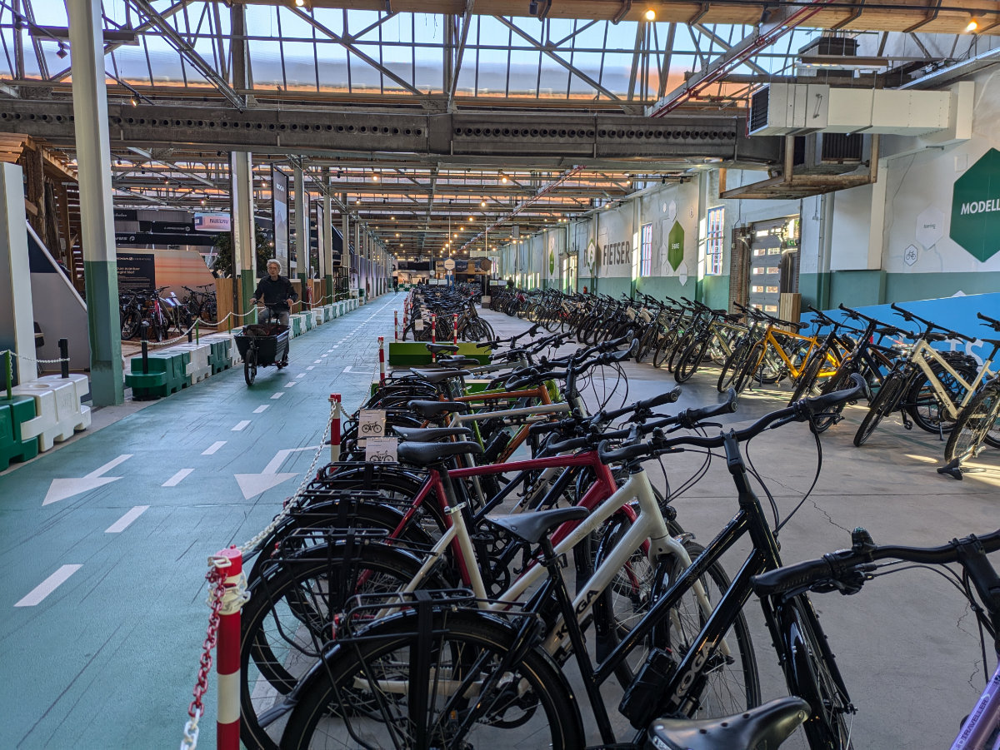

_Natascia e' il nostro primo, di una lunga serie, di ospiti_

Chiedo scusa a tutti gli appassionati di Cassetta’s Reboot per la scarsita’ di post in quest’ultimo periodo. Per il momento faccio un po’ fatica a trovare il tempo e l’ispirazione per scrivere, all’inizio lo facevo ogni due o tre giorni e ora siamo arrivati a due settimane. Comunque continuo a farlo, anche se dovesse diventare un appuntamento mensile, chi lo sa.

Una settimana fa, di venerdì, siamo andati a fare una gita scolastica con la scuola di bici. Abbiamo visitato un posto chiamato “De Fietser” (il ciclista) ed e’ venuta anche Hilly. Un grande spazio ricavato in un'ex fabbrica, dove c’erano decine di modelli di biciclette di ogni tipo di diversi brand olandesi e internazionali, che era possibile provare in un circuito interno. Solo in Olanda!\
Questo Venerdì mattina invece ho avuto gli esami teorici del corso di bici. Gli esami pratici si sono svolti durante tutta la settimana in diverse occasioni e siamo stati valutati dal nostro insegnante. Per gli esami teorici invece e’ venuto un esaminatore mandato dal “IBKI”, “L'istituto per gli esami teorici e pratici nel settore della mobilità” e ci ha fatto fare un test generale sulle bici e uno piu’ specifico sulle bici elettriche. Oggi, Lunedì, ho ricevuto i risultati e ho passato entrambi i test. Yuppiee!!\
Sono state 8 bellissime settimane, il gruppo era molto affiatato e anche l’insegnante era triste di vederci andare via.\
Alla fine siamo rimasti in 6 nel corso, uno ha abbandonato dopo 3 settimane per problemi di salute.
C’era Thomas, forse il più giovane del gruppo, poco più di 25 anni, mi pare. Una breve esperienza di lavoro come sviluppatore informatico che l’ha portato a capire che non era adatto a quella vita.
Poi c’era Gerard, il piu’ anziano, mi sembra 61 anni, da poco licenziato dalla ditta in cui aveva lavorato per più di 30 anni e ora si riaffacciava, stancamente, sul mondo del lavoro.
David, un altro giovane, aveva lavorato per diversi anni per “swapfiets”, un servizio di abbonamento per biciclette, dove pagando una quota mensile ti danno una bici e ogni volta che hai un problema la cambi per un altra in perfetto stato. David voleva continuare a lavorare con le bici ma in un ruolo più qualificato e appagante, per questo ha fatto il corso.\
C’era anche Jeroen, appassionato di fai da te e di “kite buggys” quel veicolo a tre ruote che si guida sulla spiaggia tirato da un grosso aquilone tipo “kite surf”.
Peter, il Rastaman del gruppo, molto simpatico e sempre sorridente, intrippato con le bici "cruiser" (quelle bici molto basse, con il manubrio lungo tipo Harley Davidson e le ruote “fat”) e grande appassionato di cannabis.\
Infine Albert, l’insegnante, molto paziente e disponibile, con un enorme conoscenza di biciclette e meccanica e un infallibile capacità di fare battute umoristiche e di risolvere problemi trovando soluzioni creative.\
Ho imparato molto e ora sono pronto a lavorare.

_Dall'alto a sinistra verso destra: Gerard, Jeroun, David, Thomas, Rayden (e' venuto solo a fare gli esami) In basso da sinistra: Cristian, Peter (Rastaman) e Albert, l'insegnante_

_De fietser_

_Per gli amanti delle bici un vero paradiso_

_Abbiamo provato delle bici elettriche da 8.000€_

Domani faccio una giornata di prova in un negozio a Moerkapelle, un posto che non avevo mai sentito nominare a 20km da casa. Credo stiano facendo fare una prova a diversi candidati per poi assumerne uno. Nel caso scegliessero me ne sarei contento, il posto sembra molto bello, il giusto compromesso fra negozio e officina di riparazioni, senza essere sbilanciato verso nessuna delle due parti, così almeno sembra dal sito web e dalla pagina facebook.\
Il fatto che si trovi a 20 km di distanza mi rende felice. Fosse stato a Leiden sarebbe stato comodo ma almeno in questo modo sono obbligato a farmi 40 km di bici al giorno e quindi tenermi in forma. Non vedo l’ora di uscire di casa in un mattino di Gennaio, al buio, sotto la pioggia gelida, cavalcare la bici per quasi un'ora e arrivare al negozio, togliermi gli indumenti antipioggia, guanti, cappello, copriscarpe, sovrapantaloni e giacca impermeabili, dirigermi verso la caffettiera e farmi una bella tazzona di caffe’ bollente. Forse questo e’ solo un pensiero romantico e in breve tempo mi rassegnero’ ad andare a lavoro in auto quando piove, a differenza degli olandesi, che quando piove in bici ci vanno lo stesso, senza problemi.\
Oggi pomeriggio con Hilly abbiamo fatto la strada in bici al negozio e ritorno, 42 chilometri in tutto, al 90% attraverso la campagna Olandese, sempre piacevole e suggestiva. Il negozio era chiuso, come tutti i negozi di bici che sono chiusi il Lunedì perché sono aperti di Sabato.

Negli ultimi due week-end ho dato una bella sistemata alla mia micro-officina. Ora e’ pronta per accogliere una bici alla volta. Spesso fuori dalle case, o dalle aziende, vengono depositati “rifiuti” che in realtà potrebbero essere utilizzati da qualcun altro. Mobili, elettrodomestici, materiali. Un paio di settimane fa ho portato a casa dei cassettoni fatti di legno multistrato di ottima qualita’. Li ho smontati tutti e ci ho costruito un tavolo e dei ripiani per la micro-officina. Mi sono anche avanzati dei pannelli che usero’ in futuro.

_La micro-officina prima della ristrutturazione_

_I materiali che ho trovato gratis_

_La micro-officina dopo la ristrutturazione_

_Sono pronto al lavoro_

Una settimana fa abbiamo avuto il nostro primo ospite dall’Italia.\
Natascia era di passaggio durante il week-end perche’ c’era un evento culinario vicino ad Utrecht e lei portava i vini dell’azienda che rappresenta. Ha chiesto a Hilly se aveva voglia di unirsi a lei per il Sabato e la Domenica, ad assaggiare piatti di alta cucina, offrendo il loro vino ai partecipanti e godendosi la SPA dell’Hotel nei momenti di riposo. Hilly ha accettato senza esitare. Il venerdì prima dell’evento Natascia ha dormito a casa nostra e siamo andati in centro, a Leiden, con le biciclette, a bere qualcosa mentre lasciavamo la casa a Sophia e Gemma che volevano guardare un film con la solita gang internazionale di amici.\
Questa settimana le ragazze hanno diversi test a scuola tra cui anche il test di teoria e pratico per andare in bicicletta. Di solito viene fatto alle elementari ma nel loro caso lo fanno ora perché arrivano tutti dall’estero.\
Da settimana prossima invece faranno 9 giorni di vacanza, come da calendario scolastico.
Questa mattina Sophia non è andata a scuola perché ha un forte raffreddore, Hilly ancora non lavora e io avevo un Lunedì di riposo visto che la scuola è finita Venerdì e lavoro solo da domani. L’unica a uscire di casa era quindi Gemma. E’ uscita tutta sola, alle 7.50, fuori c’era buio e sembrava dovesse diluviare da un momento all’altro. E’ stato emozionante vederla uscire contenta e positiva nell’andare a scuola, fino all’anno scorso ci mettevamo un ora a svegliarla al mattino, ed era sempre di cattivo umore. Che cambiamento.

_Qualcuno le fermi!!_

_I colori dell'autunno vicino a casa_
