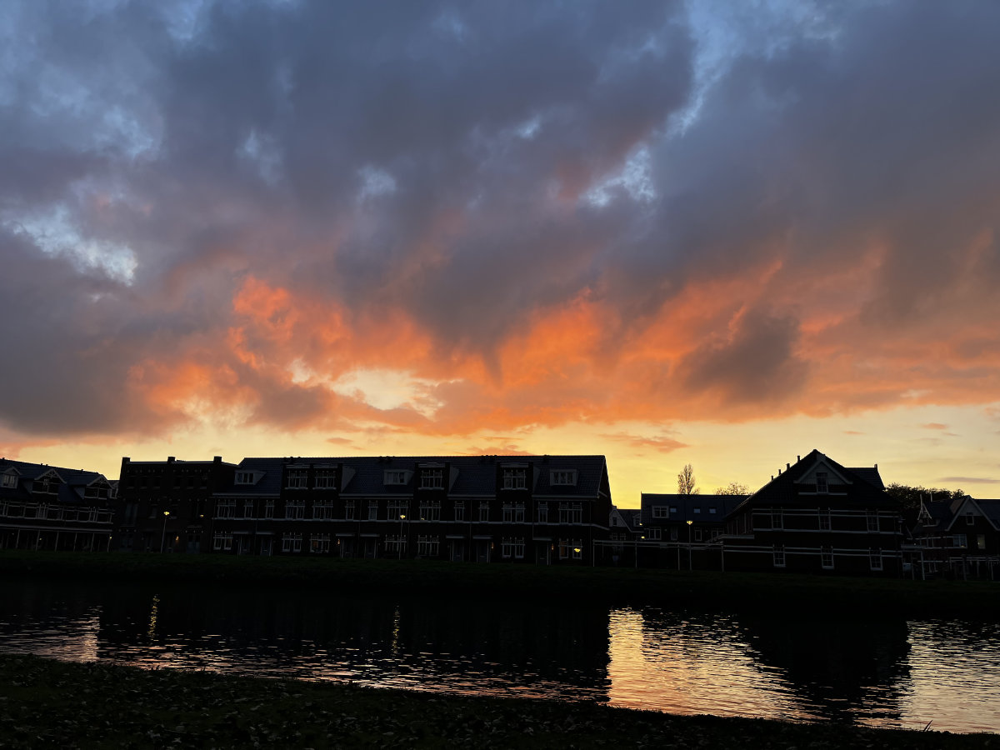
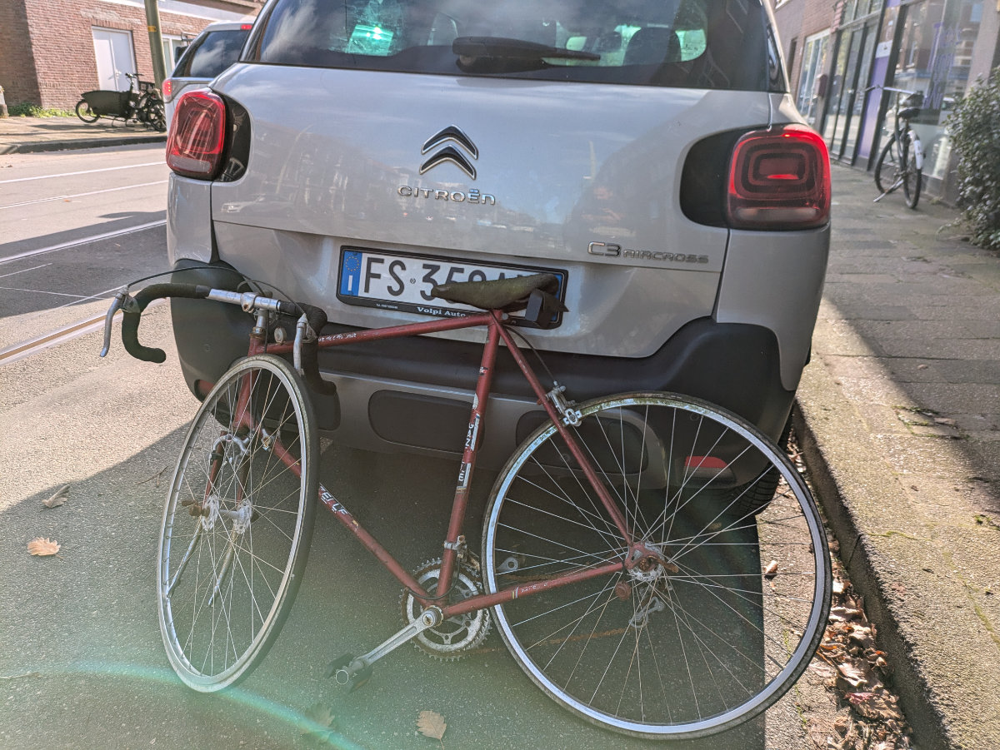
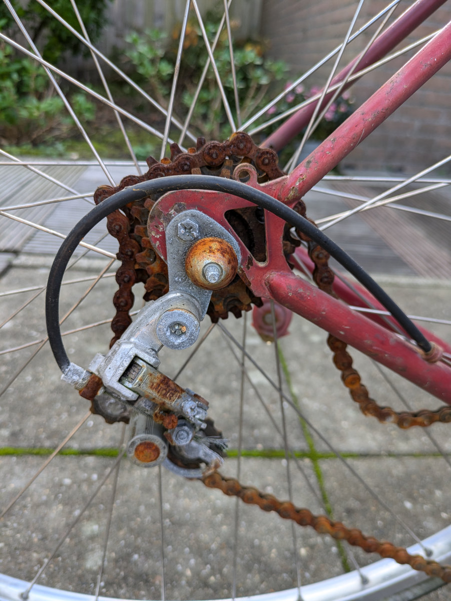
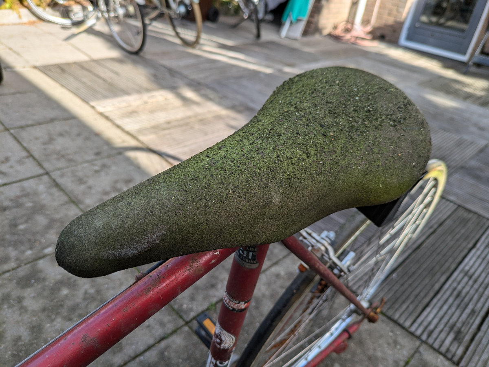
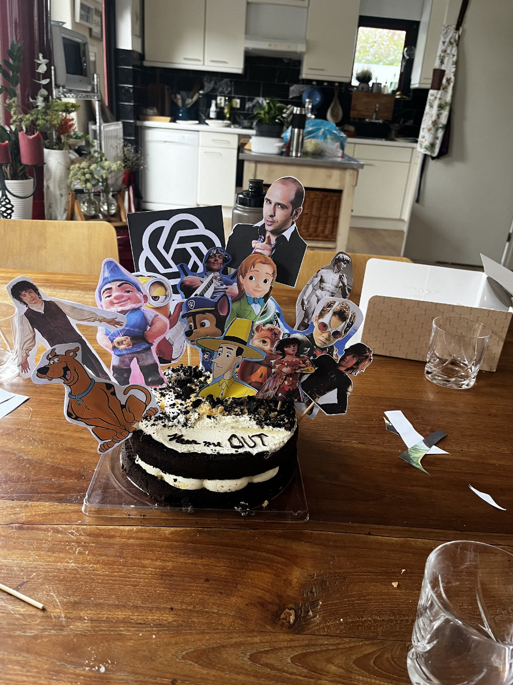
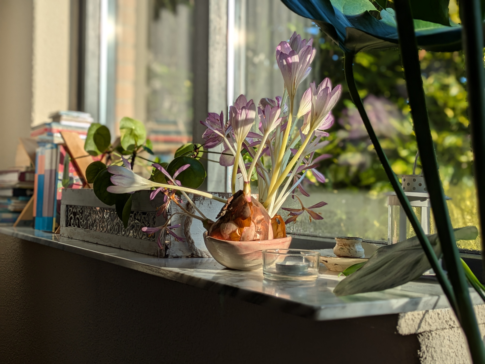

_Fuori dalla scuola delle ragazze al tramonto_

La mia situazione lavorativa non si e’ ancora risolta. La giornata di prova nel negozio di bici di Morkapelle (a 20 km da Leiden) era andata molto bene. Il proprietario, Koen, mi ha subito detto che per quanto lo riguardava lui mi avrebbe assunto subito ma purtroppo prima doveva fare i conti con la scuola, che lo forzava ad assumermi tramite loro, almeno per il primo anno, ad un costo di molto piu’ elevato che se mi avesse assunto direttamente. Ad oggi, dopo una settimana, siamo ancora in contatto perché lui sta contrattando con la scuola delle condizioni migliori.\
Nel frattempo io mi sto girando tutti i negozi di bici di Leiden chiedendo direttamente a loro se mi vogliono assumere. Se trovo qualcuno che mi prende con un buon stipendio posso anche bypassare la scuola e poi pagare il costo del corso di tasca mia (4000€), almeno così dice il contratto che ho firmato con loro.\
A Leiden ci sono 15 negozi di biciclette. Devo farne ancora due. La maggior parte sono al completo di meccanici, in 4 o 5 invece hanno preso i miei contatti e mi faranno sapere. In molti mi hanno detto che questo e’ il periodo con meno lavoro dell’anno e che probabilmente avranno bisogno di qualcuno da Febbraio. La stessa cosa che mi ha detto la scuola per giustificare il fatto che non mi hanno ancora trovato un posto.\
Oggi voglio presentarmi nei negozi che mi mancano a Leiden e poi cominciare con i paesini limitrofi. Questa cosa di andare direttamente nei negozi a chiedere un lavoro è piuttosto divertente. All’inizio, nei primi due o tre posti mi sentivo un po’ in imbarazzo. Ieri invece ero come un bambino intento in una caccia al tesoro. Alcuni giorni fa creai un file di Notion (bellissima app che utilizzo da qualche anno per organizzarmi la vita) con una lista dei negozi della zona, dando a ciascuno un voto, da uno a tre, per valutare quanto mi piacerebbe lavorare in quel posto, almeno all’apparenza, dopo aver letto alcune recensioni di clienti e aver spulciato il loro sito web. Poi ho salvato tutti i negozi su una lista di google maps. Con questo sistema vedo tutti i negozi salvati direttamente sulla mappa e sempre dallo smartphone posso scrivere delle note dopo essere entrato e aver parlato con qualcuno. Girare in bici per il centro di Leiden, alla ricerca del prossimo negozio da spuntare sulla lista, guardando la mappa con tutti i segnaposto in evidenza, sembra appunto di fare una caccia al tesoro. Il rilascio di endorfine causato dal progressivo completamento della mappa rende quasi insignificanti gli innumerevoli rifiuti ricevuti.

Domenica scorsa sono andato all’Aia a prendere una bici da corsa Vintage da ristrutturare e rivendere. L’ho pagata solo 50€ ed e’ messa piuttosto male. Un bel progettino!\
Intanto per tenermi in allenamento sto anche facendo la revisione alle nostre bici e ad altre due bici che ho sempre comprato usate. Al momento abbiamo 8 biciclette in giardino.

Ieri Hilly ha ricevuto il contratto di Johson & Johnson per l’assunzione. L’agenzia tramite cui aveva fatto i colloqui le aveva detto che avrebbe iniziato il 14 di Novembre mentre dal contratto risulta il primo di Dicembre. Un’altro mese a casa!\
Anche lei si sta dando da fare con possibili alternative e lavori part-time in attesa di iniziare da J&J.

Nonostante io sia abbastanza sicuro che a breve la nostra situazione lavorativa sara’ risolta sto vivendo una leggera ansia che si manifesta principalmente alla sera, prima di addormentarmi, quando ormai stanco chiudo gli occhi e invece di venire rapidamente avvolto dal dolce torpore che precede il sonno mi trovo a pensare a possibili scenari disastrosi e questo rallenta la mia discesa nel mondo dei sogni. Per potermi addormentare devo fare un grande sforzo per bloccare la mente irrequieta, concentrandomi sul respiro ogni volta che mi trovo a pensare a qualcosa che crea ansia. Alla fine poi ce la faccio, pero’ che fatica!

L’autunno Olandese tarda ancora. Mentre in parte dell'Europa piove in modo esagerato qui il tempo e’ abbastanza asciutto e fa ancora relativamente caldo. Finora non c'è il bisogno di accendere i riscaldamenti in casa e di giorno vado in giro in bici senza la giacca.\
Sabato scorso, in vista dell’arrivo di Halloween, hanno completamente chiuso il parco vicino a casa nostra e l'hanno trasformato in un percorso Horror per ragazzi, bambini e famiglie. Noi ce ne siamo accorti all’ultimo momento e non siamo potuti entrare perche’ servivano dei biglietti che andavano presi in anticipo. Da fuori si sentivano grida terrificanti (degli attori ) e suoni spaventosi. Tutto era avvolto da una fitta nebbia e sullo sfondo c’era una musica spettrale. Ad un certo punto, da una zona del parco, veniva il rumore di una vera motosega accompagnata dalla risata diabolica dell’attore che la maneggiava.\
L’anno prossimo non possiamo perderci l’evento!

Le ragazze si stanno godendo la loro settimana di vacanza da scuola. Questa sera speravano di poter andare a qualche festa di Halloween ma sembra che gli eventi siano stati anticipati al weekend precedente. Oggi hanno intenzione di andare in giro a cercarsi un lavoro, finora hanno sempre rimandato.\
Speriamo che almeno loro comincino a portare a casa uno stipendio!\
No dai, non preoccupatevi, non siamo ancora arrivati a questo livello.

_Prelevo la bici all'Aia_

_Devo togliere un po' di ruggine_

_Bello soffice, con tutto quel muschio_

_Le ragazze hanno fatto questa torta con una serie di personaggi (tik-tok trend)_

_Questo bulbo e' bellissimo e fiorisce senza acqua ne terra_
