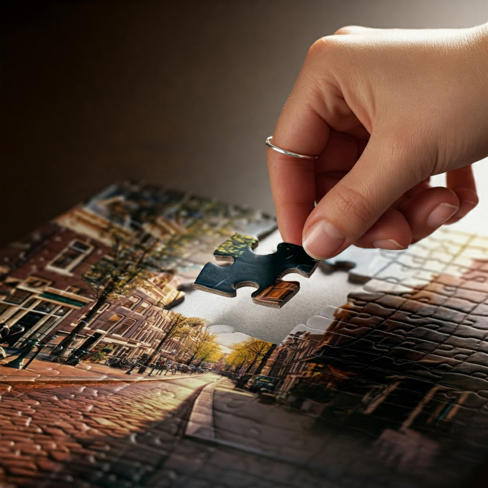
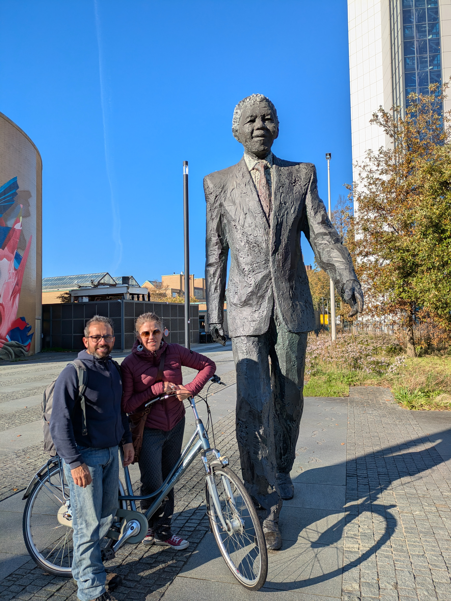
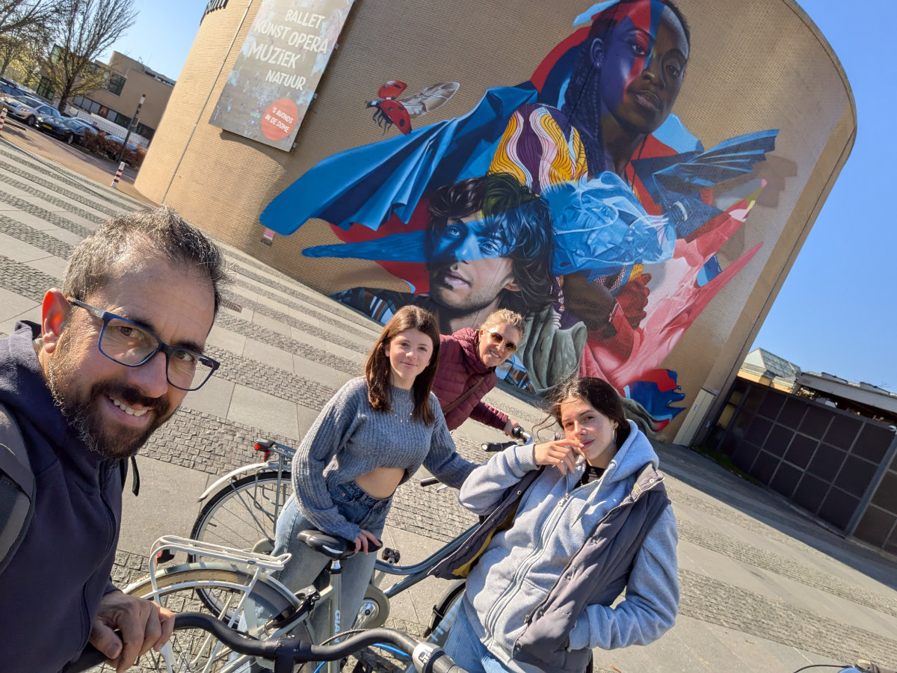

_L'ultimo pezzo del puzzle_

Non c'è mezzo di trasporto più efficiente, piacevole e “amico dell’ambiente” della bicicletta. Molte delle cose che utilizziamo ogni giorno, e che ci danno sostanziali vantaggi, hanno un grande costo dal punto di vista del consumo di risorse naturali. Quindi utilizziamo questi attrezzi, tecnologie, diavolerie moderne ma in qualche modo, chi piu’, chi meno, siamo consapevoli di stare utilizzando energia elettrica o benzina, al fine di avere piu’ comfort o semplicemente per svolgere dei compiti che una volta richiedevano incredibili sacrifici, tipo andare alla fonte o giu’ al fiume a lavare il bucato.
La bicicletta snobba tutti questi sensi di colpa con incredibile eleganza.\
Al costo fisico di una seduta in palestra la nostra affidabile amica ci porta ovunque vogliamo andare in poco tempo e senza intoppi, rendendo la camminata un obsoleto passatempo, perfetto per gli spostamenti domestici e nulla piu’.\
Per tenerci in forma e portarci in giro, l’utile marchingegno metallico, chiede poca attenzione. Sapone, olio e qualche pezzo di ricambio saltuariamente sono abbastanza per tenerla felice e disponibile. Non teme il sole, la pioggia e il freddo. Ha solo qualche problema con la neve o, per quelli non abbastanza allenati, con le salite ripide e sassose. In alcuni casi non si ferma neanche dove le migliori auto fuoristrada non ce la fanno. Al massimo viene caricata in spalla per ripartire appena possibile.\
In Olanda, la bicicletta e' un bene di fondamentale importanza.\
Tra tutti i mezzi di trasporto privati, come automobili, motociclette e scooter, la bicicletta, nei paesi bassi è senza dubbio quello più utilizzato. Per tantissime persone, qui, e’ l’unico mezzo di trasporto.
Per questo motivo le officine e i negozi dove le biciclette vengono vendute, manutenute e riparate svolgono un ruolo di grande importanza.\
Negli ultimi giorni di questi posti ne ho girati diversi.
Tra Leiden, Wassenaar, Leidschendam, Voorschoten, Oegstgeest, Rijnsburg e anche Katwijk aan zee, ho girato decine di negozi ripetendo sempre la stessa frase “Buongiorno, sono un meccanico di biciclette, da poco residente in questa zona, e sto cercando lavoro.”\
Ho visto negozi e officine di ogni tipo.\
Quelli super ordinati e organizzati, forniti delle più moderne biciclette elettriche (sorelle meno virtuose).
Quelli ultra sportivi, pieni di telai in carbonio e forcelle dal peso di una piuma, aggeggi costosissimi e delicati.\
Quelli popolari. Con le city bikes. Perfezionate nei decenni per accompagnare uomini e donne nelle loro faccende quotidiane. Grandi borsoni laterali per la spesa al supermercato. Grossa cabina di fronte per portare i figli a scuola tutto l’anno, in barba a qualsiasi fenomeno meteorologico.\
Quelli con le “fat-bike”, amate dai teenagers e dagli immigrati africani e mediorientali.\
Quelli con le bici da hipster, a rapporto fisso, con quel fascino vintage e romantico.\
Quelli con le bici usate, tutte tra i 250 e i 300 euro, per gli studenti fuorisede o gli espatriati come noi.\
La maggior parte delle persone e’ stata gentile e incoraggiante. Mi hanno dato consigli e speranze ma nessuno mi ha dato un lavoro.\
Mi sono divertito tanto ma la caccia al tesoro a un certo punto si e’ fatta snervante.\
Ero sul punto di mollare e aprire le porte a qualsiasi lavoro mi si presentasse davanti, basta che risultasse in uno stipendio adeguato.\
Proprio in quel momento ho finalmente trovato un accordo con “Reijneveld Rijwielen”, il negozio di Koen a Moerkapelle, dove ero andato un martedì di qualche settimana fa a fare un giorno di prova.\
Vengo assunto in modo da avere lo stipendio minimo garantito dal contratto nazionale per i meccanici di biciclette (2470€, a cui vanno tolte delle tasse) per il primo anno, durante il quale, con un sistema di bonus e qualche ora di straordinario, risarciro’ il negozio della spesa che deve affrontare per pagare la scuola e potermi assumere.\
Finito il primo anno ricontratteremo il mio salario per un buon aumento.\
Lavorerò 40 ore alla settimana, distribuite su 4 giorni. Due giorni alla settimana entro alle 9 del mattino e esco alle 9 di sera. Domenica, Lunedì e Mercoledì di riposo.\
Venerdì e sabato sono stati i miei primi due giorni e tutto e’ andato alla grande.
Sul fronte della riparazione delle bici sono gia’ piuttosto autonomo. Devo invece imparare in fretta a utilizzare il software per la gestione delle bici e dei clienti, che’ e’ tutto in Olandese, e anche a servire direttamente i clienti, sempre in Olandese, che entrano nel negozio per portare una bici a riparare, comprarne una nuova oppure in cerca di qualche pezzo di ricambio.

Ora in famiglia lo stress e’ finito e ci sentiamo a tutti gli effetti “immigrati” in Olanda.\
Hilly Iniziera’ il lavoro a Johnson & Johnson il 1 di Dicembre ma nel frattempo ha cominciato a lavorare come assistente domestica per una ricca famiglia di Harlem, solo per qualche settimana. Questo weekend lo passa a promuovere i vini di un'azienda produttrice Italiana, per cui lavora l’amica che ci e’ venuta a trovare, Natascia. Ieri e’ andata in un'enoteca di Tilburg, nel sud-ovest dell’Olanda, mentre oggi sara’ ad un evento proprio qui a Leiden. Se volete incontrarla, e assaggiare degli ottimi vini italiani, potete trovarla lì.

Un grande caloroso abbraccio a tutti gli amici che ci seguono in questa avventura.\
Un gioioso brindisi all’ultimo pezzo del puzzle che finalmente abbiamo messo al suo posto. Abbiamo una casa confortevole, un lavoro, le ragazze vanno a scuola e sono felici.\
Tutto a posto qui, sotto il pallido sole Olandese.\
Cheers!

_La statua di Mandela all'Aia_

_Domenica scorsa all'Aia_
