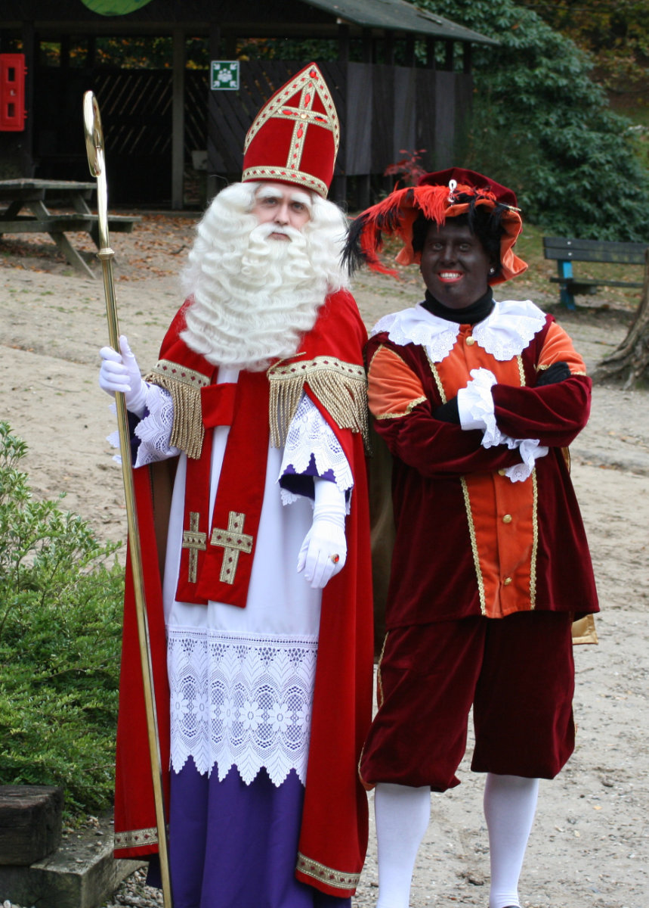
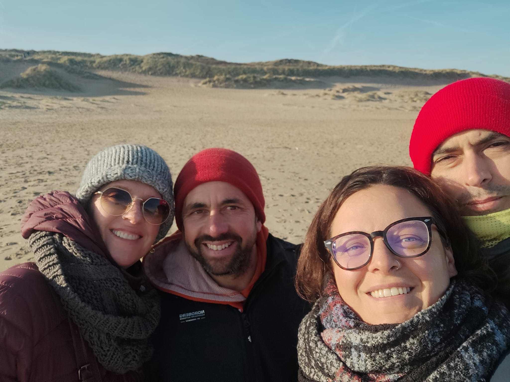
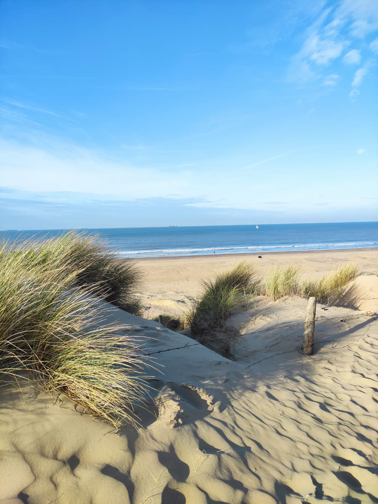
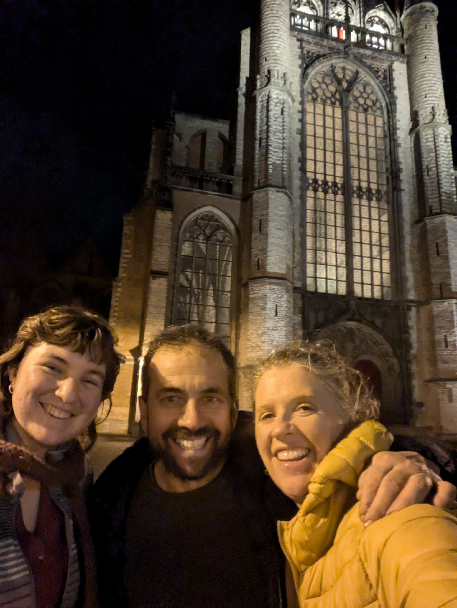

_Sinterclass e Black Pete_

A quasi un mese dall’ultimo post torno a scrivere sul blog. Chiedo scusa a tutti quelli che sono in attesa di notizie, l’unico motivo della lunga assenza e’ la mia letargia e mancanza di ispirazione a scrivere.\
Cerchero’ di far meglio.

L’autunno Olandese e’ stato rapidamente sostituito dall’Inverno, almeno credo che questo sia l’inverno. Piove spesso e anche quando c’e’ un po’ di sole non scalda per niente. Le temperature non sono bassissime, sempre sopra lo zero, anche se di poco. Piu’ o meno il clima che c’era a Milano, quando ci abitavo, anche se la differenza credo sia nella durata dell’Inverno Olandese. A Milano, verso fine Febbraio, cominciava ad arrivare qualche bella giornata, in cui il calore del sole si faceva sentire. Ricordo come da bambino bastasse una domenica di sole, passata a giocare al parco giochi in maglietta a maniche corte, per dare il benvenuto alla primavera con la sua energia esplosiva di odori di prati tagliati e alberi che cominciano a fiorire.\
In Olanda credo che quel momento arrivi un po’ piu’ avanti.\
Veniamo alle News.\
Il mio lavoro va alla grande. Settimana prossima finisco il primo mese.\
Con i miei colleghi mi trovo molto bene. Jost, il capo meccanico, un ragazzo di 25 anni gia’ espertissimo di biciclette, mi sta insegnando un sacco di cose. Poi c’e’ Cris, un diciottenne anche lui molto piu’ esperto di me nel settore, e Micha, un ragazzo di 15 anni che qualche giorno fa mi ha fatto sentire veramente vecchio. Stava chiacchierando con gli altri, ovviamente in Olandese, e gli stava facendo vedere una foto sul telefono. Mi sono avvicinato per vedere di cosa si trattasse. In pratica suo padre si trovava negli stati uniti per lavoro e, pescando su una spiaggia in florida aveva catturato un piccolo squalo. Mentre mi accingevo a guardare la foto immaginavo un boomer con barba e capelli bianchi, in posa con lo squaletto. L’immagine ritraeva invece un giovanotto sorridente di 38 anni, dieci anni piu giovane di me. Il papa’ del mio collega!\
Il proprietario, Koen, anche lui ha qualche anno in meno di me, ha quattro figli piccoli ed e’ molto dedicato a far crescere e migliorare la propria attivita’.
Non mi sono ancora abituato alla strana forma della mia settimana lavorativa. Sono di riposo la Domenica, il Lunedì ed il Mercoledì. Il Martedì e il Giovedi lavoro dalle 9 del mattino alle 9 di sera. Il Venerdì e il Sabato dalle 9 alle 18.\
Durante le lunghe giornate di lavoro, mentre aggiusto biciclette di ogni tipo, penso a come riuscire a raggranellare qualche euro in piu’ al mese. In questo primo anno di lavoro, siccome dovro’ pagare il corso, il mio stipendio resta abbastanza basso. Appena ne ricevo uno pieno vi faccio sapere la cifra. Comunque dovremmo essere intorno ai 2000€ netti al mese. Hilly dovrebbe guadagnare un po’ di piu’ ma, visto l’affitto stellare che ci tocca sborsare ogni mese, riusciamo a malapena a coprire le spese per vivere, che sono intorno ai 4500€ al mese.
Per integrare le entrate la cosa più semplice e’ quella di iniziare un'attività parallela di riparazione delle bici nella mia micro-officina. Potrei stampare un volantino da distribuire nelle caselle della posta del mio vicinato e vedere cosa succede. Per farlo pero’ dovrei aprire un’attivita’ ufficiale, in modo da poter acquistare i pezzi di ricambio a costo piu’ basso dai vari fornitori. Parliamo della meta’ o anche di un terzo del costo che si paga in un negozio o su internet.\
Aprire un'attività in Olanda dovrebbe essere abbastanza semplice e, a quanto ho capito, non dovrebbe presentare tutti i vincoli e i rischi che si hanno in Italia con l’apertura di una partita iva.\
Anche Hilly sta prendendo contatti per avere un secondo lavoro, nel mondo della promozione del vino. Come ho già scritto lei ha partecipato ad alcuni eventi in cui ha fatto assaggiare dei vini italiani e le e’ piaciuto molto.\
Hilly ha iniziato il lavoro per Johnson and Johnson una settimana fa. Il lavoro e’ molto tranquillo. Passa piu’ tempo a vestirsi, svestirsi, riempire fogli di excel e firmare moduli che a confezionare le protesi. Lavora insieme a colleghi di tutte le nazionalita’ possibili, alcuni nuovi come lei e altri gia’ li da diversi anni. Come avevo gia’ scritto il lavoro di Hilly si svolge su una settimana di sei giorni, due in cui lavora dalle 6.30 del mattino alle 14.30 e due dalle 14.30 alle 23. Poi due giorni di riposo. Quindi anche lei, stando spesso a casa durante la settimana, puo’ investire quel tempo nello sviluppo di una carriera alternativa.\
Un cosa molto positiva e’ che il suo posto di lavoro e’ a dieci minuti di bici da casa. \
Le ragazze hanno passato con voti altissimi gli esami di Novembre e da settimana prossima verranno spostate in classi differenti. Siamo andati a parlare con la coordinatrice di classe di entrambe e ci hanno assicurato che con questo anno finiranno la scuola internazionale e a Settembre inizieranno nella scuola olandese. Dalla settimana prossima dovranno quindi cambiare marcia visto che si troveranno in classi piu’ avanzate. Per tutta la seconda parte dell’anno faranno anche altre materie, oltre all’Ondese e alla matematica. Biologia, Geografia, Fisica e altro, ovviamente tutto in lingua Olandese.\
La gang di ragazzi arabi e’ sempre piu’ presente a casa nostra. Sono bravi ragazzi e ci fa piacere averli da noi. Spesso cucinano loro anche per me e Hilly. Abbiamo messo un po’ di limiti alla loro presenza comunque, cosicché possiamo anche avere dei momenti di tranquillità in casa, solo noi quattro, come ai vecchi tempi.\
Ieri sera abbiamo avuto Leith, il ragazzo di Gemma, a cena. Ci ha raccontato la sua storia di come all'età di 6 anni sia fuggito dalla Siria con la sua famiglia per andare in Turchia, dove sono stati trattati abbastanza male.Quando aveva tredici anni, tre anni fa, dalla turchia, insieme a suo fratello e ad un gruppetto di persone sono andati a piedi fino all’Austria. In Austria, per qualche motivo che non ho capito, si e’ dovuto separare da suo fratello ed e’ arrivato in Olanda da solo, grazie ad un passaggio automobilistico, dove gli e’ stato dato lo status di rifugiato politico, grazie al quale e’ poi riuscito a far arrivare i genitori e un altro fratello, che non era partito perche’ malato di diabete. Il fratello che e’ rimasto in Austria si trova ancora li e non puo’ venire in Olanda perche’ non avendo un visto Schengen potrebbe essere fermato alla frontiera che i Paesi Bassi hanno da poco ricostituito, proprio per fermare l’arrivo di migranti. Perché non sia venuto prima non l’ho capito. Leith non parla benissimo l’inglese, parla meglio l’Olandese, e spesso non capisco cosa dica. Comunque mi sembra un bravo ragazzo, molto motivato. Oltre alla scuola ha anche un paio di lavori e dice che appena compie diciotto anni vuole aprire il suo negozio di parrucchiere, uomo e donna, che vuole poi espandere in salone di bellezza. L’unica pecca è che si fuma due pacchetti di sigarette al giorno e purtroppo anche Gemma lo sta seguendo in questa brutta abitudine. La mia Gemmina!

Lo spirito natalizio e’ molto forte in Olanda e in giro si vedono un sacco di bellissime decorazioni. Qui la celebrazione piu’ sentita e’ pero’ quella di “Sinterklaas”, che culmina il 5 di Dicembre, giorno in cui “Sinterclass”, una via di mezzo tra babbo natale e un cardinale, in arrivo dalla Spagna, porta doni e dolciumi ai bambini, grazie all’aiuto di “Black Pete”, un ragazzino con la faccia dipinta di nero, che assomiglia ad uno schiavetto africano ma che oggi, per essere “politically correct” viene invece spiegato come un piccolo aiutante annerito dalla fuliggine dei camini attraverso i quali entra nelle case.
Il 5 di dicembre nella scuola di Sophia e Gemma e’ arrivato Sinterklaas e insieme a due “Black Pete”, che pero’ non si erano dipinti la faccia di nero (non sarebbero stati accolti molto bene nella loro scuola, conciati in quel modo), hanno portato dei cioccolati agli studenti.

Lo scorso week-end sono venuti a trovarci due nostri amici di Milano, Brunella e Matteo, e con loro abbiamo fatto un bel giro in bici verso l’Aia, passando lungo la spiaggia, in una giornata di sole ma bella fredda, per poi andare nella zona industriale dell’Aia, ad un mercatino di abbigliamento vintage e subito dopo in una bella birreria/fabbrica di birra, mentre fuori pioveva e noi dovevamo tornare a casa in bici. Per fortuna dopo un paio di birre e qualche piatto di leccornie da pub ha smesso di piovere e ci siamo goduti i 45 minuti di ritorno in bici attraverso le buie e fredde campagne olandesi.\
Qualche giorno prima ci aveva fatto visita anche Bea, la figlia dei nostri cari amici Australiani, Ken e Amy. Bea ha 18 anni ed ha fatto un viaggio di alcuni mesi attraverso diversi paesi europei. Alla fine del suo viaggio, siccome volava da Amsterdam, è stata a dormire una notte da noi e non potevamo non portarla a fare un giro in bicicletta nel centro di Leiden, che e' sempre affascinante, soprattutto durante il periodo natalizio.

_Con brunella e Matteo sulla spiaggia_

_La spiaggia di Wassenar, verso l'Aia_

_Venerdi sera verso Leiden_

_Insieme a Bea a Leiden_
