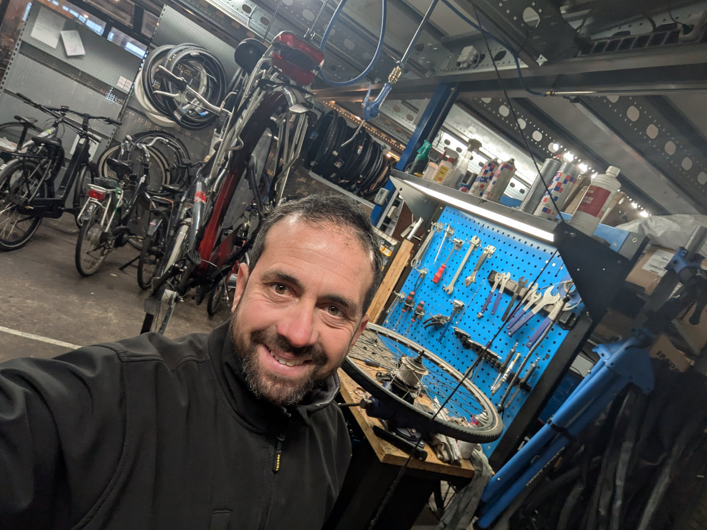
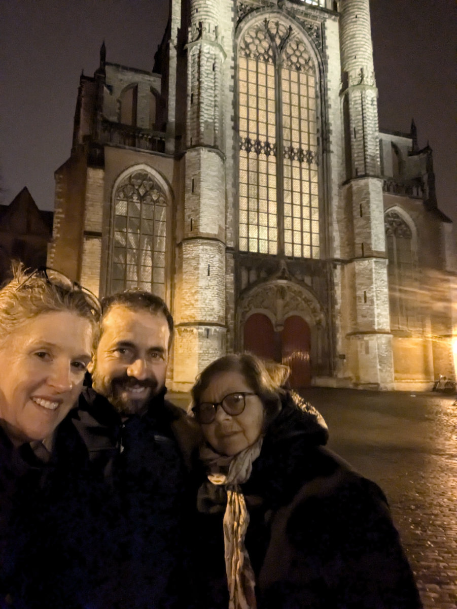
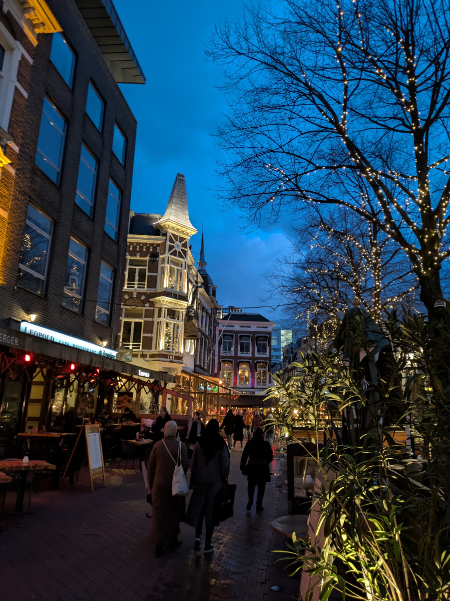
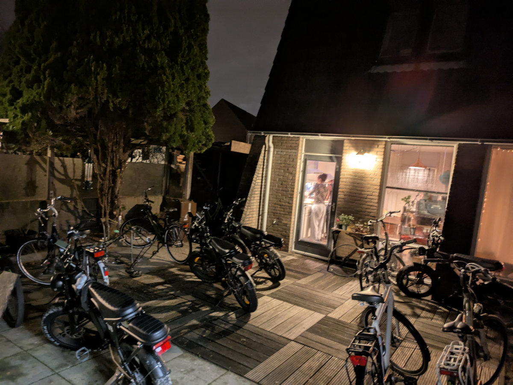
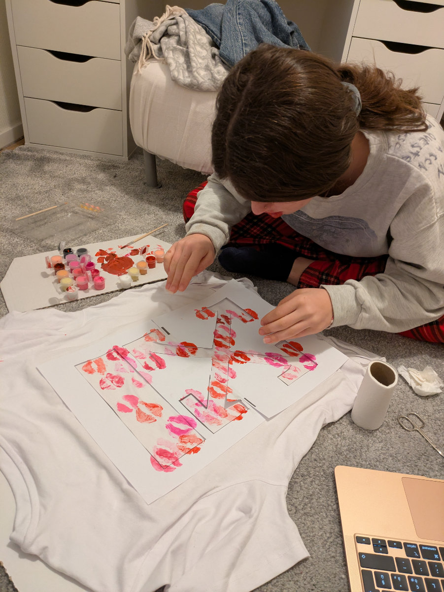
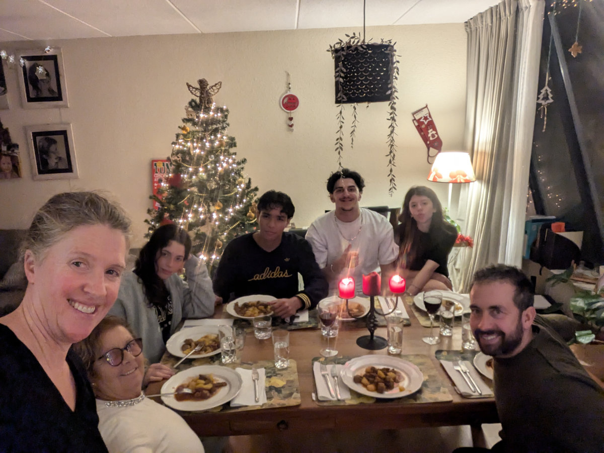
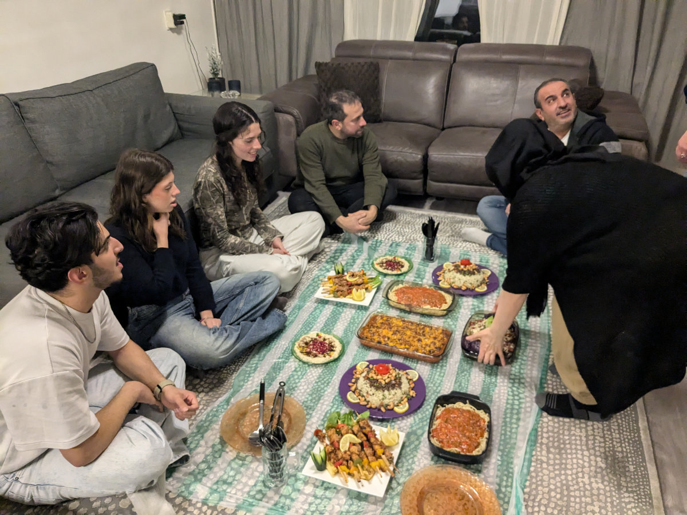

_Le targhe olandesi, ce le siamo sudate ma ne e' valsa la pena_

Per Natale e’ venuta a trovarci mia mamma. Doveva venire anche mio Papa’ ma poi, a causa dei suoi problemi di mobilita’, non se l’e’ piu’ sentita e quindi e’ rimasto in Sardegna. Alla fine e’ stato meglio cosi’ perche’ ci siamo resi conto che con le scale ripidissime che abbiamo in casa non sarebbe riuscito ad andare al piano di sopra. Avremmo potuto caricarlo come abbiamo fatto con la lavatrice, usando delle corde, ma non sarebbe stato facile.\
In primavera comunque conta di venire anche lui, magari staranno in un Hotel vicino a casa nostra.
Era la prima volta che mia mamma andava in un posto in Europa piu’ a nord della Svizzera.\
L’abbiamo portata anche un po’ in giro in bicicletta, nel freddo e nella pioggia, senza allontanarci troppo da casa, vista la sua età e la mancanza di esperienza nel muoversi in bici in contesti urbani.
Durante il periodo Natalizio io ho avuto due intere settimane di ferie, perché il negozio era chiuso. Anche Hilly ha fatto un sacco di giorni a casa.\
Devo dire che ricreare lo spirito natalizio e’ stato difficile visto che avevamo a casa ospiti musulmani, i ragazzi di Sophia e Gemma, e per loro erano giorni normali. Per fortuna Hilly si e’ impegnata molto ad addobbare la casa, mettendo lucine ovunque e tirando su l’albero di Natale più stiloso che abbia mai visto.\
E’ stato bello avere qui mia mamma. Ovviamente appena e’ arrivata si è impadronita della cucina e ha tentato di fare il meglio possibile con gli ingredienti disponibili nei supermercati. Non e’ stata un'impresa semplice e secondo me lei si e’ preoccupata un po’ per la nostra condizione di precarieta’ gastronomica tante’ che appena tornata in Sardegna ci ha subito preparato un grosso scatolone contenente generi alimentari di qualita’ che ci sta spedendo con Bartolini. Ah, se non ci fosse la mamma!

La cosa più particolare di questo natale e capodanno sono stati i fuochi d’artificio. L’Olanda ha un ossessione con i botti. Per tutto il mese di Dicembre e’ stato un continuo sparare, più ci avvicinavamo alla fine dell’anno e più ne aumentava la frequenza. Il 31 Dicembre, dal primo pomeriggio, non c’e’ stato un momento di silenzio. A mezzanotte eravamo a casa di amici e siamo usciti in strada per accendere i loro fuochi d’artificio. E’ stato epocale! Non sapevamo dove guardare. Da bambino ricordo che d’estate. verso ferragosto, in Sardegna, facevano uno spettacolo di fuochi d’artificio, che a me sembrava incredibile. Immaginate una cosa del genere ad ogni isolato, tra le casette olandesi, migliaia di spettacoli pirotecnici che illuminano il cielo.\
Sophia quella notte e’ andata ad Amsterdam con Farez, a Museumplein, dove eravamo anche l’anno scorso per partecipare al conto alla rovescia tra la folla festante. Gemma invece e’ andata a casa di amici a Leiden, con il suo fidanzato.

Una cosa che sarebbe dovuta avvenire durante il periodo natalizio ma che non si e’ concretizzata e’ il lavoro delle ragazze. Sophia ha provato a lavorare in un Hotel ma al secondo giorno, visto che non aveva ancora ufficializzato la sua presenza con un incontro con il manager, se n’e’ andata e non ci e’ piu’ tornata. Gemma invece aveva un colloquio a Dirk, un supermercato a 500 metri da casa nostra, ma all’ultimo momento ha deciso di non andare perché vuole invece fare la babysitter. Sta preparando dei volantini da distribuire fuori dalle numerose scuole materne e asili nido vicino a casa nostra.

Dal mese di Dicembre abbiamo cominciato a percepire due stipendi. In due prendiamo circa 4700€ netti al mese. In Italia un’entrata del genere non sarebbe male, ma qui, soprattutto a causa dell'affitto esorbitante, non e’ sostenibile. Infatti ci siamo messi alla ricerca di un’altra casa meno costosa. Magari piu’ piccola e senza un giardino ma che costi al massimo 1800€ al mese. Ora ne spendiamo 2200€.
Anche l’automobile e’ una spesa enorme. Solo di bollo ci costa 1500€ all’anno piu’ altre 1000€ di assicurazione, visto che siamo ripartiti dalla classe di merito più bassa.\
Quindi ogni mese ci tocca utilizzare un po’ dei nostri risparmi semplicemente per coprire le spese ordinarie. Fino a che non cominciamo a guadagnare un po’ di piu’ purtroppo la situazione è questa. Ma va bene cosi’.

Io al lavoro sono felicissimo. Aggiustare le bici mi diverte. Ogni bici e’ diversa e ha le sue particolarita’. Molto spesso per risolvere un problema bisogna inventarsi qualcosa e dare sfogo alla propria creatività utilizzando trapano, mola, lime, saldatrice e quant’altro. Anche nei giorni in cui faccio il turno da dodici ore, dalle 9 del mattino alle 9 di sera, il tempo vola. Le giornate sono scandite dalla musica anni ‘80 e ‘90 di “Joe”, una radio Olandese onnipresente nei posti di lavoro. A dicembre abbiamo messo un canale diverso dove facevano 100% musica natalizia. I primi giorni era bello ma dopo un po’ non ce l’abbiamo fatta più ad ascoltare sempre le stesse canzoni e allora siamo tornati su “Joe”.\
In negozio ho cominciato a servire qualche cliente, soprattutto quelli che non sono madrelingua Olandese e preferiscono parlare in Inglese. Il mio collega Christian, che l’Inglese lo parla peggio di come parli io l’Olandese, mi chiama ogni volta che non riesce a capire cosa gli venga detto dai clienti polacchi, che lavorano nelle serre vicino al negozio.

Nei mesi di Novembre e Dicembre non abbiamo quasi mai visto il sole. Non sta facendo tanto freddo, le temperature raramente scendono sotto lo zero. Io a lavoro in bici ci sto andando al massimo una volta alla settimana. Piu’ che altro per pigrizia ma anche dopo che il 21 Dicembre, l’ultimo giorno di lavoro prima della pausa natalizia, sono uscito dal negozio per provare una bici nuova, che avevo appena montato, e mentre testavo i freni ho fatto una brutta caduta e penso di essermi fratturato una costola. Ad oggi mi fa ancora male ma molto meno.\
Per fortuna la bici si e’ solo graffiata in un paio di punti, neri, che ho potuto riverniciare. Era una Riese & Muller da 7500€ e ho rischiato di fare un bel danno.\
Koen, il mio capo, e’ stato molto comprensivo e ha detto che sono cose che possono succedere.
Quello stesso giorno ero andato a lavoro in bici. Al ritorno mi sono fatto 21 km, per la maggior parte durante un acquazzone freddissimo, con il petto dolorante dalla caduta ma il morale alto, perché mi aspettavano due settimane di ferie natalizie.

Hilly trova il suo lavoro un po’ noioso e ripetitivo, ma è molto contenta degli orari che fa e del fatto che sia a dieci minuti da casa. Comunque si sta dando da fare per sviluppare una propria attività in parallelo al lavoro per Johnson and Johnson, che magari in futuro potrebbe rimpiazzarlo.

Da qualche settimana siamo riusciti a ottenere le targhe olandesi per la nostra auto. E’ stata l’impresa burocratica piu’ dura da quando ci siamo trasferiti. Una cosa che ho subito notato da quando guido senza le targhe italiane e' che la gente e’ molto piu’ tollerante con i miei errori. Guidare l’auto in Olanda e’ un po’ diverso rispetto all'Italia. Qui le corsie sono onnipresenti e spesso bisogna decidere con largo anticipo se si vuole svoltare e portarsi nella relativa corsia. Ogni tanto capita di accorgersene in ritardo e quindi ci si trova a mettere la freccia per infilarsi tra una colonna d’auto. Quando avevo le targhe italiane mi suonavano sempre il clacson e nello specchietto retrovisore vedevo delle facce rosse dalla rabbia e grande agitazione di diti medi. Da quando sfoggio le mie nuove, fiammanti targhe olandesi, nessuno mi ha più suonato. C'è un po’ di intolleranza verso gli stranieri e gli Italiani poi hanno la fama, giustamente guadagnata, di essere dei pessimi guidatori.

Qualche giorno fa siamo stati invitati a cena dai genitori di Leith, il ragazzo di Gemma. Ci sembrava un po’ presto, vista l’eta’ di Gemma, di incontrare i genitori del suo ragazzo, anche perche’ dalle parti del mondo da cui vengono loro spesso le ragazze vengono promesse in sposa gia’ da molto giovani. La cosa e’ stata voluta soprattutto dalla mamma di Leith, con lo scopo di formare amicizie qui in Olanda, visto che loro parlano a malapena l’Inglese e pochissimo anche l’Olandese. Visti gli ultimi accadimenti in Siria infatti il papa’ pensa, se le cose dovessero aggiustarsi veramente, di tornare al suo paese, dove era un avvocato di successo, prima dell’inizio della guerra. La mamma invece vorrebbe restare qui, e così anche i figli.\
La cena e’ stata fantastica e abbiamo mangiato piatti della tradizione Siriana cucinati tutti dalla mamma di Leith. Le comunicazioni sono state un po’ difficili ma alla fine, sulle cose importanti, ci capivamo.

_A lavoro sono felice_

_Con mia mamma davanti ad una chiesa a Leiden_

_Le vie dello shopping natalizio_

_Uno dei ritrovi di amici delle ragazze a casa nostra_

_Il nostro giardinetto quando la gang si ritrova a casa nostra_

_Gemma prepara il regalo di Natale per Leith_

_Cena a casa durante le feste_

_Sophia e Farez alla pianola_

_La squisita cena Siriana_
