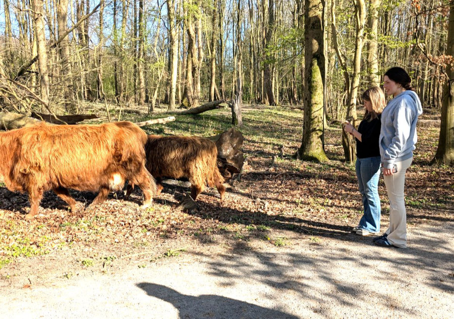

_Papaveri e amore_

Ciao a tutti voi, amici, dopo diversi mesi torno ancora a scrivere su questo blog.
Il motivo per cui non ho postato nulla, per così tanto tempo, e’ semplicemente, ahime’, per pigrizia e mancanza di ispirazione.\
Intanto, tra una pedalata e l’altra e’ passato un anno.\
Esattamente un anno fa, il 4 giugno 2024, io e Sophia arrivavamo in Olanda.
Ricordo ancora l’eccitazione della novita’, il forte senso di avventura e imprevedibilita’ che accompagnava le nostre giornate. Avevamo di fronte tutta l’estate, a caccia di una casa e di un lavoro, in casa di altre persone, in compagnia dei loro amati compagni pelosoni.\
Quest’estate si prospetta piu’ stabile e tranquilla.

Passiamo a qualche aggiornamento.\
Io proseguo con il mio lavoro da meccanico di biciclette a Moerkapelle. Nel frattempo però mi sono impegnato anche a sviluppare del software interno al negozio. Sto passando la maggior parte del mio tempo libero a scrivere codice o meglio, a dare istruzioni dettagliate all’intelligenza artificiale sul codice da scrivere.  Il progetto e’ quasi finito e presto inizieremo ad usarlo. E’ incredibile quanto siano cambiate le cose, nel mondo dello sviluppo web, negli ultimi 6 mesi.
Sono riuscito a fare il lavoro di un piccolo team, da solo e in un tempo inferiore.\
Ho trovato la giusta dimensione nell’alternanza del lavoro pratico in officina e intellettuale al computer.
Nei prossimi giorni finiro’ un corso di Olandese di 14 settimane, presso una scuola di Harlem, che mi e’ stato finanziato dal sindacato dei lavoratori dell’industria dei trasporti. Non e’ stato molto intenso, si e’ trattato solo di una sera alla settimana, ma mi ha spinto a fare più esercizi a casa e a parlare un po' di Olandese, in un piccolo gruppo.\
Purtroppo a lavoro parliamo sempre Inglese. Ogni giorno faccio degli sforzi per spiccicare qualche frase in Olandese, con il mio collega, Christian, che parla poco Inglese, ma i miei risultati sono un po’ patetici e sto facendo piu’ difficolta’ di quanto avessi previsto. La lingua Olandese e’ abbastanza complessa, soprattutto nella costruzione della frase, dove si discosta parecchio dall’Inglese e dall’Italiano.\
Nella lettura e nella comprensione sono avanzato parecchio invece, tanto che mi sembra di aver sviluppato dei super poteri quando capisco tutto quello che Hilly e le ragazze si dicono in Afrikaans.

Hilly continua a lavorare per Johnson and Johnson. Nelle ultime due settimane ha iniziato un training per andare a svolgere una mansione più complicata e da qualche giorno lavora in un nuovo reparto.\
Oltre a quello ha anche trovato un secondo lavoro, in un negozio/caffetteria, che vende prodotti alimentari Sudafricani. Cucinano e spediscono carne secca e altre pietanze tipiche in tutta l’Olanda per aiutare i Sudafricani espatriati a sentire meno la mancanza della loro terra.\
Da subito i proprietari si sono offerti di assumerla a tempo pieno ma viste le condizioni salariali di molto inferiori rispetto a J&J lei ha preferito accettare di fare solo una giornata e mezza al negozio.\
Rimastagli qualche ora libera alla settimana, tra i due impegni di lavoro, l’instancabile Hilly, collabora con un’associazione di quartiere che aiuta gli anziani e le persone disabili. Vanno in piccoli gruppetti a sistemare il giardino di queste persone oppure, da sola, aiuta gli anziani che fanno fatica con lo smartphone. Contrariamente a me, che me ne sbatto altamente del prossimo e posso vivere una vita completamente incentrata su me stesso e sui miei familiari più intimi, Hilly ha bisogno di dare indietro qualcosa, incondizionatamente, anche a costo di fare molti sacrifici. Che brutta persona!

Le ragazze si sono iscritte alla scuola Olandese. Fra un mese finiranno la loro avventura tra i rifugiati e, dopo un po’ di vacanza, entreranno in due scuole diverse, anche se molto vicine una all’altra.\
Sophia fino a qualche mese fa’ era un po’ demoralizzata perche’ a scuola, i professori, le dicevano che vista la sua eta’, ed il suo livello di Olandese, si sarebbe solo potuta iscrivere a quello che nel sistema scolastico olandese e  chiamato “Mavo”. Nel suo caso si sarebbe trattato di un corso di 4 anni, indirizzato al lavoro, per formarla come “Middenkaderfunctionaris Bouw”, in Inlgese “Middle management construction officer” in Italiano… Boh?!\
Capirete che per lei, gia’ proiettata verso la facolta’ di Architettura, la situazione era un po’ scoraggiante.\
A quel punto eravamo gia’ andati a parlare con una sua tutor, a scuola, che ci aveva detto le stesse cose, ovvero che non c’era modo di farla entrare in altre scuole piu’ accademiche, purtroppo, e che comunque dopo il MAVO poteva andare all’universita’.\
Decidemmo così di scrivere una lettera ad alcuni istituti di Leiden, spiegando bene la situazione, con la speranza che qualcuno avesse accolto Sophia in barba allo status quo.
In breve ricevemmo delle risposte positive e ora Sophia è iscritta ad un HAVO, presso una scuola famosa per le sue capacità di valorizzare gli studenti motivati. L'obiettivo di Sophia è di essere poi spostata nelle classi VWO, piu’ simili al Liceo italiano. Ora e’ felicissima.\
Per Gemma la situazione e’ stata piu’ semplice, vista la sua eta’.\
La scuola di Gemma assomiglia a quella di Harry Potter. Lei e’ un po’ preoccupata perché non si sente ancora molto sicura nel parlare l’Olandese, e, nella prossima scuola quella sara’ la lingua parlata anche tra i compagni. Al momento infatti di Olandese ne parla poco ma quando sara’ obbligata a farlo quotidianamente fara’ sicuramente dei progressi molto veloci.
A scuola Gemma avra’ tutte le materie di base ed in piu’ lei ha scelto di concentrarsi sulla Psicologia e sull’Economia.

Per rispettare la tradizione Olandese entrambe hanno cominciato a lavorare.
Sophia lavora in una gelateria vicino a casa e, nel week end, in un ristorante Spagnolo nel centro di Leiden. Fa molte ore alla settimana, visto che al momento a scuola non sono cosi’ impegnate, ma con l’inizio della nuova scuola, a metà Agosto, lavorera’ di meno.\
Gemma lavora in un supermercato, a riempire gli scaffali, solo nel week end.\
Gemma si e’ lasciata con Leith, e ora non si salutano piu’, e si e’ subito messa insieme a Haytham (credo si scriva in modo diverso), un ragazzo yemenita di 19 anni che studia e lavora in uno studio dentistico. Non ci si annoia mai con Gemma!
Sophia e’ sempre insieme a Farez, anche se adesso si vedono di meno perche’ lei lavora molto e anche lui ha iniziato a lavorare in un pancake cafe’.

L’Olanda ci sta trattando molto bene.\
La primavera e’ stata fantastica. Ha fatto diverse settimane senza che cadesse una goccia d’acqua. Il cielo sempre azzurro, le giornate sempre più lunghe, fiori dovunque e tante, tante biciclette.\
A metà Aprile sono fioriti i tulipani. Una meraviglia indescrivibile.
Con Hilly siamo andati in bicicletta, da casa, nella zona famosa in tutta l’Olanda per i campi di fiori.
Da casa nostra ci si arriva in una quarantina di minuti di bici.
Consiglio a chiunque di venire qua in quel periodo. Ettari ed ettari di colori saturatissimi e profumi idilliaci.

Siamo ancora nella prima casa, quella dal costo proibitivo. Nonostante ogni giorno guardi i siti di annunci e risponda ad alcuni di questi annunci ogni settimana, non riusciamo a trovare un alternativa più economica.\
Il punto e’ che le alternative ci sarebbero ma si presentano centinaia di persone ad ogni annuncio e quindi vengono scelti i candidati con gli stipendi più alti, con meno figli o con situazioni lavorative più stabili.\
In qualche modo tiriamo avanti ma il bonifico di 2200€ ogni primo del mese brucia parecchio.
I prezzi delle case in vendita sono cresciuti in media del 10% rispetto all’anno scorso.
Comprare una casa e’ diventato impossibile a meno che non si abbiamo già diversi soldi accantonati o non si riceva l’aiuto dei genitori. Ma penso che la situazione sia simile in tutte le zone piu’ sviluppate dell’Europa.

A fine Luglio Sophia e Gemma andranno in italia per due settimane. Una settimana in Sardegna, dai miei genitori, ed una in Toscana, a Montaione, dai loro amici, a sfoggiare l’abbronzatura sarda, anche se una settimana al mare e’ molto poco.\
Io e Hilly faremo, sempre in quel periodo, un settimana di vacanza in bicicletta. Per spendere il meno possibile partiremo da casa, verso il Nord dell’Olanda, e magari oltre, e dormiremo nei campeggi. Per molti e molte sarebbe un incubo ma per me, e anche per Hilly, uno dei migliori modi di viaggiare.\
Quest’anno infatti facciamo 20 anni di matrimonio e, in quell’estate di 20 anni fa, a inizio Agosto, partimmo in sella da Milano, in direzione Pula, Sardegna, per fare un mese di vacanza in bicicletta. Anche se Hilly in alcuni momenti, soprattutto nei sali scendi tra Bosa e Alghero, voleva gia’ chiedere il divorzio, ci divertimmo tantissimo.

Per ora e’ tutto, cari amici dall’Italia, dal Sudafrica, dagli Stati Uniti, dall’Australia, dall’Inghilterra e dalla Germania. Un saluto a tutti voi, un invito a venire a trovarci (molti lo faranno già quest’estate) e un ringraziamento per leggere questo blog.
A presto.

_Un mare di rosso_

_Fuori da questo vivaio avevano decine di varieta' di papaveri_

_Vicino a casa nostra. La cura per il verde urbano, in Olanda, e' pazzesca_

_Il giorno del compleanno del re. Una specie di S.Patricks day Olandese_

_Un'altro motivo per venire in Olanda in primavera. Decine di neo-famiglie di anatre e cigni ovunque_

_Il 27 Marzo, abbiamo festeggiato il ventesimo anniversario di matrimonio a Bruges_

_Animali che si incontrano nei parchi Olandesi_

_Gemma e Hilly hanno lavorato per il cafe Sudafricano ad un evento ad Amsterdam_

_Che coppia questi due_

_Il primo caffe' a lavoro, ogni mattina, e' il migliore_
