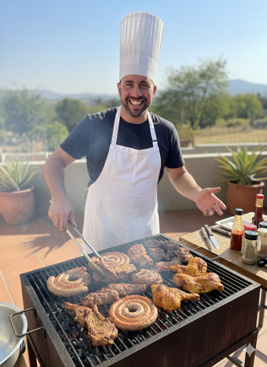
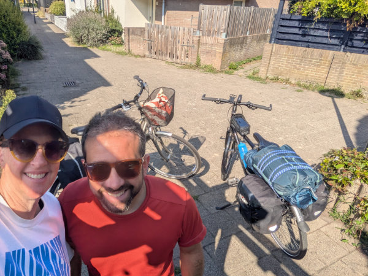
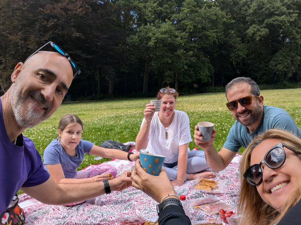
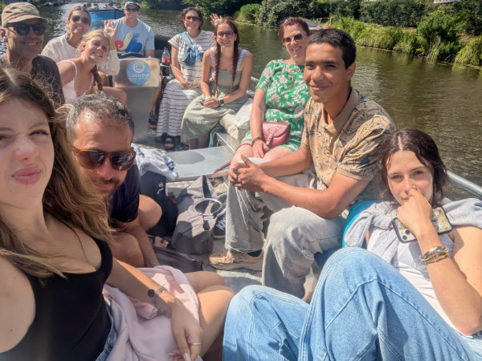
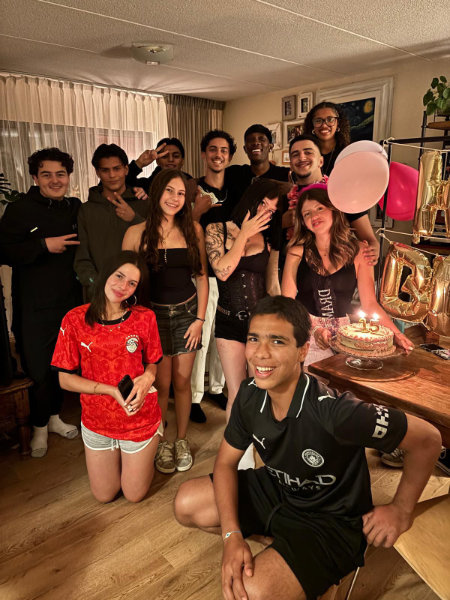
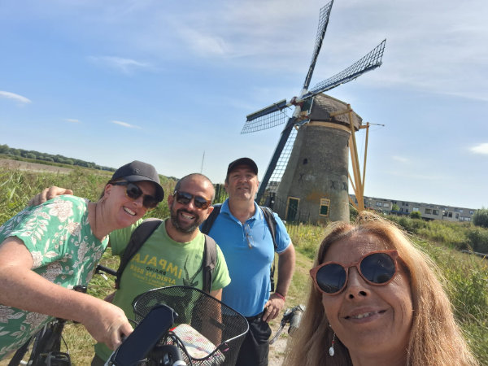
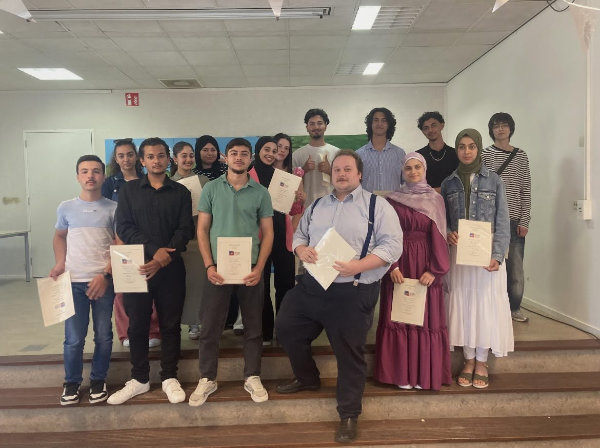

Carissimi amici e amiche, nonostante i miei post abbiano ormai cadenza trimestrale qui, in casa Cassetta, sono successe un miliardo di cose.

Le ragazze hanno iniziato la scuola Olandese, il 2 Settembre, ed è tutta un'altra storia rispetto alla classe internazionale dell’anno scorso.\
Le lezioni sono cominciate già a pieno regime dal secondo giorno. Lo dico più che altro per i lettori italiani.\
Nella mia esperienza scolastica di 30 anni fa ma anche in quella delle ragazze, in Toscana, nei primi giorni/settimane regnava il caos. Orari provvisori, insegnanti assenti, aule non ancora assegnate. Ogni anno come fosse la prima volta.

Sia Gemma che Sophia sono molto contente della propria classe e gli sembra strano che quasi il cento per cento degli alunni sia nato in Olanda.Nella prima settimana, entrambe, anche se vanno a scuole diverse, sono andate a fare una gita.\
Non me ne vogliano gli amici Italiani, però anche qui mi sento di voler far notare la differenza. Dalla scuola, ognuno con la propria bici, sono andati a Katwijk, a una decina di chilometri di distanza, dove hanno fatto una giornata di “team building” in un parco avventura. Ve lo immaginate in Italia organizzare una cosa del genere? Science fiction!

Questa fase iniziale e’ molto delicata per entrambe perché solo ora si trovano ad affrontare intere giornate di studi tutte in Olandese. Gemma poi fa anche Tedesco e Francese, tra le altre materie. Pensate che  c'è un giorno della settimana in cui si trova a fare due ore di Inglese, due ore di Francese e due ore di Tedesco. Tutto spiegato in Olandese ovviamente. Roba da corto circuito neuronale!

Anche Sophia si sente un bel po’ sotto stress, per il cambio di marcia, speriamo si abituino presto.

Dal punto di vista sentimentale Sophia e’ ancora insieme a Farez, ma si vedono di meno, visto che ora vanno a scuole diverse e Farez ha cominciato a lavorare in due ristoranti, uno Italiano e uno Indiano.\
Sophia invece, appena finita l’estate, ha mollato il ristorante spagnolo e ora lavora solo in gelateria.

Gemma e Leith si sono lasciati per la terza volta. No comment!

L’instancabile Hilly prosegue con il lavoro da Johnson and Johnson e con quello al cafe’ sudafricano.\
Va anche regolarmente da una signora anziana che abita qui vicino a giocare a Rummikub, per farle un po’ di compagnia. Per chi non lo conoscesse il Rummikub e’ un gioco da tavolo che si fa’ con un set di tessere numerate, abbastanza popolare in Olanda.

Comunque la vedo molto felice e positiva. Hilly, non la signora anziana.

Nel mese di Agosto le ragazze sono andate in Sardegna per 3 settimane.\
Io e Hilly siamo rimasti a casa tutto il tempo se non per una breve fuga di 4 giorni, in cui abbiamo caricato sulle bici la tenda, i sacchi a pelo e i materassini, e siamo partiti per fare  un giro della zona.

La pedalata, di circa 350 km, mi e’ servita come meditazione sul prossimo futuro e, proprio in quella settimana ho maturato la decisione che era giunto il momento di trovare un lavoro un po’ piu’ appagante, soprattutto dal punto di vista dello stipendio ma anche da quello delle prospettive future.

Mi sono dato un occhiata intorno e ho deciso di trovare lavoro come chef in qualche ristorante non troppo lontano.\
Dopo aver mandato qualche curriculum sono subito stato chiamato.

Una decina di giorni fa ho fatto un turno di prova, come sous chef, in un ristorante di “fine dining” francese, in centro all’Aia. Il ristorante si chiama “Villa Coucou” ( <https://www.villacoucou.com/> ), non è aperto da molto e quest’anno punta a ottenere una stella Michelin.

Lo chef e’ un cagliaritano fidanzato con una ragazza Sudafricana. Siamo andati subito d’accordo.\
Il posto e’ veramente da sogno e il team che lavora in cucina molto accogliente e simpatico.

La serata di prova e’ stata abbastanza spiazzante per me. Mi sono trovato completamente al di fuori della mia comfort zone. Ho visto ingredienti, preparazioni e tecniche di cui non immaginavo neanche l’esistenza. Nonostante lo shock iniziale l’idea mi ha subito coinvolto e affascinato e mi sono sentito pronto ad accettare la sfida.\
Mi hanno offerto un contratto per iniziare al più presto possibile e l’avrei accettato ma … c'è stato un colpo di scena.

Un’altro annuncio a cui avevo mandato il curriculum riguardava un ristorante Sudafricano ( un tema ricorrente ), anche loro cercavano un sous chef.
Qualche giorno dopo aver fatto la prova a Villa Coucou sono stato contattato dal manager di Paarl, il ristorante sudafricano, per darmi appuntamento per un colloquio. Visto che era il mio giorno di riposo dal negozio di bici ho subito preso l’auto e ho fatto i dodici minuti di strada per andare a Sassenheim e incontrare Roger Rassin, chef stellato e ora “executive chef” dell’hotel Van Der Valk, presso cui si trova il ristorante Paarl (https://restaurantpaarl.nl/ ).

Il colloquio e’ durato un'ora e Roger mi ha fatto fare un tour delle cucine dell’Hotel e poi del ristorante Paarl, che si trova a fianco all’hotel.

Ho deciso di accettare quest’offerta e sabato 27 Settembre farò un turno di prova per poi iniziare a lavorare dai primi di ottobre. Anche se non ho ancora firmato il contratto vero e proprio, ma solo una bozza preventiva, sono abbastanza fiducioso che diventero’ il sous chef di Paarl. Incrociamo le dita!

Ad ogni modo al negozio di bici ho già dato le dimissioni. Per Koen, il proprietario, e’ stato come un fulmine a ciel sereno. Ai primi di ottobre mi avrebbe assunto con un contratto a tempo indeterminato e credo non si aspettasse questa mia scelta.

Mi sono trovato molto bene a lavorare nel suo negozio, con tutto il team, soprattutto con Joost, con cui certamente continuero’ a frequentarmi.

Lavorare con le bici e’ stato fantastico e non mi sono mai annoiato un momento. Ho imparato un sacco di cose. Anche le lunghe giornate del turno da 12 ore volavano allegramente.\
Mi mancherà anche la settimana di 4 giorni lavorativi. Al ristorante lavorerò 38 ore alla settimana, ma distribuite su 5 giorni.

Ci sono un sacco di cose di cui non riesco a parlare in questo post ma rimediero’ presto.

Credo che ora riuscirò a scrivere un po’ di più visto che ho da poco semplificato il modo in cui gestisco il blog. Ho implementato un interfaccia di amministrazione in cui posso scrivere il post e fare l'upload delle foto senza dover smanettare con il codice ogni volta e dover impiegare due ore solo per mettere il nuovo post online. Roba che si fa dagli anni 90 ma io ci sono arrivato solo ora!

Quindi, amici e amiche, a presto!

