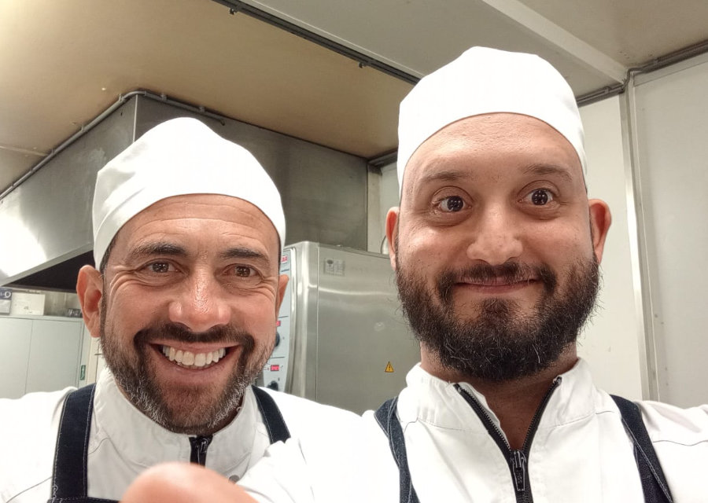
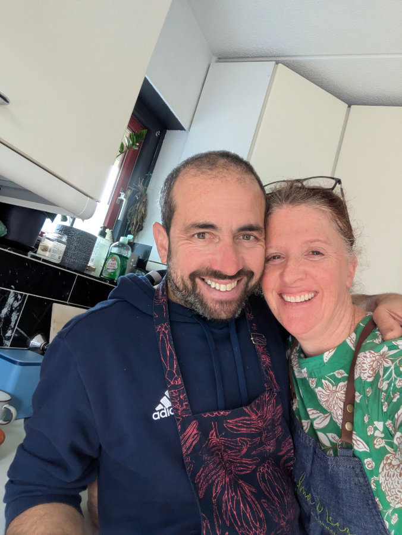

_Io e Luigi in cucina_

Le cose vanno a gonfie vele al ristorante Sudafricano.\
Un bel cambiamento dal lavoro precedente, dove passavo le giornate ad aggiustare bici e a discutere di tutto con Joost, un formidabile compagno di chiacchierate e una fonte inesauribile di conoscenze tecniche sulla meccanica e l’elettronica dei veicoli a due ruote.
Ora il lavoro è senza dubbio più frenetico e faticoso ma allo stesso tempo stimolante, affascinante e appagante.\
Luigi mi ha insegnato tutto quello che c’era da sapere sul menu’ attuale che pero’ cambiera’ presto, il 23 di questo mese. Roger, lo chef esecutivo dell’Hotel mi ha chiesto di dare un’occhiata a quello che hanno creato loro e eventualmente proporre delle modifiche o cambiare completamente dei piatti.

L'altro ieri sia io che Hilly eravamo di riposo e ci siamo messi a fare un po di esperimenti. Uno di questi e’ un dessert, che non e’ venuto niente male devo dire, anche se lo dobbiamo perfezionare. Si tratta di una panna cotta servita in un bicchierino trasparente, con sopra una gelatina di Rooibos tea aromatizzato alla cannella e ginger, e un frutto candito, probabilmente una fettina d’arancia o mandarino candito, oppure ananas, per avere piu’ contrasto di colore con il rosso del Rooibos.\
Comunque l’idea e’ piaciuta a Roger e comunque prima di uscire con il nuovo menù, io e Luigi prepareremo una degustazione di tutti i piatti per il proprietario, Mark, e anche per Roger.\
A febbraio poi cambieremo completamente il menu’, e quello dovro’ farlo tutto io da solo, anche se posso riprendere piatti gia’ fatti in passato, magari facendo qualche piccola modifica.\
Ovviamente non ce la potrei mai fare senza l’aiuto di mia moglie e della famiglia in sudafrica, che mi continua ad incoraggiare e a darmi un sacco di informazioni e consigli essenziali.

_Giornata di esperimenti culinari con Hilly_

Siamo sempre alla ricerca di un’altra abitazione. Contavo di essere già fuori da questa casa da un pezzo ma trovare un'alternativa si sta dimostrando difficilissimo.\
Ogni giorno consulto diversi siti e di tanto in tanto trovo qualcosa che potrebbe andarci bene, ovvero che abbia 3 camere da letto, anche se piccolissime non importa, e non troppo distante da Leiden. Mando subito una mail, con tutti i nostri dati, quanto guadagnamo, che tipi di lavoro facciamo etc. ma non riesco mai neppure ad avere un appuntamento per andare a visitare l'appartamento.\
Settimana scorsa, per la prima volta sono riuscito a fissare una visita.\
Venerdì mattina, alle 9.00 io e Hilly andremo a vedere una casa a Voorschoten, una cittadina poco distante da Leiden, 25 minuti di bici dal centro, in direzione l’Aia.\
La casa non sembra niente male, anzi sembra troppo bella per costare solo 1700€ al mese (vi ricordo che ora noi ne paghiamo 2200€). Sono gia’ andato qualche mattinata fa a vederla da fuori e i motivi per cui credo costi cosi’ poco sono perché confina con il parcheggio di un supermercato (quindi continuo via vai di automobili, oltre la siepe del giardino) e perché e’ in classe di efficienza energetica G, la piu’ bassa.\
Noi nonostante tutto la prenderemmo lo stesso, ma non credo abbiamo tante speranze visto che su Funda (il maggior sito di case in vendita e affitto in Olanda ) le e’ stato dato da poco lo stato “under option” che significa che e’ stato trovato un possibile locatario e che si sta svolgendo una trattativa tra le parti.\
Comunque io e Hilly domani mattina all’appuntamento con l’agenzia ci andiamo, poi si vedra’.

Questa settimana Gemma sta facendo un sacco di esami a scuola ed e’ piuttosto sotto stress.\
In Olanda, diversamente dall’Italia, non esistono le interrogazioni orali ma solo test scritti, che vengono fatti tutti nell’arco di una settimana, in diversi periodi dell’anno, di solito 2 o 3.\
Dopo questa settimana pero’ andrà a fare 5 giorni di stage nella scuola dove era prima, come assistente. Poteva andare in tanti altri posti a fare lo stage, che non siano state scuole, ha scelto lei di andare lì perchè le manca quell’ambiente, gli amici e gli insegnanti.\
Anche Sophia ricorda spesso di come era bello andare all’ISK ( la scuola internazionale statale ) e le piacerebbe tornare indietro. Ieri sera a tavola si lamentava anche lei di come sia ingiustamente stressante la scuola, in generale, e di come poi portera’ a dover andare a fare un lavoro, e anche quello poi sara’ stressante e allora che senso ha tutto cio’?\
Ho cercato di spiegarle che tanto tempo fa ci svegliavamo al mattino e dovevamo andare a procurarci il cibo sperando di non essere divorati da animali feroci e quel poco che trovavamo dovevamo riportarlo al villaggio per sfamare i nostri familiari, sperando di trovarli ancora vivi. Anche quello, anche se in un modo diverso era stressante. Questa è la condizione umana.\
 Ma tornando al presente, se facciamo un po’ ogni giorno, con costanza e passione, cercando di dare il meglio ma senza essere vittime dell’ansia di fallire, allora un po' di senso cominciamo a trovarlo e lo stress diventa gestibile.\
Non so se Sophia mi ha capito.
