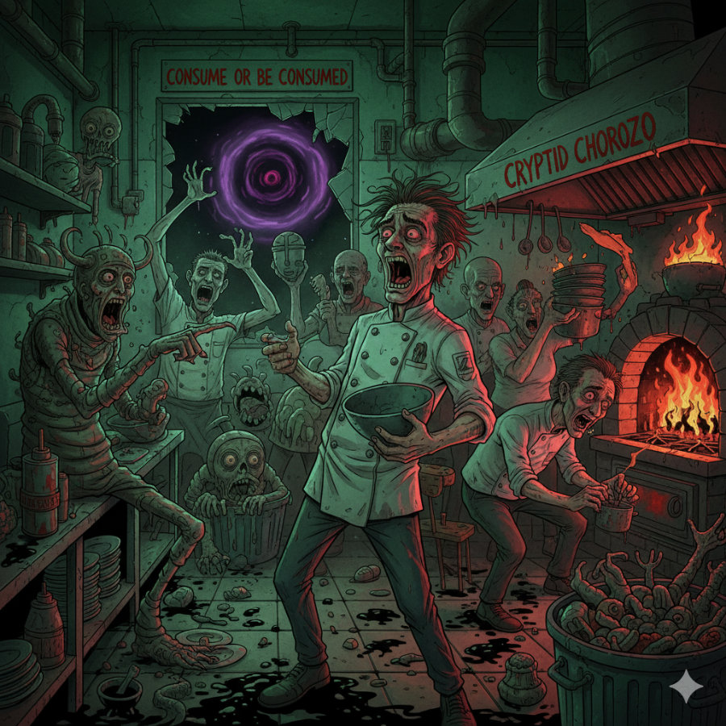
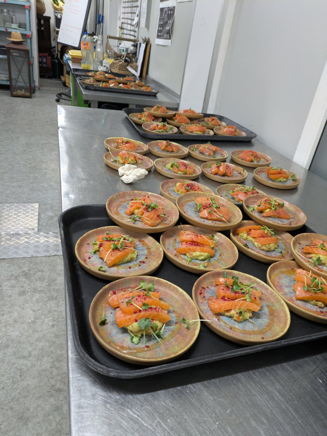
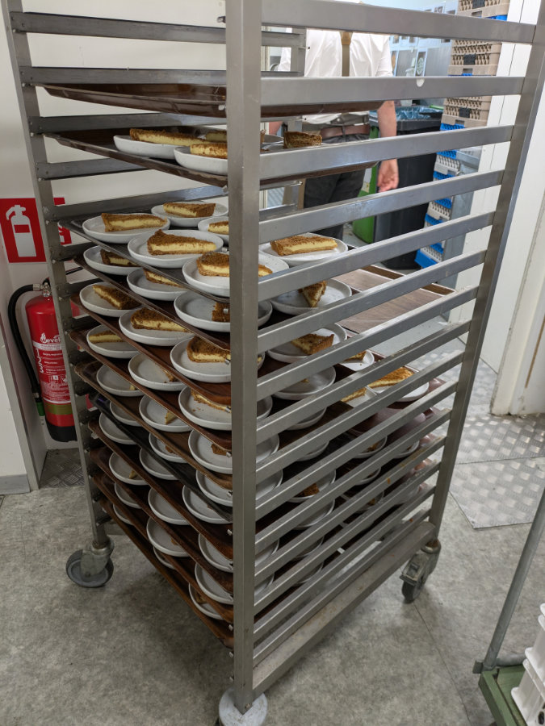

_Un po' un esagerzione, ovviamente_

Eravamo rimasti che avevo iniziato questa nuova avventura diventando chef al ristorante sudafricano Paarl, presso l’hotel Van der Valk di Sassenheim. La luna di miele e’ durata pochi giorni, seguita subito da una bella doccia fredda con imminente divorzio. Mi spiego.\
Da subito ho notato la bassa qualita’ dei piatti che serviamo e, conscio del fatto che avremmo cambiato menu’ presto, mi rassicuravo pensando di poter migliorare le cose e mettere un po’ di orgoglio in quello che facevo.\
Mi sabagliavo.

Il ristorante e’ gestito dal figlio del proprietario dell’Hotel, a sua volta figlio dei proprietari di tutti gli hotel Van Der Valk, la più grande catena di ospitalità in Olanda, tra alberghi, ristoranti e supermercati. Sono una delle famiglie piu’ ricche dei paesi bassi.\
Nonostante ciò, Mark, il gestore di Paarl, non e’ un ventiquattrenne, arrogante, figlio di miliardari, ma uno che lavora duro e si sporca le mani, in questo mi ha veramente meravigliato. Il problema e’ intrinseco alla filosofia di base dell’Hotel, ovvero ridurre i costi al minimo tenendo un'efficienza molto elevata e dei prezzi alla clientela modesti. In cucina questo si traduce in: largo utilizzo di ingredienti processati industrialmente, predilezione della quantità alla qualita’ e impiego di una sacco di studenti come personale di servizio.\
Mi sono ritrovato a dover far uscire dei piatti di cui un po’ mi vergogno e questo, da Italiano, e’ una continua pugnalata al cuore. Il fatto di avere così tanti ventenni alla prima esperienza in cucina, significa che non hanno termini di paragone con altri modi di intendere la ristorazione e, visto il fatto che siano tutti olandesi, peggiora il problema.\
L’Olanda e’, per quanto ne sappia, il posto con la peggiore cultura culinaria al mondo. Per gli olandesi, i pasti quotidiani sono un fatto puramente logistico. Il loro approccio al cibo e’ utilitaristico. Mangiare il più possibile con la spesa minore e nel tempo minore.\
Gli Inglesi ad esempio, anche loro (a mio avviso ingiustamente) famosi per la cattiva cucina, sono molto piu’ in grado di apprezzare il buon cibo, tra una bevuta e l’altra.\
Ovviamente queste sono generalizzazioni, credo da qualche parte esista un Olandese dal palato raffinato, però si nasconde molto bene perché io non l’ho ancora incontrato.\
Il motivo della grande delusione non e’ pero’ solo colpa della filosofia dell’Hotel ma anche colpa mia.\
In passato ho lavorato in un paio di cucine a New York, alla fine degli anni novanta, quando ero discepolo di Sri Chinmoy, in una situazione completamente fuori dalla realta’, dove l’approccio al lavoro era in diretta relazione agli obiettivi spirituali. I ristoranti erano di proprieta’ di altri adepti, tutto il personale era composto da discepoli, meditavamo prima e dopo il servizio e tutti lavoravano con tranquillita’, pace e consapevolezza. Questo era possibile perché la maggior parte di noi non prendeva neanche uno stipendio ma solo vitto e alloggio, tanto quello che contava era la realizzazione di sé e compiacere il maestro.

Nei primi anni duemila poi ho lavorato a stretto contatto con le cucine in Inghilterra, facendo panini e piatti freddi, lavorando al bancone di un pub oppure facendo il cameriere, quindi senza mai sperimentare veramente il vero lavoro in cucina.\
Poi quindici anni alla civettaia, dove mi gestivo io la cucina per servire al massimo una dozzina di ospiti. Compravo tutti gli ingredienti, di altissima qualita’, a loro spese e avevo tutto il tempo di lavorare con pace e tranquillita’. E al di fuori dell’ampia vetrata della cucina un paesaggio fantastico e il cinguettio degli uccelli.\
Non avendo mai guardato programmi come Masterchef o serie tv sul mondo dei ristoranti, non ho avuto neanche quel genere di esposizione, nonostante sia comunque falsata dalle esigenze televisive.\
La mia idealizzazione del mestiere dello chef ha dovuto fare i conti in fretta con la dura realtà di quello che succede dietro ai fornelli di un ristorante. Il caos che si genera dal momento in cui arrivano i primi ordini fino alla fine del servizio è divertente due o tre volte, poi diventa stressante e in fretta si trasforma in un incubo, che non ti fa dormire la notte.\
Mi e’ capitato diverse volte di svegliarmi, nel cuore della notte, in preda ad un incubo del tipo e’ finito un ingrediente importantissimo e non si sa piu’ come fare e tutti ti guardano perche’ sei tu lo chef, e devi trovare subito una soluzione. Poi non riuscire più ad addormentarmi perche’ il cervello, in modo incontrollabile sta gia’ organizzando la “mise en place” del giorno dopo. Anni di meditazione e tecniche di concentrazione buttate alle ortiche. La mia mente come un teenager ingestibile.\
Capirete quindi che ho presto cominciato a escogitare una via di fuga.\
Sto cercando un altro lavoro…qualsiasi lavoro.\
Hilly sta tentando di convincermi a provare in un'altra cucina, in un posto piu’ tranquillo, dove magari io possa ricredermi. Ha paura che cominci a lavorare in un’altro posto e poi, dopo qualche mese mi venga ancora voglia di cambiare spinto dalla passione per i fornelli. Come darle torto!\
Io non ne sono sicuro, questa esperienza mi sta dando una bella dose di PTSD (Disturbo post-traumatico da stress) verso tutti i ristoranti.

Un’altro fattore che mi disturba enormemente e l’enorme spreco quotidiano di ingredienti. Interi gastronom (contenitori standard usati nella ristorazione) di cibo in perfette condizioni buttati nel cestino senza alcuna vergogna. Questa e’ una piaga di tutti i ristoranti, con poche eccezioni. By design infatti bisogna sempre avere più ingredienti del necessario, nel caso si faccia qualche errore durante il servizio, oppure per ospiti che non avevano prenotato. Secondo le norme igieniche dell’HACCP quando un ingrediente viene scongelato la sua vita si riduce a pochi giorni e, se poi viene riscaldato non puo’ piu’ essere rimesso in frigo. Queste norme sono necessarie ovviamente, per evitare contaminazioni, ma, ai fini di fare tutto piu’ in fretta e avere sempre tutto pronto per essere servito in pochi minuti, si finisce sempre, a fine serata con contenitori pieni di cibo nel cestino dell’immondizia.\
Questa cosa e’ esacerbata se si lavora per un grosso ristorante, che deve avere più porzioni extra disponibili e se il ristorante deve tenere i costi del personale bassi poi c’e’ anche meno tempo per organizzare e gestire gli ingredienti in modo più oculato.\
Questa faccenda mi pesa ancora di più che la bassa qualità dei piatti. Non ho mai sopportato gli sprechi di alcun tipo e sto pensando di non andare più a mangiare nei ristoranti per questo motivo, non che qui in Olanda comunque sia una cosa piacevole come in Italia, il fatto di mangiare fuori.

Settimana scorsa ho spedito diversi curriculum per posti di lavoro come meccanico di biciclette, falegname, giardiniere, tecnico “tutto fare” e cose simili. Alla fine della prossima settimana infatti Luigi andra’ a lavorare per un altro Hotel Van der Valk e a me hanno affibbiato una Sous-Chef diciassettenne con cui ho gia’ lavorato un giorno, quando avevamo pochi clienti, insieme a Luigi, e mi pare sia molto svogliata e sicuramente non autonoma. Domani poi Luigi non ci sara’ e saremo solo io e lei in cucina, con 60 ospiti già prenotati, che per Paarl sono molti. Sara’ un bel casino, spero di uscirne vivo!

Ho intenzione di fare prossimamente sul blog tre episodi del tipo: “Un intervista con Hildegard Viljoen”, “Un intervista con Sophia Cassetta” e “Un intervista con Gemma Cassetta”, in cui faro’ a loro delle domande su come sta andando la loro vita qui, nel paese dei fiori, delle biciclette e del cibo spazzatura.

_Questa e' solo una piccola parte del cibo che abbiamo buttato nel cestino settimana scorsa durante un evento che e' partito con 220 invitati, poi ridotti a 150_

_Tante fette di "melktert" finite nella spazzatura_
