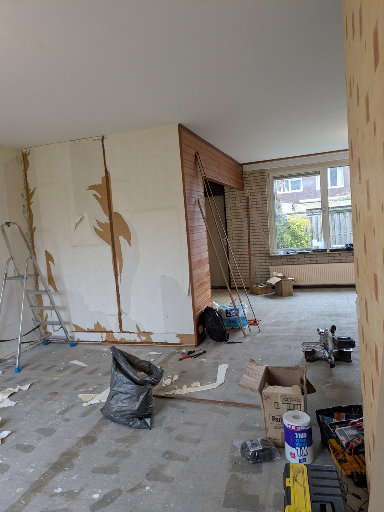

## Parte 1

Ok, vi devo un bell’aggiornamento.

Faro’ al piu’ presto l’intervista con Sophia, o Gemma, ma prima ci sono un sacco di cose che devo dirvi.

Ci eravamo lasciati parecchio tempo fa (era il 14 dicembre ) ed eravamo rimasti alla buona notizia che potevamo prendere in affitto la casa in cui ora ci troviamo. \
Ci siamo trasferiti ad Alphen aan den Rijn ( si pronuncia “alfen an de rein”).\
Il trasloco questa volta è stato abbastanza snervante.\
La consegna delle chiavi della nuova casa era pianificata per il 16 Febbraio e avremmo dovuto lasciare la casa di Leiden il 28 Febbraio. Come vi ho già raccontato qui in Olanda hanno la bella abitudine di affittare le case senza il pavimento. Quindi avremmo dovuto fare tutti i pavimenti ( tranne quello del bagno e della toilette al piano di sotto), togliere la carta da parati dai muri e dipingerli, comprare ed installare tutti gli elettrodomestici ( la cucina, nuova, e’ dotata solo della piastra per cucinare), mettere le luci in tutte le camere, tappezzare di moquette le due scale interne ed altri lavori minori.\
Inoltre avremmo dovuto inscatolare tutti i nostri averi, trasportarli nella casa nuova e consegnare la casa di Leiden intatta, per non rischiare parte del deposito cauzionale.

Lunedì 16 Febbraio andai a ritirare le chiavi della casa da solo, Hilly e le ragazze erano in Toscana e sarebbero tornate solo il venerdì.\
Entrato nella nuova casa venni subito confrontato da sentimenti contrastanti. Da una parte ero felice della nuova abitazione e del nuovo capitolo nella nostra avventura, dall’altra invece mi trovavo di fronte ad una montagna di lavoro, da fare in pochissimo tempo! Aiuto!!!!

Presi due giorni di ferie dal lavoro per iniziare con il pavimento. Nel mio ingenuo ottimismo pensavo avrei finito tutti i pavimenti entro Venerdì, nei due giorni di ferie piu’ le sere dopo il lavoro, ma la dura realta’ fu invece che la consegna del laminato fu ritardata e potei iniziare i pavimenti solo sabato, una settimana prima del trasloco.

Per farla breve, solo grazie al lavoro di Hilly, Sophia, Gemma e dei relativi fidanzati, siamo riusciti nell’impresa titanica. \
Sabato 28 Febbraio, il giorno del trasloco, eravamo in 7, abbiamo lavorato tutto il giorno senza soste, e dopo quattro viaggi di furgone (noleggiato) e auto, quasi tutto era stato trasportato.\
Al tramonto, in accordo con i nostri 3 aiutanti che rispettano il ramadan, ci siamo premiati con un ottima cena presa da un take away Iemenita e abbiamo cenato su di una coperta sul pavimento in cemento, tra mille scatoloni, nella nostra nuova casa. La domenica io e Hilly siamo tornati nella casa di Leiden per impacchettare le ultime cose e sistemare tutto, la consegna delle chiavi era per fortuna slittata al lunedì mattina.

Ad oggi ho finito il 90% dei pavimenti e la casa comincia a diventare accogliente. Il giardino sembra una discarica di materiali edili ma presto lo porteremo al suo splendore.\
La casa ci piace molto e anche il vicinato è molto accogliente e pieno di verde.\
Alphen aan den Rijn pero’, aime’, non ha nulla a che vedere con Leiden. E’ un po' una “commuter city” ovvero’ una mezza citta’ dormitorio, un centro pendolare, o come lo si voglia chiamare.\
Il centro non e’ poi male, pieno di negozi, si sviluppa lungo il fiume reno. Ha anche poi una lunga storia, visto che venne fondata dai romani, con il nome di “castellum Albanianae” e all’epoca, 2000 anni fa, era un importante centro commerciale. Tolto il centro storico però la periferia, soprattutto vicino a dove abitiamo ora noi, e’ abbastanza orribile.\
Grossi palazzi di edilizia popolare e larghe strade trafficate da numerose automobili si alternano a piacevoli agglomerati di villette e parchi. Noi siamo nell’agglomerato di villette.

Tutti e quattro rimpiangiamo Leiden, con i suoi mille canali e le stradine costantemente infestate di biciclette. Le pochissime auto, la frenesia giovane e creativa degli studenti in perenne attivita’.\
Il nostro cuore e’ rimasto li, e forse più avanti ci torneremo, ma per il momento siamo qui ad Alphen, e piano piano ci abitueremo.

Le ragazze vanno ancora a scuola a Leiden e anche hilly lavora ancora li.\
Abbiamo lasciato due delle nostre molteplici biciclette legate alla stazione centrale di Leiden, quando servono alle ragazze possono usarle, oppure quando andiamo lì per altri motivi.\
Al momento, ogni mattino, prendiamo tutti il treno alla stazione di Alphen aan den Rijn, le ragazze vanno a Leiden, io vado a Den Haag, e Hilly, anche se a orari diversi, va anche lei a Leiden.\
Casa nostra dista 5 km dalla stazione, io al mattino ci vado in bici, anche Sophia. Gemma invece si rifiuta di farlo. Dice che sul treno si sta tutti impacchettati e c'è puzza, e a lei viene la nausea. Quindi lei prende l’autobus, che ci mette 50 minuti ad arrivare a Leiden.\
Hilly addirittura e’ gia andata a lavoro da casa in bici. Andata e ritorno sono 40 km e c’e’ andata due volte alle 5 del mattino e una volta e’ tornata dopo il turno serale,pedalando dalle 11 a mezzanotte. Ma c’era una bella luna che illuminava le campagne olandesi.

Io nel nuovo lavoro mi trovo bene, vado tutti i giorni a l’Aia tranne il mercoledì, unico giorno in cui vado in un altro Hotel della catena, il Qbic hotel, ad Amsterdam, dove non hanno un manutentore, ne cercano uno disperatamente ma non riescono a trovarlo. La manager dell'Hotel mi ha già chiesto due volte se conosco qualcuno che sia alla ricerca di una posizione del genere. Il lavoro è molto vario e per nulla noioso, mi trovo bene con Laurens, nato e cresciuto a l’Aia 25 anni fa. Siamo solo io e lui, che ci occupiamo della manutenzione dei due Hotel, mentre ad Amsterdam ci vado da solo.\
Nell’ultimo mese ci siamo impegnati nella costruzione di una mini officina e di un nostro magazzinetto per le scorte dei prodotti di ricambio, all’interno dell’Ald hotel, dove siamo alla ricerca continua di spazi da occupare con i nostri attrezzi o scorte.\
Essendo entrambi gli hotel nel centro storico dell’Aia gli spazi sono molto ristretti e ci vuole creativita’ per sfruttarli al meglio.

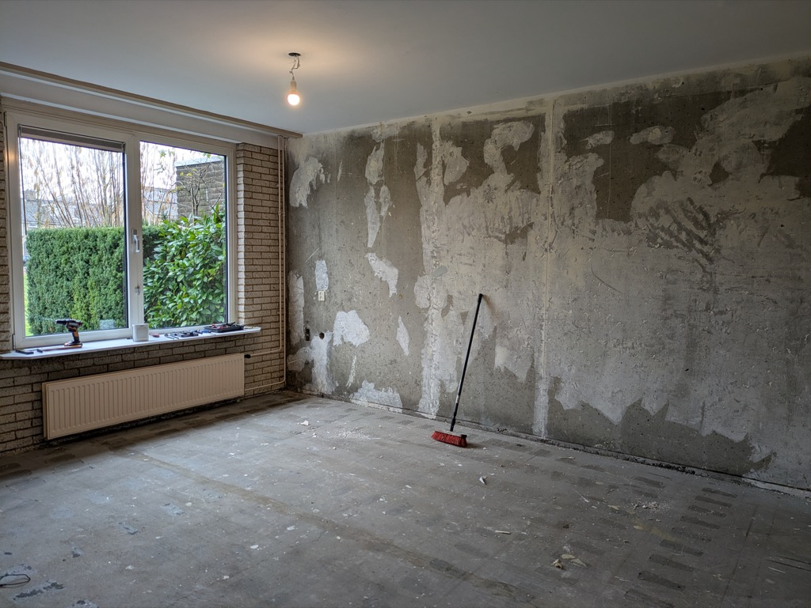

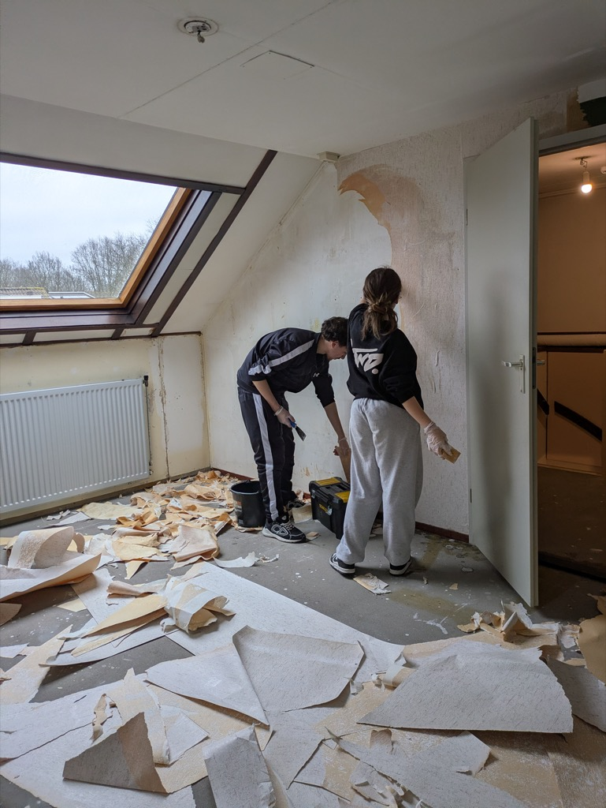

 alll’opera")

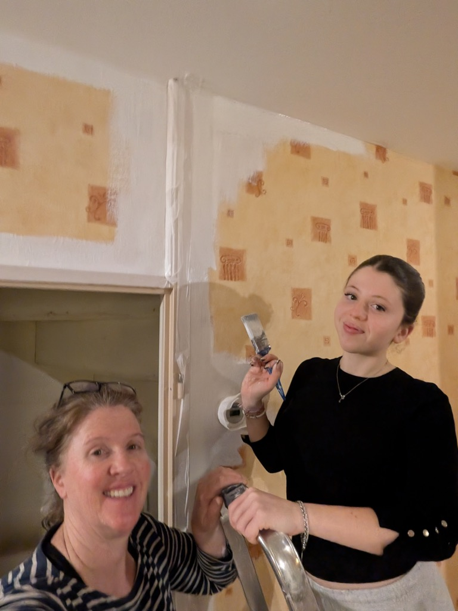

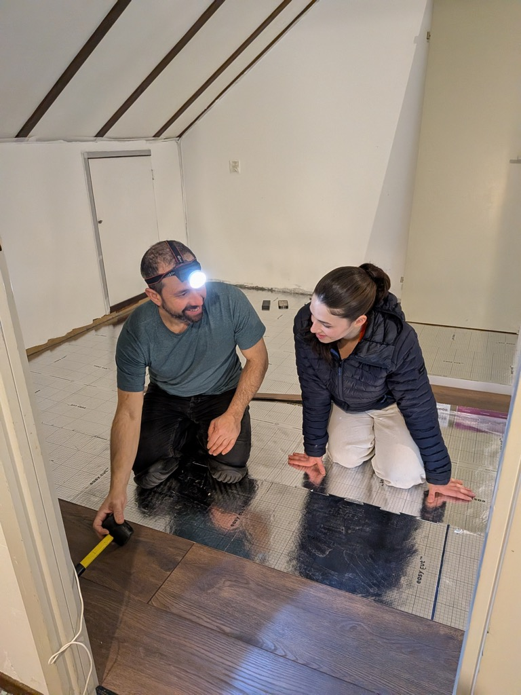

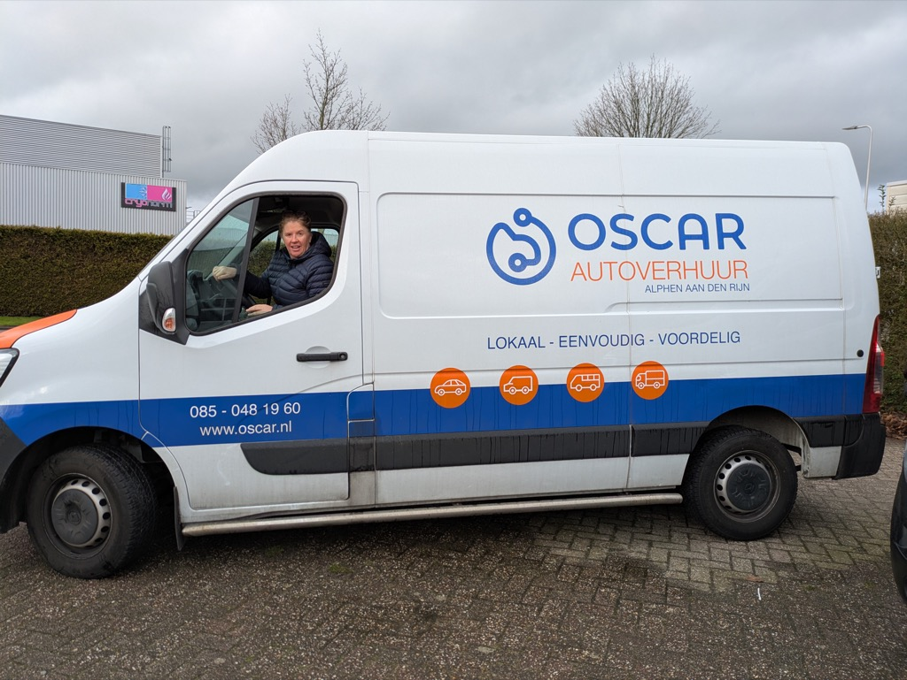

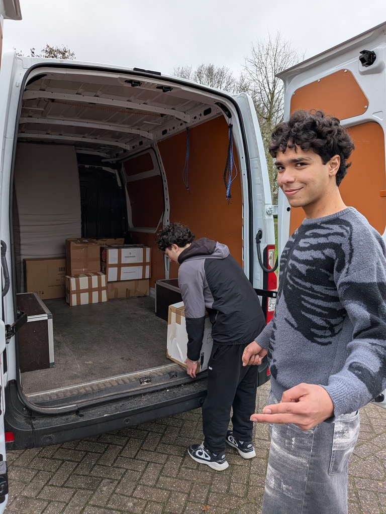

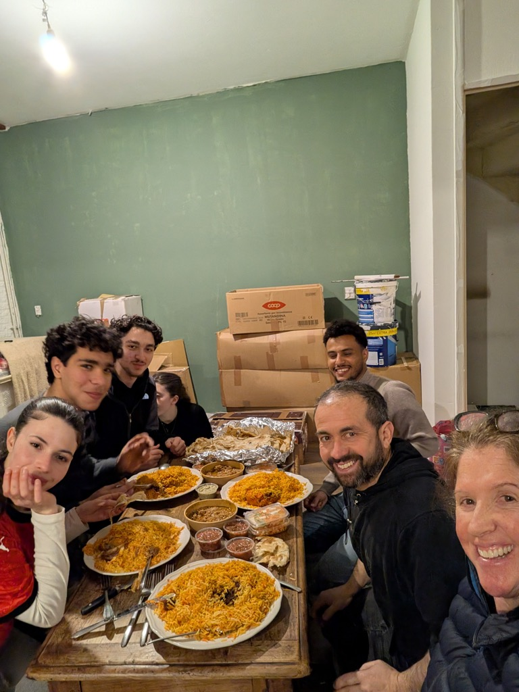

## Parte 2

Ho scritto la parte uno di questo post alcune settimane fa ma non sono riuscito a postarla. Come ho già detto in precedenza non mi sono reso la vita facile con la parte tecnica del blog visto che ho scritto io il codice ogni volta che voglio postare uno nuovo messaggio devo perdere abbastanza tempo e allora rinuncio. Presto voglio ristrutturare tutto il codice anche utilizzando l’IA in modo da rendere più semplice fare nuovi post.

Nelle ultime settimane e’ esplosa la primavera e Alphen Aan den Rijn sta sbocciando come i campi di tulipani e le magnolie. Di fronte a casa nostra ci sono sempre bambini che giocano o persone che passeggiano con il cane. Senza dubbio questo posto comincia a piacermi.\
Ci sentiamo tutti gia’ a casa e la ferita nel cuore che si e’ aperta quando abbiamo lasciato Leiden si sta rimarginando.\
La casa e’ molto accogliente e finalmente possiamo tirare un sospiro di sollievo e rilassarci un po’ durante il week-end.

Due domeniche fa siamo andati a visitare “Archeon”, un villaggio tematico dedicato alla storia e preistoria locale. Si trova proprio qui ad Alphen e ci siamo andati in bicicletta. E’ fatto molto bene, ci sono ricostruzioni di abitazioni e strutture dal Neolitico al medioevo, passando per i Romani. Tutte le strutture sono fatte in legno, pietra, cemento e mattoni e si puo’ entrare dentro per vedere gli interni. Ci sono tanti attori/artigiani che svolgono i lavori che si facevano un tempo e prendono tutto molto seriamente. Un posto veramente consigliato, per i bambini ma anche per i grandi.

La primavera in Olanda e’ qualcosa di veramente speciale. Un po’ perche’ si comincia a vedere il sole ed e’ piacevole finalmente stare all’aperto, dopo il lungo inverno piovoso, ma anche perche’ ci sono fiori dappertutto. Per non parlare poi delle famiglie di anatre e cigni che si aggirano per la città come nulla fosse.

In centro a l’Aia, dove vado quasi tutti i giorni, le strade si stanno popolando di turisti o locali seduti ai tavolini dei bar, musica e profumi tutt'intorno, profumi di cibo e di erba, quella buona.\
L’Aia ve lo già detto, mi piace un sacco. Rispetto ad Amsterdam e’ molto meno caotica ma ci sono tante cose da fare e da vedere.

Vi do appuntamento a presto con l’intervista a Sophia. Avra’ molte cose da raccontare, cambiera’ scuola l’anno prossimo, per venire ad Alphen, ma poi l’anno dopo ancora, per andare all’Universita’, a l’Aia oppure a Rotterdam, non ha ancora deciso.

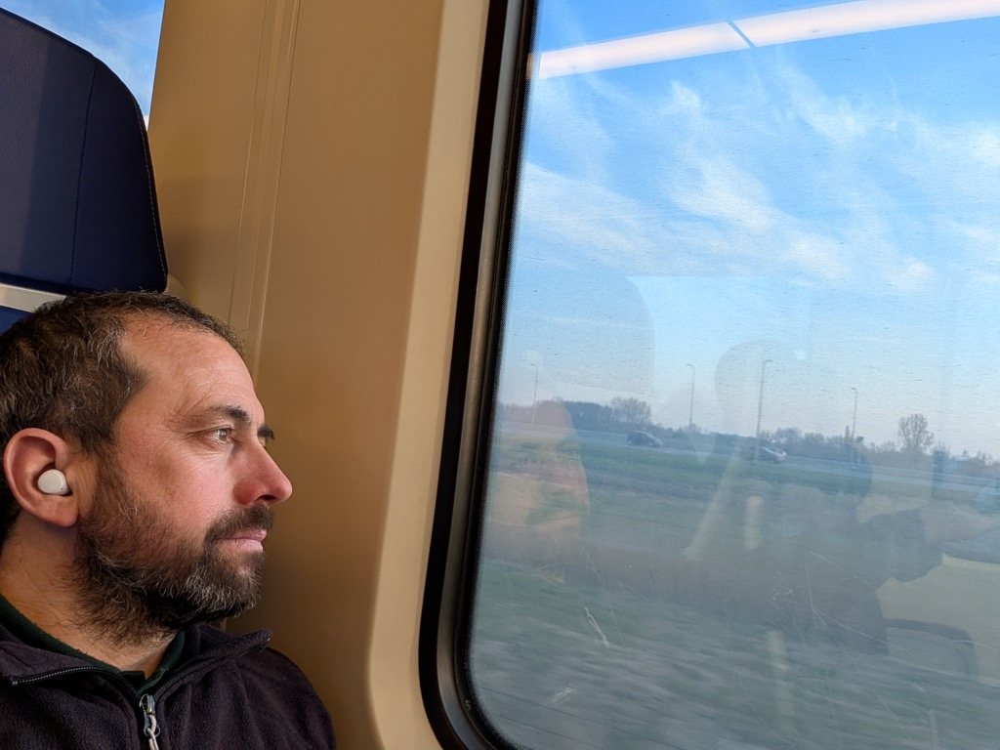

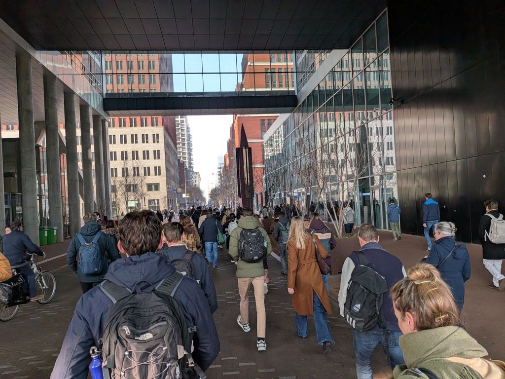

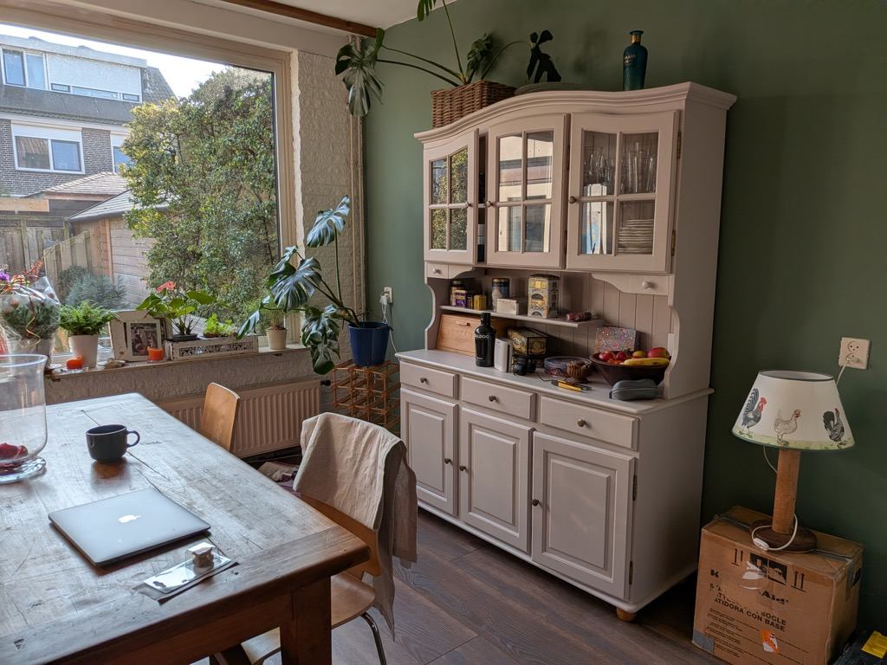

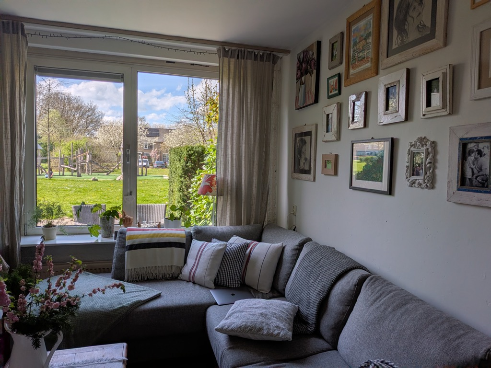

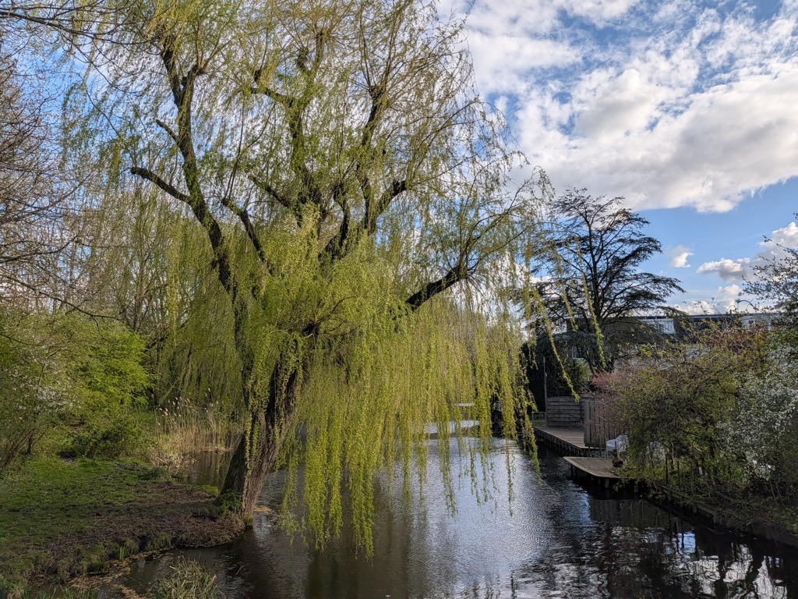
