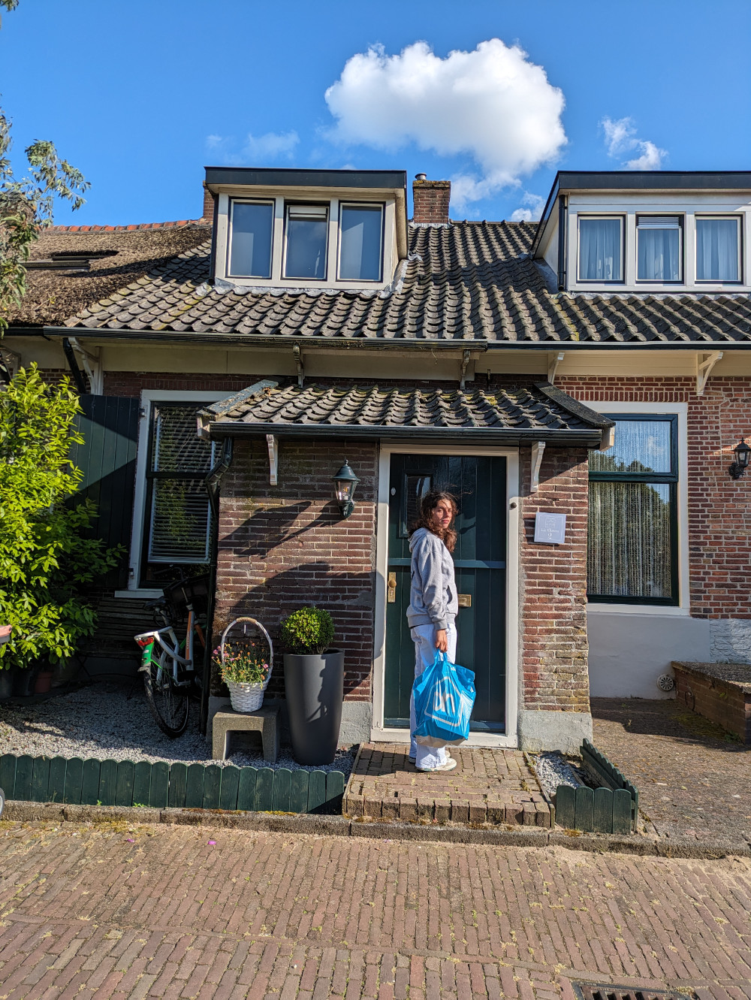
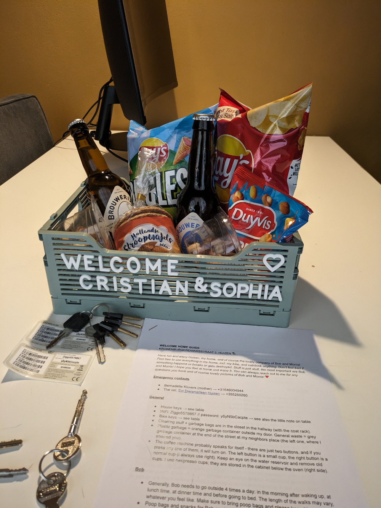
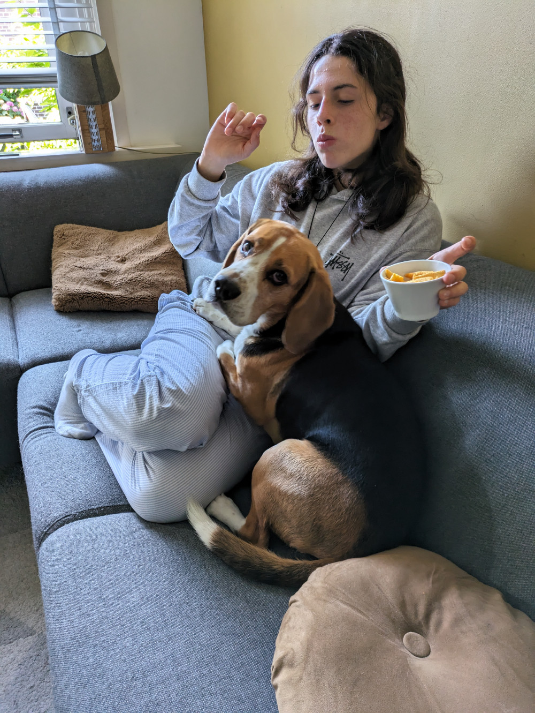

_Non avevo una foto del crepuscolo nei paesi bassi quindi ho usato DALL-E_

La durata del crepuscolo dipende dalla latitudine. Le regioni equatoriali e tropicali hanno un crepuscolo più breve rispetto alle località a latitudini più elevate.
Piu’ ci avviciniamo al polo nord, o al polo sud, invece, e più tempo dureranno il crepuscolo e l’alba.

Questo fatto l’avevo gia’ notato in Sud Africa, in diverse occasioni, dove il tramonto durava il tempo di diverse birre. In italia di birre ne bevi una e il tramonto e’ gia finito. Forse per questo i sudafricani consumano cosi’ tanta birra?

Ieri sera ci siamo seduti al ristorante alle 19.00 e stava iniziando il crepuscolo, siamo andati a letto alle 10.00 quando fuori dalla finestra dell’hotel il cielo stava finalmente passando dal giorno alla notte.

Nel pomeriggio siamo arrivati a Huizen, dove Liz ci ha accolti nella sua casa, nel centro di questa tranquilla cittadina.
L’Uber che doveva portarla all’aeroporto è arrivato dopo una mezz'oretta durante la quale Liz ci ha fatto fare conoscenza con il suo cane, Bob, e il gatto, Morris.

_L'ingresso della casa di Liz_

_Il benvenuto di Liz_

_Bob e' un vero coccolone_

Bob e’ un beagle di 3 anni molto amichevole e giocherellone mentre Morris ha 9 anni e non ama molto gli estranei. Tutti i nostri approcci sono stati bruscamente interrotti da una violenta zampata, per fortuna senza l’uso degli artigli.

L'appartamento in cui ci troviamo si trova nel centro storico di Huizen, abbiamo a disposizione la bicicletta di Liz e al più presto dovremmo comprarne di nostre perché qui le biciclette sono essenziali.
