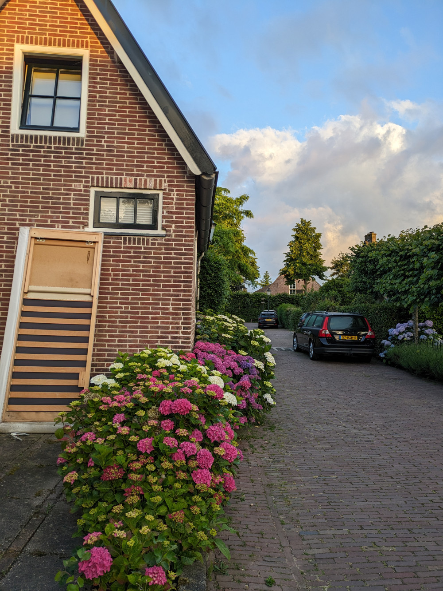
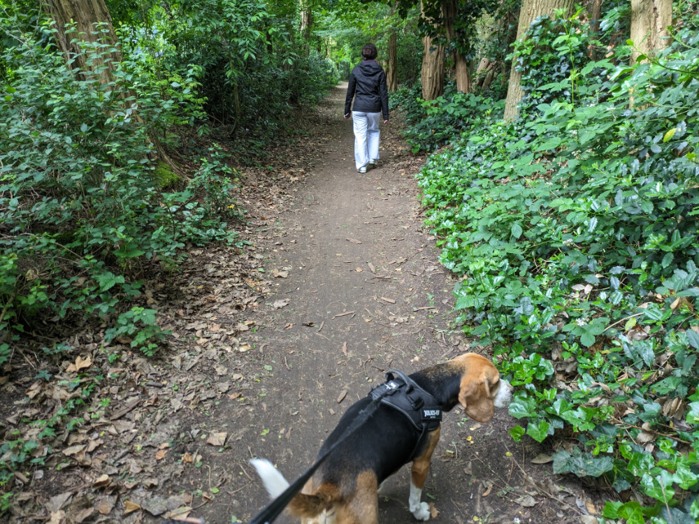
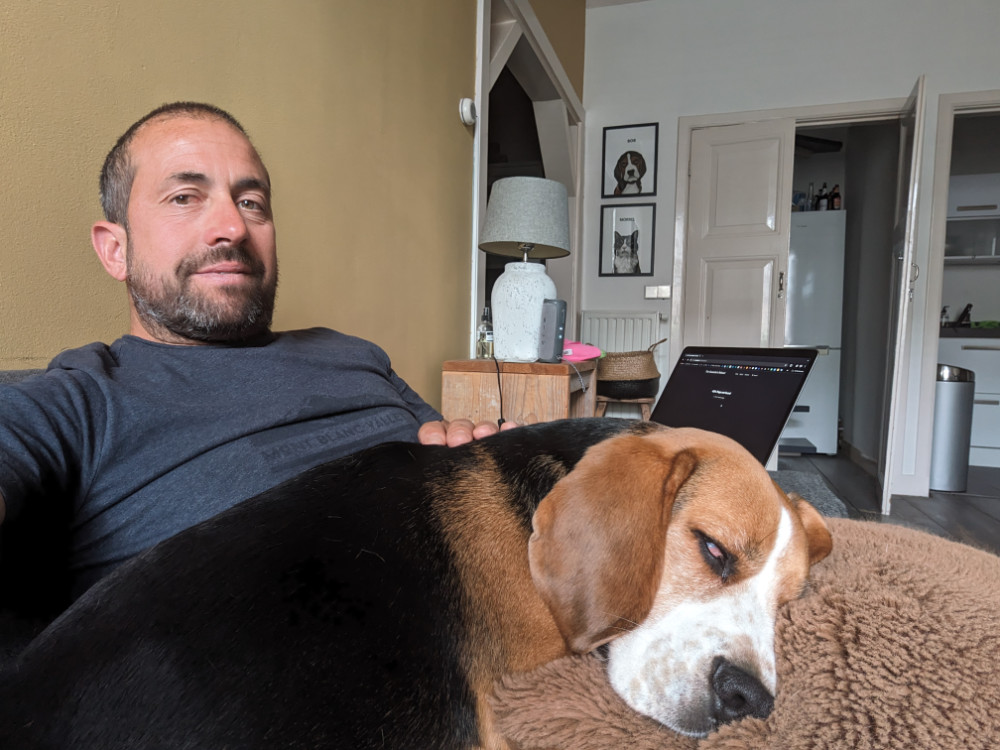
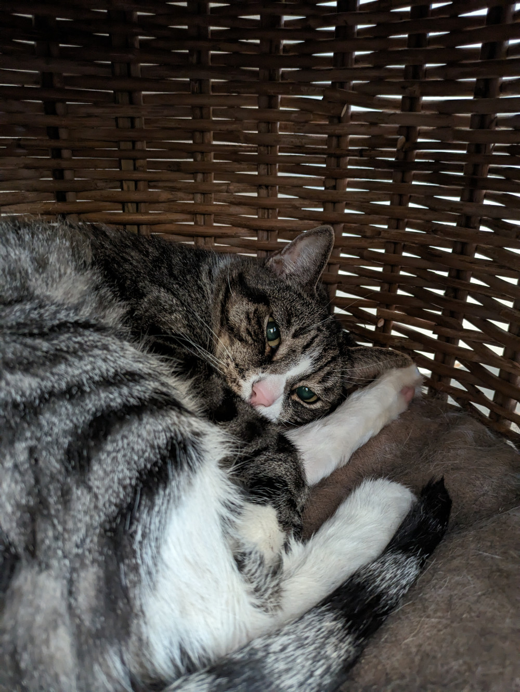

_Aspettando l'Uber_

Questa mattina alle 6.25 abbiamo preso un Uber per andare all’appartamento di Christina. Dovevamo essere lì alle 7.00 e con i mezzi pubblici non ce l’avremmo fatta visto che e’ domenica e il primo bus partiva da Huizen dopo le 7.00.
Con l’Uber siamo arrivati in 35 minuti, le strade erano deserte e il cielo limpido.

Christina e’ una epidemiologa meta’ americana meta’ tedesca, che vive ad Amsterdam da quasi dieci anni.
Il suo appartamento e’ piuttosto piccolo (33 m2) ma molto accogliente. Si trova poco distante da Rembrantpark, a ovest del centro di Amsterdam.

Una volta salutata Christina, in partenza per la Florida, siamo usciti con JJ, il cane, a fare due passi, poi Sophia e’ tornata all’appartamento e io mi sono ridiretto a Huizen. Liz infatti arrivera’ solo questa sera verso le 22.00 e siamo d’accordo che staro’ in casa fino a circa le 20.00, per non lasciare Bob e Morris da soli per troppo tempo.

Una cosa che abbiamo subito notato, in questi giorni, prendendo diverse volte l’autobus, e che ogni singola persona che scende dall’autobus ha uno scambio di ringraziamenti con il conducente. Non importa l’eta’ del passeggero, anche i piu’ giovani lo fanno.
Per tutti i mezzi di trasporto pubblici, treni, metro, bus etc. utilizziamo una carta ricaricabile che si usa per fare check-in quando si sale sul mezzo e check-out quando si scende.
Si puo’ anche utilizzare direttamente la propria carta di credito.

Ieri verso mezzogiorno siamo andati a fare una lunga camminata con Bob, abbiamo attraversato un bosco lungo le sponde del lago.
Poi nel pomeriggio Bob era stanco e ha dormito per 4 ore russando tutto il tempo come russerebbe un essere umano, che personaggio!
Fra poche ore saluto Bob e Morris e raggiungo Sophia ad Amsterdam, prima pero’ devo lavare le lenzuola e pulire un po’ la casa.
Ho appena finito di sviluppare questo blog e quindi lo metto online, cerchero’ di scrivere regolarmente e mandero’ un messaggio quando c’e’ un nuovo post.
Mi sarebbe piaciuto mettere anche una sezione per i vostri commenti ma e’ una cosa che richiede parecchio lavoro e ora devo dedicarmi a finire il portfolio (non mi manca tanto) e cominciare a contattare qualche azienda.
A presto.

_La camminata nel bosco_

_Bob mi manchera'_

_Se avessimo avuto qualche giorno in piu' sono sicuro che morris si sarebbe fatto coccolare_
