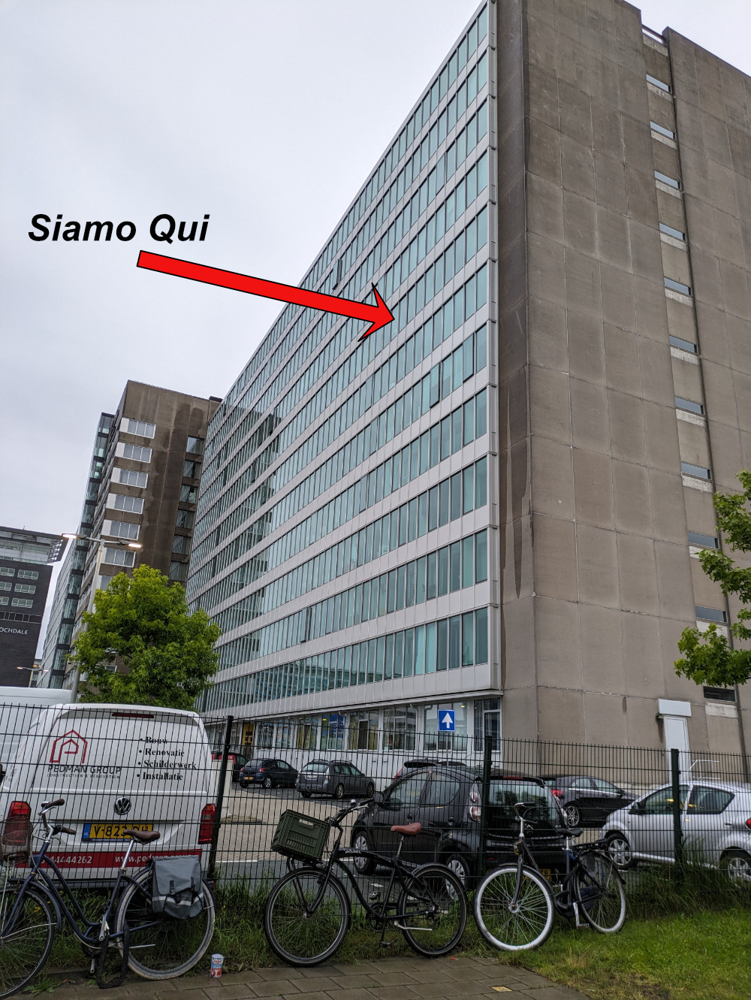
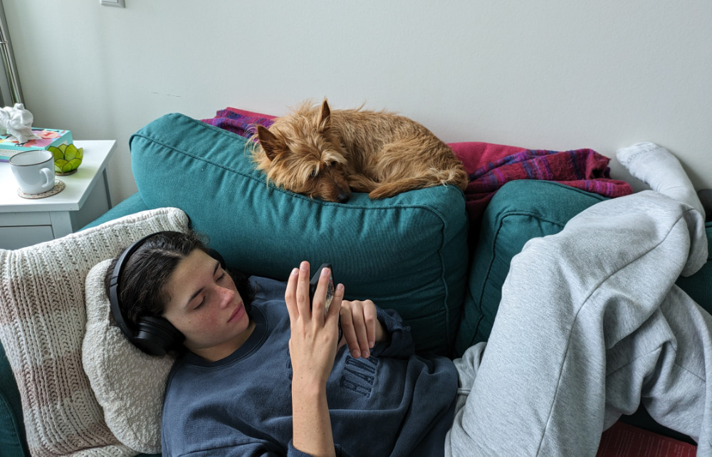

_"Koningsdag", il Giorno del Re, ogni 27 aprile_

L’Olanda non e’ una nazione ma e’ una regione dei Paesi Bassi e in Italia gli abitanti dei Paesi Bassi vengono erroneamente chiamati Olandesi.\
Luca Misculin, un giornalista del quotidiano “il post”, che io seguo regolarmente, propone di chiamare gli abitanti dei Paesi Bassi “Nederlandesi” visto che in inglese i Paesi Bassi si chiamano “Netherlands”.\
I Nederlandesi fanno riferimento a loro stessi, in Olandese, come Nederlanders.
Cercherò di cambiare un po’ il trend e chiamarli “Nederlandesi” anche io. In inglese pero’ li chiamerò sempre “Dutch people”.
Scusate per il pippone ma ci tenevo a sottolineare questa cosa.

Oggi ha piovuto tutto il giorno con una temperatura massima di 14 gradi. Nonostante ciò, qui la gente va sempre in giro, sia a piedi che in bicicletta, e di ombrelli non se ne vedono.\
L'appartamento in cui ci troviamo e’ in un palazzone tutto vetrate un po' orrendo, ad essere sinceri, sicuramente il più brutto del quartiere, ma poi una volta dentro e’ tutto moderno e ben mantenuto.\
Il nostro appartamento ha un unico finestrone che dà su un autostrada, siamo al settimo piano ma il rumore si sente lo stesso. Una volta chiuso il finestrone però non si sente quasi niente.

_Noi siamo al settimo piano, proprio li_

_La vista dalla nostra unica finestra_

Oggi visto che pioveva siamo stati quasi tutto il giorno in casa, a parte alcune uscite per portare fuori JJ e un paio di volte per andare a comprare da mangiare.
Questa sera abbiamo cucinato del salmone in padella, riso basmati e broccoli (il piatto preferito di Sophia) e, quando siamo tornati dalla passeggiata serale con JJ l’odore del salmone arrostito si sentiva in tutto il pianerottolo.\
Mi ricorda di quando passavo dei mesi a New York, nel Queens, in dei palazzoni enormi con pochissime finestre, quando salivi le scale per andare al tuo appartamento era un viaggio olfattivo nelle cucine di tutto il mondo.

JJ e’ veramente carino e cerca sempre di arrotolarsi vicino a Sophia. E’ un peluche dolcissimo che sgambetta furiosamente sul parquet dell’appartamento.
Se domani il tempo ci da un po 'di tregua lo vogliamo portare a fare una passeggiata a Rembrandt park, non molto distante da qui.\
Contrariamente ai Nederlandesi noi non siamo attrezzati per la pioggia, io mi sono portato solo un paio di pantaloni lunghi e sophia ha solo cose leggerissime. Per fortuna si e' portata una giacchetta impermeabile.

_JJ e Sophia questa mattina_

_JJ e Sophia sul divano_

_Passeggiatina serale_
