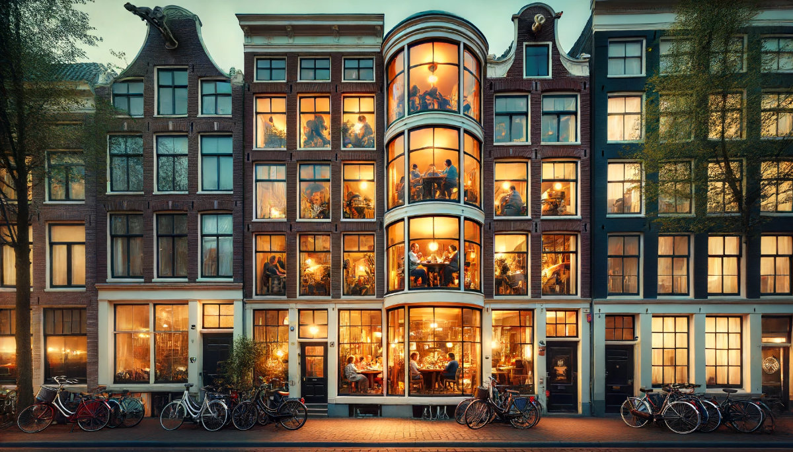
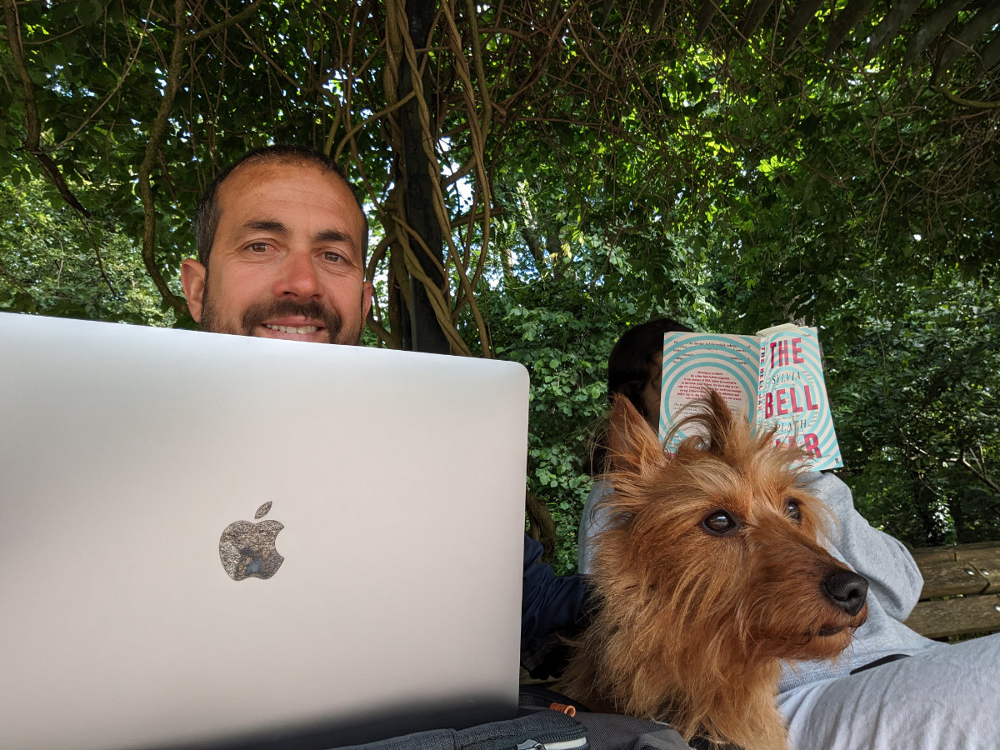
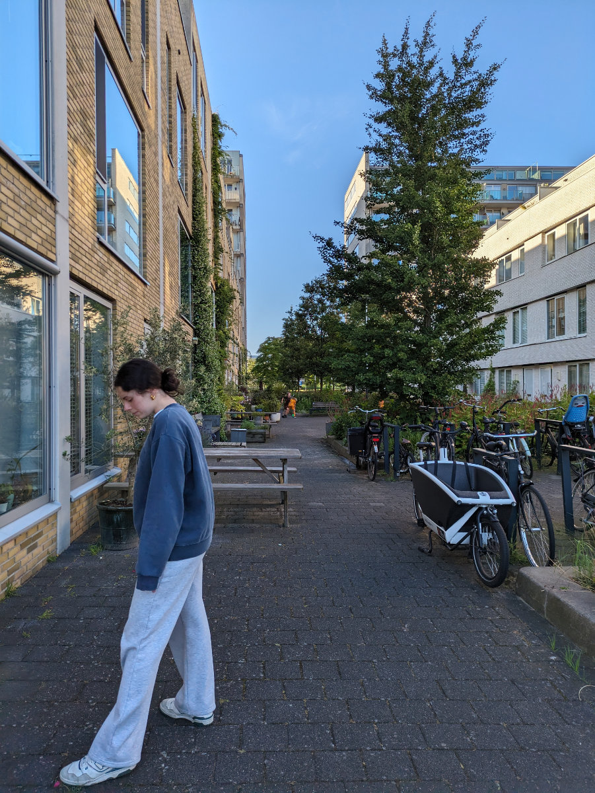
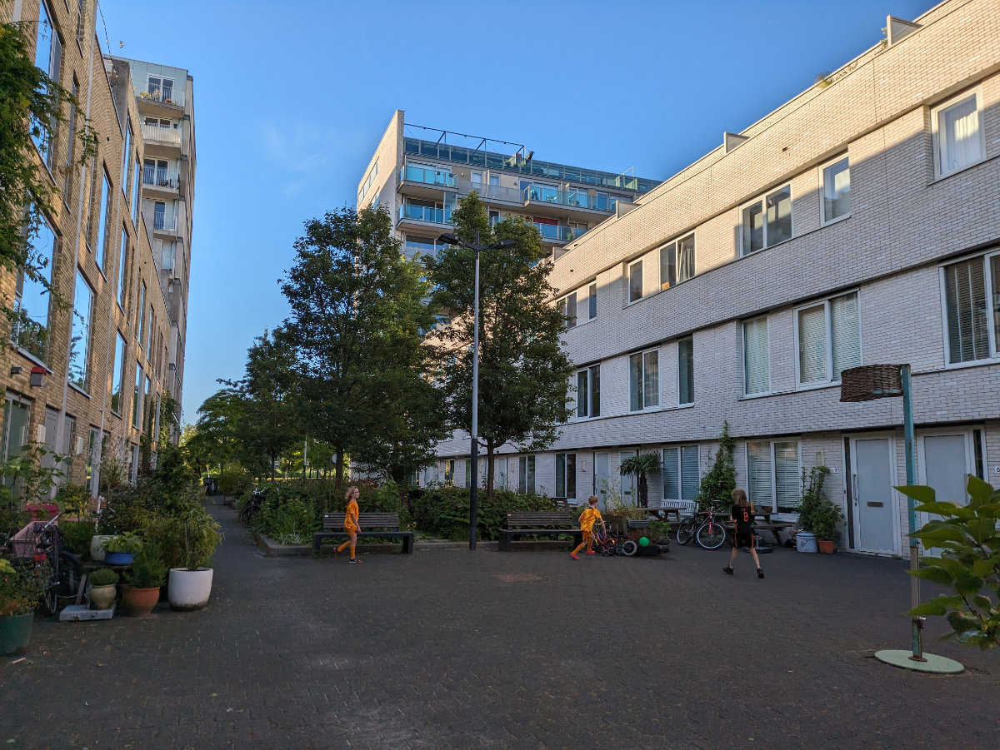

_Questa foto non e' reale_

Una cosa sorprendente dei Paesi Bassi, e anche un po’ difficile da capire, e’ il fatto che nella maggior parte delle case non vengono usate le tende. Anche quelle al piano terreno.\
Quindi tu passi per le strade e non essendo abituato ad una cosa del genere non ce la fai a non guardare dentro la vita privata delle persone. Almeno, io non ci riesco, un occhio ce lo devo buttare.\
Ho visto gente cenare in tutta tranquillita’, qualcuno impegnato a cucinare, una ragazza sul divano che guardava il cellulare, la cameretta dei bambini, ma senza bambini, dei bellissimi salotti e delle cucine ancora da pulire dalla sera prima.\
Ho anche provato a fare delle foto ma non sono venute un gran che, un po’ perche’ non volevo essere visto e passare da stalker e un po’ perché il riflesso della finestra non rendeva bene quello che invece si vedeva dal vivo.\
Per questo ho usato una foto generata dall’intelligenza artificiale per rendere un po’ l’idea ma mi sembra piuttosto esagerata, di solito l’atmosfera e’ piu’ intima di sera e le luci meno sparate.

Questa cosa di creare un’atmosfera “cozy” (in italiano la parola “cozy” si puo’ tradurre come “accogliente” ma non ha proprio lo stesso significato) non la si vede solo nelle case ma anche nei cafe’ e nei ristoranti, dove viene data molta attenzione all’illuminazione usata e agli interni. In italia, ma anche in altri paesi, in moltissimi ristoranti si trovano luci accecanti e di cromie diverse tra loro, magari si mangia anche da dio pero’ sembra di essere in sala operatoria.\
Poi la televisione sempre accesa non eh, dai!

Oggi passiamo l’ultima notte qui a casa di Christina, con l’adorabile JJ. Domani pomeriggio andremo da Stephan e dal gatto Frances.
Questa mattina ho trasferito il mio ufficio al parco, su una bellissima panchina in mezzo ad una specie di orto botanico, ma poi a cominciato a piovere e siamo andati via.
Nel pomeriggio pero’ e’ uscito un gran bel sole e siamo andati a fare una lunga camminata, io Sophia e JJ.\
C’e’ tutta una zona di appartamenti tipo terratetto, delle specie di pseudo villette ma non sono villette, a poche centinaia di metri da qui, che sono pensate proprio bene. Tra una fila di case e l’altra c’e’ una zona pedonale, dove i vari abitanti hanno piante in vaso, tavoli e panchine, giochi per bambini e, come sempre, un fracco di biciclette.\
Si e’ sempre a 5 minuti dalla fermata della metropolitana o dal tram ma comunque ce’ una tranquillita’ surreale. Credo che uno dei motivi di questa tranquillita’ e vivibilita’ sia la bassissima presenza di automobili.\
Avere un automobile ad Amsterdam, ma un po’ in tutti i Paesi Bassi, e’ un lusso, visto che si paga il parcheggio dovunque, anche al supermercato. Anche questo e’ un punto a favore, dal mio punto di vista, non il fatto che si paghi il parcheggio al supermercato, ma la scarsità di automobili.\
Credo che moltissime città moderne siano invivibili proprio a causa delle automobili. Togli quelle e improvvisamente hai più spazio sui marciapiedi, meno rumore, meno pericoli e meno smog.

Amsterdam mi piace sempre di piu’, se gli affitti non costassero cosi’ tanto qui forse mi vien quasi voglia di prendere una di quelle casette, fare un piccolo orticello nelle cassette di legno, fuori sul marciapiede e non mettere le tende alle finestre, forse.

_Lavorare al parco mentre JJ fa la guardia_

_Camminata pomeridiana_

_Le pseuduo villette, non so proprio come altro chiamarle_

_Paesi Bassi vs Polonia_
